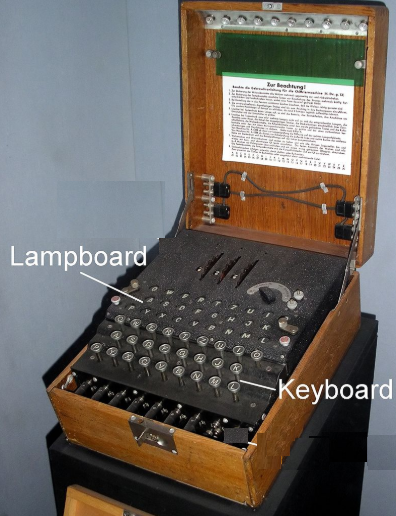
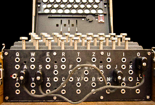
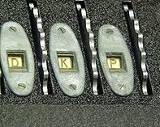
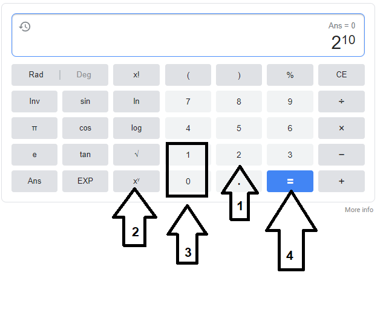
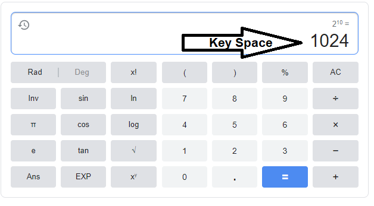

## 10.1 Lesson Plan: Introduction to Cryptography

### Overview

In today's class, students will be introduced to the fundamental concepts of cryptography.

### Class Objectives

By the end of class, students will be able to:

  - Use basic transcription and substitution ciphers and keys to encrypt simple messages.
  - Understand how encryption supports secure communication through the PAIN framework.
  - Differentiate between encoding and encrypting.
  - Calculate the strength and efficiency of various encryption levels.
  - Use the symmetric encryption tool Open SSL to confidentially transmit secure messages.

### Instructor Notes

- Before break, students need to run `sudo apt-get update` and `sudo apt-get upgrade`.

### Lab Environment 

<details><summary>Lab Details</summary>
<br>


You will use your local Vagrant virtual machine for today's activities. Please note that instructors and students have different access credentials.

- Instructor access:
  - Username: `instructor`
  - Password: `instructor`
  
- Student access:
  - Username:`sysadmin`
  - Password: `cybersecurity`

  ### Online Classroom Strategies 

Refer to the following guidelines and best practices for conducting this class online: 

- [Cybersecurity Online Classroom Strategies](../../../00-Teaching-Staff-Prework/OnlineStrategies.md)

</details>

### Slideshow

The lesson slides are available on Google Drive here: [10.1 Slides](https://docs.google.com/presentation/d/15Di5j3kyjGmwVStQQge1TOJkfcj-yfr4YOEZqG_ntrY/edit#slide=id.g4f80a3047b_0_990)

- To add slides to the student-facing repository, download the slides as a PDF by navigating to **File** > **Download as** and choosing **PDF document**. Then, add the PDF file to your class repository along with any other necessary files.

- **Note**: Editing access is not available for this document. If you or your students wish to modify the slides, please create a copy by navigating to **File** > **Make a copy**.

### Time Tracker

The time tracker is available on Google Drive here: [10.1 Time Tracker](https://docs.google.com/spreadsheets/d/185EiHqBqZ3kVFAM7FpjOItv1qb1WjnqyLI467W4j0Mw/edit#gid=0)

### Student Guide

Distribute the student-facing version of the lesson plan: [10.1 Student Guide](StudentGuide.md)


-------

### 01. Instructor Do: Introduction to Cryptography (0:05)

Welcome students to class and inform them that this week will introduce the exciting world of cryptography!

Remind the class that one of the core concepts of cybersecurity is confidentiality, which is focused on keeping information and communications secure from unauthorized parties.

Explain that it is critical for organizations to keep private information secure. Information getting into the wrong hands can cause significant financial and reputational impact.

  - For example:

     - A doctor loses a laptop containing patients' private medical records.

     - An unauthorized person finds the laptop, opens it, and is able to view the private data.

     - This can impact the reputation of the doctor _and_ the hospital responsible for maintaining the data.

     - This can also have financial impact, as a leak can result in significant legal fines for disclosure of sensitive data.

Explain that a primary method for keeping information secure is  **cryptography**.  

  - Define cryptography as the art and science of keeping information secure through the use of  mathematical concepts and techniques.

Explain that this week we will be learning the various methods and techniques of cryptography, and how they are applied with current technologies and devices we use every day.

- For each cryptography lesson, there will be fun and challenging exercises asking students to apply new techniques.

Let students know that in this week's exercises, they will be playing the role of security analysts at the Hill Valley Police Department.

  - Students will be investigating and hopefully apprehending the Alphabet Bandit, who is likely responsible for a number of burglaries in Hill Valley.

  - The Alphabet Bandit likes to leave hidden messages after each burglary. Students will use cryptographic techniques to investigate and stop the bandit from burglarizing more Hill Valley residents.

Make sure to cover the daily objectives and answer any questions before proceeding onto the first topic of the day.


### 02. Instructor Do: The History of Cryptography (0:15)  

Begin by explaining that while cryptography seems like a modern concept, cryptographic techniques were actually in use in early human civilizations.

Explain that as these early human civilizations engaged in battles, politics, and fights for supremacy, individuals needed to find methods to communicate securely with each other and keep their communications hidden from enemies.

#### Caesar Cipher

Explain that one of the earliest methods of applied cryptography is the **Caesar cipher**.

Introduce the Caesar cipher by covering the following:

  - Julius Caesar, a Roman general, needed a method for communicating securely with his military.

  - Caesar needed a method that would make his communications illegible to his enemies. For example:

     - Suppose Caesar needed to tell his military: "Launch an attack at sunrise."

     - He needed to be sure this communication, if intercepted, would not be understood by anyone outside his military.

  - Caesar developed a method for hiding his communications, which later came to be known as the Caesar cipher.

  -  A **cipher** is a method of designing secret or hidden messages.

Explain that the Caesar cipher is a method of **encryption**—a process of modifying a message or information to prevent unauthorized parties from accessing it.

   - Encryption takes a **plaintext** (readable text) message and converts it to an unreadable message, known as the **ciphertext**.

   - For example:
     - Caesar's plaintext message would be "Launch an attack at sunrise."
     - Once encrypted, the ciphertext message could be "Odxqfk dq dwwdfn dw vxqulvh."
     - Even if Caesar's enemies intercept the ciphertext, they would not understand the message.

Explain that the goal of the Caesar cipher is not only to prevent unauthorized parties from reading the communication, but to also allow authorized parties, such as Caesar's military, to receive and understand the hidden message.

  - This is accomplished through **decryption**.

  - Decryption takes the ciphertext and converts the message back to the readable plaintext.

    - In the previous example, the military would receive the ciphertext message "Odxqfk dq dwwdfn dw vxqulvh."

    - Once decrypted by Caesar's military, it would be converted back to the plaintext message of "Launch an attack at sunrise," and Caesar's military would understand the message.


Demonstrate how the Caesar cipher works by covering the following:

  - The Caesar cipher is a simple method in which each letter in the message is replaced by a letter located a fixed number of positions further down the alphabet.

  - The first step is to select this fixed number, known as a key, to determine how many letters to shift in the alphabet.

  - The **key**, or cryptographic key, specifies how plaintext is converted to ciphertext and vice versa.

  - The shift moves to the right. For example, with the letter **A**:
    - A shift (or key) of one would result in a **B**.
    - A shift (or key) of two would result in a **C**.
    - A shift (or key) of three would result in a **D**.
    - If the shift passes the letter **Z** it would start back at **A** and continue.

 Explain how this method is used to encrypt a plaintext message:

   - To encrypt "I hid a cab" with a shift or key of two:

      - I > K
      - H > J
      - I > K
      - D > F
      - A > C
      - C > E
      - A > C
      - B > D

  - This results in a ciphertext message of "k jkf c ecd."

  - To decrypt "k jkf c ecd," we would apply the same rule in reverse, shifting the letters back two characters in the alphabet.

    - K > I
    - J > H
    - K > I
    - F > D
    - C > A
    - E > C
    - C > A
    - D > B

  - This decryption takes the ciphertext of "k jkf c ecd" and returns it to the plaintext of "I hid a cab."

Explain that while the Caesar cipher provided confidentiality to Caesar many years ago, it's only used today for educational purposes, due to how easily it can be decrypted.

Over time, individuals and countries adopted new techniques and technologies for more advanced encryption methods.

#### The Enigma Machine

As technology advanced, applied cryptography became more complex and harder to crack.

Explain that after the end of the World War I, a German engineer named Arthur Scherbius developed an advanced encryption machine called the **Enigma machine**.

- The Enigma machine became a popular method used by the Germans during World War II to transmit encrypted messages.

Explain how the Enigma machine works by covering the following:

  - The Enigma machine is designed to scramble the 26 letters of the alphabet.

  - It allows for billions of ways to encrypt a message, which made it extremely difficult for other nations to decrypt German messages during the war.

  - The machine is an electromechanical device containing a keyboard and a lampboard.

    - The keyboard is similar to the keyboard on your computer, used to type (press) each letter of a message.

    - The lampboard looks similar to a keyboard, but the letters aren't pressed. Lampboard letters are simply lit or not lit after each key on the keyboard is pressed.

         


Let's look at how an Enigma machine was used to create keys and encrypt and decrypt messages.

- **Configuration**

  Settings for the Enigma machine were configured by the user.

  - These settings included:

    - Plugging wires into specific slots.

      

    - Arranging rotor settings.

      

  - While the details of these settings aren't important, it's important to understand that how the user configured them determined how the data was encrypted.

  - The settings selected by the user were the key.

  - These exact settings needed to be used by the recipient for decryption.

- **Encryption**

  - Next, an individual typed the plaintext using the machine's keyboard, one letter at a time.

  - After each letter was pressed on the keyboard, another letter lit up on the machine's lampboard.

  - The illuminated letters were documented, creating the ciphertext.

  - The ciphertext was transmitted to the recipient.


- **Decryption**

  - The recipient received the secret key (the configuration) in advance.

  - The recipient used the key to configure their machine with the exact settings used for encryption.

  - Ciphertext letters were entered one at a time on the keyboard, showing the original plaintext in the lampboard.

  - The illuminated letters were documented one at a time, converting the ciphertext back to plaintext.


#### Cracking the Enigma Cipher


Explain that during the height of World War II,  Alan Turing, an English mathematician and computer scientist, developed a method to exploit the weaknesses of the Enigma machine's design.  

  - Turing developed a machine known as the Bombe, which helped decrypt the most complex versions of the Enigma cipher.

  - This was considered one of the most important victories of the Allied forces during the war, as Turing's Bombe machine was able to prevent many attacks by decrypting secret messages sent by the Germans.

Explain to the students that this is a brief introduction to the Enigma cipher. If they're interested in researching more about this topic:

   - Refer them to the Wikipedia page on [Cryptanalysis of the Enigma](https://en.wikipedia.org/wiki/Cryptanalysis_of_the_Enigma).

   - Refer them to the film _The Imitation Game_, about Alan Turing and how he cracked the Enigma cipher.


 #### Summary

 Summarize this section by covering the following key cryptographic terms covered in this lesson:

   - **Plaintext**: Information in human-readable form.

   - **Ciphertext**: Plaintext message that has been encrypted into an unreadable form.

   - **Encryption**: The process of converting plaintext to ciphertext.

   - **Decryption**: The process of converting ciphertext to plaintext.

   - **Cipher**: A method of performing encryption or decryption.

   - **Key**: A parameter specifying how plaintext is converted to ciphertext and vice versa.

   - **Caesar cipher**: A type of cipher that shifts the letters in the alphabet by a fixed number.

   - **Enigma cipher**: A type of cipher used by Germany in World War II to encrypt messages.

 Explain that in the first cryptography activity of the day, students will use the Caesar cipher to secretly share a code name with a classmate.

Take a moment to address questions before proceeding.  


### 03. Student Do: Caesar Cipher Code Names Activity (0:10)

Explain the following to students:

- You are security analysts working for the Hill Valley Police Department.

- There has been a string of burglaries in Hill Valley by the mysterious Alphabet Bandit. You have been assigned to a top secret task force to apprehend this criminal.

- Since this is a top secret task force, anonymity is critical, and the Hill Valley Police Captain would like you to create a code name, encrypt it, and share it only with your partner.

- Your first task is to create a code name, encrypt it using the Caesar cipher, and send it to your partner.

- Additionally, you must decrypt your partner's encrypted code name.

:globe_with_meridians: This activity will use breakout rooms. Assign students into groups of 2 and move them into breakout rooms.

Send students the following file:

- [Activity File: Caesar Cipher Code Names](activities/03_Caesar_Cipher_Code_Names/unsolved/readme.md)

Answer any questions before students get started.

### 04. Instructor Optional Review: Caesar Cipher Code Names Activity  (0:00)

- :warning: **Heads Up**: This is an optional review.  If most of the students are able to complete this activity, skip the review and proceed to the next lesson.

Remind students that the point of this exercise was to have students apply basic cryptography by using a simple cipher, such as the Caesar cipher, to hide a message.

Completing this activity required the following steps:

  - Selecting a code name.

  - Encrypting the code name with the Caesar cipher.

  - Decrypting a different message with the same Caesar cipher.

Send students the following file:

- [Solution Guide: Caesar Cipher Code Names](activities/03_Caesar_Cipher_Code_Names/solved/readme.md)


#### Walkthrough

**Instructor note**: Students will each have different code names, so results will vary.

If needed, use the following example to demonstrate how to encrypt and decrypt using the Caesar cipher.

The following solution uses the example code name of **Blue Fox**.

- For encryption, we will use a key of three to shift the letters down three in the alphabet.

- The first letter, **B** will be shifted three letters to become **E**.

- The next letter, **l** will be shifted three letters to become **o**.

- If we continue this pattern for each letter, the encrypted name will be **Eoxh Ira**.

As an example for decryption, we will use a different encrypted name, **Vwhho Kdzn**.

- For deciphering, we will apply the key in reverse, shifting the letters three to the left.

- The first letter, **V** will be shifted three letters to become **S**.

- The next letter, **w** will be shifted three letters to become **t**.

- If we continue this pattern for each letter, the decrypted name will be  **Steel Hawk**.

Answer any questions that remain before proceeding to the next lesson.


### 05. Instructor Do: Introduction to Character Encoding (0:05)

Begin by reminding the students that we have just covered several methods that were historically used to hide a sender's communication.

  - Each of these methods uses a letter cipher to scramble a plaintext message and create a ciphertext.

  - While letter ciphers were useful in the past, these methods wouldn't work today, since most communications are transmitted with digital data.

  - Remind the class that, as previously covered, computers transmit digital data with **binary**.  

  - Therefore, encrypting data on computers requires a method of alphanumeric representation known as **character encoding**.

#### Encoding

Emphasize that **encoding** may look similar to **encryption**, but it has a very different goal:

  - The goal of encoding is not to keep information secret, but to transform data so it can be properly used by a different type of system.

    - For example, transforming text to binary so data can be digitally transmitted.

  - Data is encoded with a publicly-available scheme that can be decoded by anyone.  

  - Encoding does not use a key.

#### Encryption

  - The goal of encryption is to keep information from being accessed by unauthorized parties. Encryption

  - Encryption uses a key, which encrypts and decrypts the data.

Explain that there are many encoding schemes available. The primary types we will review are: binary, ASCII, hex, and octal.

#### Binary Encoding

Remind the class that binary is the basis of digital communications.

  - Explain that most encryption of digital communication takes place at the level of binary data. Readable text is first converted to binary before applying encryption.


Explain how character encoding works with binary by covering the following:

  - Remind the class that  eight bits = one byte.

  - One byte is made up of `1`s and `0`s, and can range from `00000000` to `11111111`.

  - Each byte can represent a number, which is called a **decimal**.

    - For example:

      - The byte `00000000`  represents the decimal 0.

      - The byte `11100000`  represents the decimal 224.

      - The byte `11111111`  represents the decimal 255.

   - This conversion is called a **binary to decimal encoding**.

#### ASCII Encoding   

Explain that since each byte can only represent a number from zero to 255, and since we read text with letters, we need a method to convert these numbers to letters.

Explain that this is accomplished with **ASCII encoding** and by cover the following:

  - Open the [ASCII Table website](http://www.asciitable.com/) for reference.

  - ASCII stands for _American Standard Code for Information Interchange_.

  - ASCII encoding is the representation of every upper and lowercase letter of the English alphabet, as well as common punctuation marks, and graphic and mathematical symbols, as a number between zero and 255.

    **Note**: Zero to 127 is considered the standard ASCII, and 127 to 255 is considered extended ASCII.

  - For example:

    - The decimal value **84** represents the character **T**.

    - The decimal value **118** represents the character **v**.

 - Summarize that this conversion is called **decimal to ASCII encoding** or **decimal to text encoding**.   

- Point out that the ASCII Table website shows other conversions as well, such as hex and octal.

#### Hex and Octal Encoding

Explain how **hex encoding** works by covering the following:

  - Binary representation has the disadvantage of resulting in very long numbers.

    - For example, the binary representation of the word "hello" is `1101000 1100101 1101100 1101100 1101111`.

  - Hex, short for _hexadecimal_, is an efficient number system that exists partly to allow for more compact representations of binary data.  

  - Hex is a numeric system made up of 16 symbols, using the letters A through F and the numbers zero through nine.

    - For example:

      - The hex value **52** represents the character **R**.

      - The hex value **7A** represents the character **z**.

    - The hex representation of the word "hello" is **68 65 6c 6c 6f**.

 - This conversion is called **hex to ASCII encoding** or **hex to text encoding**.

Finally, briefly introduce **octal** as a system that applies a principle similar to hex, but uses digits zero through seven.

  - For example: The octal value **042** represents the decimal **34**.


Explain that students won't be expected to translate between the various character encodings themselves—that's a job best left to translation tools. However, the underlying purpose and theory of character encoding is an important concept.

Explain that while it may seem difficult to encode and decode with these various schemes, there are many free online resources available that can help.

#### Encoding and Decoding Tools

Refer students to two popular, free encoding decoding websites:

  - [Browserling](https://www.browserling.com/)
  - [Rapid Tables](https://www.rapidtables.com/)

Explain that we will complete a brief walkthrough of decoding a binary message using Browserling.

- First, access the [Binary to Text Converter](https://www.browserling.com/tools/binary-to-text) page.

  - Explain that this page is specific to converting binary data to text.

  - Scroll to the bottom of the page and illustrate that there are many other conversions available.

- Next, illustrate that we will decode the binary message:

    `01001001 00100000 01101100 01101111 01110110 01100101 00100000 01100011 01110010 01111001 01110000 01110100 01101111 01100111 01110010 01100001 01110000 01101000 01111001 00100001`

   - Copy and paste this binary data into the box on the screen and select **Convert!**

- The message should show that the binary data represents the text data "I love cryptography!"

 #### Summary

 Summarize this section by reviewing the following key cryptographic concepts:

   - The goal of encoding isn't to keep a message secret, but to transform data to be used by another system.

   - Encoding, unlike encryption, does not use a key.

   - Encoding is often used to transform digital text data into binary data, where encryption commonly takes place.

   - There are many types of encoding schemes available and each is relevant for different circumstances.

   - There are many free online resources for encoding and decoding messages, such as [Browserling](https://www.browserling.com/) and [Rapid Tables](https://www.rapidtables.com/).

Explain that in the next activity, students will use these decoding websites to figure out the encoded messages left by the Alphabet Bandit.

Take a moment to address questions before proceeding.  


### 06. Student Do: Decoding Activity (0:15)

Explain the following to students:

- You will continue in the role of a security analyst working for the Hill Valley Police Department.

- There was another burglary last night, which occurred at Mayor Wilson's residence.

- The bandit left behind an encoded message at the Mayor's house.

- You are tasked with decoding the message to determine the bandit's next target.

:globe_with_meridians: This activity will use breakout rooms. Assign students back into their groups of 2 and move them into breakout rooms.

Send students the following files:

- [Activity File: Decoding](activities/06_Decoding/unsolved/readme.md)
- [Message Left at Mayor's House](resources/Message_left_at_Mayor's_House.txt)

Answer any questions before students get started on the activity.

**Note:** If Pageorama is not working, have the students notify you, and send them the following clues:

- [Clue 1](resources/Clue1.md)
- [Clue 2](resources/Clue2.md)


### 07. Instructor Review: Decoding Activity  (0:05)

:bar_chart: Run a comprehension check poll before reviewing the activity. 

Remind students that the goal of this exercise was to illustrate how character encoding can obfuscate a message, and to practice identifying encoding types.

Explain that this activity required the following steps:

  - Reviewing encoded data to determine what type of encoding was applied.

  - Using web resources to decode a message.

Send students the following file:

- [Solution File: Decoding](activities/06_Decoding/solved/readme.md)

#### Walkthrough

Open the TXT file containing the code from the message left at Mayor's house. The code is in hex.

- To decode the message, we can use the [Browserling Hex-to-Text converter](https://www.browserling.com/tools/hex-to-text).

  - Once decoded, it shows:

    `Ha Ha Ha! You can never catch the Alphabet Bandit! See if you can follow me here: 01101000 01110100 01110100 01110000 00111010 00101111 00101111 01110111 01110111 01110111 00101110 01110000 01100001 01100111 01100101 01101111 01110010 01100001 01101101 01100001 00101110 01100011 01101111 01101101 00101111 00111111 01110000 00111101 01100001 01100010 01110101 01110010 01100111 01101100 01100001 01110010`

- This message includes a code in binary, so we'll have to use the [Browserling Binary-to-Text converter](https://www.browserling.com/tools/binary-to-text).

  - Once decoded, it shows:

     `http://www.pageorama.com/?p=aburglar`

- This webpage shows the following message:

  `The Mayor is just the beginning of my Reign, My next target will be:  68 74 74 70 3a 2f 2f 77 77 77 2e 70 61 67 65 6f 72 61 6d 61 2e 63 6f 6d 2f 3f 70 3d 63 6c 75 65 32 `

- The coded part of the message is in hex again. We can decode it using
the [Browserling Hex-to-Text converter](https://www.browserling.com/tools/hex-to-text).

  - Once decoded, it shows:

     `http://www.pageorama.com/?p=clue2`

- This webpage shows the following message:

  `Impressive work solving my puzzles, my next target will be:
68 111 99 116 111 114 32 66 114 111 119 110 39 115 32 72 111 117 115 101`

  - This code is in ASCII. To decipher it we will use the [Browserling ASCII-to-Text converter](https://www.browserling.com/tools/ascii-to-text).
 - Once decoded, it shows that the Alphabet Bandit's next target is:

    `Doctor Brown's House`  


Take a moment to answer any questions that remain before proceeding to the next lesson.


### 08. Instructor Do: Goals of Cryptography (0:10)

Explain that so far we have covered and illustrated how cryptographic concepts can be used to keep messages private and confidential.

  - Explain that modern cryptography can serve other goals, illustrated with the cryptographic concept known as the **PAIN model**.

  - Explain the PAIN model is an acronym that stands for the core goals of cryptography:

    - **P**rivacy (confidentiality)
    - **A**uthentication
    - **I**ntegrity
    - **N**on-Repudiation

 - **Note**: These four goals will be briefly explained in this class. As the overarching goals of cryptography, they will be covered further throughout the week, along with methods to achieve them.

 Let's look at each of the following goals:

#### 1.  Privacy and Confidentiality

We have already discussed the cryptography goal of **privacy and confidentiality**, which refers to keeping data secure from unauthorized parties.

 - Confidentiality applies to two types of digital data:

   - **Data at rest**: Static data, such as that stored on a hard drive or database.

     - For example, data stored on your laptop.

     - To protect the confidentiality of this data at rest, we would encrypt the laptop's hard drive.

   - **Data in motion**: Data moving between devices on a network.

     - For example, Bob sends an encrypted email to Alice saying "The meeting is at noon."

     - To protect the confidentiality of this data in motion, the email data that moves across the internet between Bob and Alice would need to be encrypted.


#### 2. Authentication

An attacker can send an encrypted message claiming to be someone they are not. Therefore, another goal of cryptography is **authentication**.

Authentication confirms the identities of the sender and receiver of data.

For instance, in the previous example with Bob and Alice:

  - Bob sends an encrypted email to Alice, saying "The meeting is at noon."

  - Alice receives the email from Bob.

  - Later, Alice receives another email claiming to also be from Bob, but it was actually sent by a scammer named Tim.

  - The scam email says "Cancel the meeting until further notice."

  - Without any authentication methods to confirm the email actually came from Bob,  Alice could be tricked into thinking the meeting was cancelled.

 Explain that, without authentication, an attacker can send data that is encrypted, but claims to be from someone it's not.

 #### 3. Integrity

Explain that even with encryption (privacy) and authentication, an attacker can alter the contents of a message.

 - This brings us to the next cryptography goal, **integrity**.

 - Explain that integrity ensures that a message isn't altered between when it's sent and when it's received.

- Using the same email example:

  - Bob sends an encrypted email.

  - Bob uses authentication so Alice can confirm the email came from Bob.

  - Unfortunately, Tim was able to intercept and decrypt the message, and change it to say "Meet me at 5 a.m." before encrypting and forwarding the message to Alice.

  - Alice could be tricked into meeting Bob at 5 a.m.

 #### 4. Non-Repudiation

Lastly, the goal of **non-repudiation** is to prevent the sender of a message to deny that they are the sender.

  - For example: An employee sends an inappropriate message to their entire office. Because of non-repudiation, that employee will be unable to deny they sent the email.

Explain that there are technologies and techniques to ensure each of these four cryptography goals are met. They will be illustrated throughout this week.

Take a moment to address questions before proceeding to the next section.

### 09. Instructor Do: Introduction to Cryptography Ciphers (0:10)

Explain that we will continue to focus on the primary goal of of cryptography: privacy and confidentiality.

Remind the class that we covered how ciphers are used to provide confidentiality by encrypting the data.
  - Also remind the class that encryption is accomplished by using a key.

Note that we briefly introduced a few ciphers, such as the Caesar and the Enigma ciphers.

  - There are various ciphers that use different algorithms to encrypt the data.

    - Define **algorithms** as mathematical instructions that ciphers use for encryption.

- Explain that types of ciphers include: **stream ciphers**, **block ciphers**, **substitution ciphers**, and **transposition ciphers**.

Let's take a look at these various ciphers.

#### Stream Cipher

Stream ciphers apply their algorithm one bit or one character at a time.

One prominent type of stream cipher is the substitution cipher.

#### Substitution Ciphers

Substitution ciphers encrypt by substituting new values for old values in the plaintext message.

- The Caesar and Enigma ciphers are substitution ciphers.

- They are substitution ciphers because each letter is substituted for a different one to create the ciphertext.

Explain that modern ciphers use substitution along with other techniques to provide strong, fast encryption.

- While substitution alone doesn't provide strong cryptography, it's a basic function underlying most of today's algorithms.  

#### Block Ciphers

Block ciphers apply their algorithms to chunks, or blocks, of characters.

- A majority of the modern ciphers used today are block ciphers.

A prominent type of block cipher is the transposition cipher.

#### Transposition Cipher  

 Transposition ciphers rearrange a sequence of characters.

- Transposition ciphers break an input message into equal-sized blocks and rearrange the letters of each block according to a fixed rule.

Explain how the transposition cipher works by encrypting the message "Hello!"

- We will use the following key to encrypt the message:

  ```
        | 1 2 3 |
  Key = |       |
        | 3 1 2 |
  ```              
- This key indicates that we:

  1. Break the message into blocks of three characters.

  2. Replace the first, second, and third characters of the block with the third, first, and second, respectively.

- First, break **Hello!** into two blocks: **Hel**  and  **lo!**

- Next, use the transposition rule to rearrange the letters.
    - **Hel** to **lHe**
    - **lo!** to **!lo**

- Lastly, combine the rearranged text to create the ciphertext: **lHe!lo**

- To decrypt the cipher text, we would apply the same rule in reverse.

We can see how a more complex cipher would combine substitution and transposition: first obfuscating the original characters with substitution, then further obfuscating by rearranging them.

Explain to the students that there are many more cipher types.

- If students are interested in researching more other ciphers types, refer them to the [American Cryptogram Association's list of cipher types](https://www.cryptogram.org/resource-area/cipher-types/).

#### Summary

 Summarize this section by covering the main cryptographic concepts:

   - The goals of cryptography are illustrated with the **P.A.I.N. model**.

   - P.A.I.N. is an acronym standing for Privacy, Authentication, Integrity, and Non-Repudiation.

   - Ciphers use mathematical formulas, known as **algorithms**, to encrypt and decrypt data.

   - The main cipher categories are **block** and **stream ciphers**.

   - Stream ciphers apply their algorithms one character at a time, and block ciphers apply the algorithms to blocks of characters.

   - One type of stream cipher is the substitution cipher. One type of block cipher is the transposition cipher.

   - Substitution ciphers replace each character with a different character.

   - Transposition ciphers rearrange the letters within a defined block size.


Explain that in the next activity, students will use the transposition cipher to decrypt a message from the Alphabet Bandit.

Take a moment to address questions before proceeding.     


### 10. Student Do: Cryptography Concepts and Ciphers Activity (0:15)

Explain the following to students:

- You will continue to play the role of a security analyst working for the Hill Valley Police Department.

- Unfortunately, you weren't able to act fast enough and Dr. Brown's house was burglarized.

- The Alphabet Bandit again left an encrypted secret message at Dr. Brown's house.

- Another detective found a crumpled up note in the trash that may contain the key to decrypting the message.

- Your task is to use this key to decrypt the most recent message left by the Alphabet Bandit.

:globe_with_meridians: This activity will use breakout rooms. Assign students back into their groups of 2 and move them into breakout rooms.

Send students the following resources:

- [Activity File: Cryptography Concepts and Ciphers](activities/10_Ciphers/unsolved/readme.md)
- [Alphabet Bandit's Message](activities/10_Ciphers/unsolved/message.txt)
- [Crumpled up note](activities/10_Ciphers/unsolved/crumpled_note.png)

Answer any questions before students start the activity.

### 11. Instructor Review: Cryptography Concepts and Ciphers Activity  (0:05)

:bar_chart: Run a comprehension check poll before reviewing the activity. 

Remind students that the goal of  this exercise was to demonstrate how to use a key to decrypt ciphertext and make it plaintext.

Completing this activity required the following steps:

  - Viewing the cipher text and the key.

  - Breaking up the text into blocks.

  - Using the key to reverse the ciphertext into plaintext.

Solution file is available here: [Ciphers Activity Solution Guide](activities/10_Ciphers/solved/readme.md)

#### Walkthrough

First, we examine the key : `{123456} = {341256}`.

  - The text is divided into blocks of six characters.

    **Note**: Spaces are characters.

  - In these blocks of six, the first character is transposed with the third character, the fourth character transposed with the second, and so on.

    The transpositions are below, with the first number being the original placement, and the second number the placement after the key is applied.
    - 1 > 3
    - 2 > 4
    - 3 > 1
    - 4 > 2
    - 5 > 5
    - 6 > 6

- The ciphertext is converted in blocks of six.

  - For example, **u Yoca** will be converted by doing the following:

    - Take the third character in the ciphertext (**Y**) and place it in the first spot.
    - In the second spot, place the fourth character: **o**
    - The third spot, the first character: **u**
    - The fourth spot, the second character: **[space]**
    - The fifth spot, the fifth character: **c**
    - The sixth spot, the sixth character: **a**
  - When put together, we get:  **You ca**  
  - **nen	ve** will be converted to **n neve** with this same conversion.

 When applied to all the blocks of six characters, the decrypted message reads:
  - **You can never catch the Alphabet Bandit, My next Target is Calvins House**.

Answer any questions that remain, before sending your solution and proceeding to the lesson.


Before excusing students for the break explain that, we'll soon be using our Virtual Machines to send encrypted messages. Before we can send encrypted messages, we'll need to upgrade and update them, which can take a bit of time. To avoid wasting class time we'll go ahead and start the upgrade and update.

Demonstrate how to update and upgrade the machines by running the following commands:

Type: `sudo apt-get update`

Explain that `sudo apt-get update` will download package lists for packages that need to upgraded on our system.  
- Run: `sudo apt-get update`

Type: `sudo apt-get upgrade`

Explain that `sudo apt-get upgrade` will install newer versions of packages we have from the apt-get update package list.
  - Run: `sudo apt-get upgrade`

**Note:** Once students have started this process it can take up to five minutes for the necessary packages to update for the following activity. Please verify that all students complete this **before** starting their final in-class activity.


### 12. Break (0:15)

### 13. Instructor Do: Modern Cryptography and Cryptographic Keys (0:07)

Welcome students back from break and begin by explaining that, as technology improved over time, so did the methods for cracking ciphers.

- Ciphers that were previously thought to be secure were eventually defeated and no longer considered safe to use.

  - Note that there is a role within cybersecurity called a **cryptanalyst**, whose primary job is to analyze and crack ciphers.

- Explain that to counter this issue, modern cryptography needed to use more complex algorithms with longer cryptographic keys.

Explain modern cryptographic keys by covering the following:

  - Remind the class that cryptographic algorithms use keys to maintain their security.

  - Each algorithm has a specific **key space**: a range of numbers that can be used for that specific algorithm.

    - In other words, the key space is the total number of possible permutations of a key .

    - For example, if a password can only be a one digit number:
      - The possible values are 0, 1, 2, 3, 4, 5, 6, 7, 8, 9.
      - Thus, the key space is 10.


  - For modern cryptography, key space is defined by its **bit size**, which is the number of binary bits used in the key.

    - Explain that you may often hear these bit size encryptions referenced in security conversations.

      - For example, "This email has 64-bit encryption," or "This laptop contains 256-bit encryption."

A common question you may hear IT professionals ask is: "How much more secure is _x_ more bits of encryption?"

Explain that to answer this, we first need to understand the mathematical concepts behind how bit size affects the key space and the level of encryption.

  - Remind class that one bit is simply a `1` or a `0`.
    - For a one-bit key, the key space is two, or two possible values.
  - If we add an additional bit to the key, the possible values are now `00` , `01`, `10`, `11`.
    - For a two-bit key, the key space is four, or four possible values.
  - If we add another bit to the key, the possible values are now `000` , `001`, `010`, `011`, `100`, `101`, `110`, `111`.
    - So for a three-bit key, the key space is eight, or eight possible values.

Explain that this progression illustrates that for each bit that is added to the key, the key space **doubles** in size.

 - Further explain that to mathematically compute the key space, we can use the formula:

    - Two to the power of the bit size, or  2 ^ [bit size].

No we will demonstrate larger key space calculations using a free online calculator.

- Point out that this walkthrough will visualize how much greater encryption security is when larger bits are added.

- We will calculate the key spaces of a 10-bit key and a 30-bit key.    


#### Encryption Strength Walkthrough

Open up the Google calculator to show the calculation:

  - **Instructor note**: Simply do a Google search for "calculator."

Explain that we will calculate the key space for a 10-bit key first.

   

The equation we will use is key space = 2^10.

1. First, type in the **2**.
2. Next, press the **x^y** button to create an exponential value for the bit size.
3. To get the 10-bit key space, enter **10** for the bit size.
4. Finally, press the **=** button to run the calculation.

Note that this just calculated the key space for a 10-bit key as 1,024.
  - Explain that this means that for a 10-bit key, there are 1,024 possible values.

  

To get the key space for the 30-bit key, we repeat the same process.

- Point out that this equations calculates the key space for a 30-bit key as 1,073,741,824. Meaning for a 30-bit key, there are over one billion possible values!

Summarize that this walkthrough illustrates that for each bit of encryption that is added, there is an exponentially significant greater number of possible values added to make the encryption stronger.

Explain that in the next activity, students will use these same mathematical concepts to assist the Hill Valley Police Department answer a common cybersecurity question: How much encryption strength is enough?

Take a moment to address questions before proceeding.     


### 14. Everyone Do: Encryption Strength Activity (0:10)

Explain the following to students:

- You will continue to play the role of a security analysts working for the Hill Valley Police Department.

- It has been determined the Alphabet Bandit has found a way to intercept Hill Valley Police emails.  The emails are not encrypted, explaining how the bandit is always one step ahead of the police.

- Captain Strickland has tasked you with evaluating several email security vendors and choose the one that will best protect future emails.

- You will select a cost-efficient email security vendor and provide a summary to your police captain.

Send students the following file:

- [Activity File: Encryption Strength](activities/14_encryption_strength/unsolved/readme.md)

Explain to the class we will review this activity together.

- Remind students that the goal of this activity is to illustrate that the basis for cryptography is mathematics, and that "trusting the math" is a critical concept for security professionals when it comes to determining adequate security levels.

Completing this activity will require the following steps:

- Determining the current level and speed of decryption.

- Calculating how many additional seconds it will take to decrypt based on each additional bit.

- Converting the seconds into days, months, or years.

- Selecting the most cost-efficient security based on requirements.


#### Walkthrough

The first step is to understand the following concepts:

  - It takes one second to crack 64-bit encryption with current technology.

  - Each additional bit doubles the number of seconds to crack the encryption.

    - For example:

      - 65-bit encryption = 1 additional bit = 2 to the first power =  2 seconds to decrypt

      - 66-bit encryption = 2 additional bits = 2 to the second power = 4 seconds to decrypt

      - 69-bit encryption = 5 additional bits = 2 to the fifth power = 32 seconds to decrypt

We will use these same math principles to evaluate the vendor's security:      

 - Vendor Twin Pines Email offers 84-bit encryption for $10,000 a month.

     - 84-bit encryption = 20 additional bits = 2 to the 20th power =  1,048,576 seconds = 12 days to decrypt

 - Vendor Marvin's Secure Email offers 96-bit encryption for $40,000 a month.

     - 96-bit encryption = 32 additional bits = 2 to the 32nd power =  4,294,967,296 seconds = 136 years to decrypt   

 - Vendor Milton's Steel Emails offers 103-bit encryption for $100,000 a month.

     - 103-bit encryption = 39 additional bits = 2 to the 39th power =  549,755,813,888 seconds = 174 centuries to decrypt.       

We would recommend selecting Marvin's Secure Email as the most cost-efficient vendor, as they're able to protect emails from being decrypted for over one hundred years.

- Answer any questions that remain.

Send students the following file for their reference:

- [Solution Guide: Encryption Strength](activities/14_encryption_strength/solved/readme.md)


### 15. Instructor Do: Symmetric Key Algorithms  (0:10)

Note that we just discussed how the larger the bit size is, the stronger the encryption is.

 - Point out that a common question is: Why don't we just have one million-bit key to ensure it's never cracked?

    - Explain that it takes time and computational resources to encrypt and decrypt larger keys.

 - Therefore, if the key is large and takes six hours to encrypt and decrypt, we must ask if the encryption strength is worth the time it takes to use the key.

 - Explain that this cryptography concept is called the **security tradeoff**, which asks the question:

    - Do we want an incredibly strong cipher that's hard to compute and difficult to decrypt, or do we want "average" security that's faster?

 - Explain that over the last 50 years, cryptographers have been tasked with finding an algorithm to address this security tradeoff and provide strong encryption that is also fast.

- This was accomplished with **modern symmetric key algorithms**.

Explain symmetric key algorithms by covering the following:

  - Cryptographers developed symmetric key algorithms that can be used as an approved standard for secure communication.

  - Symmetric key algorithms use a single, shared key to encrypt and decrypt a message.

  - The shared key is also referred to as a **private key**.

     - This key must be private to prevent messages from being decrypted by unauthorized individuals.

Explain that the most widely known symmetric key algorithms developed in the last 50 years are **DES**, **3DES**, and **AES**.

#### Data Encryption Standard (DES)

Introduce the symmetric key algorithms of Data Encryption Standard (**DES**) by covering the following:

  - DES was published in 1977 by the United States government to secure all government communications.

  - DES uses a 56-bit key.

  - Over time, it was determined that the DES algorithm had many flaws, leading the federal government to no longer considered it secure.

  - There were some versions of DES with added security, such as **Triple DES** and **3DES**.

Explain that, because **DES** was no longer considered secure, the security community had to develop a new, secure symmetric encryption algorithm.

#### Advanced Encryption Standard (AES)

Explain how the next symmetric encryption algorithm, Advanced Encryption Standard (**AES**), was developed by covering the following:

  - In 1997, the National Institute of Standards and Technology (NIST) announced they were seeking a replacement for DES, the algorithm that was in common use but was no longer secure.

  - To select the next algorithm, NIST launched a contest asking cryptographers to submit their best new algorithms.

  - In the first round, NIST collected 15 submissions. The community attempted to break them, and the five most promising algorithms were selected.

  - NIST held a second round in which these five algorithms were subjected to extensive cryptanalysis by the community.

  - The community reached the conclusion that the Rijndael cipher was the strongest.

  - Rijndael was refined, standardized, and renamed the Advanced Encryption Standard (AES).

  - AES offers multiple encryption strengths: 128-bits, 192-bits, and 256-bits.

Explain that AES is a symmetric encryption that is still used and considered secure today.  

- Explain that in the next lesson we will illustrate how to use a command-line tool called **OpenSSL** to encrypt and decrypt data with symmetric key algorithms.

Take a moment to address questions before proceeding.  

### 16. Instructor Do: Introduction to OpenSSL (0:15)

Begin by explaining that we just covered several types of symmetric algorithms.

  - Remind the class that some of these algorithms, such as AES, are commonly used today to encrypt secure data.

Explain that unlike algorithms like the Caesar cipher, which we can use to encrypt a message by hand, the AES algorithm is complicated and cannot be used without advanced technologies.

Explain that, fortunately, there is a free command-line based program called OpenSSL which can simplify symmetric encryption and decryption.

We will now demonstrate how to encrypt and decrypt a message with OpenSSL.

#### OpenSSL Demonstration

Begin by opening up your command line in your virtual machine.


- Explain that OpenSSL is already preinstalled on your Ubuntu machine.

- Run the following command to make sure you have the most current version of OpenSSL:

  - `sudo apt-get install openssl`

Next, create a file that will contain a message to be encrypted. Using an echo command, create a file called `plainmessage.txt`.

  - Run `echo "this is a secret message" > plainmessage.txt`

#### Creating the Key and Initialization Vector

Explain that the first step for encryption is to create the key and **initialization vector** (IV).

  - The key, which is the private key, will be used for encryption and decryption.

  - The initialization vector is an additional value that adds randomness to the key.

Enter the following command on the command line to create the key and IV:

  - Run `openssl enc -pbkdf2 -nosalt -aes-256-cbc -k mypassword -P > key_and_IV`

- Break down the syntax and note that students do not need to know the specificity of every key type and cipher used at this point:

     - `openssl` initializes the OpenSSL program.
     - `enc` stands for _encryption_.
     - `-pbkdf2` specifies the encryption key type.
     - `-nosalt` specifies that salting will not be applied.
        - (Salting, which will be covered in more depth later, adds a random value.)
     - `-aes-256-cbc` is the name of the cipher used.
     - `-k PASSWORD` creates a key, with the password `mypassword`.
     - `-P > key_and_IV` prints out the key and IV to a file called `key_and_IV`.


- Run the command and explain that this just created a file called `key_and_IV` containing the key and IV.

- Open up the file `key_and_IV`, and point out the key and IV in the file.

  - For example:

  ```
    key=89E01536AC207279409D4DE1E5253E01F4A1769E696DB0D6062CA9B8F56767C8
    iv =EE99333010B23C01E6364E035E97275C
  ```

#### Encrypting with OpenSSL

Next, we will use OpenSSL to encrypt the file `plainmessage.txt` with the key and IV we just created.

- Enter the following command on the command line:


  `openssl enc -pbkdf2 -nosalt -aes-256-cbc -in plainmessage.txt -out plainmessage.txt.enc -base64 -K 89E01536AC207279409D4DE1E5253E01F4A1769E696DB0D6062CA9B8F56767C8 -iv EE99333010B23C01E6364E035E97275C`


- Break down the syntax of the command:

  - `openssl` initializes the OpenSSL program.
  - `enc` stands for _encryption_.
  - `-pbkdf2` specifies the encryption key type.
  - `-nosalt` specifies that salting will not be applied.
  - `-aes-256-cbc` the type of cipher used.
  - `-in plainmessage.txt` is the input file that we will be encrypting.
  - `-out plainmessage.txt.enc` is the output file that is encrypted.
  - `-base64` specifies completing the encryption in a text format.
  - `-K 89E01536AC207279409D4DE1E5253E01F4A1769E696DB0D6062CA9B8F56767C8` specifies the key and the key value.
  - `-iv EE99333010B23C01E6364E035E97275C` specifies the IV and the IV value.

- Run the command and point out that the file `plainmessage.txt.enc` has been created and contains the encrypted text.

- Open the file. Note that the text looks encrypted as it is not readable:

   `zi9BCV1uAdGrOnzL26fGpspt91VY44MNrbtOLL/tih4=`


### Decrypting with OpenSSL

Now, we will decrypt the encrypted message.

- First, enter the following command on the command line:

   `openssl enc -pbkdf2 -nosalt -aes-256-cbc -in plainmessage.txt.enc -d -base64 -K 89E01536AC207279409D4DE1E5253E01F4A1769E696DB0D6062CA9B8F56767C8 -iv EE99333010B23C01E6364E035E97275C`

- The syntax is the same as the encryption, except for two small changes:

    - `-d` specifies decryption.

    - `-in plainmessage.txt.enc` specifies that the input message is now the encrypted message.

- Run the command and note that it displays the following plaintext message:

      this is a secret message

 #### Summary

 Summarize this section by covering the following main cryptographic concepts covered in this lesson:
   - OpenSSL is a free command-line tool used for symmetric encryption and decryption.

   - OpenSSL can generate a random key and initialization vector (IV).

   - With the key and IV, OpenSSL can encrypt and decrypt a message with simple terminal commands.


Explain that in the final activity of the day, students will use OpenSSL to decrypt and encrypt secret communications within the Hill Valley Police Department.

Take a moment to address questions before proceeding.           


### 17. Student Do: OpenSSL Activity (0:20)

Explain the following to students:

- In this activity, you will continue to play the role of a security analyst working for the Hill Valley Police department.

- Captain Strickland thanks you for selecting the best email vendor, but unfortunately it takes a few weeks for this vendor to install their systems.

- Captain Strickland needs to still communicate with you securely, so they sent you an urgent message, encrypted with OpenSSL.

- Your task is to decrypt the message and follow the instructions.

- In this activity you will also use the command called `wget` from the Linux weeks to grab the files that you need.

:globe_with_meridians: This activity will use breakout rooms. Assign students back into their groups of 2 and move them into breakout rooms.

Send students the following resources:

- [Activity File: OpenSSL](activities/17_openSSL/unsolved/readme.md)
- [Captain Strickland's Encrypted Message](resources/communication.txt.enc)
- Key: `key=346B3EFB4B899E8205C4B35E91F5A4605A54F89730AE65CA2C43AB464E76CA99`
- IV: `iv =759D1B9BF335985F55E3E9940E751B67`


### 18. Instructor Review: Open SSL Activity (0:08)

:bar_chart: Run a comprehension check poll before reviewing the activity. 

Remind students that the goal of this exercise was to practice using a symmetric encryption tool, OpenSSL, to provide confidentiality when transmitting secure messages.

Completing this activity required the following steps:

- Writing an OpenSSL command to decrypt an encrypted message.

- Decrypting the message using OpenSSL and reading the plaintext instructions.

- Writing a new plaintext message.

- Create a IV and a key with OpenSSL.

- Encrypting a new message using OpenSSL.

The solution file is provided here:[Open SSL Activity Solution Guide](activities/17_openSSL/solved/readme.md)

#### Walkthrough

- First, download the `communication.txt.enc` file into your virtual machine.
  - Run: `wget https://gist.githubusercontent.com/jmmeacham/d71fa8a987ea7d12e7be46dadc7f5986/raw/1ff3d2b04827a11ccd9b78eb14f5552e0d39b89d/communication.txt.enc`

- Next, download and read the Key and IV file
- Run: `wget https://gist.githubusercontent.com/jmmeacham/d894fcde2f5ed5613fe49fee433a6bbc/raw/809ea931822ac3ed30e93d864bf251f7c106166e/key-iv`
- Run: `cat key-iv`

- From the command line write the following command to decrypt the message:
    `openssl enc -pbkdf2 -nosalt -aes-256-cbc -d -in communication.txt.enc -base64 -K 346B3EFB4B899E8205C4B35E91F5A4605A54F89730AE65CA2C43AB464E76CA99 -iv 759D1B9BF335985F55E3E9940E751B67`

  - The decrypted message will display the following:

      ```
      From: Captain Strickland

      Great Job cracking all the Alphabet's coded messages so far, but we need to act faster.

      I need you and your partner to meet me at Lou's Cafe tomorrow at noon.
      I have some additional information to share about the Alphabet Bandit.

      I need you to do the following things:

      1) Write a message called "meetingplace.txt" for your partner, letting them know about the secret meeting tomorrow
      2) In the message don't use your real names!
      3) Create a new Key and IV with Open SSL
      4) Use Open SSL with that Key and IV to encrypt the message
      5) Don't send the message until we give you the green light
      ```

- To complete the first step, create a message called `meetingplace.txt` that includes a message similar to the following:

    `Hi [partner's code name], this is [your code name]. Tomorrow we will be meeting Captain Strickland at noon at Lou's Cafe to discuss some additional information about the Alphabet Bandit`

- To create a the new key and IV, run the following:

  `openssl enc -pbkdf2 -nosalt -aes-256-cbc -k [password here] -P > key_and_IV`

- View the key and IV and and use the data to encrypt the message with the following command:

  `openssl enc -pbkdf2 -nosalt -aes-256-cbc -in meetingplace.txt -out meetingplace.txt.enc -base64 -K <key> -iv <iv>`

- Validate the encrypted message has been created by running:

    `cat meetingplace.txt.enc`


-----

© 2020 Trilogy Education Services, a 2U, Inc. brand. All Rights Reserved.
