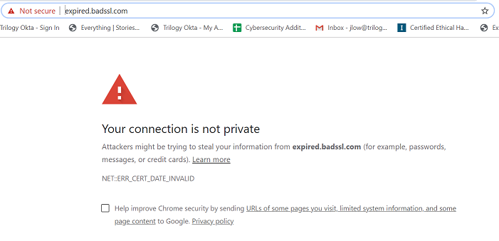
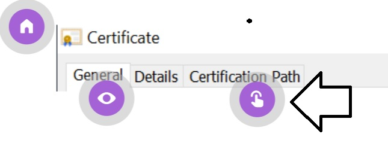

## 10.3: Applied Cryptography and Cryptographic Attacks

### Overview

In today's class, we will explore how cryptographic concepts are applied to modern technology and security challenges.  


### Class Objectives

By the end of class, students will be able to:

- Apply steganography in order to hide a message within non-secret data, such as an image.

- Use SSL certificates to help authenticate a website.

- Use cryptographic attack methods to crack a password.

- Use Hashcat to uncover the plaintext value of a hash.

### Instructor Notes

**Next Week's Lab Environment**: Students will use the new NetSec Azure lab environment for the next module. Please find the registration link in the Azure credentials spreadsheet.

- If you are unsure about where to find this unique registration link, please do the following:

  * Refer to this [spreadsheet](https://docs.google.com/spreadsheets/d/1uHVzvVQftHL4CkUOB03lNelf-kLToZys6ugsIoVOpE0/edit#gid=0) to find your university specific spreadsheet.
  * Open up your university-specific spreadsheet and navigate to your specific cohort’s tab.
  * Find the registration link for the appropriate lab environment.
  * These links will be added 1-2 classes prior to when students will be using the lab environment for the first time. If you would like access to a lab environment earlier for preparation, please reach out to the curriculum team.

- At the end of today's class:

  - Tell students to turn off their virtual machines and return to their local computers.
  - Send the NetSec Azure registration link. When students click on this link, it will add the NetSec environment card to their Azure dashboards.
  - Explain that the machines are found in this environment and then share the log-in credentials for each one.
  - Remind students to turn off their machines and environment before ending class.


### Lab Environment

<details><summary>Lab Details</summary>
<br>


You will use your local Vagrant virtual machine for today's activities. Please note that instructors and students have different access credentials.

- Instructor access:
  - Username: `instructor`
  - Password: `instructor`
  
- Student access:
  - Username:`sysadmin`
  - Password: `cybersecurity`


</details>


### Online Classroom Strategies 

Refer to the following guidelines and best practices for conducting this class online: 

- [Cybersecurity Online Classroom Strategies](../../../00-Teaching-Staff-Prework/OnlineStrategies.md)


### Slideshow

The lesson slides are available on Google Drive here: [10.3 Slides](https://docs.google.com/presentation/d/1XcQQdgdoVVBFYUsZE7GMFngWWENI_w1bon251iMG8Ms/edit).

- To add slides to the student-facing repository, download the slides as a PDF by navigating to **File** > **Download as** and choosing **PDF document**. Then, add the PDF file to your class repository along with any other necessary files.

- **Note**: Editing access is not available for this document. If you or your students wish to modify the slides, please create a copy by navigating to **File** > **Make a copy**.

### Time Tracker

The time tracker is available on Google Drive here: [10.3 Time Tracker](https://docs.google.com/spreadsheets/d/185EiHqBqZ3kVFAM7FpjOItv1qb1WjnqyLI467W4j0Mw/edit#gid=1047115118)


### Student Guide

Distribute the student-facing version of the lesson plan: [10.3 Student Guide](StudentGuide.md)

-------

### 01. Instructor Do: Class Introduction (0:05)

Begin class by welcoming students to the last day of cryptography and informing them that today they will continue to learn and apply more cryptography concepts.

Before we introduce new cryptography concepts, let's review the concepts taught in the previous class:

**Asymmetric Encryption**

- While symmetric encryption has many advantages, its primary disadvantages are key exchange and key management.

- As an alternative, we can use **asymmetric key encryption**, also known as **public-key encryption**, in which each individual has a two-key pair.

- The two-key pair consists of:
  - A **public key**, which can be seen and shared with anyone.
  - A **private key**, which should be kept private and only seen by the owner of the key pair.

- For encryption, the sender of a message uses the receiver's public key to encrypt a message.

- For decryption, the receiver of the encrypted message uses their private key to decrypt the message.

- **RSA** is the most widely used asymmetric key algorithm used today.

- **GPG** is a command-line tool that can apply asymmetric encryption.

**Hashing**

- While encryption is used to protect confidentiality, hashing is a cryptographic method used to protect integrity.

- Hashing uses algorithms to convert a plaintext message into  a **message digest**, also known as a **hash**.

- Data that has been hashed cannot be reversed, therefore it is known as a **one-way function**.

- Common hashing algorithms are **MD5** and **SHA256**.

- Command-line tools that can be used to create hashes are **`md5sum`** and **`sha256sum`**.

**Digital Signatures**

- A **digital signature** is a mathematical scheme for verifying the authenticity of digital data.

- The primary purpose of digital signatures is authentication, but they can also be used for integrity and non-repudiation.

- Like encryption, digital signatures also use public key cryptography.
  - However, a user uses their own private key to sign a document, and the public key is used by other users to validate the signature.

- There are several types of digital signatures available: **detached**, **all at once**, and **clearsigned**.


Now students complete a cryptography refresher activity using digital signatures with GPG.

- Ask the class if they have any questions before starting on the warm-up activity.


### 02. Student Do: Cryptography Refresher (0:20)

Explain the following to students:

- You will continue your role as a security analyst working for the Hill Valley Police Department.

- In the last class, you determined that the Alphabet Bandit is likely an insider, as a forged message told you to investigate *outside* of the Hill Valley Police Department.

- Since the Alphabet Bandit has yet to be identified, and in order to protect your fellow police officers, you want to remind everyone to be sure to use digital signatures to create and verify messages.

- Your task is to create a message reminding your fellow officers to use digital signatures.

- Be sure to follow your own advice by clearsigning the message, and then share it with your fellow officers.

- Before you begin verify that you can see your gpg key by running: `gpg --list-keys`. 
   - Note: If you can't see your gpg key, reinstall it using `gpg --gen-key`. 
   
:globe_with_meridians: This activity will use breakout rooms. Assign students into groups of 2 and move them into breakout rooms.   
   
Send students the following instructions & solution file.
  - Explain there will be no formal review since this is a refresher.

- [Activity File: Cryptography Refresher](activities/02_Cryptography_Refresher/unsolved/readme.md)
- [Solution Guide: Cryptography Refresher](activities/02_Cryptography_Refresher/solved/readme.md)


### 03. Instructor Do: Introduction to Applied Cryptography (0:10)

Remind students that so far, we have covered many cryptographic concepts, such as encryption, public key cryptography, digital signatures, and hashing.

- Until now, we have primarily covered the foundations of these cryptographic concepts.

- Now we will now focus on how these cryptographic concepts are applied to modern technology and security challenges.

First, we will look at how these cryptographic concepts are applied to portable devices, emails, web security, and digital forensics.

**Portable Devices**

Explain that encryption can be applied to securing portable devices such as laptops and cell phones.

- For example: An attorney has a laptop that contains all of his private legal documents. The attorney will need to know that if the laptop is lost and later found by someone who is not authorized to view the documents, that this person wouldn't be able to view them.

Explain that most current operating systems on laptops include disk encryption.

  - This disk encryption is a symmetric encryption, which often uses the AES algorithm.

  - Microsoft Windows uses a symmetric disk encryption program called **BitLocker** and Mac operating systems use **FileVault** encryption.

  - These disk encryptions prevent an unauthorized party from viewing the data on a laptop in case it is accessed by someone it shouldn't be.

**Email and Web Security**

Explain that public key cryptography can be used to secure emails and web applications.

- Emails are not natively encrypted and therefore can be sent and received in plaintext.

- Programs such as **S/MIME** and **PGP** are used to make emails confidential by applying public key cryptography.

  - For example: A sender of an email can use PGP to encrypt an email with the receiver's public key. The receiver of the email can decrypt the email with their private key.

-  PGP and S/MIME are also used to digitally sign emails to provide authenticity and integrity.

  - For example: A sender of an email can use PGP to sign an email with their private key. The receiver of the email can verify the authenticity by validating it with the sender's public key.

Next, explain how public key cryptography works for securing websites:

- **SSL** (Secure Socket Layer) is a protocol designed to provide encryption for web traffic.

  - The protocol HTTPS stands for _HTTP over SSL_.

- Websites are issued **SSL certificates** as a "seal of approval," confirming the website can be trusted.

- These certificates use public key cryptography to establish a secure connection between the browser and the server before the web traffic is encrypted with symmetric encryption.

Point out that websites also use hashing to store their passwords.

- Storing passwords in plaintext comes with risks.

  - For example, if a web server storing passwords in plaintext was breached by a hacker, the hacker would have access to the accounts and passwords for all the users of that website.

- Websites defend against this by using a hashing algorithm to hash the passwords of all users.

- This same algorithm is applied when a user logs in, then it is validated against the user's hashed password to provide authorization into the user's account.

  - This concept isn't just limited to website logins. It is also applied to server logins.


**Digital Forensics and Steganography**

Explain that a forensic examiner is a cybersecurity professional who is tasked with capturing and investigating digital evidence from computers, cellular phones, and other devices that contain digital data.

- This evidence can be used for private industry or public legal and criminal investigations.

- Forensic examiners often apply hashing.

  - For example: If a forensic examiner collects a hard drive from a laptop for an investigation, the examiner will immediately create a hash of the laptop.

  - This hash can be used by the examiner in legal proceedings to later prove that the hard drive they collected hasn't been modified since its original collection, proving the integrity of the evidence.

Explain that forensic examiners might also be tasked with using the cryptographic technique of **steganography**.

  - Define steganography as the cryptographic technique of placing hidden messages within a file, image, or video.

    - For example, a forensic investigator is conducting an investigation on an employee who is suspected to be selling insider trading information.

    - The suspicious employee has no files that contain any obvious evidence of wrongdoing. Their laptop only contains pictures of their family.

      

    - The forensic investigator can apply steganographic forensic tools to analyze these family photos and determine if they contain hidden data related to insider trading.

       

Explain that we will do a brief walkthrough demonstrating how to apply the steganographic command-line tool **`steghide`** to hide a secret message in an image.

#### `steghide` Walkthrough

Begin by opening up a command line in your virtual machine.

- Navigate to your `/home/instructor/Cybersecurity-Lesson-Plans/10-Crypto/` directory by running:
  - `cd /home/instructor/Cybersecurity-Lesson-Plans/10-Crypto/`  

- Point out that in this directory we have an image file called family.jpg. Explain we can open this picture with Ubuntu's image viewer by running:
  - `eog family.jpg` 
       
- Explain that now we are going to create a file with a secret message by running:
  - `echo "this is my hidden steganography message" > hidden_message.txt`

Next, type and explain the following commands:

  - `steghide embed -cf family.jpg -ef hidden_message.txt`

    - `steghide` is the command to run `steghide`.

    - `embed` is the additional command to specify that we are hiding the message.

    - `-cf family.jpg` uses `-cf`, which stands for _cover file_, to specify the file that the data is being hidden in. In this example, we are using the file `family.jpg`.

    - `-ef hidden_message.txt` uses `-ef`, which stands for _embed file_, to specify the file that is being hidden. In this example, we are hiding `hidden_message.txt`.

  - Run the command and enter a password when prompted.

  - Run the command `eog family.jpg` and point out that while there are no visable changes to the image, the secret message is now hidden inside of the family picture.

- Now delete the hidden message so it will be kept secret and only exist in `family.jpg`.

  - Run `rm hidden_message.txt`

Next, we will demonstrate how to extract the secret message from the image. Type the following command:

- `steghide extract -sf family.jpg`

    - `extract` is the additional command to indicate we are extracting the message.

    - `-sf family.jpg` uses `sf`, which stands for _stegofile_, to specify which file to run the steganography tool against.

- Run the command and enter  the password when prompted.

- Run `ls` and show that the file, `hidden_message.txt`, has been extracted from the image.

Summarize the following concepts covered in this lesson:

  - Cryptographic concepts such as encryption, public key cryptography, and hashing have many modern day applications.

  - Operating systems often use symmetric encryption programs such as BitLocker and FileVault to encrypt their hard drives.

  - Emails can use tools such as PGP and S/MIME to apply encryption, authentication, and integrity to emails.

  - Websites use public key cryptography to establish a secure session between a user's browser and the web server.

  - Forensic examiners use hashing to prove the integrity of the digital data they collect.

  - Steganography is a cryptographic technique used to hide data within messages, files, images, or video.

  - `steghide` is a forensic command-line tool used to apply these steganography techniques.

Explain that in the next activity, students will get to apply these steganography techniques to determine if a secret message has been hidden within an image found at an Alphabet Bandit crime scene.

Ask the class if they have any questions before starting the activity.

### 04. Student Do: Steganography Activity (0:15)

Explain the following to students:

- You will continue your role as a security analyst working for the Hill Valley Police Department.

- Unfortunately, the Alphabet Bandit committed another burglary, this time at Mrs. Peabody's house.

- The Alphabet Bandit left a thumb drive that only contained a JPG image of a car.

- While all the other detectives believe that this is just a regular image, your captain wants you to investigate if the image holds any secret messages.

- You must use steganography tools to determine if the image contains any hidden messages.

:globe_with_meridians: This activity will use breakout rooms. Assign students back into their groups of 2 and move them into breakout rooms.

Send students the following files:

- [Activity File: Steganography](activities/04_Steganography/unsolved/readme.md)
- [Image of the Car](https://drive.google.com/file/d/1LaMplkAEjxg3-oeq6jzqXq5sLvNbOX9H/view)

- :warning: **Heads Up**: Make sure the students do not slack the image. That will corrupts the file. Instead, have them download the image file from their VM with the link provided.

### 06. Instructor Review: Steganography Activity (0:05)

:bar_chart: Run a comprehension check poll before reviewing the activity. 

The goal of this activity was to demonstrate how steganography is used as an applied cryptographic concept to hide a message within non-secret data, such as an image. Students applied the command-line tool `steghide` to find the secret message.

Completing this activity required the following steps:

  - Save the image to a virtual machine.

  - Preview the image.

  - Run `steghide` to find the hidden message.

  - Preview the content of the hidden message.

Send students the following file:

- [Solution Guide: Steganography ](activities/04_Steganography/solved/readme.md)

#### Walkthrough

- Save the image to your virtual machine.

- Preview the image by double-clicking the image from the desktop of your VM.

  - The image should display a DeLorean car:

       

- Next, from the command line, go to your desktop directory to run the following `steghide` command:

  - `steghide extract -sf mydreamcar.jpg`

- When it asks for the password, enter the brand of the car:

  - `delorean`

- This extracts the hidden file, called  `list_of_targets.txt`.

- Preview the contents. This clearly reveals the previous and future targets of the Alphabet Bandit:

  ```
  List of Homes to Break Into

  Doctor Brown House - Done
  Mayor Wilson's House - Done
  Mrs Peaboday's House - Done
  Captain Strickland's house - Next
  ```

Answer any questions that remain before proceeding to the next lesson


### 07. Instructor Do: SSL Certificates (0:15)

Begin by explaining to the class that we just covered several ways to apply cryptography with technologies and devices we use every day.

Explain that we will now dive deeper into one of the commonly used applications of cryptography: securing website applications.

  - For example, if Widgets Corp. wants to start a new secure website, widgets.com, to accept customer transactions, they would need to take certain steps to add the appropriate security to their website application.

Explain that the security of website applications is often accomplished with **SSL certificates**.

  - Define SSL certificates as small files of data that use public key cryptography to secure connections between the browser and the web server.

    - Note that SSL certificates work with the HTTPS protocol.

  - SSL certificates can assist websites by providing them authentication and confidentiality.

Before we cover how SSL certificates provide authentication and confidentiality, we will walk through the process of acquiring an SSL certificate for widgets.com.

#### Obtaining an SSL Certificate

- First, Widgets Corp will reach out to an organization responsible for issuing SSL certificates, called a **certificate authority** (CA).    

- Examples of certificate authorities include:
  - GlobalSign
  - DigiCert
  - Comodo
  - Symantec

Widgets will request an SSL certificate called an **X.509 certificate**.

  - X.509 is the current standard for SSL certificates for securing online communications.

Next, the certificate authority will require the following information from Widgets Corp in their application.

  - Company documents

    - This will help the certificate authority validate that the application was submitted by a legitimate representative of Widgets Corp, preventing scammers from getting a real certificate added to a fraudulent website.

  - Unique IP address

  - Certificate signing request (CSR)

    - A **CSR** is a block of encrypted data that is created on the web server where the SSL certificate will eventually be installed.

    - The CSR contains information that will be added to the certificate, such as the company name and location.

    - When generating the CSR, a private and public key pair will be created, and only the public key will be sent to the certificate authority.

    - The private key remains hidden on the web server.

 - After the certificate authority validates and approves the information provided in the application, they will send the SSL certificate back to Widgets Corp.

 - Widgets Corp will then install the SSL certificate on the web server where they are hosting widgets.com.

 - After this, anyone who views widgets.com will be able to see the SSL certificate installed on the website.

     

#### SSL Certificates and Authenticity

Explain that we will now demonstrate how SSL certificates can be used to validate the authenticity of a website.

  - For example: A user receives an email from their bank to go to the following website www.Superbank!!.com to update their credentials.

  - The user is a customer of Superbank, but they have never seen this website and aren't sure it's legitimate.

  - The user can check the SSL certificate of this suspicious website to determine if the website is in fact authentic.

Explain that validating authenticity with SSL certificates is accomplished with a **chain of trust**:

- Browsers (such as Chrome and Internet Explorer) predetermine which certificate authorities to trust.

  - Browsers have a pre-established list of trusted CA's, called a **root store**.

  - In Chrome, we can access the root store by doing the following:

    - Go to **Preferences** > **Settings**.

    - Go to **Privacy and security** > **Manage certificates**.

     

    - Select **Trusted Root Certification Authorities**.

    

- Explain that this list contains a certain type of certificate authority called a **root certificate authority**, which your browser trusts.

    - Root certificate authorities are CAs at the top of the chain of trust and are typically not the organizations that issue SSL certificates.

- Next, select **Intermediate Certification Authorities**.

     

    - Another type of CA is an **intermediate certificate authority**, which report up the chain of trust to the root certificate authorities.

    - They typically issue SSL certificates on behalf of the root certificate authorities because it limits the risk exposure in the case where:

      - A root certificate authority was breached. In this case, every SSL certificate issued underneath it would be invalidated, including all certifications issued by intermediate certificates.

      - An intermediate certificate authority was breached. In this case, the impact would be limited to the certificates they issued.

  - Point out that if a website is issued a valid certificate from a CA that is not in the root store, your browser will warn you that the site isn't a trusted website.

**Valid Certificate Walkthrough**

Explain that we will now walk through how to view and validate the SSL certificate for a website.

- We will view a valid SSL certificate for Google.

- Begin by opening up a Chrome browser and going to [Google](https://www.google.com/).

   - Select the lock next to the URL of the website.

   - The following image confirms the SSL certificate is trusted.

      

- Next select **Certificate (Valid)** to view the details of the certificate.

  - Point out the following three important values from the details of the certificate:

    1. **Issued to** identifies the domain of the website that the certificate was issue to.
    2. **Issued by** identifies which certificate authority issued the certificate. This is typically the intermediate CA.
    3. **Valid from** identifies the date the certificate was issued and the expiration date.

    


- Next, select the **Certificate path**, which shows the the chain of trust for the certificate.

    

    1. **google.com** is the website that was issued the certificate.

    2. **GTS CA 101** is the intermediate certificate authority that issued a certificate to google.com.
    3. **Google Trust Services, Global Sign Root CA** is the root certificate authority that signed off on the intermediate certificate authority, GTS CA 101.

Summarize that the chain of trust on the above certificate is:
- **google.com** is trusted by ...
  -  The intermediate CA of **GTS CA 101**, which is trusted by ...
     - The root CA of **Google Trust Services, Global Sign Root CA**, which is trusted by ...
        - The Chrome browser, as this root CA is in the root store.


**Invalid Certificate Walkthrough**  

Explain that so far, we have only looked at a valid SSL certificate. Sometimes certificates aren't valid and your browser will warn you before you access the website.

Walk through the following steps to show an invalid certificate:

- Open the following website to display an invalid SSL Certificate: expired.badssl.com.

- Point out that the browser immediately displays several notifications on the URL and the main page.

  

- Explain that next we will click on **Not secure** next to the URL on the top left to view the certificate.  

- Point out that this page also clearly indicates that the website is not secure.

  

- Next, click on **Certificate (Invalid)** to display the details of the certificate.

  

- Point out that this shows that the certificate is invalid because it expired in 2015.

  - If students are interested in viewing additional invalid certificates, share the website www.badssl.com. It has many invalid certificates that students can safely view.

 #### SSL Certificates and Privacy

Explain that we just covered how the browser and the user of a website use SSL certificates to validate the site's authenticity.

 We will now cover how a website uses SSL certificates to offer privacy by securing a user's web traffic.

- **Step 1**: When we access a website that is secure, the browser asks the web server to provide the details of the certificate.

  - Remind the class that these are the details we saw when we viewed the certificate details.

- **Step 2**: The server responds with the copy of its SSL certificate, and also provides the public key.

- **Step 3**: The browser validates the certificate by checking expiration date and the root CA.

- **Step 4**: Once the certificate is validated, the browser uses the server's public key to create, encrypt, and send a new key called a **session key**.

  - A session key is a key that is used to secure a communication session between two devices.

  - In this case, the two devices are the browser and the web server.

- **Step 5**: The server decrypts the session key with its private key and sends back an acknowledgement encrypted with the session key to begin the encrypted session.

- **Step 6**: Now that secure web traffic can begin, the server and browser encrypt and decrypt all data with the session key.

Emphasize that an important concept to understand from the above steps is that accessing an HTTPS site uses both asymmetric and symmetric encryption.

   - Note that this is a common cybersecurity interview question.

   - More specifically, steps one through five use asymmetric methods and step six uses symmetric methods.


**Instructor Note:** If you have enough time, note the following additional fact about SSL certificates:

   - SSL certificates were originally used to work with the SSL cryptographic protocol, but SSL was later replaced with a more secure cryptographic protocol called **TLS (Transport Layer Security)**.

   - Even with this change, the certificates are still considered SSL certificates.

   - If students are interested in researching this topic further, please point them to the following article:

      - [GlobalSign: SSL vs TLS - What's the Difference?](https://www.globalsign.com/en/blog/ssl-vs-tls-difference/)


Summarize the concepts covered in this lesson:

  - One of the most common applications of cryptographic concepts is the securing of website traffic.

  - Website traffic is typically secured with an SSL certificate.
    - X.509 is the current standard for SSL certificates.

  - Certificate authorities, or CAs, are the organizations responsible for issuing SSL certificates.

  - Root certificate authorities, or root CAs, are at the top of the certificate chain, and don't usually issue SSL certificates directly.

  - Issuing SSL certificates is accomplished by intermediate certificate authorities, which report up to root CAs.

  - Validation of certificates is accomplished by the chain of trust.
    - For example: Your website has to be trusted by the intermediate CA, which must in turn be trusted by the root CA.

  - Even if a certificate has been issued, a website can be considered invalid if the certificate is:
     - Expired.
     - Assigned to the wrong host.
     - Issued by a CA that is not in the browser's root store.

  - Websites use both asymmetric and symmetric encryption to accomplish secure communication with the HTTPS protocol.   

Explain that in the next activity, students will apply these concepts to validate an SSL certificate.

 - Ask the class if they have any questions before starting the next activity.


### 07. Student Do: SSL Certificates Activity (0:15)

Explain the following to students:

- You will continue your role as a security analyst working for the Hill Valley Police Department.

- Several of your fellow officers have received a suspicious email saying that their Hill Valley Police website account had expired and asking them to login.

- One suspicious detail is that the website linked in the emails is hillvalleypd.org, but the website that officers usually access is hillvalleypd.com.

- Captain Strickland has tasked you with investigating the suspicious website and checking the certificates to determine if the website is legitimate.

:globe_with_meridians: This activity will use breakout rooms. Assign students back into their groups of 2 and move them into breakout rooms.

Send students the following files:

- [Activity File: SSL Certificates](activities/07_SSL_Certificates/unsolved/readme.md)
- [Homepage of the Suspicious URL](https://view.genial.ly/5defb03224596c0fff13c3a2/interactive-image-interactive-image)


**Instructor Note:** If the website isn't accessible, share the offline version:
  - [Offline Hill Valley PD Website](resources/Hillvalley_offline_webpage.zip) (To view it, simply extract all the files in the folder and open `genially.html`.)


### 08. Instructor Review: SSL Certificates Activity (0:10)

:bar_chart: Run a comprehension check poll before reviewing the activity. 

This activity showed how SSL certificates can assist with the authentication of a website.  Students explored a mock website's SSL certificate and learned how even if a site has a certificate issued, it can still be inauthentic.

Completing this activity required the following steps:

  - Viewing a mock website
  - Exploring the website's SSL certificate
  - Determining the root and intermediate Certificate Authority
  - Determining if a website should or should not be trusted

Send students the following file:

- [Solution Guide: SSL Certificate](activities/07_SSL_Certificates/solved/readme.md)

#### Walkthrough

- First, open [the webpage that was sent to the officers]( https://view.genial.ly/5defb03224596c0fff13c3a2/interactive-image-interactive-image).

    - Remember, the officers found this website suspicious because the official website is hillvalleypd.com.

 - View the certificate of the website. To do this,  click on the purple icon next to the website.

   

 - There is a clear warning of an issue with certificate and the website.

   

  - To further view the details, click on the purple icon next to **Certificate (Invalid)**.

  - This displays the certificate details header, with several tabs available for viewing.

  - Begin by viewing the **General** tab.

   

  - We can see that this is invalid because the root authority that issued the certificate is not trusted by the browser you are using.

  - Also, the certificate is expired.

   

- Close this page by clicking the **x**. Click on **Certification Path**.

   

- This clearly shows that while a certificate was issued, the issuing root authority's name is highly suspicious:
   - No Verification Certificate Authority
- The intermediate certificate authority name is also suspicious:
   - Alphabet Bandit Certificate Authority

           

  - What is the root certificate for this website?
      -  No Verification Certificate Authority

  - What is the intermediate certificate for this website?
      -  Alphabet Bandit Certificate Authority

  - Why is the browser giving a warning about the certificate?
      - Because the root issuing certificate authority is fraudulent, and not in the browser's root store.

- Sample summary and recommended communication:

   - "Captain Strickland, I have determined that the emails our detectives have been receiving are phishing emails. The website hillvalleypd.org is fraudulent, and while it has a certificate, it was issued by an illegitimate root and illegitimate intermediate certificate authority.

      I recommend we provide a warning message bulletin to all of our staff to be aware of all suspicious emails and websites, and to verify if certificates are legitimate on any website being accessed. Also, don't forget to digitally sign your message."


Take a moment to answer any questions that remain before proceeding.

### 09. Break (0:15)

### 10. Instructor Do: Cryptographic Attacks (0:10)

Now we are going to change topics and discuss **cryptographic attacks**.

- Remind the students that we have so far covered multiple methods and technologies that provide individuals and organizations with privacy, authenticity, integrity, and non-repudiation (The P.A.I.N model).

- Explain that, unfortunately, determined adversaries often find ways to attack these methods through **cryptographic attacks**.

  - As an example, a hacker might try to crack a bank's encrypted files containing credit card data to sell on the dark web.

- Explain that it is important for cybersecurity professionals to understand and be able to conduct these same cryptographic attacks to determine if a cryptographic method is secure.

  - For the example above: A security professional would want to attempt the same cryptographic attacks against the encrypted files that they anticipate might be used by a hacker. This would help them determine if the credit card data is in fact secure.

Explain that next, we will cover several types of cryptographic attacks and the mitigation strategies used to counter them.

#### Statistical Attack

- A **statistical attack** exploits weaknesses associated with statistics in a cryptographic algorithm.

  - There are many cryptographic algorithms that attempt to produce truly random values.

  - A statistical attack attempts to determine if the values being created are in fact not random and are instead predictable.

    - For example: Some technology professionals use a token generation program that creates a random number that they use to securely log in to their computer.

       

    - If the number generated is in fact predictable and not random, a hacker could determine the number and access unauthorized data.

- **Mitigation**

  - A security professional needs to be sure that algorithms that use random values continue to produce values that are in fact random, so the data is not predictable.

#### Brute Force Attack

- A brute force attack is when an attacker simply uses many passwords or user/password combinations until one of them works.

  - For example: If a hacker wants to log in with the user `root`, they would try the user `root` with many passwords until they guess correctly:
    - User: root, Password: abc123
    - User: root, Password: 123abc
    - User: root, Password: 123456
    - User: root, Password: 654321
    - User: root, Password: aaaaaa
    - User: root, Password: bbbbbb

- **Mitigation**
    - A security professional can apply the lockout functionality to all logins, which will limit the number of login attempts a user has before getting locked out.

    - Applications can also have firewalls that detect and stop large volumes of attempted logins from a single source IP address.

#### Birthday Attack

- A birthday attack exploits the probability (and weakness) that two separate plaintexts that use a hash algorithm will produce the same ciphertext.

  - This same ciphertext is also known as a **collision** or a **hashing collision**.

  - The birthday attack is named after a probability theory called the Birthday Paradox, which states that for a given number of people there will always be two that share a birthday.

    - If students are interested in reading more about the Birthday Paradox, send them the following resource: [Birthday problem (Wikipedia)](https://en.wikipedia.org/wiki/Birthday_problem).

- **Mitigation**

   - Use a strong hashing algorithm that limits the possibilities of a hashing collision.

#### Frequency Analysis

Frequency analysis involves an attacker looking at the ciphertext of a substitution algorithm and trying to determine which ciphertext letters appear most frequently.

  - Since the most common letters in the English language are e, t, o, and a, the attacker substitutes the frequently occurring letters with the common English language letters to determine the substitution algorithm key.

  - Once the key is figured out, the hacker can determine the plaintext from the ciphertext.

  - Additionally, if the common letters in the ciphertext are actually e, t, o, and a, the hacker can determine that the ciphertext is likely using a transposition cipher.

- **Mitigation**
  - This method typically targets standard ciphers. Using more advanced encryption algorithms will better protect against this attack.

#### Replay Attack

In a replay attack, an attacker intercepts an encrypted message and replays it to the receiving party to get access.

  - For example: An attacker can obtain an encrypted signal from a garage door opener. The attacker can replay the encrypted signal at a later time to open the garage.

- **Mitigation**
  - Add an expiration time for the encrypted data so it can't be replayed at a later time.

#### Known-Plaintext

In this method, the attacker has access to the ciphertext and the associated plaintext.

- The attacker does not have access to the encryption device or program.

- The attacker does an analysis to determine the encryption/decryption algorithm of the ciphertext and plaintext data to determine future encrypted messages.

- For example, suppose a hacker captured the following plaintext and ciphertext:

   - Plaintext: **hello**, ciphertext: **8 5 12 12 15**

   A hacker could analyze this data and determine that each alphabet letter corresponds to a number in alphabetical order, where:

  -  a = 1, b = 2, c= 3, etc.

    If a future message comes through as: **7 15 15 4 2 25 5** the hacker can decrypt it as: **goodbye**.

- **Mitigation**
  - Use an advanced encryption algorithm and limit the access to ciphertext and associated plaintext.

#### Chosen-Plaintext

In a chosen-plaintext attack, an attacker has access to the encryption device and program and the ciphertext, but not the associated plaintext.

  - The attacker can encrypt several plaintext messages to see how the ciphertext is generated each time.

  - Based on the results of the different ciphertexts generated, an attacker can determine the algorithm and apply it in reverse to obtain the plaintext from the acquired ciphertext.

- For example: We obtain a ciphertext of **act** along with an encryption program that can create this ciphertext.

  We can then enter several plaintexts into the encryption program to analyze the results:
    - plaintext: **boy**, ciphertext: **oby**
    - plaintext: **red**, ciphertext: **erd**
    - plaintext: **hot**, ciphertext: **oht**

   Based on these results, we can conclude that this is a transposition cipher using the key: {1, 2, 3) = {2, 1, 3}

   - If we apply this key in reverse to **act**, we can determine the plaintext is **cat**.

- **Mitigation**:
  - Limit access of the encryption device and use an advanced encryption algorithm.


Summarize the concepts covered in this section:

  - Attackers use a variety of cryptographic attacks to compromise cryptographic methods and algorithms.

  - Cybersecurity professionals also use these same cryptographic attacks to determine the security strength of the cryptographic methods being used.

  - Cryptographic attack types include statistical, birthday, brute force, frequency, replay, known-plaintext, and chosen-plaintext attacks.

  - With each of these attacks, there are also measures that security professionals can use to protect from them.

Explain that in the next activity, students will apply the cryptographic technique of a chosen-plaintext attack to determine the plaintext message from a found ciphertext.

Ask the class if they have any questions before starting the activity.


### 11. Student Do: Cryptographic Attacks Activity  (0:20)

Explain the following to students:

- You will continue your role as a security analyst working for the Hill Valley Police Department.

- Captain Strickland shared some news: they have been secretly capturing and monitoring all the online activity of the Hill Valley detectives.

- They believe that Detective Tannen is the Alphabet Bandit, as Tannen has been recently saving suspicious encrypted files on their computer.

- The captain believes these encrypted files contain evidence that can be used to prosecute Detective Tannen.

- While capturing Detective Tannen's online activity, Captain Strickland was able to capture the following:
    - Detective Tannen's password encryption script, which generates encrypted passwords from plaintext.

    - Detective Tannen's encrypted password, which is **cbzhptmm**.

- Your task is to see if you can figure out the algorithm of the encryption script to figure out Detective Tannen's plaintext password.

- Then, you will try to use Detective Tannen's password to log into their account and gather evidence that they are the Alphabet Bandit.

:globe_with_meridians: This activity will use breakout rooms. Assign students back into their groups of 2 and move them into breakout rooms.

Send students the following files:

- [Activity File: Cryptographic Attacks](activities/11_Crypto_Attacks/unsolved/readme.md)
- [Detective Tannen's Password Encryption Script](resources/encrypter.py)
- [Detective Tannen's Computer Login](resources/password.py)


### 12. Instructor Review: Cryptographic Attacks Activity (0:05)

:bar_chart: Run a comprehension check poll before reviewing the activity. 

The goal of this activity was to use a chosen-plaintext attack method to crack a password. Students used an algorithm that converts plaintext into ciphertext to determine the plaintext of an encrypted text.

Completing this activity required the following steps:

  - Downloading the encryption and password verification script.

  - Testing the encryption script on plaintext to examine the results.

  - Determining the algorithm applied by the encryption script based on the results.

  - Reversing the algorithm to determine the plaintext of the provided ciphertext.

  - Logging in with the plaintext password to validate the password was correct.

Send students the following file:

- [Solution Guide: Cryptographic Attacks](activities/11_Crypto_Attacks/solved/readme.md)

#### Walkthrough

- First, download the two scripts (`encrypter.py` and `password.py`) to your virtual machine.

- Next, test the `encrypter.py` with several plaintext words to see the results.
  - For example, if you run `python3 encrypter.py`, you will be asked:
      ```
     What is your password?
      ```
  - We will first test:  **hello**. The following is returned:

      ```
      Your Password is: hello
      Your Encrypted Password is: axeeh
      ```

   - We can determine that the letters are being substituted, as both **l**s are substited with an **e**.

   - We will test it again with one letter, **a**,  to see if we can determine the algorithm. The following is returned:

      ```
       Your Password is: a
       Your Encrypted Password is: t
      ```
   - Since **a** is the first letter in the alphabet, and **t** is the twentieth letter in the alphabet, we can conclude that this algorithm is a Caesar cipher shifting the letter 19 characters.

   - Let's apply this algorithm in reverse for each letter.
     - A good way to do this is to write or type out the whole alphabet and count 19 characters to the left for each letter of the encrypted password.

     - If you pass the letter **a** while counting, start back at the letter **z**.

   - Once we apply this to every letter, the plaintext of Detective Tannen's encrypted password (**cbzhptmm**) is decrypted as **jigowatt**.

 - Next we will test out this password by running `python3 password.py`. This will return the following:

      ```
      Hi Mr Tannen,  What is your password (lowercase only) ?
      ```

  - Enter in the password `jigowatt`, and the following will be returned:
      ```
      Hello Detective Tannen, the last file you accessed is: topsecret.txt.
      ```


We will examine the `topsecret.txt` file in the next activity.

Answer any questions that remain before proceeding.

### 13. Instructor Do: Introduction to Rainbow Tables and Hashcat (0:10)

We just covered many techniques that can be used to attack cryptographic methods.

 - The last activity demonstrated that some of these attack methods can be applied with manual methods and deductive reasoning.

 - Cracking other types of cryptography can require more advanced methods and technologies.

Explain that one type of cryptography that requires an advanced cracking method is **hashing**.

  - Remind the class that hashing is a cryptographic method that uses a mathematical algorithm to create a one-way ciphertext, which can not be reverted back to its original plaintext.

  - Since hashing creates a one-way ciphertext, it is almost impossible to decipher the algorithm and figure out the plaintext from the ciphertext.

A different approach can be used to crack hashes: a cryptographic method called rainbow tables.

#### Rainbow Tables

Explain that **rainbow tables** are resources that contain precomputed hashes with the associated plaintext password.

- For example:

  

- Typically different hashing algorithms have different rainbow tables.

  - For example, there may be a a MD5 rainbow table, and a NTLM rainbow table.

- The advantage of using rainbow tables is that finding the correct password is as "simple" as looking up the password associated with a given hash.

- One disadvantage is that some rainbow tables are extremely large, and take a lot of storage space and computing power to work effectively.

Explain that a defense against rainbow tables is the cryptographic method known as salting.

- A **salt** is simply a random value.

- **Salting** is a cryptographic method that combines the salt with the plaintext into the hash function.

  - The output value of salting is called a **salted hash**.

  (**plaintext** + **salt**) run through (**hashing function**) = **salted hash**  

  - Therefore, a unique output is created for each plaintext/salt combination.


#### Hashcat

Explain that although we've talked about John the Ripper in the past, to make you a more versatile candidate, we'll be looking at another hash cracking program called hashcat. 

Explain that **Hashcat** is a command-line tool that can automate the cracking of hashes.

   - Hashcat is available as a free download.

   - Hashcat uses dictionary wordlists, rainbow tables, and brute force methods to figure out plaintext passwords from hashes.

   - Hashcat works with a variety of hashing algorithms.

Explain that we will demonstrate how to use Hashcat to crack a hash with the following scenario:

  - A cybersecurity professional is tasked with testing the security of a company's website by confirming if they can log into their website as the root user.

  - The security professional is able to conduct an attack on the website. With this attack, they capture an unsalted hash value of the root user's password: `ea847988ba59727dbf4e34ee75726dc3`.

  - From the length of the hash, they determine it is an MD5 hash.

  - The walkthrough will demonstrate the steps necessary to determine the root user's plaintext password with Hashcat.

**Hashcat Walkthrough**

- Begin by accessing the following directory in your virtual machine:

  - `/usr/share/wordlists/`

- Point out that within this directory, there is a large wordlist file called `rockyou.txt` that contains a large list of common plaintext passwords.

  - If the file is zipped, it can be unzipped by running the following command: `gunzip rockyou.txt.gz`

- Preview the file by running the following command:

  - `more rockyou.txt`

- It should display a list of common plaintext passwords, such as:

  ```  
  123456
  12345
  123456789
  password
  iloveyou
  princess
  1234567
  rockyou
  ```

- Emphasize that this list is a dictionary list of common passwords. It does not contain hashes like a rainbow table, only the plaintext passwords.

  - Hashcat will use this plaintext list and, depending on which hash algorithm is selected,  compute hashes against each of these plaintext words.

- Explain that the next step is to place the hash we want to crack into a file.

  - We will place this into a file called `hashes.txt`:

    - ` echo ea847988ba59727dbf4e34ee75726dc3 > hash.txt`

  - We can add multiple hashes to this file, as long as each hash is on a separate line.

- Next, we will type the following Hashcat command to crack this hash:

  - `hashcat -m 0 -a 0 -o solved.txt hash.txt rockyou.txt --force`

- Break down the syntax:

    - `hashcat`: The command to execute Hashcat.

    - `-m 0`: The `0` indicates the script will use the MD5 hash, as this was the hash the security professional determined to be in use.

      - If a different hashing algorithm is in use, we would change the value of `0`.

      - For example: We would use `-m 100` for SHA-1, and `-m 1400` for SHA-256.


  - `-a 0`: The `0` tells the script to apply the attack method of "dictionary."
    - The above link provides additional attack types.

  - `-o solved.txt`: Creates an output file called `solved.txt`.

  - `hash.txt`: The input file of the hash.

  - `rockyou.txt`: The file containing the wordlist we will check against.

  - `--force`: Overrides any small errors that may occur.

- Run the command and explain that this will place the results in the file called `solved.txt`.

- Open the `solved.txt` file and note that it displays:

   - The hash and the plaintext value of the hash separated by a colon: `ea847988ba59727dbf4e34ee75726dc3:topsecret`

- Explain that with this combination, the cybersecurity professional can determine the root user's password is `topsecret`.

- They are now able to log into the website with these credentials.

Summarize that this lesson and walkthrough covered the following concepts:

  - Some cryptographic attack methods require advanced methods and technologies to crack.

  - A popular advanced cryptographic method for cracking hashes are rainbow tables.

  - Rainbow tables contain precomputed hashes with the associated plaintext password.

  - One defense against rainbow tables is salting, which adds a random value to the plaintext value during the hashing process.

  - Hashcat is a free command-line tool which can automate the process of using dictionary, brute force, and rainbow table attacks against hashes.

Take a moment to address questions before proceeding to the final cryptography activity to hopefully capture the Alphabet Bandit.

### 14. Student Do: Hashcat Activity (0:20)

Explain the following to students:

- You will continue your role as a security analyst working for the Hill Valley Police Department.

- You impressed Captain Strickland by logging into Detective Tannen's account. Unfortunately, the file you must access to prove Tannen is the Alphabet Bandit is encrypted on their computer.

- Fortunately, you found a hash on Detective Tannen's computer that will likely lead you to the password for opening the encrypted file: `f31663d6c912b0b1ced885a6c6bbab7c`.

- Your task is to use Hashcat to figure out the plaintext representation of the hash.

- Once you figure out the password, you will open the secret file and see if it contains the evidence needed to convict the Alphabet Bandit.

:globe_with_meridians: This activity will use breakout rooms. Assign students back into their groups of 2 and move them into breakout rooms.

Send students the following files:

- [Activity File: Hashcat](activities/14_Hashcat/unsolved/readme.md)
- [Encrypted File from Detective Tannen's Computer](resources/secret.zip)


### 15.  Instructor Review: Hashcat Activity (0:05)

:bar_chart: Run a comprehension check poll before reviewing the activity. 

 The goal of this activity was to illustrate how Hashcat can be used to determine the plaintext value of a hash. Students ran the Hashcat script to determine the password needed to open an encrypted file.

Completing this activity required the following steps:
- Designing a Hashcat script.

- Running the Hashcat script to determine the plaintext value of a hash.

- Use the plaintext value to open an encrypted file.

Send students the following file:

- [Solution Guide: Hashcat](activities/14_Hashcat/unsolved/readme.md)

#### Walkthrough

- First, we place the hash into a file.

  - We will place it into a file called `hash.txt` by running the following:

    - `echo f31663d6c912b0b1ced885a6c6bbab7c > hash.txt`

  - Run the command and preview the file to confirm the hash has been placed inside:  

    - `more hash.txt`

- Next, we write the Hashcat command:

  - `hashcat -m 0 -a 0 -o solved.txt hash.txt /usr/share/wordlists/rockyou.txt --force`

- The syntax is:
  - `hashcat`: The command to execute Hashcat.
  - `-m 0`: Uses the MD5 hash (which was created by Ronald Rivest in 1992).
  - `a 0`: Applies a dictionary attack.
  - `-o solved.txt`: Creates an output file called `solved.txt`.
  - `hash.txt`: The input file of the hash.
  - `/usr/share/wordlists/rockyou.txt`: The location of the wordlist we will check against.
  - `--force`: Overrides any small errors that may occur.

- Run the command. This will place the results in the file called `solved.txt`.

- Open the `solved.txt` file. It displays that the hash represents the value of `ilovelorraine`:

   - `f31663d6c912b0b1ced885a6c6bbab7c:ilovelorraine`

- Open the file `secret.zip` using the command `unzip secret.zip`.

- When it prompts for the password, enter `ilovelorraine`.

- This will reveal the Alphabet Bandit's confession letter:

```
CONGRATULATIONS TO THE CYBER SLEUTH THAT FINDS THIS MESSAGE!!


My Confession

  I, Detective Tannen, am confessing that I am the Alphabet Bandit!

  I am the one solely responsible for all of the Hill Valley Break-ins.

  Since I wasn't promoted to Captain, I have been determined to cause havoc to the Hill Valley community and tie up the Hill Valley Resources.

  Unfortunately, since you have found this message, I will assume that I will be prosecuted and the break-ins will cease.

Sincerely,
Detective Tannen
```

### 16. Instructor: End Class and Next Week's Azure Lab Environment

Let students know that in the next module, we will be returning to Azure Lab Services. We will be using a new lab environment: `NetSec`

Tell students to switch to their local computer environment.

Please send students the registration link for the NetSec environment. Once they click on it,  the NetSec environment card will be added to their Azure dashboard.

**Details Around the Environment**

Inside of the NetSec instance, you will find a Windows 10 machine hosting a Security Onion machine and two virtual Linux machines named UFW and firewalld.

  - Credentials for the Windows 10 machine:
    - Username: `azadmin`
    - Password: `p4ssw0rd*`

  - Credentials for the Security Onion, UFW, and firewalld machines:
    - Username: `sysadmin`
    - Password: `cybersecurity`


Make sure all students are set up and can access this environment. Address any troubleshooting issues prior to the next class.

Remind students to turn off any nested VMs running and their NetSec lab environment before ending class.

-------

© 2020 Trilogy Education Services, a 2U, Inc. brand. All Rights Reserved.
