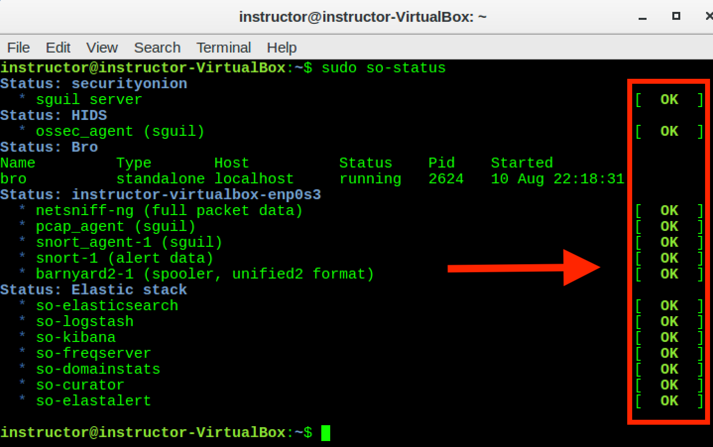
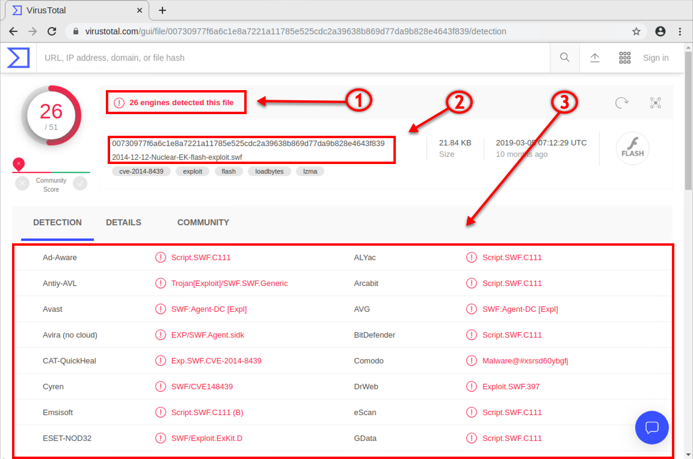

## 11.2 Lesson Plan: Intrusion Detection, Snort, and Network Security Monitoring

### Overview

In today's class, students will build upon their knowledge of firewalls by using intrusion detection systems such as, Snort IDS systems. Students will learn how to use Network Security Monitoring (NSM) and the Snort IDS engine to analyze indicators of attack (IOA), indicators of compromise (IOC), perform network forensics, and acquire intelligence and situational awareness of their networks providing them with the necessary information required to defend against network attacks.

### Class Objectives

By the end of today's class, students will be able to:

- Interpret and define Snort rules and alerts.

- Explain how intrusion detection systems work and how they differ from firewalls. 

- Use Security Onion and its suite of network security monitoring tools to trace the path of network attacks.

- Collect and analyze indicators of attack and indicators of compromise using NSM tools.

- Apply knowledge of NSM, Snort rules, and Security Onion to establish situational awareness within a network.

### Instructor Notes

- On Days 11.2 and 11.3, we will begin class by logging into Azure and launching an instance of Security Onion. This will generate PCAP traffic that we will use to analyze and triage alert data.

### Lab Environment

Lab Details

 

In this module, you will use the NetSec lab environment located in Windows Azure Lab Services. RDP into the **Windows RDP host machine** using the following credentials:

  - Username: `azadmin`
  - Password: `p4ssw0rd*`

Open Hyper-V Manager to access the below machines:

**Security Onion machine:**
  - Username: `sysadmin`
  - Password: `cybersecurity`

**UFW machine:**
  - Username: `sysadmin`
  - Password: `cybersecurity`

**firewalld machine:**
  - Username: `sysadmin`
  - Password: `cybersecurity`

In today's class, you will use the SecOnion machine.

### Online Classroom Strategies 

Refer to the following guidelines and best practices for conducting this class online: 

- [Cybersecurity Online Classroom Strategies](../../../00-Teaching-Staff-Prework/OnlineStrategies.md)

### Lesson Slideshow 

The lesson slides are available on Google Drive here: [11.2 Slides](https://docs.google.com/presentation/d/1Pd55jWifT2gLTugCxhdS_wvfaDSfiAYXmcJeLUTwWak/edit#slide=id.g4789b2c72f_0_6)

- To add slides to the student-facing repository, download the slides as a PDF by navigating to File > "Download as" and choose "PDF document." Then, add the PDF file to your class repository along with other necessary files.

- **Note:** Editing access is not available for this document. If you or your students wish to modify the slides, please create a copy by navigating to File > "Make a copy...".

### Time Tracker

The time tracker is available on Google Drive hereL: [11.2 Time Tracker](https://docs.google.com/spreadsheets/d/1FZrOydH1-aV9-WboQLUgsSQMS6igxz5mfVwO8GM0AoA/edit#gid=1145703143)

### Student Guide

Distribute the student-facing version of the lesson plan: [11.2 Student Guide](StudentGuide.md)

---

### 01. Everyone Do: Security Onion Setup (0:10) 

Welcome students to class and let them know that today's lesson will introduce fundamental concepts and tools of network security monitoring, intrusion detection, and Snort.

Before we get started, we will need to log into Azure and launch an instance of Security Onion. This will generate alert data that we'll use later in the class. Specifically, it will spin up an instance of Security Onion with loaded PCAPs.

- Review that PCAPs are snapshots of live traffic. In the networking modules, students loaded PCAPs into Wireshark. 

- Explain that, Security Onion will use the command `sudo so-replay` to replay multiple PCAPS stored in the `/opt/samples` directory, which stores hundreds of PCAPs. 

- It's essential, that network defenders know how to replay network traffic using PCAPS in order to analyze and triage alert data.

Send students the following file: 

- [Everyone Do: Security Onion Setup](Activities/01_Security_Onion_Setup/README.md)

Lead the class in the following demonstration.

1. First, we will all verify that our network security monitoring (NSM) tools are working before starting the labs. Click on **Applications** > **Other** > and scroll down to **Terminal**. Click to launch the terminal type the following command:
   
    - `sudo so-status`
      
       - `so-status`: Checks the status of currently installed NSM tools.
   
    - Output should look similar to below:
   
       
   
      - Ensure all statuses are listed as `OK`.
      - If not, let the `so-status` command run for a few minutes. It can be slow.
   
    - If any of the statuses are not listed as `OK` after a few minutes, restart the NSM tools with the following command:

       - `sudo so-restart`
   
    - Run the `so-status` command again for a few minutes. All systems should be listed as `OK` after a few minutes.

2. Next, we need to generate alerts.  

   - Run `sudo so-replay`

      - `so-replay` is the command used by Security Onion to "replay" all PCAP files from previously captured malware.

It can `so-replay` take as long as 10 to 15 minutes for Security Onion to run all of the PCAPs. This will be running as we move into the first lecture. By the time we reach our first activity, the PCAP replay should be completed and Security Onion should be ready to go.

### 02. Instructor Do: Welcome and Overview (0:10)

#### Network Security Recap

Explain that last class, students learned how firewalls play a critical role in establishing a perimeter defense. They  protect networks by making decisions based on rules that are set by administrators. Firewalls are designed to allow traffic from trusted sources and block traffic from untrusted sources.

- While a good first step, firewalls are only one layer of defense.

- Firewalls do have their limitations. Advanced hackers can easily fool them through packet manipulation.

- For instance, an attacker can send malicious data through a firewall by hijacking or impersonating a trusted machine. This is why it's crucial to have a strong defense in depth methodology to help protect sensitive data.

Today, students will build upon the defense in depth methodology by using intrusion detection systems (IDS). 

- Explain that students will learn how to use network security monitoring (NSM) and the Snort IDS engine to analyze indicators of attack (IOA), indicators of compromise (IOC), perform network forensics, and acquire intelligence and situational awareness of their networks providing them with the necessary information required to defend against network attacks.

- The first half of the day introduce intrusion detection and prevention systems. Students will learn how to physically interconnect IDS systems and how to read, write, and interpret Snort rules.

- The second half of the day will introduce Security Onion and the role NSM tools play in network security.

Answer any questions before proceeding. 

### 03. Instructor Do: Introduction to Intrusion Detection Systems and Snort (0:20)

Today, we'll explore the world of intrusion detection systems and how they differ from firewalls.

Remind students that a firewall is a device used in network security designed to filter inbound and outbound traffic, based upon a set of predetermined administratively defined rules. 

Firewalls make decisions to either allow or block traffic based on the following:

- Source and destination IP address
- Source and destination port number
- Protocol type

- Firewalls do have their limitations. They can easily be fooled through packet manipulation by clever hackers. 

   - For instance, attackers can send malicious data through a firewall by hijacking or impersonating a trusted machine.

- Unlike firewalls, intrusion prevention and detection systems monitor, detect, and alert about an attack depending upon the configuration.

**Intrusion detection systems** (**IDS**) are tools that can both analyze traffic _and_ look for malicious signatures. An IDS is like a firewall that also reads the data in the packets it inspects, issues alerts/alarms, and blocks malicious traffic if configured to do so.

- Explain that there are many varieties of intrusion detection systems, but today's class will focus on **Snort**, the world's most popular open-source solution.

**Network security monitoring** (**NSM**) is the process of identifying weaknesses within a network's defense. It also provides organizations with situational awareness of their network.

- Explain that Security Onion is a specific Linux distribution that's derived from Ubuntu. Security Onion uses the Snort IDS engine as its event-driven mechanism. 

Pause to answer questions before proceeding.

#### Intrusion Detection System Overview

Explain that intrusion detection systems (IDS) are passive devices that perform packet captures of all traffic that passes through a network interface.

- Point out that intrusion detection systems are not designed to _respond_ to an attack, but rather to document and log attacks for future analysis.

- Emphasize that intrusion detection systems help organizations establish situational awareness of their adversaries, which may include intent and end objectives. Organizations can use this information to harden their defenses.

#### IDS Types

Point out that there are two primary types of IDS:

- **Signature-based** IDS compares patterns of traffic to predefined signatures.
   - Good for identifying well-known attacks.
   - Requires regular updates as new attack signatures are released.
   - Vulnerable to attacks through packet manipulation that tricks the IDS into believing malicious traffic is good.
   - Unable to detect zero-day attacks.
   
- **Anomaly-based** IDS compares patterns of traffic against a well-known baseline.
   - Good for detecting all suspicious traffic that deviates from the well-known baseline.
   - Prone to issuing false alerts.
   - Assumes normal network behavior never deviates from the well-known baseline.
   - Excellent at detecting when an attacker probes or sweeps a network.

#### Intrusion Detection Architecture

Explain that intrusion detection systems have two basic architectures:

- **Network intrusion detection system** (**NIDS**) filters an entire subnet on a network.
   - Matches all traffic to a known library of attack signatures.
   - Passively examines network traffic at the points it is deployed.
   - Relatively easy to deploy and difficult to detect by attackers.

- **Host-based intrusion detection system** (**HIDS**) runs locally on a host-based system or user’s workstation or server.
   - Acts as a second line of defense against malicious traffic that successfully bypasses a NIDS.
   - Examines entire file systems on a host, compares them to previous snapshots or a baseline, and generates an alert if there are significant differences between the two.

**Intrusion Prevention System**

Explain that an **intrusion prevention system** (**IPS**) does everything that an IDS can do, but can also respond to attacks. An IDS doesn’t alter or react to packets as they enter the network. An IPS does this by blocking malicious traffic and preventing it from being delivered to a host on the network.

Emphasize the two main differences between an IPS and IDS:

- IDS physically connects via a network tap or mirrored port or SPAN.
  
   - **Network tap** (Test Access Port) is a hardware device that provides access to a network. Network taps transit both inbound and outbound data streams on separate channels at the same time, so all data will arrive at the monitoring device in real time.

   - **SPAN** (Switched Port Analyzer), also known as **port mirroring**, sends a mirror image of all network data to another physical port, where the packets can be captured and analyzed.

   - IDS requires an administrator to react to an alert by examining what has been flagged.

- IPS physically connects inline with the flow of data. An IPS is typically placed in between the firewall and network switch. 

   - Requires more robust hardware due to the amount of traffic flowing through it.
   
   - Automatically takes action by blocking and logging a threat, thus not requiring administrative intervention.

Point out that an IDS generates an alert when a Snort rule detects malicious traffic that matches a signature. An alert is a message that’s created and sent to the analyst’s console as an **indicator of attack** (**IOA**).

Explain that there are two primary types of indicators:

- Indicators of attack indicate attacks happening in real time.
   - Proactive approach to intrusion attempts.
   - Indicate that an attack is currently in progress but a full breach has not been determined or has not occurred yet. 
   - Focus on revealing the intent and end goal of the attacker regardless of the exploit or malware used in the attack.

- **Indicators of compromise** (**IOC**) indicate previous malicious activity. 

   - Reactive approach to successful intrusions.
   - Indicate that an attack occurred, resulting in a breach.
   - Used to establish an adversary's techniques, tactics, and procedures (TTPs).
   - Expose all of the vulnerabilities used in an attack, giving network defenders the opportunity to revamp their defense as part of their mitigation strategy, and learn from an attack so it won't happen again.

#### Snort

Explain that Snort is a freely available open-source network intrusion detection\prevention system. It can perform real-time traffic analysis and log packets on a network. Snort is used to detect a wide variety of attacks.

- Configuration Modes

   Explain that Snort can operate in three modes:

   - **Sniffer Mode**: Reads network packets and displays them on screen.
   
   - **Packet Logger Mode**: Performs packet captures by logging all traffic to disk.

   - **Network Intrusion Detection System Mode**: Monitors network traffic, analyzes it, and performs specific actions based on administratively defined rules.

Most Snort deployments use all three modes of operation.

#### Snort Rules

Explain how Snort uses rules to detect and prevent intrusions. Snort operates by:

1. Reading a configuration file.

2. Loading the rules and plugins.

3. Capturing packets and monitoring traffic for patterns specified in the loaded rules.

4. When traffic matches a rule pattern, generating an alert and/or logging the matching packet for later inspection.

Rules can direct Snort to monitor the following information:
- OSI layer: Watches for IP vs. TCP data.

- Source and destination address: Where the traffic is flowing from and to. 

- Byte sequences: Patterns contained in data packets that might indicate malware, etc.

Present the following Snort rule: 

 - `alert ip any any -> any any {msg: "IP Packet Detected";}`
   
- This rule logs the message "IP Packet Detected" whenever it detects an IP packet.

Using the following example, explain each part of the rule: 

`alert tcp any 21 -> 10.199.12.8 any {msg: "TCP Packet Detected";}`
 
   - This rules triggers an alert whenever a TCP packet from port `21`, with any source IP address, is sent to the IP `10.199.12.8`. With each alert, it will print the message "TCP Packet Detected."

   - Rule Header
      - `alert`: The action that Snort will take when triggered. 
      - `tcp`: Applies the rule to all TCP packets.
      - `any`: Applies the rule to packets coming from any source IP address.
      - `21`: Applies the rule to packets from port `21`.
      - `->`: Indicates the direction of traffic.
      - `10.199.12.8`: Applies the rule to any packet with this destination IP address.
      - `any`: Applies the rule to traffic to any destination port.

  - Rule Option

    - `{msg: "TCP Packet Detected";}`: The message printed with the alert.

- Let students know that Snort provides many additional actions and protocols, which can be combined to design rules for almost any type of packet.

Take a moment to address questions before proceeding.

### 04. Student Do: Intrusion Detection Systems and Snort (0:15)

Explain the following:

- In this activity, you will play the role of an SOC analyst for the California Department of Motor Vehicles (DMV).

- Your CISO has advised you to implement new security controls as an added layer of protection for the driving records of all state citizens.

- In this activity, you will strengthen your knowledge of the concepts related to Snort and intrusion detection systems.

:globe_with_meridians: This activity will use breakout rooms. Assign students into groups of 3-5 and move them into breakout rooms. 

Send students the following file:

- [Activity File: Intrusion Detection Systems and Snort](Activities/04_IDS_and_Snort/Unsolved/README.md)

### 05. Instructor Review: Intro to Intrusion Detection Systems and Snort Activity (0:10)

:bar_chart: Run a comprehension check poll before reviewing the activity. 

Remind students that the goal of this activity was to reinforce concepts related to Snort rules and intrusion detection systems. An understanding of these concepts is critical to gaining insight into an attacker’s TTPs.

- Emphasize that an IDS is a passive device that performs packet captures of all traffic that passes through a monitored network interface.

- IDS systems provide an additional layer of defense.

- Point out that an IDS generates alerts when a Snort rule detects malicious traffic matching a specific signature. An alert is a message that’s created and sent to the analyst’s console as an indicator of attack, or IOA.

- Explain that an IPS is like an IDS, with the added capability of responding to attacks. An IDS doesn’t alter or react to packets as they enter the network, while an IPS can act upon traffic by blocking it and preventing it from being delivered to a host.

Use the following solution guide to review the answers: 

- [Solution Guide: Intrusion Detection Systems and Snort](Activities/04_IDS_and_Snort/Solved/README.md)

Pause to ask if there are any questions before proceeding.

### 06. Instructor Do: Network Security Monitoring and Security Onion (0:20)

:warning: **Heads Up:** Each PCAP may not be imported in its exact sequence from the previous session. Therefore, the alert IDs in your demo may vary from the screenshots in this lesson plan. 

#### Network Security Monitoring Overview

Begin by providing the following case study: 

- On November 24, 2014, a hacker group called Guardians of Peace released confidential information from Sony Pictures that contained personally identifiable information for all its employees, including full names, home addresses, social security numbers, and financial information.

- It was later discovered that the assailants had been lurking in Sony's network for 17 months prior to the discovery of the breach. 

- As a result, a number of executives and upper management were fired, all employees had their PII exposed, and the company suffered massive damage to its reputation. Sony was also forced to pay large fines for violating federal regulations.

If Sony Pictures had put a network security monitoring program in place, they would have discovered the attack much sooner, perhaps within hours.
-  NSM would have allowed Sony to stop the attack immediately, while gaining a good understanding of the tactics, techniques, and procedures (TTPs) used by the adversary to penetrate the network. 

- This could have been accomplished by adding additional layers of defense in the form of an NIDS, NIPS, and HIDS as part of an NSM program.

Explain that network security monitoring highlights the failures of existing security controls through the use of data analysis tools. NSM is most useful when the front-end layers of defense are compromised. 

Point out that it takes time for intruders to achieve their objectives. In many cases, infiltrators spend hours, weeks, months, or even years inside of a network before achieving their final objectives. It’s during this critical time that NSM can work to slow and/or eliminate threat-based attacks. 

- NSM is threat-centric. Its primary focus is the adversary, not the vulnerability.

- NSM is focused on visibility of an attack, not the response to the attack. 

- NSM also reveals statistical data related to specific IOAs and IOCs from attacks.

#### NSM Strengths

Point out that NSM can only protect against the adversarial tactics that it can detect. This detection process takes place when collected data is inspected and irregularities are identified.

NSM allows organizations to:
- Track adversaries through a network and determine their intent.
- Acquire intelligence and situational awareness.
- Be proactive by identifying vulnerabilities.
- Be reactive through incident response and network forensics.
- Provide insights related to advanced persistent threats (APTs).
- Uncover and track malware.

#### NSM Weaknesses

It’s important for security administrators to know the limits of their defenses so they can better prepare new ones. NSM capabilities are extremely limited in the following situations:

- Encrypted traffic and VPNs: NSM and IDS do not have the capability to read encrypted traffic. Adversaries will often use this tactic to bypass security defenses.

- Underpowered hardware: NSM and IDS require adequate amounts of processing and memory to function well. Larger networks have more traffic, requiring more powerful hardware requirements, and larger expenses.

- Mobile communication platforms: Adversaries often use mobile radio communications to obfuscate their attacks because it's difficult for NSM and IDS to monitor radio transmission waves.

- Legal and privacy issues: NSM is an invasive process that monitors and records all network data as it passes through. Therefore, there may be legal implications regarding certain types of data collected by an NSM.

- Limited access to network taps: The placement of an NSM sensor can be limited at certain areas of the network.

#### NSM Stages and Processes

Explain that NSM operates under two distinct stages, each with two processes.

- **Detection**: In this stage, an alert is first generated in the Sguil analyst's console. (Sguil, which you'll learn about in a moment, is a tool that collects alert data from Snort. )

   - **Collection**: The event is observed and the data is stored in a PCAP file. 
   
   - **Analysis**: The alert data is identified, validated, documented, and categorized according to its threat level.
   
- **Response**: In this stage, a security team responds to a security incident with two processes:

   - **Escalation**: All relevant individuals are notified about the incident.
   
   - **Resolution**: The process of containment, remediation, and any additional necessary response.

#### NSM Sensor Connectivity

Explain that intrusion detection systems are generally placed at strategic locations in a network where traffic is most vulnerable to attack. These devices are typically placed next to a router or switch that filters traffic.

Remind students that an IDS can be physically connected to a network in two ways:

- **Mirrored port or SPAN**: A SPAN port is a function of an enterprise-level switch that allows you to mirror one or more physical switch ports to another port. A mirror image of all data will flow across both ports equally. This is what allows the IDS to perform packet captures on all inbound and outbound traffic within a network.

- **Network Test Access Point (TAP)**: TAPs allow us to access our network and send that data in real time to our monitoring systems. One example of a TAP is known an aggregated TAP, in which a cable connects the TAP monitor port with the NIC on the sensor. This specific placement allows traffic to be monitored between the router and switch.  

#### Security Onion

Today we'll work with Security Onion, a network security monitoring platform that provides context, intelligence, and situational awareness of a network.

- Security Onion is an Ubuntu-based, open source Linux distribution that contains many NSM tools used to protect networks from attacks.

Point out that today we'll be using a few NSM tools to help us with an incident detection and response routine that will simulate a real world situation.

Explain that the tools we will be using are:

- **Sguil**: Pulls together alert data from Snort. It provides important context for alerts,  which we can use to complete more detailed analysis of the data. 

- **Transcript**: Provides us a view of PCAP transcripts that are rendered with `tcpflow`, the equivalent to following TCP streams in Wireshark.

- **NetworkMiner**: Performs advanced network traffic analysis. Extracts artifacts from PCAP files and provides an intuitive user interface to analyze them with. Allows the analyst to analyze, reassemble, and regenerate transmitted files and certificates from PCAP files.

#### Alert Data

Point out that Snort watches and interprets network traffic and creates a message when it sees something it is programmed to report. These alerts are based on patterns of bytes, counts of activity, or even more complicated options that look deeply into packets and streams. 

Let students know that the first tool that we'll discuss from the Security Onion NSM suite is Sguil, a security analyst's alarm console. 

#### Sguil

Explain that Sguil has six key functions that help NSM analysts with their work:

  - Performs simple aggregation of alert data records.

  - Makes available certain types of metadata and related data.

  - Allows queries and review of alert data.

  - Allows queries and review of session data.

  - Allows easy transitions between alert or session data and full content data, which is rendered as text in a transcript or in a protocol analyzer like Wireshark.

  - Exposes features so analysts can count and classify events, enabling escalation and other incident response decisions.

Point out that Sguil is made up of four main sections:

- **Alert Panel**: Displays detailed alert data, including:
   - Source and destination IP
   - Source and destination port
   - Alert ID/severity
   - Event message (message generated by Snort rule option)

- **Snort Rule**: The Snort rule that generated the alert, obtained from the IDS engine.

- **Packet Data**: PCAP file showing header and payload information of the data.

- **IP Resolution**: Displays reverse DNS lookup information.

#### Sguil's Alert Panel

Explain that, as shown in the screenshot, the Snort IDS generated the alert `GPL ATTACK_RESPONSE id check returned root`. The analyst must decide if this is benign or malicious. This demonstration will focus on how to obtain data and use tools and process to make this decision.

- The alert panel has four fields that we should look at:

  - **ST or Status**: Colors indicate severity levels of "real-time" or "RT" events.
   
     - **Red**: Critical, possible data breach in progress. Must be resolved immediately.
     - **Orange**: Moderate, high potential for data breach. Requires immediate review.
     - **Yellow**: General, low potential for data breach. Requires review.

  - **Alert ID**: A randomly generated numerical ID created by Sguil to itemize alert data.
  - **Source IP**: IP address of the source identified by the alert.
  - **Event Message**: The message generate by the Snort rule option.

#### Sguil's Snort Rule and Packet Data Sections

The next screenshot is an example of the Snort rule set in Sguil that activated this alert.
  - Click on **Show Packet Data**
  - Click on **Show Rule**

- **Snort Rule**: In the top portion of the window, we see the Snort NIDS engine that generated the alert data when traffic matched one of its rules. 
   - Alert data is an indicator of attack. An analyst may have to determine if it represents benign or malicious activity. 
   
   - Alert data from the Snort NIDS stores entries in the Event Messages column that begin with text like "ET" (for Emerging Threats, an IDS rule source).
   
- **Packet Data**: The lower, more colorful part of this window is the portion of Sguil that performs network packet analysis. 
  
   - The packet analyzer shows a detailed view of the data capture. It includes packet header information and data streams presented in hex and text form.

#### Sguil's IP Resolution Section

Explain that this section of Sguil's analyst console provides reverse DNS lookup information. This is used to reveal identifying information about the attacker. This includes their domain name registries and IP addresses.

- Other information may include the country of origin, and, ideally, the names, email addresses, and/or phone number of the DNS registrants.

Emphasize that analysts can use the data obtained from IP resolution to formulate attacker profiles. 

Stop and ask if anyone has any questions before proceeding.

### 07. Student Do: Security Onion and NSM (0:20)

Explain the following:

- In this activity, you will continue your role as an SOC analyst for the California DMV.

- It’s critical for your organization to understand the limits of what it can detect, adversarial tactics, and how to quickly apply lessons learned to mitigate newly discovered security vulnerabilities.

- For this activity, you will strengthen your knowledge of concepts related to Security Onion and network security monitoring.

:globe_with_meridians: This activity will use breakout rooms. Assign students into groups of 3-5 and move them into breakout rooms. 

Send students the following file:

- [Activity File: Security Onion and NSM Overview](Activities/07_Security_Onion_NSM/Unsolved/README.md)

### 08. Instructor Review: Security Onion and NSM Overview Activity (0:10)

:bar_chart: Run a comprehension check poll before reviewing the activity. 

Remind students that the goal of this activity was to reinforce  concepts related to network security monitoring and Security Onion. 

- An understanding of these concepts is critical for gaining insight into an attacker’s intent, tracking adversaries through a network, and acquiring intelligence and situational awareness.

Point out that the main tasks we needed to complete were:

- Reinforce concepts by answering questions.

- Analyze an indicator of attack (Snort alert), and establish an attacker profile.

Use the following solution guide to review the activity: 

- [Solution Guide: Security Onion and NSM Overview](Activities/07_Security_Onion_NSM/Solved/README.md)

### 09. Break (0:15) 

### 10. Instructor Do: Alert - FTP File Extraction (0:15)

Explain that there will be many times when an alert requires an analyst to do some data mining. A security analyst must have a thorough understanding of how NSM tools are integrated in order to do this. These skills help speed up incident and response efforts.

In the following walkthrough, we will explore the Security Onion interface, using Sguil as the starting point for learning other NSM tools for security investigations.

:warning: **Heads Up**: The IP addresses used in the demos and activities need to be treated as prototypical rather than literal. The actual IP addresses will need to be determined before starting the exercises.

#### Security Onion Demo

The first thing we will do is search using a filter for the IP address from the indicator of attack (IOA).

Launch an instance of Security Onion. Do the following steps:

- Click the Sguil desktop icon and launch the application.
  
- When prompted, select **both** networks to monitor. 
  
- Click **Query** in the top toolbar.

- Click **Query by IP** in the dropdown menu.

   

Next, input the IP address that we obtained from the IOA alert:

- Enter the IP address obtained from the alert: `128.199.52.211`.

- Click **Submit**.

  

Now, we will only see information related to our filtered alert data, as seen below.

1. Alert information: 
   - NSM sensor that triggered the alert.
   - Source and destination IP.
   - Source and destination port.
   - Date and time of the alert.
   - Event message (defined in the Snort IDS rule option used to generate the alert).

2. Reverse DNS lookup information.

3. Snort rule that triggered the alert.

4. Server response message in the packet data section.

   

Since we've now compiled critical information from the attack signature, we have a partial picture of the attack profile. Let's continue our network forensic investigation.

Point out that from the information we've gathered so far, we can conclude the following:

- This attack occurred as the result of a **drive-by** attack that used the HTTP protocol. 

   - A drive-by attack is when a user navigates to a webpage that has built-in malicious scripts running in the background. 

   -  Drive-by attacks are dangerous because the user doesn't need to click anything on the webpage to launch the attack. The mere act of opening the webpage creates a session in the background without the user knowing, which prompts malicious software downloads. 

- Now that we have this knowledge, we know we must search for any files that may have been downloaded to this particular host (the victim).

- Next, we'll introduce a new forensic tool that can extract any files that were installed on the user's machine, and provide us with an attacker profile.

#### NetworkMiner

Explain that NetworkMiner is an NSM tool that's included as part of the Security Onion NSM suite of tools. 

   - NetworkMiner performs advanced network traffic analysis (NTA) of extracted artifacts, and presents them through an intuitive user interface. 

From our Sguil window, we will switch to NetworkMiner by following the steps below. 

**Instructor Note**: Details may vary slightly from screenshot but the concepts still apply.

 Sort the alert IDs from low to high by clicking on **Alert ID** at the top of the column. Right-click on the first Alert ID at the top. 

- Click on **NetworkMiner** in the dropdown menu.

- Now we are presented with NetworkMiner's interface. Pay attention to the tabs at the top. We'll focus on the **Files** tab next.

- Select the **Files (4)** tab as seen in the screenshot. This tells us that NetworkMiner was able to extract and reconstruct the four files used in the attack, from Security Onion's PCAP captures.

- Source port and protocol used (Box 3).

- Protocols used during transmission (Box 4).

- Right-click on one of the files.

- Click on **Open folder**.

- This will open the folder on the local hard disk where NetworkMiner stores the recompiled files.

- Next, open the Chromium Web Browser, navigate to www.virustotal.com, and select **File**.

- Explain that these are parts of the malware. We can click and drag on any one of the files and get results. Drag the `d10.octet-stream` file to the **Choose file** box in the VirusTotal window.

Explain that this opens the VirusTotal search tool, which will attempt to match these files to any known malware signatures.

- Point out that VirusTotal returned the number of matches it discovered for well-known virus engines against this particular file.

- Explain that VirusTotal hashes the files, which establishes a malware signature used to look for a match and determine the common name for the malware.

- Point out that VirusTotal lists all of the common names for this specific malware.

Emphasize that security professionals, especially security researchers, use this website frequently when performing malware analysis and establishing the tactics, techniques, and procedures used by adversaries to infiltrate networks. This information contributes to what is commonly referred to in the industry as an "attacker profile." These help us know our enemies in order to better defend against future attacks.

#### Summary

Remind students that the strength of NSM depends on knowing the limits of what you can see and detect, developing an understanding of adversarial tactics, and applying that knowledge to mitigate future attacks. This process happens when collected data is inspected and irregularities are identified.

Point out that NSM allows organizations to:

- Track adversaries through a network and determine their intent.
- Acquire intelligence and situational awareness.
- Be proactive by identifying vulnerabilities.
- Be reactive through incident response and network forensics.
- Provide insights related to advanced persistent threats (APTs).
- Uncover and track malware.

Pause to answer any questions before proceeding.

### 11. Student Do: Alert - FTP File Extraction (0:20)

Explain the following:

- In this activity, you will continue your role as an SOC analyst for the California DMV.

- Immediately after deploying your new defenses, your organization experienced an attack.

- You need to examine an alert to determine if any systems were breached and if any data was supplanted or exfiltrated from the network.

:globe_with_meridians: This activity will use breakout rooms. Assign students into groups of 3-5 and move them into breakout rooms. 

In this activity, you will strengthen your knowledge of concepts related to the Detection and Response stages of the NSM process.

Send students the following file:

- [Activity File: Alert - FTP File Extraction ](Activities/11_(Alert)_FTP_File_Extraction/Unsolved/README.md)

### 12. Instructor Review: Alert - FTP File Extraction (0:10)

:bar_chart: Run a comprehension check poll before reviewing the activity. 

Remind students that the goal of this activity was to reinforce  concepts related to network security monitoring and the NSM Detection stage processes of Collection and Analysis. 

   - Note again that an understanding of these concepts is critical for gaining insight into an attacker’s intent, tracking adversaries through a network, and acquiring intelligence and situational awareness.

Point out that the main tasks we needed to complete were:

- Use Sguil to analyze an indicator of attack (Snort alert).

- Use NetworkMiner to perform network forensics by establishing an attacker profile and the intent behind the attack.

- Determine if a breach had occurred and whether or not any files were supplanted on or exfiltrated from the network.

Use the following solution guide to review the answer: 

- [Solution Guide: Alert - FTP File Extraction](Activities/11_(Alert)_FTP_File_Extraction/Solved/README.md)

---

© 2020 Trilogy Education Services, a 2U, Inc. brand. All Rights Reserved.

