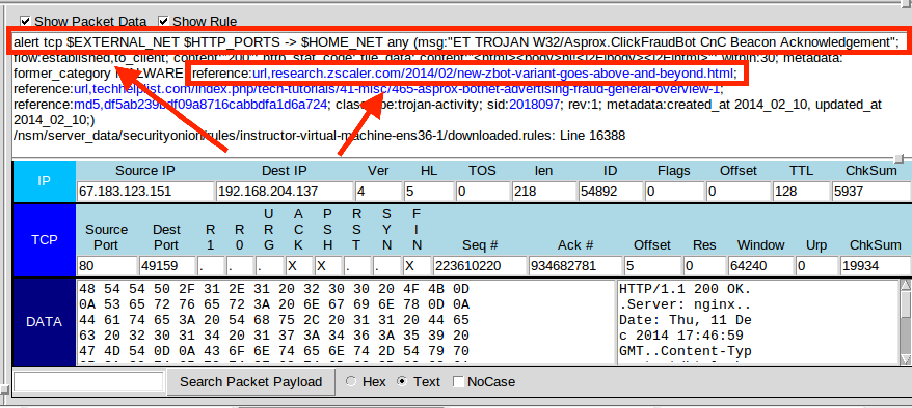

## 11.3 Lesson Plan: Enterprise Security Management (ESM)

### Overview

In today's class, students will advance their network security knowledge by learning enterprise security management (ESM) and how host-based OSSEC IDS technology plays a critical role in endpoint telemetry. Students will investigate threats using Security Onion's Elastic Stack and a web-based data analytics visualization tool called Kibana.

### Class Objectives

By the end of today's class, students will be able to:

- Analyze indicators of attack for persistent threats.

- Use enterprise security management to expand an investigation.

- Use OSSEC endpoint reporting agents as part of a host-based IDS alert system.

- Investigate threats using various analysis tools.

- Escalate alerts to senior incident handlers.

### Instructor Notes

Like Day 11.2, today's class will begin with  **01. Everyone Do: Security Onion Setup** in order to launch an instance of Security Onion and generate alert data that will be used throughout the day. 

- Please note that if student's PCAP files are not populating, they should run `sudo so-replay` in the terminal of their Sec Onion machine. 

### Lab Environment

Lab Details

 

In this unit, you will be using the NetSec lab environment located in Windows Azure Lab Services.  RDP into the **Windows RDP host machine** using the following credentials:

  - Username: `azadmin`
  - Password: `p4ssw0rd*`

Open Hyper-V Manager to access the below machines:

**Security Onion machine:**
  - Username: `sysadmin`
  - Password: `cybersecurity`

**UFW machine:**
  - Username: `sysadmin`
  - Password: `cybersecurity`

**firewalld machine:**
  - Username: `sysadmin`
  - Password: `cybersecurity`

In today's class, we will use the SecOnion machine.

### Online Classroom Strategies 

Refer to the following guidelines and best practices for conducting this class online: 

- [Cybersecurity Online Classroom Strategies](../../../00-Teaching-Staff-Prework/OnlineStrategies.md)

### Lesson Slideshow 

The lesson slides are available on Google Drive here: [11.3 Slides](https://docs.google.com/presentation/d/1fcrK8CDI7JVia3uWXvKfkRnIUGns7TfwYzvmuhY80bE/edit)

- To add slides to the student-facing repository, download the slides as a PDF by navigating to File > "Download as" and choose "PDF document." Then, add the PDF file to your class repository along with other necessary files.

- **Note:** Editing access is not available for this document. If you or your students wish to modify the slides, please create a copy by navigating to File > "Make a copy...".

### Time Tracker

The lesson time tracker is available on Google Drive here: [11.3 Time Tracker](https://docs.google.com/spreadsheets/d/1FZrOydH1-aV9-WboQLUgsSQMS6igxz5mfVwO8GM0AoA/edit#gid=1047115118)

### Student Guide

Distribute a student-facing version of the lesson plan: [11.3 Student Guide](StudentGuide.md)

___

### 01. Everyone Do: Security Onion Set Up (0:10)

#### Security Onion Setup

Like the previous class, in preparation for the labs, everyone will need to log into Azure and connect to the Network Security environment. After you are connected, launch an instance of Security Onion from the HyperV manager. This will generate alert data that will allow everyone to complete the labs.

Send students the following file: 

- [Activity File: Security Onion Setup](Activities/01_Security_Onion_Setup/README.md)

Log into the Security Onion machine with the following credentials:

- Username: `sysadmin`
- Password: `cybersecurity`

Lead the class in the following demonstration.

1. First, we will all verify that our network security monitoring (NSM) tools are 100% operational before starting the labs. Launch the terminal.

   - Run the following command to check the status of currently installed NSM tools.

      - `sudo so-status`

   - Output should look similar to below:

      

   - Ensure all statuses are `OK`.
   
   - If not, repeat the `so-status` command a few times. Sometimes it's slow.
   
   - If any of the statuses are not `OK` after a few minutes, restart Security Onion's NSM tool with the following command:

      - `sudo so-restart`
   
   - Keep running the `so-status` command for a few minutes. All systems should reflect `OK` after a few minutes.

#### Generate Alerts

2. Next, have the students log into Sguil to verify that their PCAPs are still populated. Remind students that their Sguil login credentials are:

   
   - Username: `sysadmin`

   - Password: `cybersecurity`

Verify that students still have their pcaps loaded from the previous class. If this is not the case for anyone, have them run the following command to replay all PCAP files from previously captured malware:

- Run:`sudo so-replay`

- Emphasize that it could take as long as 10 to 15 minutes for Security Onion to run all of the PCAPs.

Once everyone's machines are set up, move on to a brief review and introduce today's topics.

### 02. Instructor Do: Overview and Alert - C2 Beacon Setup (0:20)

#### Network Security Recap

- On Day 1, we covered how firewalls protect a network. On Day 2, we expanded our layers of network security to cover IDS and IPS systems.

- Today, we will turn our focus to learning how an adversary conducts network security attacks. Then, through a process known as cyber threat hunting, we will use advanced network security tools, such as Security Onion and ELK, to gain a deeper understanding and situational awareness of a network's security posture.

Pause to answer any questions before proceeding.

#### C2 Alert Beacon Set Up

Let's start off with an activity in which students will apply their knowledge of NSMs. 

- Explain that we'll explore how **command and control (C2) servers** are used to create a specific type of alert against attacks that use persistence as part of its attack campaign.

- NSM plays a critical role in implementing a defense in depth approach, serving as an additional layer of protection when an adversary bypasses defenses. 

Before diving into the activity, let's take a look at command and control servers. 

#### Command and Control

- Attacks against these servers make infected hosts call back to C2 servers. These callbacks, referred to as "keep alives", serve as beacons that keep the back channel open, therefore enabling access in and out of the network at all times. 

- These keep alive beacons activate a specific alert. In the screenshot below, we see an alert identified as a C2 beacon acknowledgement. Note it includes the text `CnC Beacon Acknowledgement` in the Event Message. 

  

- Point out that there is a reference URL specified within the Snort rule option.

   - Sometimes, writers of Snort rules will put links in their rule options to help network defenders establish TTPs.

   - With this information, network defenders can form mitigation strategies to help improve their security posture.

Pause to ask the students if there are any questions before proceeding.

### 03. Student Do: C2 Beacon (0:20)

Explain the following:

- In this activity, you will work in groups and play the role of an SOC analyst for the California DMV.

- Your organization has just experienced another attack that Snort has identified as an emerging threat: a C2 beacon acknowledgement attack.

- You will establish an attacker profile that includes the TTPs used by the adversary and document all of your findings.

- You will notice that there are many attacks targeting the victim IP address. Please make sure to focus on the `ET TROJAN W32/Asprox.ClickFraudBot CnC Beacon Acknowledgment` attack.

:globe_with_meridians: This activity will use **breakout rooms**. Assign students into groups of 3-5 and move them into breakout rooms.

Send students the following file:

- [Activity File: C2 Beacon](Activities/04_C2_Beacon/Unsolved/README.md)

### 04. Instructor Review: C2 Beacon Activity (0:10)

:bar_chart: Run a comprehension check poll before reviewing the activity. 

Remind students that the goals of this activity were to practice investigating a C2 beacon acknowledgement attack, and to reinforce concepts related to Snort IDS, Security Onion, and network security monitoring.

- Emphasize that the strength of NSM depends knowing the limits of what you can detect, developing an understanding of adversarial tactics, and applying this knowledge to detecting future attacks.

- Point out that NSM accumulates a lot of information used by computer incident response teams to formulate specific tactics, techniques and procedures used by an adversary.

Completing this activity required the following steps:

- Use Sguil to analyze an indicator of attack (Snort alert).

- Use Sguil to take a closer look at Snort rule options.

- Use Transcript to extract HTML message headers from a data flow.

- Use the URL resource included in the Snort rule option to visit a website and discover the intent and TTPs used by the adversary.

Send students the following solution guide and use it to review the activity:

- [Solution Guide: C2 Beacon](Activities/04_C2_Beacon/Solved/README.md)

### 05. Instructor Do: Enterprise Security Monitoring (0:20)

Now that we've learned about the benefits of using firewalls and NSM, we will move from traditional network-based IDS engines like Snort to the more all-encompassing **enterprise security monitoring** (**ESM**)

#### OSSEC

Explain that firewalls and NSM cannot see inside of encrypted traffic. This is major limitation because:

- In most cases, malware will be transmitted from attacker to victim in an encrypted state in order to hide its presence and intent. This also serves as a method of obfuscation to bypass IDS detection engines.

- Since malware cannot activate in an encrypted state, it must be decrypted. This can only happen after it is installed on the victim’s machine. This is where ESM and, more specifically, endpoint telemetry become relevant.

Explain that ESM uses OSSEC to provide visibility at the host level, where malware infection takes place after it's decrypted.

- OSSEC is the industry's most widely used host-based IDS (HIDS). It has many configuration options and can be tailored to the needs of any organization. 

- Explain **endpoint telemetry** as host-based monitoring of system data. 

   - OSSEC agents are deployed to hosts and collect syslog data. This data generates alerts that are sent to the centralized server, Security Onion. 

   - Security administrators can then use Security Onion to form a detailed understanding of the situation and reconstruct a crime.

#### Elastic Stack

Explain that OSSEC monitors all of the syslog data that it sees. However, not every syslog entry will generate an alert. Security admins will need to switch to other tools to fully analyze packet captures.

These other tools are known as the **Elastic (ELK) Stack**, the engine that operates within Security Onion. It consists of three important components:

1. **Elasticsearch** is considered the heart of the Elastic Stack. It is a distributed, restful search and analytics engine built into Security Onion that is capable of addressing thousands of data points seen within network traffic. It helps security administrators locate the expected and uncover the unexpected.

2. **Logstash** is an open-source, server-side data processing pipeline built into Security Onion. It ingests data from many sources at the same time by transforming it and sending it to designated log files, known as stashes.

3. **Kibana** is a browser-based visualization interface. It uses thousands of data points from the Elastic Stack as its core engine.

Explain how these tools work together with OSSEC to make a comprehensive alert data process:

1. OSSEC agents generate an alert.

2. OSSEC sends alert data gathered from syslog to Security Onion's OSSEC server.

3. The OSSEC-generated syslog alert is written to Logstash for storage.

4. Log data is ingested into the Elasticsearch analytics engine, which parses hundreds of thousands of data points to prepare for data presentation.

5. Users interact with the data through the Kibana web interface.

#### Investigation, Analysis, and Escalation Demo

:warning: **Heads Up**: Each PCAP may not be imported in its exact sequence from the previous session. Therefore, the alert IDs in your demo may vary from the screenshots in this lesson plan. 

Explain that in this demo we will discuss using several tools in the ELK stack. We will focus on how these tools work, and not a specific attack. 

- We will also focus on the process of escalation within a Security Operations Center:

   - Point out that a junior analyst working in a Security Operations Center will belong to a multi-tier group of analysts. Junior analysts typically perform the initial triage of alerts and then escalate these events to senior incident responders.

- This process and the tools involved will be our focus.

We'll begin our investigation with a new tool called Squert:

- Click on the Squert desktop icon and enter the same credentials you used for you Sguil login.

- After logging in, we may need to change the date range to ensure we see all the alert data in our system. Click on the date range as illustrated below.

   

- The default view shows alerts from today. In order to show older alerts, click **INTERVAL**, then click the **two right arrows** to set your custom date. 

   

In this example we'll change the year to 2014 in the **START** field. This date range should cover all alerts used in the PCAPs.

-  Click on the **circular arrows** to reload the web page and refresh the alert data for the newly selected date range.

   

- Next, click on the word **QUEUE** to arrange the priorities from the highest count to the lowest. It may require two clicks.

   

- Explain that clicking on a red number box will drop down that line and reveal several important items.

   - We can see URL links to two websites that provide additional insights into the attack.

   - As security administrators, we can use this research later in our incident investigations. It's encouraged to accumulate information from several different resources.

   

- The screenshots below show the articles found at the links.

   - The articles, written by two different security researchers, provide incident responders with different insights into the same attack.

   

   

- Click on the **Views** tab at the top.

   - Explain that the Views tab displays traffic as it flows between a source and destination IP.
   
   - Scroll down to see more. 
   
   - Thicker bands indicate higher volumes of traffic.

   - This visualization indicates to security administrators potential problem areas that may require further investigation.

   

- Hover the mouse over a band and a window will pop up displaying the flow of traffic between source and destination IP using directional arrows.

   - The number of transmissions that have occurred is also displayed.

   

- Explain that next we'll use Elastic Stack's data analytics engine through Kibana's web-based visualization tool. 

- Minimize the Squert window and open Sguil.

Launch Kibana by doing the following:

   - Right-click on any IP address.

   - A dropdown menu will appear. Select **Kibana IP Lookup**, and then select either the destination (**DstIP**) or source IP (**SrcIP**).

   

- After Kibana launches, you may be prompted to log in. If so, log in with the same credentials used for the Sguil client.

  - Once the web browser launches, it's best practice to verify that Kibana is using the correct filter, as seen in the screenshot below.

   - The IP address in the Kibana filter should match the one that we right-clicked to pivot from the Sguil client. In this case, it matches the IP that we used for this pivot, which is good.

   

- Explain that we have now started using the powerful Elastic Stack data analytics engine.

   - Remind students that Elastic Stack is the heart of Security Onion's enterprise security monitoring capabilities. Kibana is the interface that provides insight into endpoint telemetry by interpreting the OSSEC agent syslog data.

In this next example, we'll begin our investigation by scrolling down to the **HTTP - Destination Ports** section.

- At this point in an investigation, we are looking for non-standard HTTP ports.

   - For example, if we saw port `4444` indicated here, that would be a clear indicator that a Metasploit Meterpreter session was in progress.

    

Scroll down to the MIME word cloud.

- Explain that **MIME** (Multipurpose Internet Mail Extension) types (not a file extension), are used by browsers to determine how URLs are processed.

   - Therefore, it is important that web servers use the correct type of MIME.

   - Incorrectly configured MIME types are misinterpreted by browsers and can cause sites to malfunction and mishandle downloaded files.

   - Attackers use this to their advantage.

- Point out that in the graphic below, the Elastic Stack data analytics engine is displayed through Kibana's **MIME - Type (Tag Cloud)** visualization window.

   - The more a MIME type is discovered, the larger it appears in the word cloud.  

   

- If we scroll down a little further, we see **HTTP - Sites**, which lists the number of times particular websites have been visited. This is a good place to look for suspicious websites.

   - The **HTTP - Sites Hosting EXEs** section lists websites that were used to either download or search for an EXE. Again, anything that looks malicious will require further investigation.

   

- To investigate a malicious website, we apply a filter by hovering our mouse over the count and clicking the **+** sign. This will filter out all other websites.

- In the graphic below, the arrow pointing to the left will drop down the contents of the selected log, revealing its contents.

   - The arrow pointing to the right is the hyperlink to the PCAP file.

   - Clicking on this link will launch the PCAP in another window and display the TCP conversation using either TCP or HTTP flow.

   

- Now, using the image above as an example, click on the **triangle arrow pointing to the right**.
   - This will drop down the log file and reveal its contents, as shown in the screenshot below.  

   

   - In our screenshot example, we can see the message `A Network Trojan was detected`, as indicated in the `classification` field.

   - We can also see that the `event_type` is indicated as `snort`.
      - An event type is the source of the alert, i.e., the application that generated the alert.

      - This entry is the result of an endpoint Snort IDS engine alert.

- Scroll up and click the link under **_id**. Explain that we can see the PCAP pivot. We can learn three facts from this view: 
   - The configuration is set to IDS and not operating in IPS mode. A download _could_ have occurred.  
   - We can see the HTTP response **SRC: Connection: Close**, meaning it closed when the victim got to this page. 
   - We can also see an **error 302**, meaning the website had moved.

   From this we can assume the following likely happened:
     - The victim clicked on a malicious link.
     - The link opened a window which downloaded or attempted to download the trojan.
     - The window quickly closed itself.

   Further analysis is required.

- Explain that once we determine an alert needs further analysis, we will escalate the event to a senior incident handler for further review.

   - Return to your Sguil window.
   - Right-click **RT** in the status column.
   - Select **Update Event Status**.
   - Select **Escalate**.
   - Add a comment: "Trojan may have been downloaded."
   - Click **Okay**.

 Note: This will move the alert from the Real Time alerts queue to the Escalation queue.

We can verify the escalated event by:

- Selecting the **Escalated Events** tab.

- Right-clicking on the event.

- Selecting **Event History**.

- Verifying the note that was entered by the junior analyst.

#### Summary

- This demonstration taught students how to conduct investigations using various threat hunting techniques. We focused on a few of the many ways to start an investigation.  

- ESM (enterprise security monitoring) includes endpoint telemetry, host-based monitoring of system data that uses OSSEC collection agents to gather syslog data.

- To investigate network-based IDS alerts, security administrators must use enterprise security monitoring, which includes visibility into endpoint OSSEC agents.

- IDS alerts are snapshots in time. They raise questions that need answers. With the use of Security Onion, security admins can use PCAPs to reconstruct a crime.

Pause to ask the students if there are any questions before proceeding.

### 06. Student Do: Investigation, Analysis, and Escalation (0:20)

Explain the following:

- In this activity, you will work in groups and continue your role as an SOC analyst for the California DMV.

- Although IDS alerts indicate an attack, they typically lead to many more questions than answers. Security administrators must expand their investigation by performing deep packet analysis using thousands of data points.

- You use Squert and Kibana to investigate, analyze, and escalate indicators of attack.

:globe_with_meridians: This activity will use **breakout rooms**. Assign students into groups of 3-5 and move them into breakout rooms.

Send students the following file:

- [Activity File: Investigation, Analysis, and Escalation](Activities/06_Investigation_Analysis_and_Escalation/Unsolved/README.md)

### 07. Break (0:15)

### 08. Instructor Review: Investigation, Analysis, and Escalation Activity (0:10)

:bar_chart: Run a comprehension check poll before reviewing the activity. 

Remind students that the goal of this activity was to reinforce concepts related to the investigation, analysis, and escalation process of enterprise security monitoring.

- Restate that IDS provides a snapshot in time, creating questions that need answers. Emphasize that this is where full packet captures are useful. 
   - PCAPs allow security admins to reconstruct a crime. Security Onion provides this capability and more, through the use of deep packet analysis using Squert and Kibana.

- Point out that traditional IDS alerts are only indicators of security incidents. Full packet captures provide the security admin with the full context of an IDS alert, and a more complete understanding of the crime.

The main tasks we needed to complete were:

- Using Squert:
  - Analyze the Summary tab for the top destination country and IP.
  - Analyze the Views tab and determine which source and destination IP pair generated the most traffic." ?)

- Using the `bro_conn` filter in Kibana, determine if there were any non-standard HTTP ports.
- Using Kibana:
   - Determine the most prevalent MIME types.
   - Analyze the HTTP - Sites section.
   - Pivot to CapME via the `bro_log` and determine the file type that was downloaded. 
   - Pivot to Google Lookup to perform preliminary malware analysis.
   - Escalate the alert to senior incident handlers as part of an incident response.

Send students the solution guide and use it for your review:

- [Solution Guide: Investigation, Analysis, and Escalation Activity](Activities/06_Investigation_Analysis_and_Escalation/Solved/README.md)

### 09. Instructor Do: Threat Hunting - Cyber Threat Intelligence (0:10)

Explain that in the previous activity, we learned how to:

- Deepen a network security investigation by expanding our understanding of an event.

- Use Security Onion's Elastic Stack to perform data analysis.

- Establish an attacker profile and their TTPs.

- Escalate an alert to senior security responders.

Point out that threat intelligence is important at every level of government and public sector organizations, which use it to determine acceptable risk and develop security controls that inform budgets.

Malicious actors have various motivations. For example:

- Hacktivist organizations are politically motivated.
- Criminal hackers are financially motivated.
- Cyber espionage campaigns, most typically associated with nation states, steal corporate secrets.

Knowing the motivations for attacks against your organization will help you determine the security measures necessary to defend against them.

#### Threat Intelligence Cards

- Explain that as a member of the Computer and Incident Response Team (CIRT), one of your responsibilities is to establish a threat intelligence card, which documents the TTPs used by an adversary to infiltrate your network.

- Threat intelligence cards are shared among the cyber defense community, allowing organizations to benefit from the lessons learned by others.

- Explain that cyber threat intelligence centers on the triad of actors, capability, and intent, along with consideration of TTPs, tool sets, motivations, and accessibility to targets.  

- These factors inform situational aware decision making, enhanced network defense operations, and effective tactical assessments.

Below are examples of the TTPs used by adversaries as outlined through the Cyber Kill Chain framework. 

   - Note: Lockheed Martin, an aerospace and defense company, developed an Intelligence Driven Defense framework, designed to identify and prevent cyber attacks.

   - One aspect of that framework, called the **Cyber Kill Chain**, defines seven steps that an adversary must complete before being able to act on their objectives. Those steps are outlines as follows: 

Briefly review each category with the class.

| TTP | Example |
| --- | --- |
| **Reconnaissance** | Information gathering stage against targeted victim. Information sources include: DNS registration websites, LinkedIn, Facebook, Twitter, etc. |
| **Weaponization** | After collecting information regarding infrastructure and employees, adversaries have the capability to establish attack vectors and technical profiles of targets such as: logical and administrative security controls, infil/exfil points, etc.|
| **Delivery** | The delivery of the weaponized payload, via email, website, USB, etc.|
| **Exploitation** | Actively compromise adversary’s applications and servers while averting the physical, logical, and administrative controls. Exploiting employees through social engineering. This stage prepares for escalation during the installation phase.|
| **Installation** | A.k.a., the persistence preparation phase. Activities include malicious software installation, backdoor implants, persistence mechanism, ie. Cron Jobs, AutoRun keys, services, log file deletion, and timestamp manipulation.|
| **Command & Control (C2)** | A command channel, most typically Internet Relay Chat (IRC) , used for remote control of a victim's computer.|
| **Actions on Objectives** | After achieving the equivalent of "Hands on Keyboard" access to a victim's systems, adversaries are now able to act their objectives.|

Send the following articles to the class for use as a reference for the next activity.

Advise students to skim through these articles to use as examples for ideas of what to include in their own threat intel reports:

- [OnionDuke: APT Attacks Via the Tor Network (F-Secure Labs)](https://archive.f-secure.com/weblog/archives/00002764.html)
- [APT29 (Mitre)](https://attack.mitre.org/groups/G0016/)
- [APT29 Domain Fronting With TOR (FireEye)](https://www.fireeye.com/blog/threat-research/2017/03/apt29_domain_frontin.html)
- [APT29 Used Domain Fronting, Tor to Execute Backdoor (Threatpost)](https://threatpost.com/apt29-used-domain-fronting-tor-to-execute-backdoor/124582/)

### 10. Student Do: Threat Hunting - Cyber Threat Intelligence (0:35)

Explain the following:

- In this activity, you will work in groups and continue your role as an SOC analyst for the California DMV.

- You've decided to include threat hunting as part of your defense strategy. You assembled a team of highly motivated security professionals.

- You will strengthen your knowledge of concepts related to intelligence gathering and incidence response as part of the enterprise security monitoring process. You can use any tool you've learned to hunt for any malicious threat.

- This activity only requires hunting a single threat, as time is limited.

:globe_with_meridians: This activity will use **breakout rooms**. Assign students into groups of 3-5 and move them into breakout rooms.

Send students the following file:

- [Activity File: Threat Hunting - Cyber Threat Intelligence](Activities/09_Threat_Hunting/Unsolved/README.md)

### 11. Instructor Review: Threat Hunting - Cyber Threat Intelligence Activity (0:15)

:bar_chart: Run a comprehension check poll before reviewing the activity. 

The goal of this activity was to demonstrate how students can use all of the skills covered in this unit to investigate a threat.

Recap by emphasizing that:
- Cyber threat intelligence plays a critical role within the cyber incident and response community. Cyber threat intelligence information is shared across organizations in an effort to help prevent attacks.

- Cyber defense communities such as [CERT](https://www.us-cert.gov/) use threat intelligence shared by attacked entities as part of their National Cyber Awareness program. CERT's National Awareness Program sponsors free websites for organizations looking for information to help protect their cyber infrastructure.

Point out that the main tasks we needed to complete were:

- Hunt for a single threat deemed worthy of further investigation.

- Use all skills taught throughout this unit to establish a threat intelligence card that consists of the tactics, techniques, and procedures used in the attack.

#### Walkthrough

:warning: **DO NOT SEND THIS FILE TO STUDENTS**: Use the following Challenge Solutions file to help guide your review as a measure to gauge the students' understanding.

- [Challenge Solutions Guide](Resources/Green_Eggs_Spam_Solution.pdf)

Student responses will vary.

- Engage the class in a facilitated discussion.
- Call upon students to share their findings.  
- Emphasize the importance of understanding the concepts for each answer.

---

© 2020 Trilogy Education Services, a 2U, Inc. brand. All Rights Reserved.
