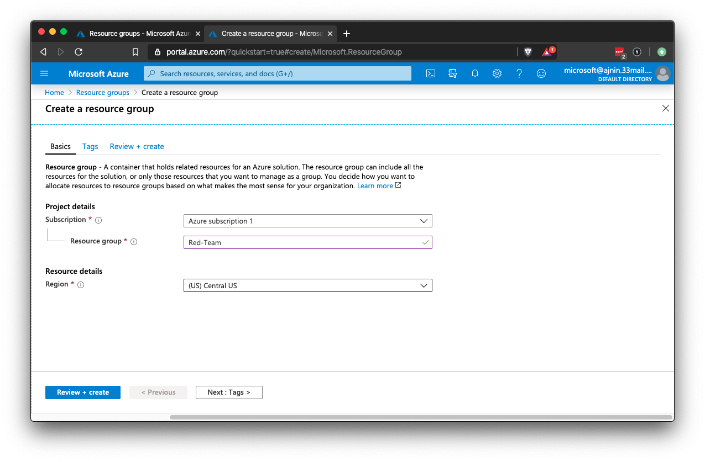
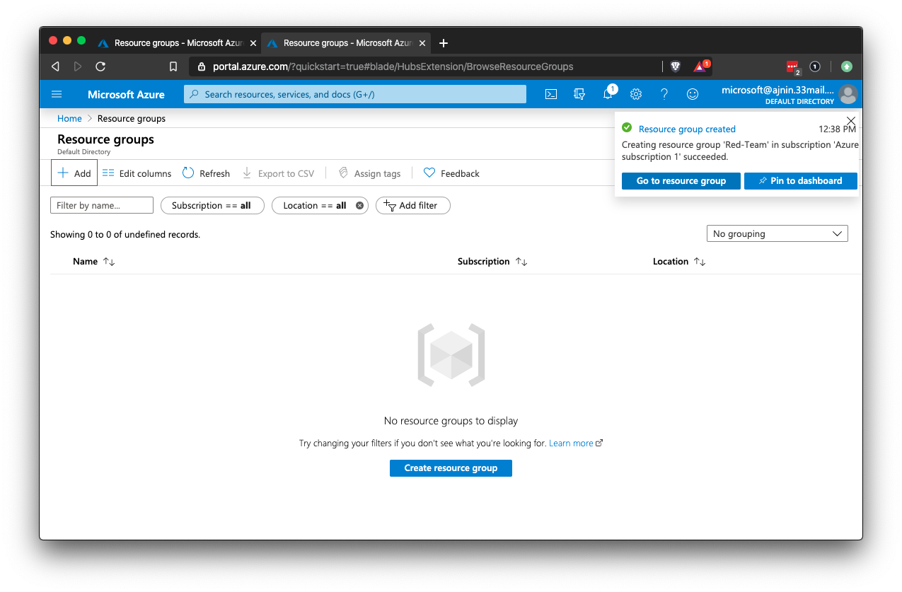
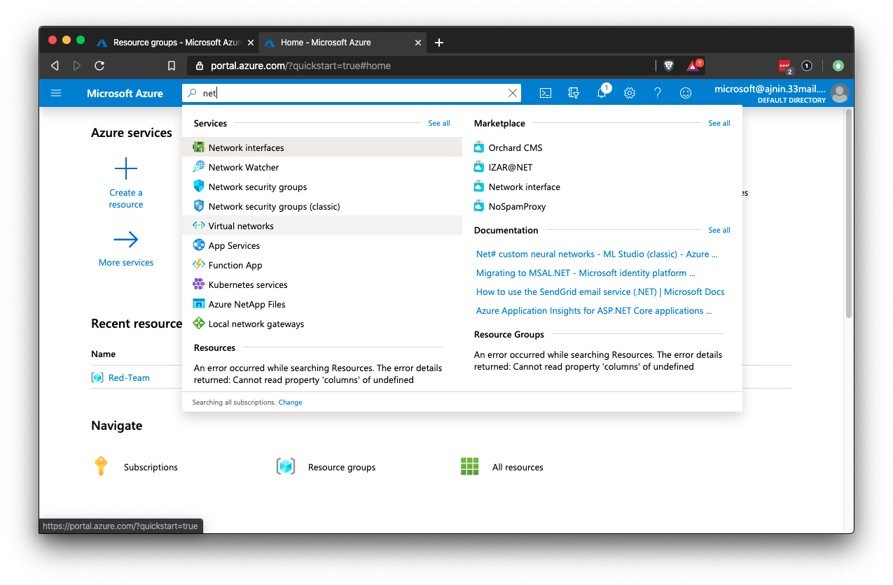
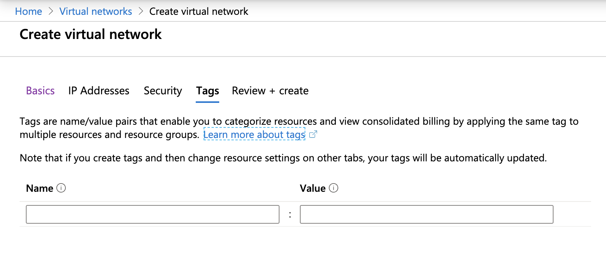

## Solution Guide: Virtual Networking

The goal of this activity was to set up the cloud network using the Azure portal. First, we set up a resource group containing all other objects you will set up during this unit.

If your Azure account is not fully set up yet, use these instructions to do so: [Azure Sign Up](../../../Resources/azure_sign_up.md). 

---

#### Setting up the Resource Group

Use the Azure portal to create a resource group that will contain everything the Red Team needs in the cloud.

- On the home screen, search for "resource."

    

- Click on the **+ Add** button or the **Create resource group** button.

    

- Create a name for your resource group and choose a region.        
    - Note: Choose the region you determined in the class walkthrough. Every resource you create after this must be created in the exact same region.

- Click on **Review + create**.

    

- Azure will alert you if there are any errors. Click on **Create** to finalize your settings and create the group.

    

- Once the group is created, click on **Go to resource group** in the top-right corner of the screen to view your new resource group.

    

#### Setting up the VNet

Before you can deploy servers and services, there must be a network where these items can be accessed.

- This network should have the capacity to hold any resource that the Red Team needs, now and in the future.

- Return to the home screen and search for "net." Choose the search result for **Virtual networks**.

    

- Click on the **+ Add** button on the top-left of the page or the **Create virtual network** button on the bottom of the page.

     

Fill in the network settings:

- Subscription: Your free subscription should be the only option here.

- Resource group: This should be the resource group you created in step two.

- Name: A descriptive name so it will not get confused with other cloud networks in the same account.

- Region: Make sure to choose the same region you chose for your resource group. 

    - Carefully configuring the region of your resources is important for ensuring low latency and high availability. Resources should be located as close as possible to those who will be consuming them.

- IP Addresses: Azure requires you to define a network and subnet.
   
    - Use the defaults on this tab.

- Security: Leave the default settings.
  
  - In order to avoid recurring charges, do **not** enable DDoS Protection Standard. 

   

- Tags: No tags are needed.

   

Click **Create**.

- 

Once you have created your resource group and VNet, return to the home screen and choose the resource group option. 

- This provides a list of all resource groups in your account. 
- Choose the group that you created and you should see your VNet listed as a resource. 

You now have a resource group and VNet that you can use to create the rest of the cloud infrastructure throughout the unit.

---
© 2020 Trilogy Education Services, a 2U, Inc. brand. All Rights Reserved.
