## 13.2 Lesson Plan: Cloud Systems Management

### Class Overview

Today's class will introduce students to containers, provisioners, and a working concept of "infrastructure as code."

### Class Objectives

By the end of class, students should be able to:

- Access their entire VNet from their jump box.

- Install and run containers using Docker.

- Set up Ansible connections to VMs inside their VNet.


### Instructor Notes

Please make sure that you are using your personal Azure account for the lab demonstrations and activities.

Today's demonstrations and activities include the following:

- A demonstration and activity of SSH connections and network security group rules.

- An explanation of containers and an activity using Docker to install and run containers.

- After the break, a demonstration and activity using Ansible.

**Note:** Be sure to explore these activities prior to class, especially if you are new to Docker and Ansible.

### Lab Environment 

<details><summary>Lab Details</summary>
<br>

For demonstrations, activities and reviews, you will use your free Azure account.

- [Azure Setup Guide](https://docs.google.com/document/d/1gs_09b7eotl7hzTL82xlqPt-OwOd0aWA78qcQxtMr6Y/edit)

- [Azure Free Tier FAQs](https://azure.microsoft.com/en-us/free/free-account-faq/)

### Lab References

- [Ansible](https://ansible.com)
- [Docker](https://docker.com)
- [YAML](https://yaml.org/spec/1.2/spec.html#Introduction)

</details>

### Slideshow

The slides for today can be viewed on Google Drive here: [13.2 Slides](https://docs.google.com/presentation/d/1nsN12hXByXxbcZh73ODEJSBV5lfiP6IhEQQxuNimTDg/).

- To add slides to the student-facing repository, download the slides as a PDF by navigating to File > "Download as" and choose "PDF document." Then, add the PDF file to your class repository along with other necessary files.

- **Note:** Editing access is not available for these document. If you or your students wish to modify the slides, please create a copy by navigating to File > "Make a copy...".

#### Time Tracker

The time tracker for today's lesson can be viewed on Google Drive here: [13.2 Time Tracker](https://docs.google.com/spreadsheets/d/1D-rEaPZXDy-9Ly9LHGakfGXP0gJdBRHAiSXFw8u7Udo/edit#gid=1145703143).

### Student Guide

Send students the student-facing guide at the end of the class: [13.2 Student Guide](StudentGuide.md)

---

### 01. Instructor Do: Introduction to Cloud Systems Management (0:15)

Welcome students to class and briefly review what was covered in the previous class:

- We covered the different cloud services and the *aaS acronyms. 
- Students learned about the unique challenges of securing cloud deployments and building security from the ground up.
- We set up a virtual network protected by a firewall with 3 virtual machines on that network.
- At this time, the VMs are still inaccessible because our firewall is blocking all traffic.


---
|:warning: **CHECKPOINT** :warning:|
|:-:|
| Using the [Daily Checklist](../Resources/Checklist.md),  verify that students have completed all Day 1 critical tasks and are ready to continue to today's activities. |

At the end of day one, students should have completed:

- [ ] SSH key has no password.
- [ ] Web VMs are created using the same availability set.
- [ ] Web VMs should have 2 GB of RAM.
- [ ] Jump-Box VM only needs 1 GB.
- [ ] All 3 VMs should only have 1 vCPU.
- [ ] All VMs are using the same security group and vnet.

Failure to complete these steps will hinder today's activities.

---

Provide an overview of today's curriculum:

- SSH connections and security group rules.
- Containers, what they are, and their role in IT infrastructure.
- Provisioners and their role in the larger concept of infrastructure as code.
- Using Ansible to create infrastructure.
- An introduction to network architecture and secure network design.

Explain that the tools being discussed today (containers, infrastructure as code, and provisioners) are considered "modern" technologies, even in the fast-paced world of tech. 

- They are new technologies that provide powerful solutions to some of the most difficult problems in infrastructure management.

- Not all organizations leverage them fully. However, nearly all organizations are aware of their value, and many are updating their processes and tool kits to make better use of them. 

- Potential employers will consider knowledge of containers, infrastructure as code, and automated provisioning valuable for both cloud-specific and "standard" systems/network administration roles. 

Provide a high-level definition of each tool and note that we will cover them in-depth later in the class.

- **Containers** can be thought of as lightweight VMs. They're smaller than VMs, being megabytes rather than gigabytes, and require fewer CPU resources. 
    - Because they are smaller, they can be downloaded and distributed more easily. Since they're cheap, more of them can be run. They're also easier and faster to destroy and redeploy as needed. 

- **Provisioners** are tools that automatically configure VMs or containers for you. Instead of manually logging into a machine and issuing commands like `apt get` or editing configuration files yourself, you can use a provisioner to do this automatically. 
    - The primary benefits of provisioners are that they a.) drastically reduce the potential for human error and b.) make it easy to configure potentially thousands of identical machines all at once.

- **Infrastructure as code (IaC)** is the idea that the configurations for all of the VMs, containers, and networks in your deployment should be defined in text files, which you can use with provisioners to automatically recreate machines and networks whenever necessary. 
    - The primary benefit to IaC is that everyone can see exactly how the network is configured by reading text files. These can easily be version controlled in a tool like Git, or Apple Time Machine and Microsoft OneDrive.

- **Continuous Integration/Continuous Deployment (CI/CD)** is the concept of automatically updating machines on your network whenever your IaC files change. In other words, whenever you change a machine's configuration file, CI ensures that a new version of that machine is built immediately. CD ensures that this new version is automatically deployed to your live environment. 
    - The primary advantage to CI/CD is that it allows you to manage your entire network by simply updating IaC text files.

Emphasize that these concepts will make more sense as we work through them hands-on in class. For now, summarize the benefits as: 

- Containers expedite and simplify the deployment of custom machines to a network.

- Provisioners eliminate human error in the configuration process.

- IaC allows engineers to describe all of their network and VM configurations in simple text files.

- CI/CD allows organizations to automatically get the most recent networks and VMs to their customers after engineers have reviewed and approved their new configurations.  
    - In practice, CI/CD is the "glue" that binds all of the other tools together, allowing for fully automated configuration and infrastructure management. However, it is also the most complex, and different organizations vary wildly in how they manage their CI/CD systems. As such, we'll discuss the tools that go into a normal CI/CD pipeline; discuss how CI/CD systems use these tools; and leave the details of deploying them for students to learn on-the-job. 

List some job roles in which these skills are used: 

- **Cloud security analysts** and **cloud penetration testers** need to understand cloud architecture in order to test the security settings for a given environnement.

- **Cloud architects** build out a cloud environment for an organization and are expected to understand how to build in security from the ground up. 

- **DevSecOps** are responsible for maintaining production and testing environments for an organization's developer and QA testing teams. They are expected to build and maintain secure systems at every step of the development process.


### 02. Instructor Do: Foundations of Network Architecture (0:15)

Remind students what we accomplished in the previous class:
- Created a virtual network.
- Blocked all traffic to this network using a firewall.
- Deployed 3 virtual machines to this network.

### Configuration vs. Architecture
 
Remind students that our virtual machines are not accessible because our security group firewall is blocking all traffic to them. This is to ensure there is no way anyone can gain access to these VMs until we want them to.

- This is an example of "secure configuration" as opposed to "secure architecture." These terms aren't typically understood as opposites in the industry, but for the purposes of learning, we will define them as follows:

- **Secure configuration** ensures that an individual VM or network is protected from intrusion using well-considered rules, such as access control policies and firewall rules. A securely configured VM or network is secure because it follows the right rules.

- **Secure architecture** ensures that a poorly configured or malfunctioning individual machine can only cause a limited amount of damage. A secure network is secure because it is "structurally sound." 
    - In other words, secure architecture deters and contains the effects of a breach, ensuring that even insecure machines are difficult to compromise, and that damage to a single machine doesn't take down the entire network.

Provide some examples to distinguish between secure configurations and secure architecture: 

- The Linux VM's deployed in our last class are secure by configuration. They are impossible to access because the security group on the VNet was set up securely, and because the VM's have been configured with SSH key access only, which is the most secure way to configure remote access.

- A network that is hidden behind a gateway router is secure by architecture. Rather than exposing every machine directly to the public internet, machines have to first send traffic to the single router, which then forwards traffic to the machines behind it. This allows security personnel to implement strong access controls on a single machine (the router) rather than on every individual VM. 
    - This drastically reduces an organization's attack surface from several machines to just one, while also making it easy to securely configure the machine that is exposed.

Emphasize that while secure configuration and secure architecture promote security in different ways, they must work together. 

- Secure configuration is setting secure "rules" for individual machines and networks. Secure architecture is connecting these individual machines and networks in safe ways. 

- While secure architecture can effectively mitigate the consequences of a breach, the machines deployed with that architecture must be securely configured in order for the architecture to fully deliver its security guarantees.

Reiterate that the VMs students set up in the previous class are an example of secure configuration. It ensures that the individual machines are both configured and connected to in a secure manner.

#### Network Redundancy

As students should know by now, organizations and businesses need to use best security practices that fit their budgetary restrictions and operational needs. 

One important security practice is **fault tolerance and redundancy**. 

- A fault tolerant system can keep running even if one or more components within the system fail. 

- These systems continue to run because of **redundancy**, the practice of creating duplications of critical components or systems.

- If one system or component is lost or compromised, a redundant system or component can step in and keep the system going.

- In terms of security, this directly affects the reliability and availability of a system.

Point out that the top priority of redundant systems is persistent data redundancy, also known as data backups.

-  Losing access to a critical database or server can cause an organization losses in revenue, production, and operations.

- For example, if an authentication server goes down, employees won't be able to authenticate or access systems necessary for doing work.

Point out that when making decisions about network architecture, we should always consider the amount of redundancy needed versus the amount of budget available. Not every organization will have the budget to create redundant systems for everything. 

- Ask students if they think Amazon.com is running only on one web server.

- If it was, and that server went down, Amazon would likely lose millions of dollars in revenue during the downtime.

- However, it would not make sense for a smaller web company to invest in the infrastructure needed to support a site like Amazon.com. The company would likely go out of business due to unsustainable operational costs. 

So where does the cloud come in?

- Explain that using cloud services, and especially IaaS, allows a company to add resources as needed, scale infrastructure as the business grows, and only pay for what they need. 

In the next activity, students will look at a few different network architectures and determine the best use case for each one.

### 03. Student Do: Cloud Architecture (0:15)


Explain the following to the students:

- In this activity, you are a cloud architect in charge of creating a new cloud network.

- Before you start building, it is helpful to diagram a blueprint of the network. Building a strong, secure network requires careful planning and consideration of which servers will provide which function.

- You will be presented with several network options and must choose the best option for each scenario.

:globe_with_meridians: This activity will use **breakout rooms**. Assign students into groups of 3-5 and move them into breakout rooms.


Send students the following file:

- [Activity File: Cloud Architecture](Activities/03_Cloud_Architecture/Unsolved/README.md)


### 04. Instructor Review: Cloud Architecture Activity (0:10)

:bar_chart: Run a comprehension check poll before reviewing the activity. 

This activity had students think about network architecture from a combined administration, security, and budgetary point of view.

Send students the following file:

- [Solution Guide: Cloud Architecture](Activities/03_Cloud_Architecture/Solved/README.md)

#### Walkthrough

**Gateways**: The first example uses one gateway to access the network and the second example uses two gateways. 

- Example 1

    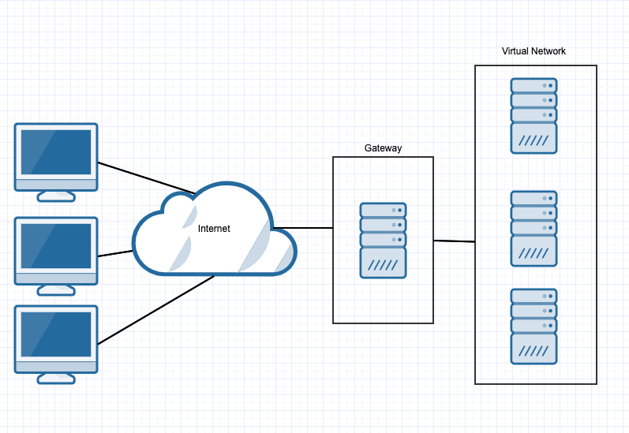

- Example 2

    

Ask the class what are the pros and cons of each example?

- Having two gateways provides redundancy. If one gateway fails, access can still be granted by the second gateway. 

- However, two gateways requires double the maintenance and setup time, as well as double the cost. Now two servers need to be maintained instead of one.

- Critical cloud networks will benefit from having redundant gateways. It all depends on how critical the network is, compared against the extra cost and setup time.


**Databases**: The first example uses a single database for an organization and the second example splits up databases for each department into separate servers.

- Example 1

    

- Example 2

    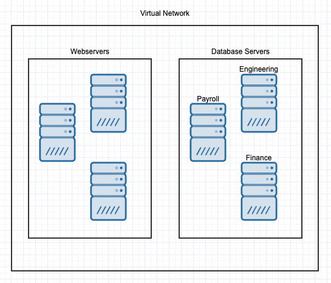

Ask the class what are the pros and cons of each example?


- Multiple databases (known as sharding) can provide redundancy, increase availability and obfuscation. As the size of databases grow, a single server can get bogged down with too many requests. Additionally, if one database is compromised, the attacker doesn't have access to _all_ of the organization's data.

- This is again weighed against budget. More databases require paying for more servers, maintenance and setup time. If a vulnerability is found that affects all the databases, more systems will need patching. Also, more systems increases an organization's overall attack surface and, if configured incorrectly, can increase the amount of vulnerabilities present. 

- This decision will generally depend on the size of the organization. Smaller organizations may not be able to justify the cost of maintenance and additional systems required to support sharding.

**Logs**: The first example has logs from each web server sent to a SIEM server which saves logs to its database located on a separate server. The second example sends logs directly to a log server. 

- Example 1

    

- Example 2

    

Ask the class what are the pros and cons of each example?

- Using a SIEM sever is typically preferable because a SIEM can preprocess before persisting the log data. This enables the system to do real-time analysis and collect data at the same time, rather than requiring a security professional to collect raw logs from a single log database, then parse and investigate them.

- Using a SIEM server is more complex and time consuming to set up and requires additional servers and costs.

- Typically, large organizations both send logs to a SIEM system and keep a backup of raw logs on redundant log servers. Because log data is continuously generated, this can get expensive quickly and not all companies can justify the cost.


### 05. Instructor Do: Jump Box Administration (0:10)

Now, students will apply secure architecture methods to their jump box configuration.

First we will look at the **fan-in** pattern: 

Explain that placing a gateway router between VMs on a network forces all traffic through a single node. Securing and monitoring this single node is called **fanning in**, and is much easier than securing and monitoring each individual VM behind the gateway.

- Focusing traffic through a single node makes it easier to implement routing logic and design networks. By focusing on the interactions between the routers instead of all of the machines, we only have to worry about a few connections between a few machines, rather than connections between all machines.

- The name "fan-in" comes from the way this pattern looks on a diagram: focusing traffic on a single machine looks like a fan.

Explain that, as shown in the previous diagram, a jump box is essentially identical to a gateway router. 

- The jump box is exposed to the public internet. In the classroom, we will be able to connect to the jump box's SSH port (`22`).

- The jump box sits in front of other machines that are _not_ exposed to the public internet.

- It controls access to the other machines by allowing connections from specific IP addresses and forwarding to those machines. 


Explain that for now, this secure architecture will be enough. But, setups like this can and should be further hardened by:

- Limiting the number of machines that our jump box can access.

- Locking the root account and limiting the `sudo` access of the administrator account on the jump box.

- Implementing log monitoring on the jump box.

- Implementing two-factor authentication for SSH login to the jump box.

- Implementing a host firewall (UFW or IPtables) on the jump box.

- Limiting jump box network access with a virtual private network.

    - Give a short overview of what a VPN is.

    - Explain that a VPN creates a direct connection between your local network and a remote network.

    - A VPN can encrypt all network traffic between your current network or device and your remote network.

    - Once you are connected to the VPN, you have full access to all resources on the remote network, as if you were locally connected.

    - Many companies use VPNs to allow remote workers access to computers and servers that are otherwise only accessible from the local network.

    - Explain that the complexities involved in configuring a VPN are beyond the scope of this class, but students should be aware of what a VPN is and when it should be used. In this case, it would add a layer of protection before the jump box.

- Point out that instead of using a VPN, we will limit access to our jump box to the student's individual IP Addresses. This will still provide some security as only computers from the student's network will be able to access the jump box.

Pause and ask if there are any questions.

### 06. Student Do: Jump Box Administration (0:15)


Explain the following to students:

- In the previous activities you have created a secure network for XCorp's Red Team and launched a virtual machine on that network. 

- In this activity, you will configure this machine as a jump box that you will connect to and use to configure other machines that will be added to the Red Team's network.

- At this time, you are not able to connect to your VM because your security group settings are blocking all connections.

- Your task is to create a security group rule to allow SSH connections _only_ from your current IP address and connect to your new virtual machine for management.

:globe_with_meridians: Students should stay in the same **breakout room** groups as the previous activity.


Send students the following file:

- [Activity File: Jump Box Administration](Activities/06_Jumpbox_Admin/Unsolved/README.md)


### 07. Instructor Review: Jump Box Administration (0:10)

:bar_chart: Run a comprehension check poll before reviewing the activity. 

This activity had students create a security group rule that allows SSH connections _only_ from their current IP address in order to connect to their new virtual machine.

Send students the following file:

- [Solution Guide: Jump Box Administration](Activities/06_Jumpbox_Admin/Solved/README.md)

#### Walkthrough 

Explain that we will only allow SSH connections from our external IP address, and all other connections will be dropped:
  
- Find your external IP address by using Google. Search for "what's my IP address."
    
    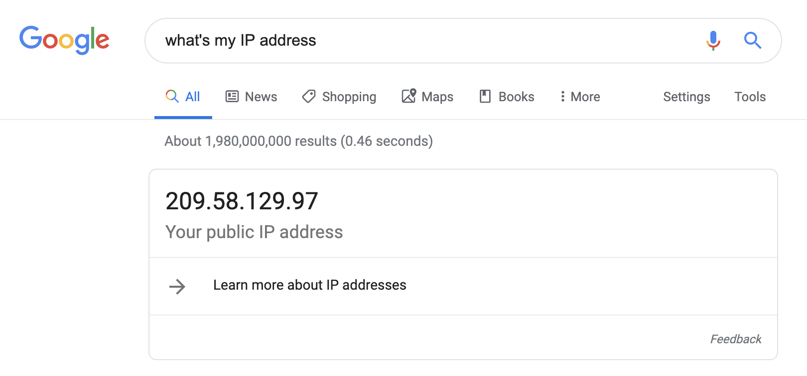

Open the Azure portal and create a security group rule to allow SSH connections from your current IP address.

- Find your security group listed under your resource group.
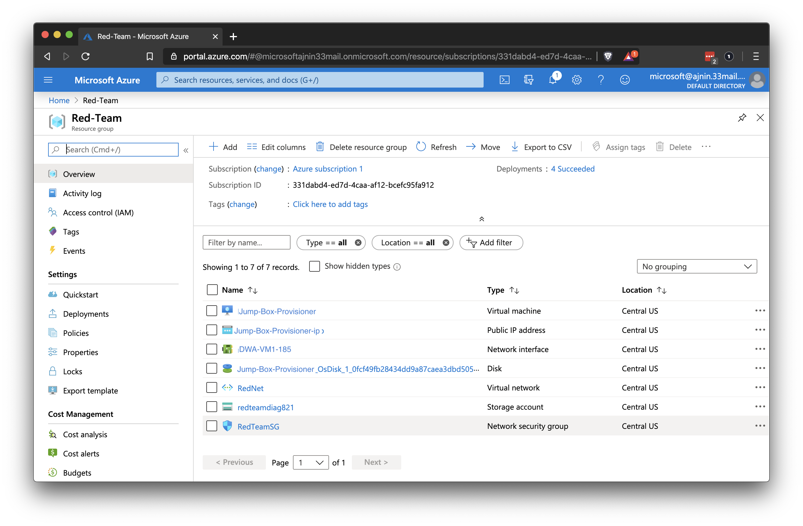

- Choose **Inbound security rules** on the left.
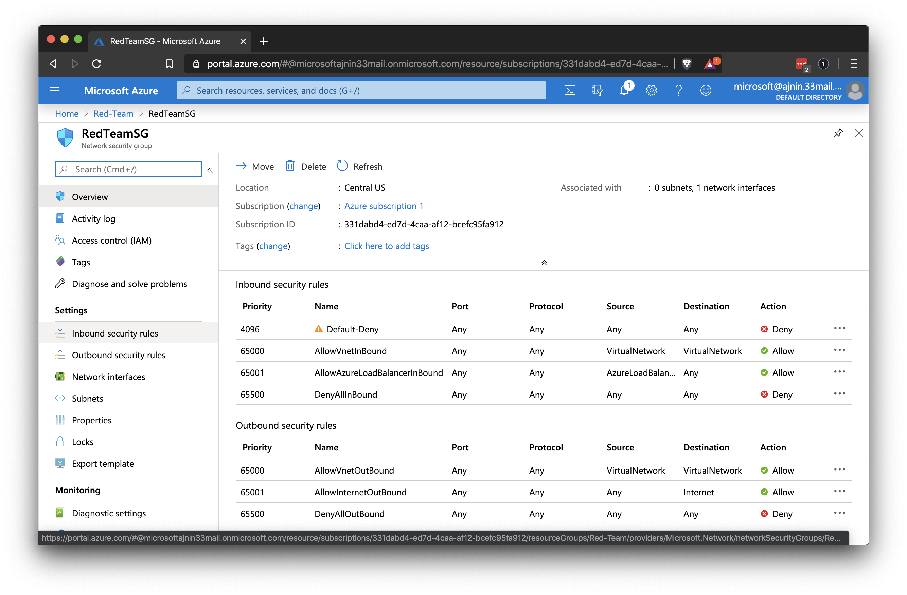

- Click on **+ Add** to add a rule.
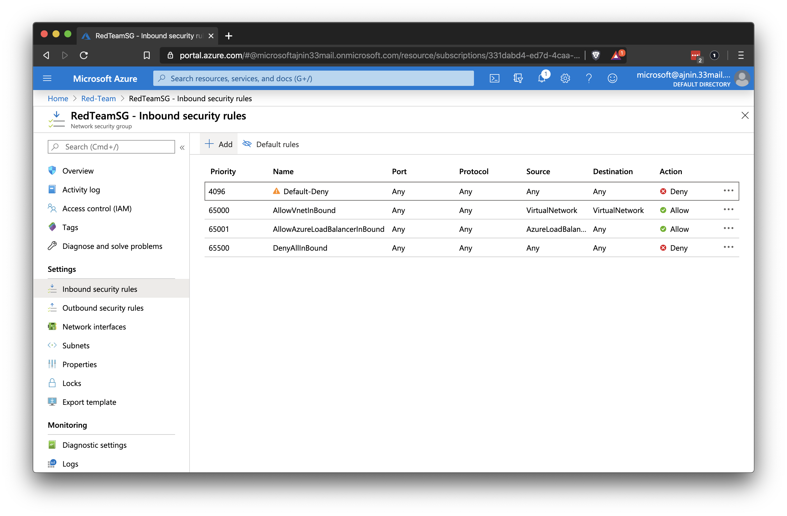

Create a rule allowing SSH connections from your IP address.

The rule should resemble the following:

- Source: Use the **IP Addresses** setting, with your IP address in the field.
	- Google 'what's my IPv4 address' to obtain your IPv4 address for this field.

- Source port ranges: Set to **Any** or * here.

- Destination: This can be set **VirtualNetwork** but a better setting is to specify the internal IP of your jump box to really limit this traffic.

- Service: This should be set to SSH as this is all we want to allow

- Destination port ranges: Since we selected SSH, it will automatically populate port `22`.

- Protocol: Set to **Any** or **TCP**.

- Action: Set to **Allow** traffic.

- Priority: This must be a lower number than your rule to deny all traffic, i.e., less than 4,096. 

- Name: Name this rule anything you like, but it should describe the rule. For example: `SSH`.

- Description: Write a short description similar to: "Allow SSH from my IP." 

 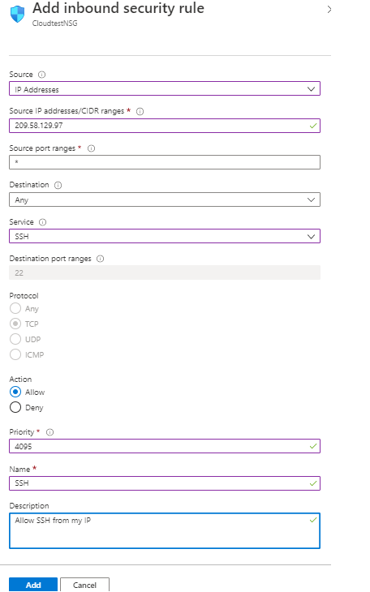

An example of a rule with more limited traffic:

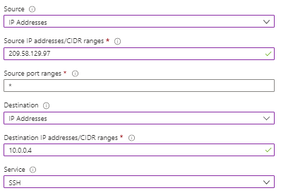

Explain that we now want to test this SSH connection and make sure that we can access our jump box.

- Open your terminal and type: `ssh admin-username@VM-public-IP`. Remind students that Windows users should use GitBash.

    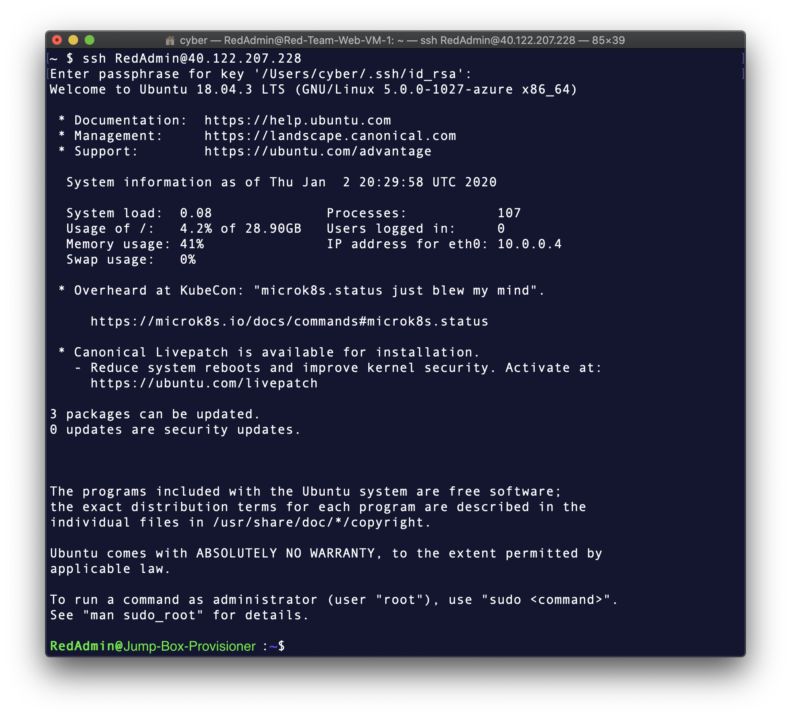

- Run `ssh admin-username@VM-public-IP`

- You should be connected without entering a password.

- Run the command `sudo -l` to check your `sudo` permissions.

- Point out that your admin user has full `sudo` permissions without requiring a password.

    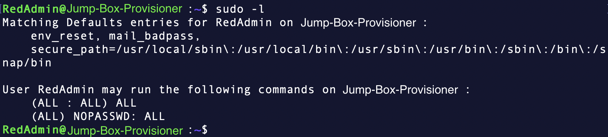

The students should now have a fully functioning jump box that they can access via SSH.

**NOTE:** If students need to reset their SSH key, they can do so in the VM details page by selecting 'Reset Password' on the left had column.

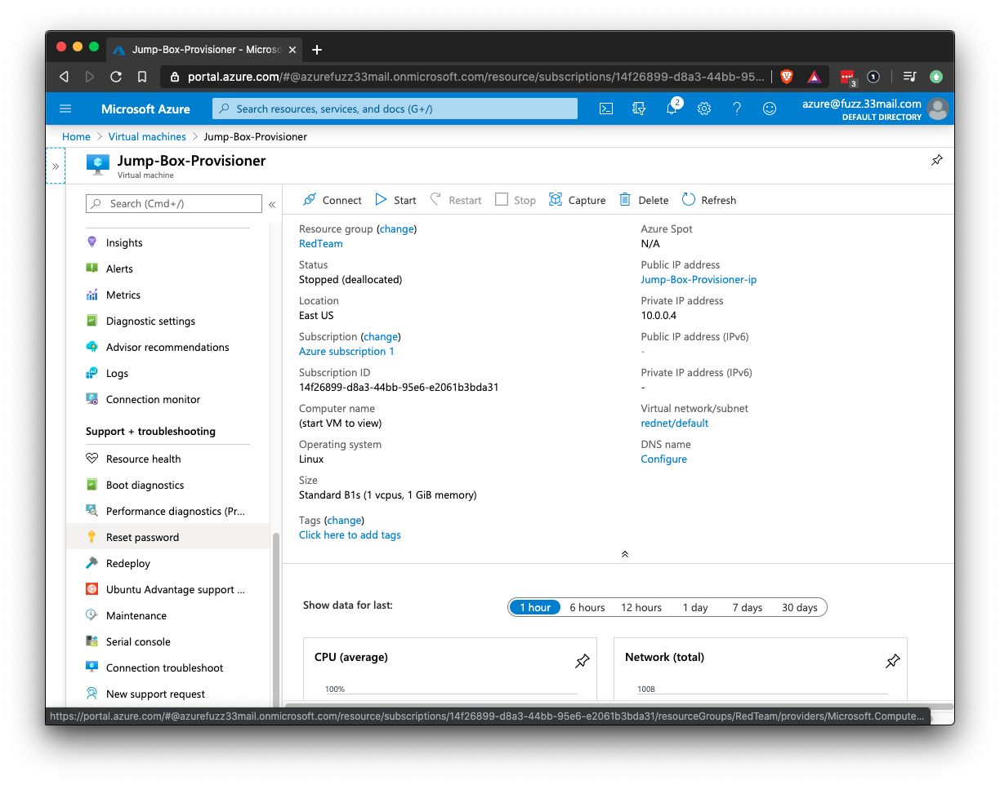


### 08. Instructor Do: Containers (0:15)

Remind students where we are in today's curriculum. Thus far, we have created a jump box, which we will use to access our network and configure a machine for the Red Team.

Explain that configuration typically requires downloading and installing several different applications, then configuring them to work together. For example, when configuring a LAMP web server, you must install: 
- Linux
- A web server like Apache
- A database like MYSQL
- A back-end programming language, like PHP. 

In order for each of these items to work together, they need to be properly configured. This can be a time consuming process. 

Explain that VMs can be used to streamline this process. They can be used by
- Configuring a Linux VM as a LAMP server
- Capturing an image of this VM
- Duplicating this image whenever a new LAMP server is needed

Note that the term **image** — sometimes also **golden image** — means a _copy_, or _template_, of a VM. 

Explain that the point of creating such an image is to ensure that every LAMP server on the network is identical. If they are all created from the same image, then they must all have the same configuration. If the base image used to create them is thoroughly hardened and properly configured, you can be sure that every web server in your infrastructure is the same: This is what makes them "golden".

While powerful, this method is also "heavy". VMs are large; take a long time to download and deploy; and it takes time to provision and capture an image. In addition, many servers perform very simple jobs, and don't need all of the resources a full VM provides. A web server, for instance, is a relatively lightweight process. Provisioning an entire VM just to process HTTP requests works just fine, but imposes the following costs:
- **Time**: Creating VM images is a lengthy process.
- **Budget**: Sometimes, the only VMs available are expensive.
- **Opportunity**: Provisioning a whole VM uses up some of your vCPU quota. If you have a vCPU quota of 10 in a region, and you create 8 web servers to handle requests in that region, you only have 2 vCPUs left for other purposes.

Additionally, if you clone an entire VM, most of the VM will be "wasted space," since only a few files on the entire disk are actually relevant to running the LAMP server. The rest are just operating system files. 
- For example, it would be inefficient to deploy 20 VMs that are each 3 GB, if each VM is identical with the exception of, e.g., 5Gb of data in their databases.
- Since each web server is identical, certain files will be the same on each machine. E.g., since each LAMP server is a Ubuntu machine, they will all have the same kernel, core libraries, etc.
- Only certain files on each server will be different between machines — for example, log files.
- It would be much more efficient if each web server focused only on generating these unique files, and _shared_ the resources they have in common, instead of maintaining copies of their own.
-  For example, it would be better if there were _one_ copy of the kernel, which all 20 servers shared. This saves a considerable amount of space on disk, and allows the server to focus on only thing: Processing requests and generating logs. 

For many applications, these limitations pose no problem. However, the community has recently begun to use **containers**, an alternative to VMs, for handling workloads like web servers. 

A **workload** is simply a type of processing you want a server to do — processing HTTP requests, converting image formats, sending emails, etc. Containers are attractive because they address the shortcomings enumerated above, and are much easier to use than virtual machines for many workloads. The takeaway points are:
- VMs are powerful solutions, but are "overkill" for certain applications
- Containers provide a faster, lighter, and cheaper alternative

Let students know that you will proceed by:
- Explaining how containers work, and how they differ from VMs
- Understanding how containers work
- Practicing using containers, for the rest of the lesson

#### Running Containers

Like VMs, containers are simulated machines that run on a single host. 

However, two separate VMs running on the same host are completely independent of each other. 
- Virtual Machine A has no knowledge of Virtual Machine B. Even if Virtual Machine A and B were created from identical images. 

In contrast, containers can share certain files. Container A, Container B, and Container C can run on a single host and use the same kernel. 
- They share these files and therefore only have to contain the files relevant to their applications, such as the LAMP server.


Cover the following aspects of containers: 

- **Lightweight**: Containers are much more lightweight than virtual machines. This is because they don't need to virtualize all the hardware of the computer and don't need to run their own OS.

- **Share resources**: Containers intelligently share OS resources while remaining isolated, allowing each one to focus exclusively on its own state.

- **Specialized**: Containers only run the software components that they need to complete their task. Containers only do one thing. 
    - In the example of our LAMP server, we can have a LAMP container image that already has all the LAMP components installed. The image is downloaded like an app.

    - When a LAMP server is needed, a container is created from the image that was downloaded, and the LAMP server is up and running.

- **Easily duplicated**: A copy or image of a container can be easily downloaded and shared from computer to computer. When you need that particular container, the image is used to create a duplicate container.

- **Prevalent and redundant**: Containers are widely used in today's web architecture. 
    - Using our LAMP server example again, we might have a single virtual machine server that is running 100 LAMP containers that are all configured in exactly the same way. As website traffic grows, the traffic can be evenly distributed among the 100 containers, and more containers can automatically be created. 
    
    - If one container is attacked or has a problem, it can be killed and regenerated as needed without the website going down.

Point out that VMs and containers are used together. Usually, an administrator will provision a powerful VM and then run many containers on it.

Pause and ask the class if there are any questions about this high-level overview of containers.

#### Comparing & Contrasting VMs & Containers

Note that containers are often called "lightweight VMs". This is because they act like VMs, but are smaller, and use fewer resources by sharing those they have in common with other containers. This allows a container to perform the same job a VM would with considerably less CPU, memory, and infrastructure overhead.

The fact that containers are called "lightweight VMs" betrays the fact that they are more similar to VMs than different. For example:
- You can create images of both VMs and containers. The process is similar for both, but is much faster with containers.
- Most containers you'll use run Linux. This means everything you already know about scripting, configuring, and securing Linux VMs applies to containers, as well.
- You can use configuration tools, such as Ansible, to interact with containers the same way you use them to interact with VMs. 

All this means that using containers feels almost identical to using VMs in many regards. There are, however, important differences, from which containers derive their advantages:
- Multiple VMs call for multiple, completely separate copies of everything on each machine. Multiple containers share common resources, such as a kernel and core libraries.
- VMs and VM images are larger than containers and container images.
- Containers can be quickly destroyed and recrated, whereas recreating VMs can take several minutes.

Arguably the most important similarity between containers and VMs is the fact that they can be provisioned with the same scripts and tools as VMs, and configured containers can be captured, just like VMs, to create images. These images can be redeployed later with the same benefits of using VM golden images, but much less overhead.

These advantages make containers popular for the following use cases:
- Packaging server applications for easy deployment
- Packaging software for easy distribution

##### Use Cases: Packaging Software
One of the main use cases for containers is packaging and distributing software. Distribution is the process of publishing code that you've written, or a server that you've configured, so that others can use it. **Packaging** is the process of preparing your code or server in a way that makes it easy to distribute for others to install.

Typically, when users install software, they must:
- Download the software itself
- Download and install any dependencies the software uses
- Configure the software

For tools that can be installed via `apt-get`, this happens automatically. However, more complex applications — such as the ELK stack students will deploy during Project Week — can take a very long time to set up from scratch.

One way to solve this problem is to:
- Configure an ELK stack in a container
- Capture a "golden container image"
- Redeploy this template whenever an ELK machine is needed

Emphasize that the process of configuring an ELK stack within the container is essentially identical to the process of configuring it in a VM, as students will see soon.

Once such a container has been built, anyone can simply download and run it to start a new ELK server — a process that takes a minutes, rather than an hour or more in the case of downloading and launching a new VM.

#### Managing Containers

Point out that using containers instead of VMs to run a LAMP server immediately results in massive cost and operational savings by eliminating a large amount of file and CPU overhead.

- However, each container still has to maintain its own data, making each one *stateful*. You can't safely destroy a container and replace it with a new one if it contains data that no other container has.

- This seems to work against one of the main benefits of using containers: their ability to be easily created and destroyed.

Therefore, we want to make containers as *stateless* as possible. This can be done by moving data to its own central location and extracting server and application data as much as possible.

- This can be remedied by further splitting the LAMP container into a set of multiple containers:

    - One responsible for the database (MySQL)
    - One responsible for the web server (Linux/Apache)

In this setup, the containers responsible for the Linux/Apache server would be identical. They would have the exact same application data. Differences would now only exist in the containers that contain the database. 


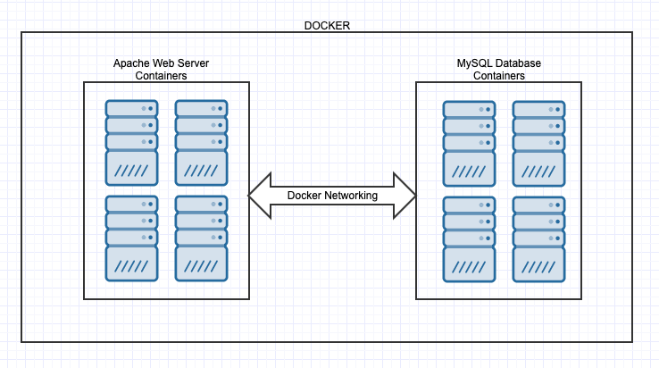

- If we have a sudden increase in the number of users accessing our site, we can accommodate it by creating even more application/server containers, and linking them to the database container(s).

- While we can increase the number of database containers, we can also create more application containers to handle a larger number of user requests and throttle requests to the database from these instances. 

- Making a machine as stateless as possible allows us to create and destroy as many application containers as we want, knowing that the application's data will continue to exist in the database containers.

Explain that the process of creating more containers to handle additional load is called **horizontal scaling**. This is different from **vertical scaling**, where we simply make an existing machine more powerful by adding more RAM or CPU.

Explain that, on the cloud, horizontal scaling is preferable to vertical scaling because it offers much greater flexibility. This is because:

- Using containers, we can scale each part of the web application individually.

- Horizontal scaling makes the system more resilient. Instead of having a single point of failure, (one web server) we have multiple web server containers running, each taking different requests. If one of them fails, we can redirect requests to the other containers. If a container is compromised, we can tear it down and re-build it from scratch, while the other containers continue to function.

- Vertical scaling has a limit. We can only add so much RAM and CPU to one computer before we run out of resources.

- In real-world practice, both vertical and horizontal scaling are used.

Let students know that they'll revisit this concept in-depth when they study multi-tiered deployments later in the course.

#### Docker

Explain that **Docker** is the most common program used to manage containers:
- Docker is open source and free software.

- It has a container hub that anyone can use to store containers or download containers created by other people.

- Docker containers make it extremely fast and easy to install complex server configurations.

- Docker makes it relatively easy to create a custom container.

Let students know that in the next exercise, they will configure their jump box to be able to run Docker containers.

Point out another advantage of containers being lightweight: they can be used to distribute software, versus having to install software directly on a host machine.

For example, let's say we want to install a tool like Git on our VM. Compare the following scenarios:
- Install Git directly on your host machine.
- Download a container that has Git inside of it and use Git from the container.

While downloading a container with Git seems like indirection, as we are adding another step, it also has the advantage of eliminating platform and version issues.

If your machine can run Docker and you use a Docker container to run Git, it has the following advantages:

- You can use the same container on any machine where you use Git, and it will work identically.
    - While you can't guarantee that software installed directly will behave identically across different machines, you can guarantee that the same container will. (This is usually not an issue with Git in particular, but is a source of bugs with other software.)

- You can more easily install multiple versions of a tool, and use them at the same time for different projects.
    - Rather than managing several versions of a single software on your machine, you can have one container for each version you need. This is useful if you are working on several different projects at once, each needing a different version of the same software. (This is actually an extremely common use case among developers, operations, and cloud engineering specialists.)

Let students know that, since we are working towards a fully reproducible automated configuration process, we will use Docker to install Ansible, a provisioning tool. This will ensure our provisioning scripts run identically everywhere. This will further ensure our automated configurations will do exactly the same thing every time they run, eliminating as much variability between configurations as possible.

#### Docker Demo

Explain that installing and using Docker only requires a few commands. Students should make note of these commands as they will need them in the upcoming activity.

**:warning: Heads Up**: All `docker` commands must be run as root using `sudo`.

Remind students to double check the public IP of their Jump Box as it may have changed since relaunch.

Open your terminal and SSH into your jump box.

- Run `ssh admin@jump-box-ip`

Remind students that to install applications on a Linux machine, we use the `apt` command.

Explain that since we don't know when these images were last updated, we will first update them by running `apt-get update`.

- Run `apt-get update`

Point out that to install Docker, we need to specify `docker.io`.

- Type `sudo apt install docker.io`

- After Docker is installed, you can use Docker commands to download a container image.

Switch to a browser and go to [hub.docker.com](https://hub.docker.com).

- Explain that this is Docker Hub, where students can make a free account and find various container images.

    - Point out that having an account is not necessary. To install an image, you only need to know the name of the image. 

- Image names always follow the same format: `[image_owner]/[image_name]`.

- To download an image, use the `docker pull` command with `sudo` and the image name. 

Run `sudo docker pull cyberxsecurity/ubuntu:bionic`

- `sudo`: Runs Docker with the root account. 
- `docker pull`: The Docker command to download containers.
- `cyberxsecurity/ubuntu:bionic`: The specific container to download from the Docker Hub.

Clear your prompt.

Explain that once you have the image downloaded, you only need to run the `docker run` command to launch a container and connect to its command line.

Run `sudo docker run -ti cyberxsecurity/ubuntu:bionic bash` to start the container.

Make sure you're demoing and emphasizing the `bash` directive at the end of the command as shown above.  While the `cyberxsecurity/ubuntu:bionic` container does not require this, the `cyberxsecurity/ansible` container in the next activity will fail without it.

- `sudo docker run`: The command to create and run a new container.
- `-ti` stands for `terminal` and `interactive` and sets up the container to allow us to run a terminal and interact with the container.
- `cyberxsecurity/ubuntu:bionic`: The container image that has already been downloaded.
- `bash`: The command we are running inside the container. This will give us a shell to control the container.

Explain that running this command will create a new container and connect to it with a new command prompt.

Point out that in order to exit a container, you need to type `exit` at the command prompt, similar to exiting an SSH session.

Ask if there are any questions about the commands for installing Docker or downloading a container.

### 09. Student Do: Containers (0:20)


Explain the following to students:

- In the previous activities, you created a secure network for XCorp's Red Team and launched a virtual machine to be a jump box on that network with a secure SSH connection. 

- In this activity, you will set up this machine to run containers and prepare to use it to configure other machines.

- You must configure your jump box to run Docker containers, and install a container.

:globe_with_meridians: Students should stay in the same **breakout room** groups as the previous activity.


Send students the following files:

- [Activity File: Containers](Activities/09_Containers/Unsolved/README.md)

### 10. Instructor Review: Containers Activity (0:10)

:bar_chart: Run a comprehension check poll before reviewing the activity. 

The goal of this activity was to install Docker and download a Docker container to a jump box.

Send student the following solution guide: 

- [Solution Guide: Containers](Activities/09_Containers/Solved/README.md)

Open your terminal and SSH into your jump box.

- Run `ssh admin@jump-box-ip`

- Once you are connected, run `apt-get update` to update your machine. 

Next, explain that we'll need to install `docker.io`. 

- Run `sudo apt install docker.io`

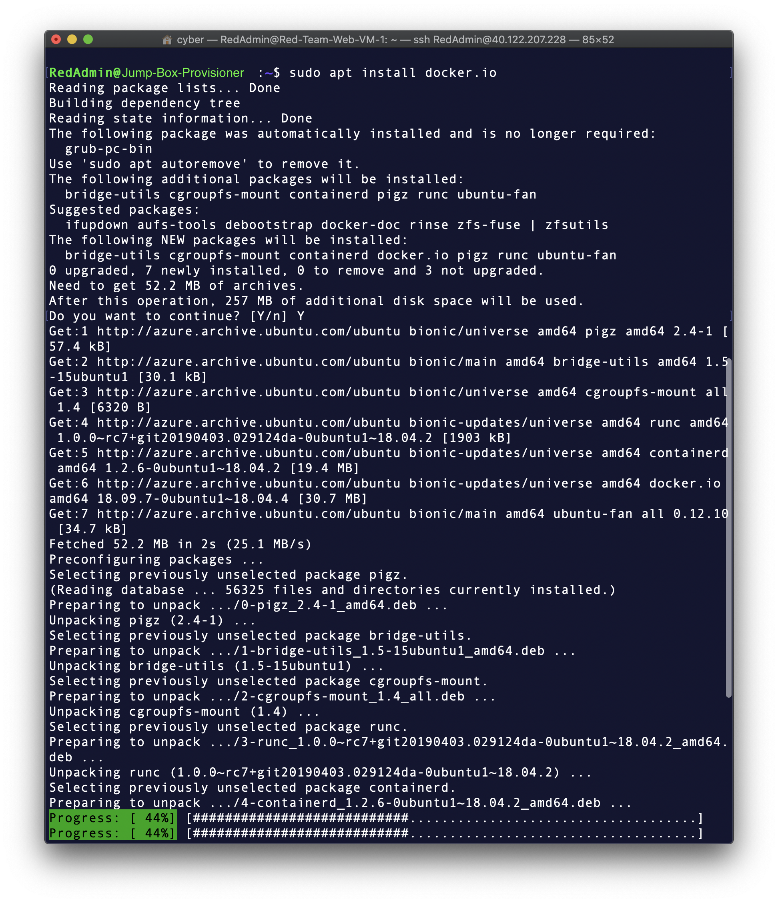

Double check that the docker service is running.

- Run `sudo systemctl status docker`
  - If the Docker service is not running, start it with `sudo systemctl start docker`. 


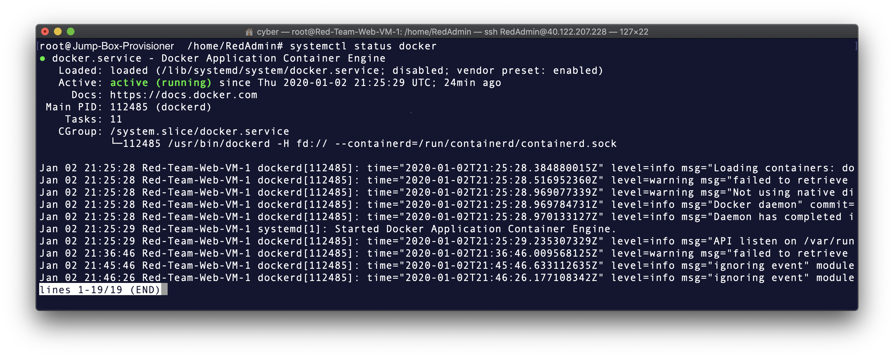


Now that Docker is installed, we can pull the container `cyberxsecurity/ansible`.

- Run `sudo docker pull cyberxsecurity/ansible`

    - `docker pull`: The Docker command to download containers.
    - `cyberxsecurity/ansible`: The specific container to download from the Docker Hub.

   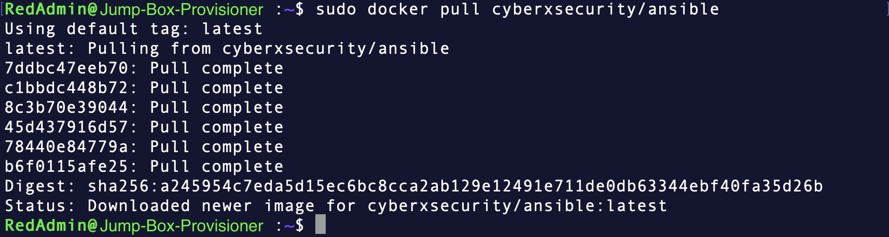

Now launch the Ansible Docker container and connect to it.

 - Run `sudo docker run -ti cyberxsecurity/ansible bash`

    - `sudo docker run`: The command to create and run a new container.
    - `-ti` stands for `terminal` and `interactive` sets up the container to allow you to run a terminal and interact with the container.
    - `cyberxsecurity/ansible`: The container image we just downloaded.
    - `bash`: The command we are running inside the container. This will give us a shell to control the container.

Point out that you get a new command prompt, showing that you are now connected to the container.

- Run `exit` to quit.

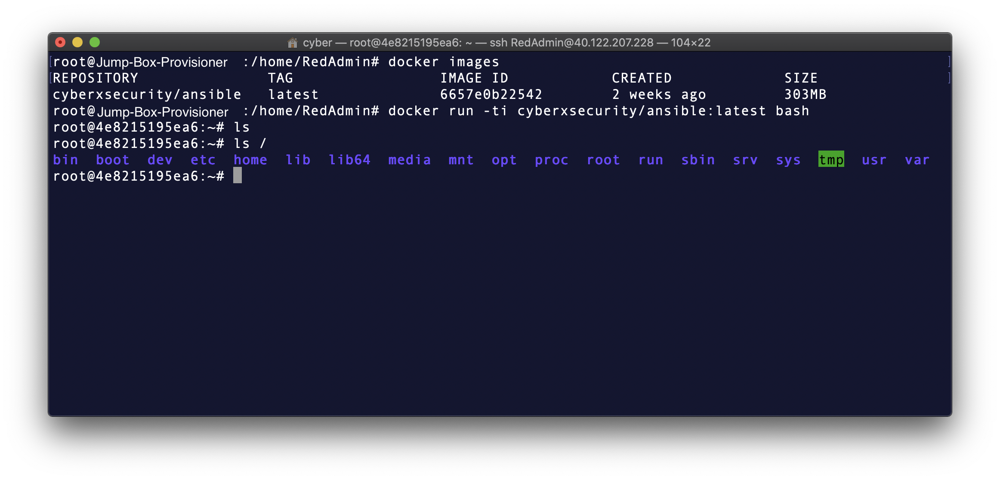

Now we need to create a security group rule that gives our jump box machine full access to our VNet. Without this permission, the jump box will not be able to access any resources inside the Azure portal.

- Get the private IP address of your jump box from the VM resources page inside the Azure portal.

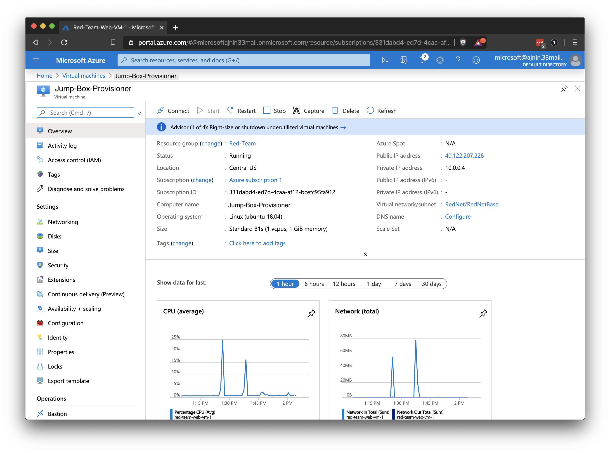

- Go to your security group settings and create a rule. Use settings that allow SSH connections from your jump box's internal IP address.

The rule should look similar to the following:

- Source: Use the **IP Addresses** setting with your jump box's internal IP address in the field.

- Source port ranges: **Any** or * can be listed here.

- Destination: Set to **VirtualNetwork**.

- Service: Select **SSH**

- Destination port ranges: This will default to port `22`.

- Protocol: Will default to **TCP**.

- Action: Set to **Allow** traffic from your jump box.

- Priority: Priority must be a lower number than your rule to deny all traffic.

- Name: Name this rule anything you like, but it should describe the rule. For example: `SSH from Jump Box`.

- Description: Write a short description similar to: "Allow SSH from the jump box IP."

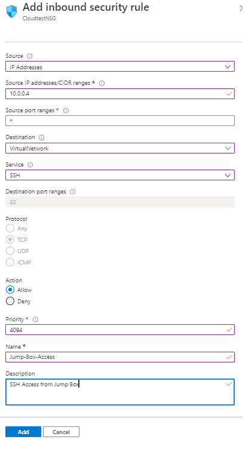

Your final security group rules should be similar to this:
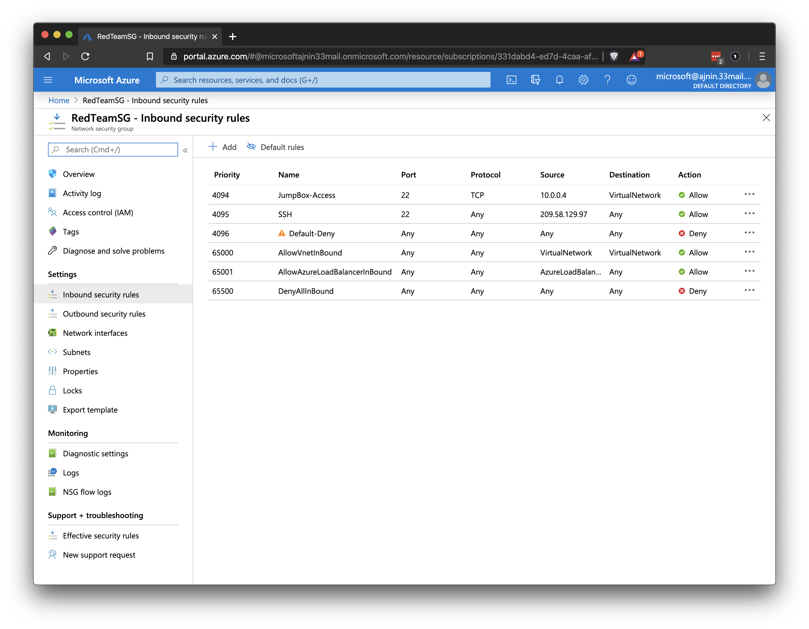

While this is the easiest way to limit access to the VNet other types of secure access include setting up a site-to-site VPN or a client-to-site VPN.

- If someone on the same network as you was able to access your SSH private key, they would be able to log into the jump box and access the entire VNet.

Explain that we don't have enough time to set up a VPN, but students can explore this more secure setup using these resources:

- [Azure VPN](https://azure.microsoft.com/en-us/services/vpn-gateway/)
- [Azure Point to Site](https://docs.microsoft.com/en-us/azure/vpn-gateway/vpn-gateway-howto-point-to-site-resource-manager-portal)

The students should now have Docker and Ansible set up on their jump box, with the box being able to access the entire VNet.

Ask if there are any questions before moving to break.


---

|:warning: **CHECKPOINT** :warning:|
|:-:|
| Verify that students have completed the following steps before continuing. |

Students should have completed the following critical activities before continuing. 

- [ ] Docker is installed and running on the Jump-box.
- [ ] The `cyberxsecurity/ansible` Docker container is running on the jump-box.
- [ ] The security group has a rule that allows the jump-box ssh access to the vNet.

---


### 11. Break (0:15)

### 12. Instructor Do: Infrastructure as Code and Provisioners (0:20)

Explain that now that we have our jump box running an Ansible Docker container, we will go over provisioners and configure this jump box to connect to other servers so it can configure them.

Explain that whenever we make configuration changes to a server, it is important to keep track of exactly what changes are made.

Ask students if they have ideas of how to track the changes made to a server. Possible answers include:
- Reviewing log files on the server. 

- Reviewing standard operating procedures, which may identify which programs were preinstalled for users. 

Explain that infrastructure as code (IaC) is the concept of defining all of your equipment and network with code. When using virtual machines and containers, almost every server, database, workstation and other component in your infrastructure can be individually defined with code.
- When a particular piece of the infrastructure is needed, we can run the code that defines that thing and it will be up and running within a few minutes.

- IaC allows us to clearly build in security protocols from the ground up. If a server is found to be vulnerable, it's easy to change the code that created the server and build in a fix.

Explain that IaC is also important for keeping track of the changes we make. 
- When we create code that contains the configuration of a server, that code can be version controlled and easily audited. 

- Rather than having to back up the server and its settings, servers can send logs to a central database. This way, we only need to back up small text files containing the code that defines the servers.

- Code configuration changes can be deployed or reversed as needed. If an update causes a problem, we can use version control to reverse the code to its previous state, and redeploy.

- In order to see what changes are made to a server, we just need to look at what changes the code makes. Often this code is written in a very easy-to-read language, so we only need minimal documentation to understand any given configuration.

While IaC makes it easier to manage individual components of a VM, it raises a question about scaling: 

- Ask the class to imagine the following scenario: What if they are personally in charge of managing 1,000 servers and 10,000 containers? Logging in individually to each of them in order to make changes becomes an impossible task.

Explain that a provisioner is a software application used in IaC setups for making automated configuration changes to computers.

- Provisioners focus on bringing a server to a certain state of operation. 

- Once the desired state of a server is documented with code, that code can be run on one server, 100 servers or 10,000 servers within a few minutes. Provisioners can do everything from install software to change configuration text files, and more.

- The changes that a provisioner makes are created using text files, usually written in YAML or JSON.

- Common provisioners include Ansible, Puppet, and Chef.

#### Container and Provisioner Demo: Docker and Ansible

Remind students that during our last activity, we downloaded a Docker container that runs Ansible. It has everything we need to run Ansible and configure other servers. During the next few activities, we will be using the Ansible container on our jump box to connect to another VM and make configuration changes. 

Explain that in the following walkthrough, we will explore Docker more in-depth and use our Ansible container to connect to a new VM. This means we need to create an SSH key pair on the Ansible container and reset the SSH keys on our Web-VM's to use the SSH `id_rsa.pub` file from our Ansible container.

Begin by connecting to your jump box via SSH.

- Run `ssh admin@jump-box-ip`

Once you are connected, explain that there are a few Docker commands we will need in order to get the container up and running. 

- If we began the with the same command we used to create our container, we would end up creating another new container. 

- We want to make sure we are only running one container and that it is the same container every time we use Ansible. 

:warning: **Heads Up**: The difference between `docker run` and `docker start` needs to be very clear for students. 

- `docker run` will create a _new_ container from the container image and that new container will have default settings. None of their previous Ansible changes will be there. 

- Therefore, `docker run` should only be used on the first time the Ansible container is created and started. 

- `docker start` should be used _every_ time thereafter. Otherwise problems with the activities will arise because of missing files on the Ansible container. Walk through the instructions below to help solidify this point.

List all the containers created on the system: 

- Run `sudo docker container list -a` 

- Your output should resemble the following:

    ```bash
    root@Red-Team-Web-VM-1:/home/RedAdmin# docker container list -a
    CONTAINER ID        IMAGE                           COMMAND                  CREATED             STATUS                         PORTS               NAMES
    Exited (0) 2 minutes ago                           hardcore_brown
    a0d78be636f7        cyberxsecurity/ansible:latest   "bash"                   3 days ago  
    ```

- In this example, the container name is `hardcore_brown`, but your container will have a different name. 

- This name will be automatically created. Point out that these names are generated by randomly pairing a strong adjective with the last name of a notable computer programmer. 

- Your unique container name will be used when referring to a container with Docker commands. 


Type `sudo docker start hardcore_brown`

- `sudo docker`: Uses `sudo` to run Docker with root.
- `start`: Initiates the container that follows.
- `container_name`: The unique name for your container.

Run the command and point out that nothing seems to have happened. 

```bash
$ sudo docker start container_name
$ hardcore_brown
```

Show all running containers:

- Run `sudo docker ps`

- You should see your container in the list.

    ```bash
    $ sudo docker ps
    CONTAINER ID        IMAGE               COMMAND             CREATED             STATUS              PORTS               NAMES
    21a0f55d4e30        775349758637        "bash"              6 weeks ago         Up 3 seconds                            hardcore_brown
    ```

Activate a shell on your container: 

- Run `sudo docker attach container_name`

- Point out that your prompt has changed and you are now connected to your Ansible Docker container.

    ```bash
    $ sudo docker attach hardcore_brown
    root@23b86e1d62ad:~# 
    ```

Explain that during the activity students will need to create an SSH key from inside the Ansible container and use that SSH key to create a new VM. Since students have completed these steps during the previous activity, we will skim this subject here. 

Run `ssh-keygen` to create an ssh key **inside the ansible container**. 

- Hit enter 3 times to accept all default key settings (located in /root/.ssh/id_rsa.pub and no password)

:warning: **Heads Up**: It is a common mistake to create ssh keys from the jump box itself instead of from inside the Ansible container. Any keys that are meant to be used with Ansible **must** be created from within the Ansible container.

Reset the password for one of your Web-VM's inside the azure portal and copy over your new ssh key.

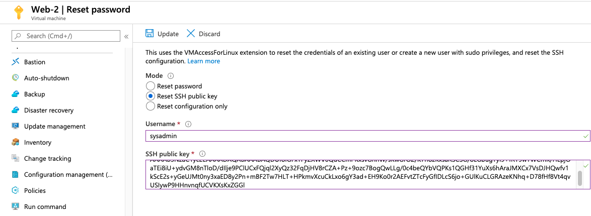

Explain that after we have a VM running with the SSH key installed, we want to configure Ansible to connect to that VM.

First, we need to verify that our ssh connection is working and accept the key.

Run `ssh <username>@<webVM-IP>` to connect to the Web-VM and accept the key.

```bash
root@6160a9be360e:/etc/ansible# ssh sysadmin@10.0.0.5
The authenticity of host '10.0.0.5 (10.0.0.5)' can't be established.
ECDSA key fingerprint is SHA256:/jlvMP2ZRQu3fdXXPc65t8Z8fjuDMIMxhXCsaihHcJU.
Are you sure you want to continue connecting (yes/no)? yes
Warning: Permanently added '10.0.0.5' (ECDSA) to the list of known hosts.
Welcome to Ubuntu 18.04.4 LTS (GNU/Linux 5.3.0-1020-azure x86_64)
```

Run `exit` to close the ssh connection and return to your ansible container.

- Run `ansible` to show that you now have Ansible installed and running.

    ```bash
    root@9bd16493749f:~# ansible
    usage: ansible [-h] [--version] [-v] [-b] [--become-method BECOME_METHOD]
                [--become-user BECOME_USER] [-K] [-i INVENTORY] [--list-hosts]
                [-l SUBSET] [-P POLL_INTERVAL] [-B SECONDS] [-o] [-t TREE] [-k]
                [--private-key PRIVATE_KEY_FILE] [-u REMOTE_USER]
                [-c CONNECTION] [-T TIMEOUT]
                [--ssh-common-args SSH_COMMON_ARGS]
                [--sftp-extra-args SFTP_EXTRA_ARGS]
                [--scp-extra-args SCP_EXTRA_ARGS]
                [--ssh-extra-args SSH_EXTRA_ARGS] [-C] [--syntax-check] [-D]
                [-e EXTRA_VARS] [--vault-id VAULT_IDS]
                [--ask-vault-pass | --vault-password-file VAULT_PASSWORD_FILES]
                [-f FORKS] [-M MODULE_PATH] [--playbook-dir BASEDIR]
                [-a MODULE_ARGS] [-m MODULE_NAME]
                pattern
    ansible: error: too few arguments
    ```

Explain that we must make two changes to the configuration files to let Ansible make connections:
- Ansible needs to know which administrative username it should use when making SSH connections. This will be the admin username you used when you created your Web-VM's.
- Ansible needs to know the IP address of the VM you want it to connect to.

Explain that each of these settings is located in a different file, but _all_ Ansible configurations live in `/etc/ansible`.

- Run `cd /etc/ansible` and then `ls` to show all the files:

    ```bash
    root@9bd16493749f:~# cd /etc/ansible/
    root@9bd16493749f:/etc/ansible# ls
    ansible.cfg  hosts  roles
    root@9bd16493749f:/etc/ansible# 
    ```

-  `ansible.cfg`: The file with the setting for the admin name that should be used.

- `hosts`: The file with all of the IP addresses that should be used.

Use Nano to open the `ansible.cfg` file:

- This setting  is called the `remote_user`. We will need to make sure that this user matches the admin username we use when we create the new VM.

Scroll down or search for the `remote_user` option.

- We need to uncomment the `remote_user` line and replace `root` with the admin username you used when creating the Web-VM's.

- The file should look like this:

    ```bash
    # What flags to pass to sudo
    # WARNING: leaving out the defaults might create unexpected behaviors
    #sudo_flags = -H -S -n

    # SSH timeout
    #timeout = 10

    # default user to use for playbooks if user is not specified
    # (/usr/bin/ansible will use current user as default)
    remote_user = YOUR_USER_NAME

    # logging is off by default unless this path is defined
    # if so defined, consider logrotate
    #log_path = /var/log/ansible.log

    # default module name for /usr/bin/ansible
    #module_name = command
    ```

Exit the file. 

Run `nano hosts` to open the `hosts` file with Nano.

- This file must contain the IP address for any machines that Ansible connects to.

- Machines can be grouped together under headers using brackets:
    - `[webservers]` or `[databases]` or `[workstations]`headers can all hold different groups of IP addresses, which Ansible can run configurations on individually or together.

Explain that for now we will only have one web server, so we can add our IP to the provided web server header.

- Uncomment the `[webservers]` header line.

- Add a random IP address under the `[webservers]` header as an example.

- The file should resemble the following:

    ```bash
    # This is the default ansible 'hosts' file.
    #
    # It should live in /etc/ansible/hosts
    #
    #   - Comments begin with the '#' character
    #   - Blank lines are ignored
    #   - Groups of hosts are delimited by [header] elements
    #   - You can enter hostnames or ip addresses
    #   - A hostname/ip can be a member of multiple groups
    # Ex 1: Ungrouped hosts, specify before any group headers.

    ## green.example.com
    ## blue.example.com
    ## 192.168.100.1
    ## 192.168.100.10

    # Ex 2: A collection of hosts belonging to the 'webservers' group

    [webservers]
    ## alpha.example.org
    ## beta.example.org
    ## 192.168.1.100
    ## 192.168.1.110
    10.0.0.4
    ```

Explain that the way Ansible works is, it creates a python script and then runs that script on the target machine using *that machine's installation of Python*. Typically, Ansible may have issues determining which python to use on the target machine, but we will solve this by forcing ansible to use python 3 on each machine we configure. 

Add the line: `ansible_python_interpreter=/usr/bin/python3` besides each IP address.

```bash
    [webservers]
    ## alpha.example.org
    ## beta.example.org
    ## 192.168.1.100
    ## 192.168.1.110
    10.0.0.4 ansible_python_interpreter=/usr/bin/python3

```

Without this line, Ansible will still connect, but you will see this Warning:

```bash
[DEPRECATION WARNING]: Distribution Ubuntu 18.04 on host 10.0.0.5 should use 
/usr/bin/python3, but is using /usr/bin/python for backward compatibility with 
prior Ansible releases. A future Ansible release will default to using the 
discovered platform python for this host. See https://docs.ansible.com/ansible/
2.9/reference_appendices/interpreter_discovery.html for more information. This 
feature will be removed in version 2.12. Deprecation warnings can be disabled 
by setting deprecation_warnings=False in ansible.cfg.
```

Exit the file and then exit the VM. These two settings are all that's needed to create connections from Ansible to a virtual machine.

Explain that Ansible has a `ping` command that will verify these connections.

- Run `ansible webservers -m ping`

- Point out that we are specifying the `[webservers]` group that we just created.

- We _could_ target any group in the `hosts` file or we can target _all_ the machines in any group by using `ansible all -m ping`.

    - `ansible`: Used to run one-off Ansible commands.
    - `-m`: Specifies the Ansible module to run. 
    - `ping`: Module that checks the connection with each of the machines given.
    - `all` or `webservers`: The group of machines you want to run the `ping` module on. 
        - `all` will run it on all the hosts listed in the `hosts` file. 
        - In this case, there is only one host, so either group will work.

- Output of a successful `ping` command should resemble:

    ```bash
    root@1f08425a2967:~# ansible all -m ping
		10.0.0.6 | SUCCESS => {
				"changed": false, 
				"ping": "pong"
		}
    ```

Ask the students if there are any questions about configuring Ansible, or creating SSH keys or a new VM.

### 13. Student Do: Provisioners (0:25)


Explain the following to students:

- In the previous activities, you finished setting up a jump box that can only be accessed from your current IP address, using your SSH public key.  

- In this activity, you will continue to set up a testing environment for XCorp's Red Team.

- Instead of accessing this machine from a local machine, you will only access it from inside the container inside your jump box.

- You are tasked with launching a new VM from the Azure portal that can only be accessed using a new SSH key from the container running inside your jump box.

:globe_with_meridians: Students should stay in the same **breakout room** groups as the previous activity.


Send students the following file:

- [Activity File: Provisioners](Activities/13_Provisioners/Unsolved/README.md)

### 14. Instructor Review: Provisioners Activity (0:15)

:bar_chart: Run a comprehension check poll before reviewing the activity. 

Explain that the goal of this activity was to launch a VM that can only be accessed from the Ansible container running on the jump box. This VM should not have an external IP and should not be accessible from the internet.

Send students the following file: 

- [Solution Guide: Provisioners](Activities/13_Provisioners/Solved/README.md)


Begin by connecting to your jump box using `ssh admin@jump-box-ip`.

We want to start the same container as in last activity.

- Run `sudo docker images` to view your image.

    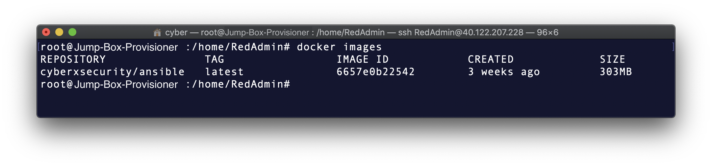

- This isn't the container you created, but rather the image that the container was created _from_.

Run `sudo docker container list -a` to see a list of all the containers created on the system.

- Your output should resemble the following:

    ```bash
    root@Red-Team-Web-VM-1:/home/RedAdmin# docker container list -a
    CONTAINER ID        IMAGE                           COMMAND                  CREATED             STATUS                         PORTS               NAMES
    Exited (0) 2 minutes ago                           hardcore_brown
    a0d78be636f7        cyberxsecurity/ansible:latest   "bash"                   3 days ago  
    ``` 

In this example, the container name is `hardcore_brown`, but your container will have a different name.

Run your container, verify that it is running, and then start a shell:

- Run `sudo docker start container_name`

- Run `sudo docker ps` to show all running containers. You should see your container in the list.

    ```bash
    $ sudo docker ps
    CONTAINER ID        IMAGE               COMMAND             CREATED             STATUS              PORTS               NAMES
    21a0f55d4e30        775349758637        "bash"              6 weeks ago         Up 3 seconds                            container_name
    ```

- Run `sudo docker attach container_name` to get a shell on your container.

Now that you are connected to your container, you can create an SSH key for this container to connect to other VMs on your VNet.

Ask the students if they remember the command to create an SSH key pair.

- Run `ssh-keygen` to create an SSH key.

    ```bash
    root@23b86e1d62ad:~# ssh-keygen
    Generating public/private rsa key pair.
    Enter file in which to save the key (/root/.ssh/id_rsa): 
    Created directory '/root/.ssh'.
    Enter passphrase (empty for no passphrase): 
    Enter same passphrase again: 
    Your identification has been saved in /root/.ssh/id_rsa.
    Your public key has been saved in /root/.ssh/id_rsa.pub.
    The key fingerprint is:
    SHA256:gzoKliTqbxvTFhrNU7ZwUHEx7xAA7MBPS2Wq3HdJ6rw root@23b86e1d62ad
    The key's randomart image is:
    +---[RSA 2048]----+
    |  . .o+*o=.      |
    |   o ++ . +      |
    |    *o.+ o .     |
    |  . =+=.+ +      |
    |.. + *.+So .     |
    |+ . +.* ..       |
    |oo +oo o         |
    |o. o+.  .        |
    | .+o.  E         |
    +----[SHA256]-----+
    root@23b86e1d62ad:~#
    ```

- Run `ls .ssh/` to view your keys.

    ```bash
    root@23b86e1d62ad:~# ls .ssh/
    id_rsa  id_rsa.pub
    ```

- Run `cat .ssh/id_rsa.pub` to display your public key.

    ```bash
    root@23b86e1d62ad:~# cat .ssh/id_rsa.pub 
    ssh-rsa AAAAB3NzaC1yc2EAAAADAQABAAABAQDz5KX3urPPKbYRKS3J06wyw5Xj4eZRQTcg6u2LpnSsXwPWYBpCdF5lE3tJlbp7AsnXlXpq2G0oAy5dcLJX2anpfaEBTEvZ0mFBS24AdNnF3ptan5SmEM/
    ```

- Explain that you are only concerned with the `id_rsa.pub` file because this is the `public` key for your SSH key pair.

- Copy your public key string.

Return to the Azure portal and locate one of your web-vm's details page.

		- Reset your Vm's password and use your container's new public key for the SSH user.

    - Get the internal IP for your new VM from the Details page.


- Point out that only TCP connections are enabled for SSH in your security group rule, so ICMP packets are disabled. As such, you will not be able to use `ping`.

- Run a `ping` command to demonstrate:

    ```bash
    root@23b86e1d62ad:~# ping 10.0.0.6
    PING 10.0.0.6 (10.0.0.6) 56(84) bytes of data.
    ^C
    --- 10.0.0.6 ping statistics ---
    4 packets transmitted, 0 received, 100% packet loss, time 3062ms

    root@23b86e1d62ad:~#
    ```

- Now run an SSH command to connect to your VM.

    ```bash
    root@23b86e1d62ad:~# ssh ansible@10.0.0.6
    The authenticity of host '10.0.0.6 (10.0.0.6)' can't be established.
    ECDSA key fingerprint is SHA256:7Wd1cStyhq5HihBf+7TQgjIQe2uHP6arx2qZ1YrPAP4.
    Are you sure you want to continue connecting (yes/no)? yes
    Warning: Permanently added '10.0.0.6' (ECDSA) to the list of known hosts.
    Welcome to Ubuntu 18.04.3 LTS (GNU/Linux 5.0.0-1027-azure x86_64)

    * Documentation:  https://help.ubuntu.com
    * Management:     https://landscape.canonical.com
    * Support:        https://ubuntu.com/advantage

    System information as of Mon Jan  6 18:49:56 UTC 2020

    System load:  0.01              Processes:           108
    Usage of /:   4.1% of 28.90GB   Users logged in:     0
    Memory usage: 36%               IP address for eth0: 10.0.0.6
    Swap usage:   0%


    0 packages can be updated.
    0 updates are security updates.


    Last login: Mon Jan  6 18:33:30 2020 from 10.0.0.4
    To run a command as administrator (user "root"), use "sudo <command>".
    See "man sudo_root" for details.

    ansible@Pentest-1:~$
    ```

- Exit this SSH session with `exit`.

Pause and ask if there are any questions about the setup so far.

Explain that you will now configure Ansible to connect to the VM.

- Locate the Ansible config file and hosts file.

    ```bash
    root@1f08425a2967:~# ls /etc/ansible/
    ansible.cfg  hosts  roles
    ```

- Explain that you will add this machine's internal IP address to the Ansible hosts file.

- Open the file with `nano /etc/ansible/hosts`.
    - Uncomment the `[webservers]` header line.
    - Add the internal IP address under the `[webservers]` header.
		- Add the python line: `ansible_python_interpreter=/usr/bin/python3` besides each IP.

```bash
		# This is the default ansible 'hosts' file.
		#
		# It should live in /etc/ansible/hosts
		#
		#   - Comments begin with the '#' character
		#   - Blank lines are ignored
		#   - Groups of hosts are delimited by [header] elements
		#   - You can enter hostnames or ip addresses
		#   - A hostname/ip can be a member of multiple groups
		# Ex 1: Ungrouped hosts, specify before any group headers.

		## green.example.com
		## blue.example.com
		## 192.168.100.1
		## 192.168.100.10

		# Ex 2: A collection of hosts belonging to the 'webservers' group

		[webservers]
		## alpha.example.org
		## beta.example.org
		## 192.168.1.100
		## 192.168.1.110
		10.0.0.6 ansible_python_interpreter=/usr/bin/python3
		10.0.0.7 ansible_python_interpreter=/usr/bin/python3		
```

Save and quit.

Explain that you will now change the Ansible configuration file to use your administrator account for SSH connections.

- If you do not do this, Ansible will try to connect to the root account.

- Open the file with `nano /etc/ansible/ansible.cfg` and scroll down to the `remote_user` option.
    
    - Uncomment the `remote_user` line and replace `root` with your admin username using this format:
				- `remote_user = <user-name-for-web-VMs>`

Example:

```bash
# What flags to pass to sudo
# WARNING: leaving out the defaults might create unexpected behaviours
#sudo_flags = -H -S -n

# SSH timeout
#timeout = 10

# default user to use for playbooks if user is not specified
# (/usr/bin/ansible will use current user as default)
remote_user = sysadmin

# logging is off by default unless this path is defined
# if so defined, consider logrotate
#log_path = /var/log/ansible.log

# default module name for /usr/bin/ansible
#module_name = command

```

Save and quit.

Now we will test the Ansible connection from this container on your jump box to the new VM you have created.

- Run `ansible all -m ping`

    - `ansible`: Used to run one-off Ansible commands.
    - `-m`: Specifies the Ansible module to run.
    - `ping`: The module you are using. It will check the connection with each of the machines given.
    - `all`: The group of machines you want to run the `ping` module on. `all` will run it on _all_ the hosts listed in the hosts file. 
        - In this case, there is only one host.

If you used `ansible_python_interpreter=/usr/bin/python3` your output should look like:

```bash
root@1f08425a2967:~# ansible all -m ping
10.0.0.5 | SUCCESS => {
"changed": false, 
"ping": "pong"
}
10.0.0.6 | SUCCESS => {
		"changed": false, 
		"ping": "pong"
}
```

If that line isn't present, you will get a warning like this:

```bash
root@1f08425a2967:~# ansible all -m ping
[DEPRECATION WARNING]: Distribution Ubuntu 18.04 on host 10.0.0.6 should use 
/usr/bin/python3, but is using /usr/bin/python for backward compatibility with 
prior Ansible releases. A future Ansible release will default to using the 
discovered platform python for this host. See https://docs.ansible.com/ansible/
2.9/reference_appendices/interpreter_discovery.html for more information. This 
feature will be removed in version 2.12. Deprecation warnings can be disabled 
by setting deprecation_warnings=False in ansible.cfg.
10.0.0.6 | SUCCESS => {
		"ansible_facts": {
				"discovered_interpreter_python": "/usr/bin/python"
		}, 
		"changed": false, 
		"ping": "pong"
}
```

- Ignore the `[DEPRECATION WARNING]` or add the line `ansible_python_interpreter=/usr/bin/python3` next to each Ip address in the hosts file.

The students should now have an Ansible connection between their Ansible container and their Web VM's.

Ask if there are any questions about today's activities.

Explain that during the next class, students will explore redundancy in their cloud setup and create a new container that will allow them to set up and connect to their own DVWA instance from the internet. 


---
|:warning: **CHECKPOINT** :warning:|
|:-:|
| Use the [Daily Checklist](../Resources/Checklist.md) to verify that students are ready for the next class session. |

At the end of Day Two, students should have completed the following critical items.

- [ ] Docker is installed and running on the Jump-box.
- [ ] The `cyberxsecurity/ansible` Docker container is running on the jump-box.
- [ ] The security group has a rule that allows the jump-box ssh access to the vNet.
- [ ] An ssh key created from inside the Ansible container that has no password.
- [ ] The Web VMs password has been reset using the ssh key from the Ansible container.
- [ ] Ansible is able to make a connection to both Web VMs.

Failure to complete these steps will hinder the activities in the next class.


---


© 2020 Trilogy Education Services, a 2U, Inc. brand. All Rights Reserved.
