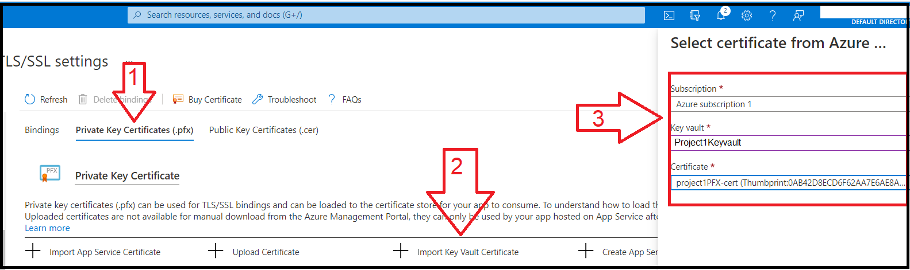
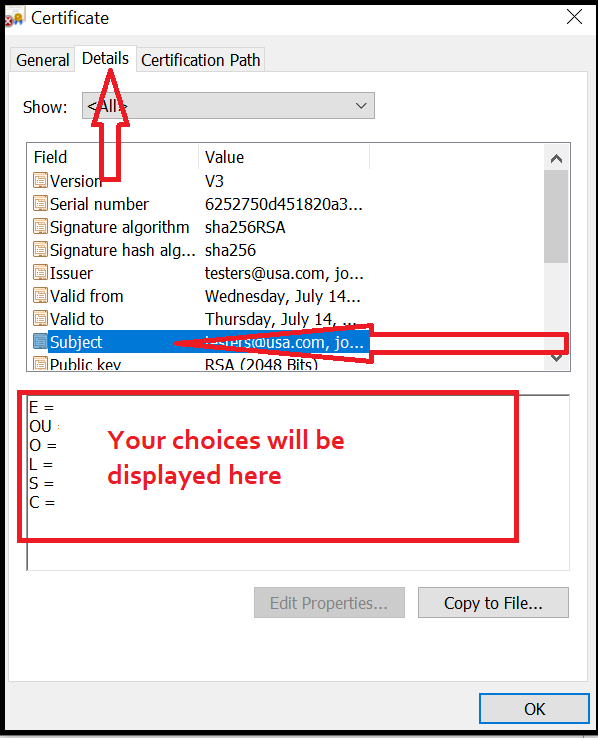

# Day 2 Activity File: Secure Your Web Application with SSL Certificates (Azure Premium and GoDaddy Domain Version)

Today, you will secure your web application. Specifically, you will:

  - (1) **Create a key vault**.
  - (2) **Create a self-signed certificate**.
  - (3) **Import and bind your self-signed certificate to your web app**.
  - (4) **Create and bind an app service managed certificate**.
  - (5) **Answer review questions**.

⚠️ Note: You will purposely create and add **two** types of SSL certificates to your web application to experience the advantages and disadvantages of each certificate.

### Resources

- [Azure Key Vaults](https://azure.microsoft.com/en-us/services/key-vault/#product-overview)
- [What is a self signed certificate?](https://sectigostore.com/page/what-is-a-self-signed-certificate/)
- [Binding Certificates in Azure](https://docs.microsoft.com/en-us/azure/app-service/configure-ssl-bindings#bind-your-ssl-certificate)
- [Azure App Service Managed Certificates](https://azure.microsoft.com/en-us/updates/secure-your-custom-domains-at-no-cost-with-app-service-managed-certificates-preview/)
- [Azure App Service Documentation](https://docs.microsoft.com/en-us/azure/app-service/)
- If Microsoft Support is needed, visit [How to open a support ticket](https://docs.microsoft.com/en-us/azure/azure-portal/supportability/how-to-create-azure-support-request)

---

### Getting Started/Prerequisites

Before you begin Day 2, you are required to have completed the following tasks from Day 1:

- Created your own web application.
- Created your own unique domain name.
- Deployed a Docker container to your web application.
- Customized your web application with your own unique content.

## Instructions

### Part 1: Create a Key Vault

In this first part, you will create an Azure key vault. To do so, complete the following steps:

1. Begin by logging in to the Azure portal: [https://portal.azure.com](https://portal.azure.com).

	 - Make sure that you're logged in to your personal Azure account (not @Cyberxsecurity), where your Cloud Security&ndash;unit VMs are located.
	
2. Select "Key vaults" from the Azure search field at the top of the page, as the following image shows:

      
 
3. Select "+ Create" from the Key Vault page to create your key vault, as the following image shows:

      
 
4. On the "Create key vault" tab, make the following selections:
   - Subscription/Resource Group: Select the same subscription and resource groups that you selected on Day 1.
   - Key Vault Name: Choose a key vault name, such as `project1_KeyVault`. (Note: This name must be globally unique, so you will be prompted to choose a different name if the one you enter has been used before.)
   - Region: Select the same region that you selected on Day 1.
   - Pricing tier: Select the "Standard" tier.
   - Leave the default options for all of the other tabs (Access Policy, Networking, Tags).
  
   The following image shows the completed "Create key vault" tab:

   
  
   - Finally, select "Review + Create" to create your key vault.

5. After your key vault has been created, select your new resource to view your new key vault.

6. Preview the options available on your key vault to store secure information, including:
   - **Keys**
   - **Secrets**
   - **Certificates**

   The following image shows these options:

    

### Part 2: Create a Self-Signed Certificate

In this second part, you will return to the command line to create a self-signed certificate using OpenSSL. To do so, complete the following steps:

1.  From your Azure portal, access the same Cloud Shell that you accessed on Day 1 to load the Docker container, as the following image shows:

     

     - From this command line, you will now use the open source cryptography and SSL/TLS "toolkit" **OpenSSL** (it is preinstalled).
         - Recall that during Cryptography week, we used OpenSSL to generate keys and an IV to encrypt a message.

2. Next, you will use OpenSSL to generate a **self-signed certificate**.
     - A self-signed certificate is a certificate that has not been signed by a certificate authority.
     - These certificates are simple to create and have no expense.
     - We will explore their advantages and disadvantages in today's review questions.

3. From the command line, enter the following command: `openssl req -x509 -sha256 -nodes -days 365 -newkey rsa:2048 -keyout <privatekeyname.key> -out <certificatename.crt> -addext "extendedKeyUsage=serverAuth"`
     - For example: `openssl req -x509 -sha256 -nodes -days 365 -newkey rsa:2048 -keyout project1_key.key -out project1_cert.crt -addext "extendedKeyUsage=serverAuth"`
     - The following image shows this step:
      
         
 
     - We added the following options: 
         -  **-x509**: Indicates for OpenSSL to create an SSL certificate.
         -  **-sha256**: Uses the sha256 hashing algorithm.
         -  **-nodes** 
         -  **-days 365**: States the certificate will be valid for one year.
         -  **-newkey rsa:2048**: Uses a 2048-bit RSA key.
         -  **-keyout project1_key.key**: The outputted name of the private key.
         -  **-out project1_cert.crt**: The outputted name of the certificate.
         -  **-addext "extendedKeyUsage=serverAuth"**: Indicates how a public key can be used.

     - Refer to the following [document](https://wiki.openssl.org/index.php/Command_Line_Utilities) for additional information on OpenSSL options.

4. After pressing Enter, you will be asked several questions about your certificate. Answer the following:

      - **Country Name (2 letter code) [AU]**: Enter your country.
      - **State or Province Name (full name) [Some State]**: Enter your state.
      - **Locality Name (e.g., city) [ ]**: Enter your city.
      - **Organization Name (e.g., company) [Internet Widgits Pty Ltd]**: Enter "Student".
      - **Organizational Unit Name (e.g., section) [ ]**: Leave blank by pressing Enter.
      - **Common Name (e.g., server FQDN or YOUR name) [ ]**: Enter your full domain name, such as "bobsblog.com".
      - **Email Address [ ]:** Leave blank by pressing Enter.

      The following image shows this step:

       

5. Now, view your newly created key (`.key`) and certificate (`.crt`) by running `ls`, as the following image shows:

       

      -  Note that Azure requires a PFX format for its certificates.
          - The PFX format is the server certificate and the private key combined into a single encrypted file. 

6. To create a PFX format, run the following command: `openssl pkcs12 -export -out <new_certificatename.pfx> -inkey <keyname.key> -in <certificename.crt>`
     - For example: `openssl pkcs12 -export -out project1_cert.pfx -inkey project1_key.key  -in project1_cert.crt`

     - We added the following options:
         -  **pkcs12**: Indicates for OpenSSL to create a PFX certificate.
         -  **-export -out project1_cert.pfx**: States what to name the PFX file.
         -  **-inkey project1_key.key**: This is the current private key that you are importing.
         -  **-in project1_cert.crt**: This is the current certificate that you are importing.

7. After pressing Enter, you will be prompted for a password to encrypt your PFX key.
     - Don't forget your password, as you will be prompted for it again shortly!
     - The following image shows this step:

       

8.  View your new PFX certificate by running `ls`, as the following image shows:

       
 
9.  To download your new PFX certificate, complete the following four steps:
     - (1) Click the "Upload/Download" icon in the toolbar above your Cloud Shell window.
     - (2) Select "Download."
     - (3) Enter the name of your PFX certificate in the "Download a file" window.
     - (4) Click "Download." 
     
     The following image shows these steps:

       

### Part 3: Import and Bind Your Self-Signed Certificate to Your Web App

In this part, you will use Azure to import and bind the certificate that you just added to your web application. To do so, complete the following steps:

1. From the Azure Portal, select "Key Vaults."
     - Select the key vault that you created in Part 1.

2. From your key vault, select "Certificates" and then "+ Generate/Import," as the following image shows:

     
 
3. On the "Create a certificate" page, select the following:
      - **Method of Certificate Creation**: Import
      - **Certificate Name**: project1PFX-cert
      - **Upload Certificate File**: Select your PFX certificate (it's likely in your `Downloads` folder)
      - **Password**: Enter the password that you created in Part 2

      The following image shows these steps:

      

4. Select "Create" to upload your certificate.
     - The following success message should appear to confirm that your PFX certificate has been uploaded to your key vault:

     
 
 
5. Now that you have uploaded your certificate, it's time to add it to your web application. To do so, complete the following steps:
     - Return to the web application (under "App Services") that you created on Day 1.
     - On this page, select "TLS/SSL Settings," as the following image shows:

      
 
6. On this page, import your new PFX certificate from your key vault. To do so, complete the following steps:
      - (1) Select "Private Key Certificates."
      - (2) Click "+ Import Key Vault Certificate."
      - (3) When the pane opens on the right side of your screen, enter your subscription, key vault, and certificate that you just created.

      The following image shows these steps:

      

7. Your certificate should now appear as an available certificate to use for your web application, as the following image shows:

      
 
8. Currently your certificate is just available to use for your web application&mdash;now, it is time to bind it! To bind your certificate, complete the following steps:
     - Select "Bindings."
     - Toggle "HTTPS Only" to "On."
     - Toggle "Minimum TLS Version" to "1.2."
     - Click "+ Add TLS/SSL Binding."
     - When the pane appears on the right side of your screen, select your domain, the matching certificate, and "SNI/SSL" for the TLS/SSL type.

     The following image shows these steps:

     
 
9. After selecting "Add Binding," your binding should appear in the "TLS/SSL bindings" list, as the following image shows:

     

10. Now, open a browser and access your web application.
     - Did your browser return an error like the one shown in the following image?

     

     - Note that this image is from the Chrome browser; the message may look slightly different depending on your browser.

11. Let's examine the certificate that you just added. Click "Not secure" in the search bar if you are in Chrome, or a similar message depending on your browser, as shown in the following image:

    

     - After selecting "Not secure," select "Certificate (Invalid)" from the menu to examine your certificate.
     - Note the reason for your error based on the message on your certificate. This message is due to the fact that your certificate was created by you and not a trusted CA.

12. Next, click the "Details" tab of your certificate, then select the "Subject" option, as the following image shows:

     

     - Note the results that now display in the box on the bottom; these were the options that you selected when you created your certificate with OpenSSL.

You have successfully created a self-signed certificate and bound it to your web application using Azure!

|:warning: **Checkpoint** :warning:|
|:--|
|Before continuing, make sure that you have completed the following critical tasks:|
| :heavy_check_mark: Created your Azure key vault. |
| :heavy_check_mark: Created a self-signed certificate using Open SSL. |
| :heavy_check_mark: Imported and bound your self-signed certificate to your web app. |

	
### Part 4: Create and Bind an App Service Managed Certificate

In this part, you will use Azure's managed certificate to create and bind a more secure certificate to your web application.

You were just able to create and bind your own self-signed certificate to your web application to encrypt your web traffic. However, unfortunately, your browser displayed warnings to visitors that your website is not trusted and that there may be security risks associated with your web application. (Note that you will explore this issue further in the daily review questions.)

You will now create and bind a more secure, trusted SSL certificate to your web app using Azure's cloud services. To do so, complete the following steps:

1.  First, return to "TLS/SSL settings" under your web application.
2.  Select "Private Key Certificates."
3.  Select "+ Create App Service Managed Certificates."
4.  When the pop-up appears on the right side of your screen, select your domain and click "Create," as the following image shows:

      

5. Once your app service managed certificate has been created, return to the "Bindings" tab.
6. Select "+ Add TLS/SSL Binding."
7. When the pane appears on the right side of your screen, select your domain and the new certificate that you just created.
     - Note the current thumbprint next to your domain under the "TLS/SSL bindings" menu, and select the certificate with the other thumbprint, as the following image shows: 

      

8. Select "SNI/SSL" for the TLS/SSL type, then click "Add Binding."

9. Now that your new app services managed certificate has been bound to your web application, revisit your website. You should not see any warnings displayed this time!

Congratulations, you have now created a web application and secured it with a trusted SSL certificate!

### Part 5: Answer Review Questions

- Open your copy of the [review questions](https://docs.google.com/document/d/1VoWNPNUvobnVj7F6oM2wnVO0vViaZlzgIUs43adVw1U/edit?usp=sharing), make a copy of the document, and answer the Day 2 review questions.   
     - Note that you will submit this document as one of your deliverables at the end of the project.

---

### Day 2 Milestone

In today's class, you:
  - (1) **Created a key vault**. 
  - (2) **Created a self-signed certificate**.
  - (3) **Imported and bound your self-signed certificate to your web app**.
  - (4) **Created and bound an app service managed certificate**.
  - (5) **Answered review questions**.

Completing these steps required you to leverage your terminal, systems administration, cloud, cryptography, and networking skills. This is an impressive set of tools to have in your toolkit!

---

© 2022 Trilogy Education Services, a 2U, Inc. brand. All Rights Reserved.  
