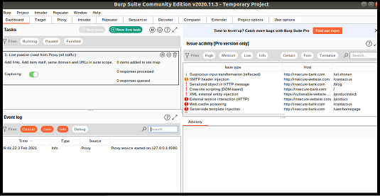
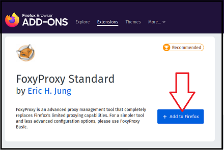
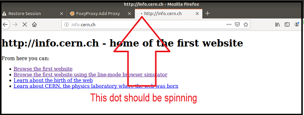

## Activity File: Burp Suite Setup 

- In this activity, you will continue your role as an application security engineer with Replicants.

- So far, you've manually tested the company's main production website and confirmed both front- and back-end component vulnerabilities.

- Now your manager would like you to test for vulnerabilities, like session hijacking, that require more advanced tools to exploit.

- The advanced tool you will use is the security proxy tool **Burp Suite**.

- Before you use Burp to test this vulnerability, your manager would like you to configure your Burp Suite proxy settings.

- Once configured, Burp Suite will be used in the next activity to test whether the Replicants application is in fact vulnerable to session hijacking.

### Setup

- Access Vagrant and open the terminal.

- From the command line, type `burpsuite` and press Enter.
  - This will open the **Burp Suite** application.

- On the first page of Burp Suite, select **Temporary project** from the list of options. Select Next on the bottom right of the page.
  
  - Note: If you encounter any pop-ups about updating Burp Suite, DO NOT update. Cancel the pop-up.

- On the second page, select **Use Burp defaults** from the list of options. Select Start Burp on the bottom right of the page.

  - Do not select any other options on this page. 
  
- The Burp Suite Dashboard will appear once you have successfully accessed Burp Suite. 

  - The following image illustrates the page that should be displayed:
  
  
  
 ### Instructions 
 
1. First we need to set up the proxy to capture web traffic with Burp.

    - Select the Proxy tab from the tool bar at the top of the Burp window.

    - On this page, confirm that Intercept is on. You should see a gray button that reads **Intercept is on**:

   - If the button says **Intercept is off**, click the button to turn it back on.

   - Under Proxy on the tool bar, select the Options tab.

    - Under Proxy Listeners, confirm that you have the interface `127.0.0.1:8080` set up, with the Running option checked.

     - The following image illustrates how the listener should be set up:
      
      
     
2. Next we need to set up the proxy to send traffic to Burp from Firefox.

    - Open the Firefox browser within Vagrant.
    
      - **Note**: You can open the Firefox browser from the Vagrant menu or type "firefox" in your terminal.

   - Next we need to add a free add-on browser feature called **Foxy Proxy**.

   - In your browser, search for "Foxy Proxy":

       

   - It should be the first result listed in a Google search. Select that option, which should take you to a page like the one shown in the following image:
      
       
      
   - Select **Add to Firefox**.
      
      - If a pop-up appears on the top of your screen, select **Add** to proceed.
     
   - Once you have added it, you will see the Foxy Proxy icon in the top-right corner of your browser.

      - It is a drawing of a fox, with a circle and line through it.
    
      - The circle and line indicate that it is currently not enabled.
    
    - Click on the Foxy Proxy add-on, and the application will open a box on the top right of your browser.
    
   - Within the Foxy Proxy window that opens, select Options.
    
      - Select Add on the top left, to go to the Add Proxy page.
    
      - Because we are going to add a proxy to send the traffic to Burp Suite, under Title, enter "Burp" or "Burp Suite".
    
    - On the right, update the following fields to match what we configured in Burp:

      - Proxy Type: `HTTP`

      - Proxy IP address or DNS name: `127.0.0.1`
      
      - Port: `8080`
    
    - Leave the rest of the fields blank.
   
   - Select Save on the bottom right to save your proxy.

3. Capture proxy traffic from your browser.

   - On your browser, open a new tab.

   - In your new tab, you will access the very first webpage ever created to test your configuration.

     - Enter the following URL and press Enter: <http://info.cern.ch/>.

   - The webpage should display the following information:
        
          http://info.cern.ch - home of the first website
          From here you can:

          Browse the first website
          Browse the first website using the line-mode browser simulator
          Learn about the birth of the web
          Learn about CERN, the physics laboratory where the web was born
   
   - Now let's turn on the proxy to capture requesting this webpage.

   - Click the Foxy Proxy icon again at the top of your browser..
     
     - Select the newly created proxy that you just configured: Burp or Burp Suite.

     - A check mark will appear to the left of that option once you have selected it. 

   - Now from the webpage, click on the first link: <http://info.cern.ch/hypertext/WWW/TheProject.html>.

   - Notice how, after you enter the URL, the screen turns blank and the page appears to be spinning.

     - This indicates that the HTTP request has been sent to Burp and the browser is awaiting a response:
   
      
   
4. Let's go back to Burp Suite and see if we can find the captured traffic!

    - Select Proxy on the primary tool bar.
    
    - Within Proxy, select Intercept.
    
    - Note that this is where your captured HTTP request should appear.
   
    - Look at the `Host` line of your HTTP request.
   
     - **Important**: It is very likely that your Firefox browser sends requests looking for WiFi networks to log into. You will notice this if the HTTP traffic you see shows the host as `firefox` or `mozilla`.
   
     - To prevent Burp from capturing these requests, right-click on the HTTP traffic and select **Don't intercept requests** > **To this host**.

       - This will prevent Burp from capturing future requests. 

      - You might have many of these captured update requests requests. To remove them, continue to select Drop from the Intercept page, until the host is `info.cern.ch`.
        
   - You have successfully captured the HTTP traffic request when the HTTP traffic shows the following:
    
          GET /hypertext/WWW/TheProject.html HTTP/1.1
          Host: info.cern.ch
          User-Agent: Mozilla/5.0 (X11; Ubuntu; Linux x86_64; rv:68.0) Gecko/20100101 Firefox/68.0
          Accept: text/html,application/xhtml+xml,application/xml;q=0.9,*/*;q=0.8
          Accept-Language: en-US,en;q=0.5
          Accept-Encoding: gzip, deflate
          Connection: close
          Referer: http://info.cern.ch/
          Upgrade-Insecure-Requests: 1
  
    - Note that Burp has captured and held this HTTP request before it is forwarded to the host, `info.cern.ch`.

      - This is why the loading bar on the browser tab is still spinning.

    - Select the **forward** option to forward the HTTP request to `info.cern.ch`.
    
    - Return to the browser and note that you can now see that the response was returned, as the correct webpage has been displayed.
    
    - If you have completed these steps, you have successfully completed the Burp Suite configuration steps, and in the next activity you will continue to use Burp to test for more web vulnerabilities.
  
5. **Bonus**: If you complete these steps early, repeat the same steps, except instead of <http://info.cern.ch/>, test with the following:

      - <http://google-gruyere.appspot.com/>
    
      - <https://www.hackthissite.org/>
    
      - <https://overthewire.org/>
    
___

© 2021 Trilogy Education Services, a 2U, Inc. brand. All Rights Reserved. 
