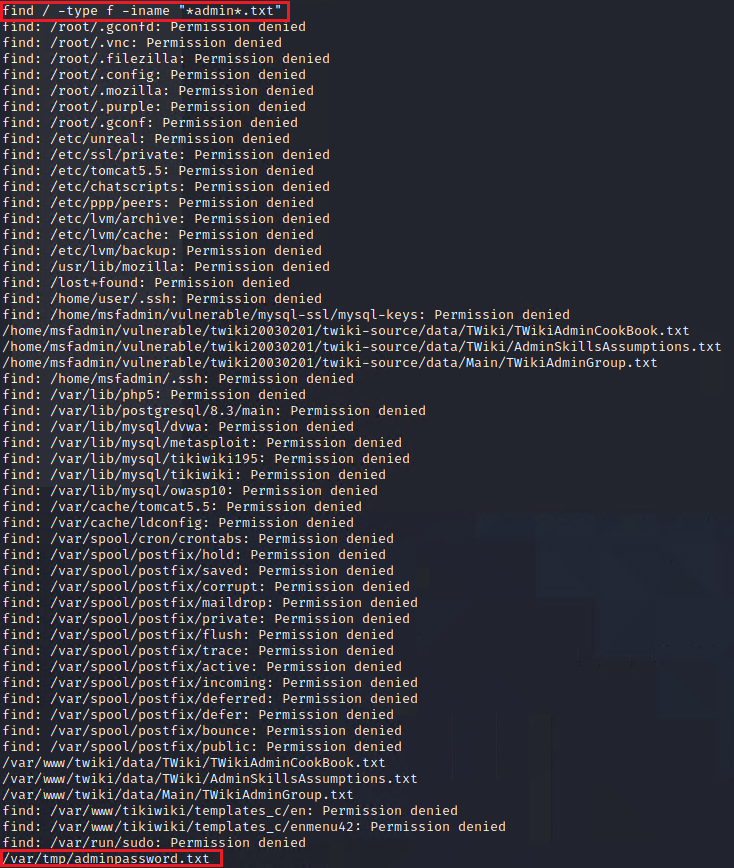
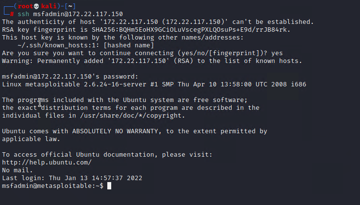

## Activity File: Privilege Escalation

You started with a low-privileged shell as the daemon user on the remote host. You needed to perform some post-exploitation tasks in order to do proper enumeration which could lead to privilege escalation. During a briefing meeting, MegaCorpOne explained that they were concerned that administrators were saving passwords in plain text on machines.

### Instructions

While operating through the reverse shell in Metasploit, use `grep` or `find` to search for any interesting files. Some keywords to search for include:

* admin
* key 
* password 
* secret

If you come across anything interesting that could be used for privilege escalation, perform the necessary actions in order to escalate your privileges from daemon to another user!

1. Use the `find` command (`find / -type f -iname "*admin*.txt"`), as the following image shows:

    

2. Run `cat /var/tmp/adminpassword.txt`, as the following image shows:
 
    

3. In a new terminal, run `ssh msfadmin@172.22.117.150`, as the following image shows:

    

**Bonus**: While logged in as msfadmin, you can escalate to root.

   - `sudo su -`

---
© 2021 Trilogy Education Services, a 2U, Inc. brand. All Rights Reserved.

