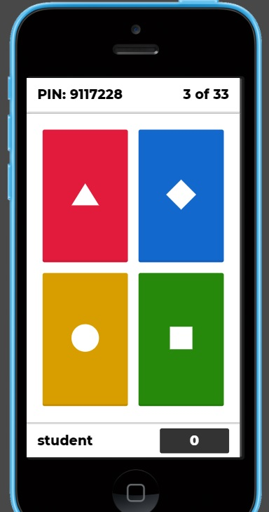

## 16.4 Lesson Plan: Post-Exploitation and Reporting

### Overview

Today, students will learn more about the Post Exploitation phase and common post-exploitation tasks, followed by reporting. Students will learn about re-performing enumeration after privilege escalation and how to gather password hashes on the machine and crack them offline with John the Ripper. They will then learn about establishing persistence by creating a back-door account. Finally, students will be introduced to reporting and to a report template, which they'll use for the final deliverable at the end of the next module. 

### Class Objectives

By the end of class, students will be able to:

- Describe the common tasks that are included in privileged post exploitation.
- Perform post-exploitation tasks, such as gathering password hashes.
- Explain how password crackers work and perform password cracking.
- Understand the importance of reporting and fill out a strong report.

### Instructor Notes

- The sample report is a Google Doc. Students should make a copy of the doc to edit instead of trying to edit the template.
- John the Ripper sometimes hangs when run in a VM with low resources. If this happens, students should restart their VM.

### Lab Environment

For this module, you will use the Pentesting lab environment located in Windows Azure Lab Services. RDP into the Windows RDP Host machine using the following credentials:

  - Username: `azadmin`
  - Password: `p4ssw0rd*`

The credentials to the Hyper-V VMs are as followed:

| Virtual Machine | Username | Password |
|-----------------|----------|----------|
| Kali            |root|kali|
| Metasploitable2 |msfadmin|cybersecurity|
| Windows 10 |.\Administrator|Topsecret!|
| WINDC01 | Administrator|Topsecret!

### Slideshow

The lesson slides are available on Google Drive here: [16.4 Slides](https://docs.google.com/presentation/d/1i4kLphYDvYzaS1aXfo5XsFCenrT4aSCjn-w6JuxKiQo/edit#slide=id.g4789b2c72f_0_6).

- To add slides to the student-facing repository, download the slides as a PDF by navigating to **File** > **Download** and choosing **PDF document**. Then, add the PDF file to your class repository along with any other necessary files.

- **Note**: Editing access is not available for this document. If you or your students wish to modify the slides, please create a copy by navigating to **File** > **Make a copy**.

### Time Tracker

The time tracker is available on Google Drive here: [16.4 Time Tracker](https://docs.google.com/spreadsheets/d/1JyGml25Ob-iu4NQHXV8X8KgMZAHHyOupf1UsRVsFQ-g/edit#gid=959666883).

### Student Guide

Share the student-facing version of this lesson plan after class: [16.4 Student Guide](studentguide.md). 

-------

### 01. Instructor Do: Post-Exploitation Tasks (0:10)

Welcome students back, and explain that today we will continue exploring the **Post Exploitation** stage of a pentest engagement and then cover the last stage, **Reporting**. 

Before beginning, let's review the important concepts that we covered on Day 3:
- **Command and control (C2)** is a framework that consists of tools and techniques that attackers use to maintain communication with compromised devices following initial exploitation.
- The C2 architecture consists of:
   - **(1) C2 server**: The attacker's server, where the attacker communicates with the compromised machines.
   - **(2) C2's agents**: The payload that is run on the compromised machine in order to open up a connection back to the C2 server.
- Once the machine has the C2's agent running on it, it is compromised and sometimes referred to as a **zombie**.
   - Multiple zombies form a **botnet**.
- **Metasploit** is a popular C2 framework that contains a suite of tools for enumerating and exploiting servers and other networked devices.
   - The main tools of Metasploit are:
     - **(1) MSFconsole**: The main interface for Metasploit, which runs on your local machine.
     - **(2) Meterpreter**: A Linux-style shell that runs on the machines you compromise.
     - **(3) `msfvenom`**: Allows the operator to craft the malicious agents and payloads that will be used to communicate back with Metasploit.
- MSFconsole is a unified interface for a variety of functions. Each of these functions is called a **module**.
   - The five main types of Metasploit module are:
     - **(1) Auxiliary modules**: Used for information gathering, enumeration, and port scanning.
     - **(2) Exploit modules**: Generally used to deliver exploit code to a target system.
     - **(3) Post modules**: Offers post-exploitation tools.
     - **(4) Payload modules**: Used to create malicious payloads to use with an exploit.
     - **(5) Encoder modules**: Used to ensure that payloads make it to their destination intact.
- **Post Exploitation** is the next phase after Exploitation and involves any actions performed *after exploitation*.
   - Post Exploitation includes three common tasks:
     - **(1) Enumeration and searching for useful data**: Similar to the enumeration process during the Reconnaissance phase, except we are enumerating and searching for data from *inside* the target after it has been exploited.
     - **(2) Persistence**: The method of attempting to maintain long-term access into your target.
     - **(3) Privilege Escalation**: The method of escalating privileges from a less-privileged user to a more-privileged user (or a low-privilege to high-privilege user).

#### Re-performing Enumeration After Privilege Escalation

Remind students of the following:
 - We finished the previous lesson by performing the post-exploitation task of **enumeration** and utilizing that data to conduct **privilege escalation**.
   - **Low-privileged** means having limited access to the machine. In Linux, this typically means not being able to browse through configuration files or other home folders.
   - **High-privileged** means having a high amount of access. In the case of root, privileges are unrestricted.

Point out that since we are now in a high-privileged or even root context, we now have more post-exploitation tasks to perform since we have more access to the file system.
 - We can now **re-perform enumeration** as a high-privilege user to see if there are any other files that may be useful.

On Linux, there are several files that would now be accessible and could offer additional information to an attacker, such as:
  - `/var/lib/mysql/mysql/user.MYD` - MySQL database file, which may contain SQL login credentials.
  - `/home/[USER]/.bash_history` - Contains a history of a user's bash commands.
  - `/home/[USER]/.ssh/` - Contains private SSH keys.

Ask students if they remember another file in Linux that is extremely sensitive and would be fruitful for an attacker.
   - The `/etc/shadow` file is one of the most sensitive files on Linux, because it houses the password hashes for all users on the machine.
   - This file is typically limited to root-level access.

Remind students that while the `/etc/shadow` file appears nearly identical to `/etc/passwd`, there is one stark difference. Illustrate this by showing the following record for the user **timmy** in each file:

- **`/etc/passwd`**: `timmy:x:1016:1019::/home/timmy:/bin/sh`

- **`/etc/shadow`**: `timmy:$6$6Y/fI1nx$zQJj6AH9asTNfhxV7NoVgxByJyE.rVKK6tKXiOGNCfWBsrTGY7wtC6Cep6co9eVNkRFrpK6koXs1NU3AZQF8v/`

Point out that instead of an `x`, like in the passwd file, the second field in the shadow file (after the `:`) contains a long, complex string: `$6$6Y/fI1nx$zQJj6AH9asTNfhxV7NoVgxByJyE.rVKK6tKXiOGNCfWBsrTGY7wtC6Cep6co9eVNkRFrpK6koXs1NU3AZQF8v/`.
 
Explain the following about this field in the shadow file:
  - The string is a password hash.
  - This hash cannot be used to log in, but can be cracked to retrieve the user's original password.
  - If a row in `/etc/shadow` contains an `!` instead of a password hash, it means the account is locked.
  - If a row in `/etc/shadow` contains an `*` instead of a password hash, it means the user is not allowed to log in.
     - Explain that this is usually implemented on a user reserved for the system, and not a human user.
  
Now that we have sudo or root access, we're able to read this file and obtain the hashes, which we can crack offline.
- Point out that the reason we want to crack additional passwords is to gain access to other accounts, which may have additional privileges across the network.

Explain that in the next demonstration, we will continue our post-exploitation activities by revisiting the tool **John the Ripper** to crack the hashes from the shadow file.

#### John the Ripper Refresher

Remind students of how to use `john` by completing the following steps from your terminal:

1. Copy the following hash into a file called `hash.txt` with the following command: 
   - `echo '$6$RhLGADK.vMFF4Gzf$G.3Y5tHVGcJ096M3gwRi1TkyxLSNbr4QJEDHQhdjUBwJX2Hf05RUAvgnHOWD4FkVEsiuc5fQGps4MegSbPD36.' > hash.txt`
2. Use `john` with the file as an argument to crack the hash. 
   - `john hash.txt`
3. Point out to students that the hash was cracked to reveal that the password is "password".
   - Note that `john` will automatically detect the hash type.
4. Remind students that `john` uses a default wordlist but can use other wordlists as well.
   - Show an example of using a wordlist called `passwords.list`:
     - `john --wordlist=passwords.list  hash.txt`	 
5. If the password doesn't show once it's cracked, type 
	 - `john --show hash.txt`

In the next activity, students will use John the Ripper to conduct a post-exploitation password-cracking activity.

Ask the class if they have any questions before proceeding to the activity.

### 02. Student Do: Password Cracking (0:15)

Explain the following to students: 

- In this activity, you will continue to play the role of pentesters conducting an engagement on MegaCorpOne.
- In the previous activity, you successfully elevated your privileges to a privileged user.
- Now, you are tasked with re-performing enumeration as a high-privileged user to see what additional information you can gather, since you can now access more files.
- Specifically, you're tasked with cracking user hashes from the shadow file.

Send students the following file:

- [Activity File: Password Cracking](activities/01_PasswordCracking/Unsolved/README.md)

### 03. Instructor Review: Password Cracking (0:05)

The purpose of this activity was to crack password hashes for additional users, which we may be able to use later on in the network.

Send students the following solution guide and use it to review the activity:

- [Solution File: Password-Cracking](activities/01_PasswordCracking/Solved/README.md)

### 04. Instructor Do: Persistence (0:15)

Now that we have completed the post-exploitation task of enumerating data after privilege escalation, we'll move on to another post-exploitation task: establishing **persistence**.

Introduce **persistence** by covering the following:

- Per MITRE, **persistence** consists of techniques that adversaries use to keep access to systems across restarts, changed credentials, and other interruptions that could cut off their access. Techniques used for persistence include any access, action, or configuration changes that let them maintain their foothold on systems, such as replacing or hijacking legitimate code or adding startup code. 
- Students might find this metaphor helpful: if a burglar broke into a building and wanted to return later without getting caught, they could find a window in the back of the building and unlock it so they could sneak back in again. 
- Persistence is its own tactic under MITRE: https://attack.mitre.org/tactics/TA0003/.

#### Persistence Techniques

"Persistence" refers to an adversary maintaining their access to the target, but there are several techniques that can be used to maintain persistence.

*Note that often, several of these techniques may be applied together.*

- **Technique 1 - Utilizing Existing Services**

   - Explain to students that persistence is less about exploitation of vulnerable software and services and more about utilizing existing system services. 
     - For example, utilizing `useradd` to create a new user as a "backdoor."
 
   - Ask students if they have any additional ideas about how to use existing system services or functions for persistence.
     - After students have shared a few ideas, introduce the following examples:
       - Creating a cron job to schedule the execution of a payload/reverse shell that provides access.
       - Creating an additional user to SSH. 
       - Creating a script that executes a reverse shell when a user logs on.
       - Uploading a web shell page to the existing webpage directory (usually `/var/www/html`).

- **Technique 2 - Blending into the Environment**

   - Emphasize to students that an important part of persistence is making sure that the attacker's work blends in with the current environment and can't be detected.
   - Knowledge of the system you're on is crucial to blending in with the environment in order to not be caught.
     - For example, if creating a backdoor account, you want to blend in with current account names instead of naming the account `backdoor`. (E.g., Use `sysadmin` to pose as a system admin or `systemd-ssh` to pose as a service.) 

- **Technique 3 - Maintaining Current Level of Access**

   - Another key aspect of persistence is maintaining your current level of access. 
     - You could, and typically should, establish persistence as a low-privilege user before privilege escalation, just in case you lose access to the machine. 
     - You should then re-establish persistence as an elevated user. 
   - Note that elevated users will have more options for persistence due to privileged access to service -- e.g., crontab.
   - It's important to establish persistence and ensure persistence with the highest privileges possible, to avoid having to re-step through the privilege-escalation phase.

- **Technique 4 - Privesc Persistence**

   - There are also opportunities for **privesc persistence**, which means purposely establishing opportunities for low-privilege users to escalate their privileges.
     - For example, the SUID bit technique: https://attack.mitre.org/techniques/T1548/001/.
     - On Linux or macOS, when the setuid or setgid bits are set for an application, the application will run with the privileges of the owning user or group. 
     - Normally, an application is run in the current user’s context, regardless of which user or group owns the application. However, there are instances where programs need to be run in an elevated context to function properly, but the user running them doesn’t need the elevated privileges.
   - As an attacker with root privileges, you could establish a privesc persistence script by creating a reverse shell in a Python script and setting the SUID bit to root.

**Summary**

Summarize the concepts covered in the previous sections and demonstration:
- In the Post Exploitation stage, after privilege escalation has been accomplished, we can now **re-perform enumeration**.
   - This is because we now have access to higher privileged files, such as the shadow file.
- **Persistence** is another post-exploitation method, which an attacker can utilize to maintain access to their target.
   - Techniques that can be used for persistence include:
     - **Utilizing existing services**
     - **Blending into the environment**
     - **Maintaining current level of access**
     - **Privesc persistence**

Ultimately, we use persistence to get back into the target and conduct further exploits. 

In the upcoming activity, students will create a different form of persistence by configuring the SSH configuration file to log back in at a later time undetected. 

### 05. Student Do: Persistence  (0:15)

Explain the following to students: 

- In this activity, you will continue to play the role of pentesters conducting an engagement on MegaCorpOne.
- In the previous activity, you accessed the shadow file and cracked several passwords in it.
- You will now conduct the post-exploitation task of persistence by adding an additional port for the SSH service to listen on, and then opening the port on a firewall.
- Then, you will create a privileged account to SSH to your new hidden port, so that you can re-access your target.

Send students the following file:

- [Activity File: Persistence](activities/02_Persistence/Unsolved/README.md)

### 06. Instructor Review: Persistence (0:05)

The purpose of this activity was to establish a backdoor to the target machine as a form of persistence in case access is lost. We also opened up an additional SSH port in case port 22 is shut down due to suspicious activity. 
- This is additionally beneficial because, when defenders look at SSH traffic, they sometimes only look at port 22. 
- Note that the technique we used did not abuse any misconfiguration or exploit, we simply used our current access for malicious purposes. 

- [Solution File: Persistence](activities/02_Persistence/Solved/README.md)

### 07. Break (0:15)

### 08. Instructor Do: Reporting (0:15)

Welcome the students back from break. Explain that while we have completed all the technical aspects of our penetration test, we have one important step left.
- We will complete the penetration test engagement by completing the most important phase, **Reporting**.

Introduce the **Reporting** phase by covering the following:
- **Reporting** is the most important phase because it's where the pentester describes their actions in words, which will eventually be communicated to stakeholders and leadership who will interpret the results.
- To the client, the quality of the report reflects the quality of the pentester's work.
   - A poorly written report could make the client believe the pentester is incompetent and the pentest was a failure, even if the pentester had several important findings. 
   - Communication is the key component in linking actions to results.
   - A well-written report will help establish the pentester's reputation and perhaps even generate repeat business, while also taking a positive step toward remediating any findings within the client's network. 
  
#### Report Writing Best Practices
 
Go over the following tips for creating a high-quality report:
 - (1) The report should be well balanced between technical and non-technical results. 
 - (2) The findings should be understandable by management, who are usually less technical, but there should also be a section that gets more technical so that system administrators can read the report and develop remediation strategies.
- (3) It's extremely important to document and log all actions taken, even if they were unsuccessful. 
   - Sometimes pentester attacks trigger alerts, and the pentester needs to be able to prove with timestamps that it was their actions that caused the alert to fire and not an actual adversary. 
- (4) The report should also contain any notable failed actions that the pentester attempted. 
  - For example, if anti-virus software successfully stopped a payload from executing, that should be documented in the report. It shows that the current defensive stack for the customer is effective, which is a form of positive reinforcement. 

#### Reporting Overview

Explain to students that in the upcoming activity, they will fill out part of the report template. 
- Remind them that we are just starting to fill it out and will finish it after the next module, so we are not aiming to complete it today.

Open [this report](https://docs.google.com/document/d/1wDIaTVbfBMQyhqnYpsTeAEPFpNj3eTDTnXDg1l8D1x0/edit#heading=h.gjdgxs). 

Before going through the blank report, point out the following to students:
- They should fill out anything that's highlighted. 
- Students will use the notes that they kept from the previous activities to complete the report.

**Page 1**
- This is the cover/title page of the report.
- Students should start by coming up with a company name and filling out their name and the date on the title page. 

**Page 4**
- Contact information should be put here. 
   - Students do not need to put their real phone number or email address and are free to make up any qualifications.
- In the **document history** table, students should keep track of any revisions made to the report. 

**Page 5**
- The introduction sets the stage by explaining why the engagement was undertaken and the expected deliverables. 
   - Remind the class that they are only responsible for completing the highlighted items.

**Pages 8 - 10**
- The executive summary provides a quick snapshot of what occurred during the engagement. 
- This section is meant to be read quickly by high-level executives or stakeholders, so technical content should be kept to a minimum.

**Page 8**
- Point out that the grading methodology serves as a rubric for scoring any findings. These should not be changed.
- Organizations use these gradings to prioritize the items they need to fix.
- This page is for logging actions taken to distinguish the pentester's actions from another, potentially real, attack. 

**Page 10**
- The executive narrative tells the story of the steps that the pentester took during the engagement. 
   - Avoid putting in too much detail, but using technical terms is OK here.

**Pages 11 - 12**
- The main vulnerability findings go in this section.

- Students should provide their best estimate for the severity of each finding.
   - To guide their severity ratings, they should consider what the impact on the company would be if the vulnerability were exploited.
- Under each finding, they can feel free to detail steps taken to reproduce it, as well as any images.

**Page 13**
- Students should fill out the MITRE map in order to map the pentester's actions to MITRE. 
  - This serves as a great visual aid, especially for executives who like a visual snapshot of what actions were successful and unsuccessful during the engagement. 
- Inform students that when they fill out the MITRE map, they should save the file, as pointed out in the sample report. 

Explain that in the next activity, students will complete this report with the findings that they've gathered during penetration testing week.

Ask the class if they have any questions before proceeding to the activity.

### 09. Student Do: Reporting Activity (0:35)

Explain the following to students: 

- In this activity, you will continue to play the role of pentesters conducting an engagement on MegaCorpOne.
- You are tasked with completing a summary report of the work you have completed this week.
- The report should be filled out as accurately as possible. Be sure to fill in all highlighted areas. 

Send students the following file:

- [Activity File: Reporting](activities/03_Reporting/Unsolved/README.md)

### 10. Week 1 Review Activity (0:45)

Explain the following to students: 

- We covered a lot of information in Week 1. For the remainder of class, we will review what we learned in a game called **Kahoot**.
- This game will provide examples of the types of multiple-choice questions that students may see on the Security+ exam. 
- If students wish to continue working on their report instead, they may do so. 
- Kahoot will be conducted as an individual competition or in groups. 

#### What Is Kahoot?

Explain that Kahoot is a web-based online tool offering the following features:
  - Displays questions and answers for students to select from in real time.
  - Keeps track of individual and team scores.
  - Keeps track of remaining time for each question.
  
As an instructor, you can view the questions and answer choices on your projected or shared screen.

- Display the following example:
  
   
  
Students can select an answer from either their computer or a mobile device.
  
- Display the following image as an example:

   

- Each answer has an associated shape or color.

- For example, in the previous example question, the answer is Accounting, Authorization, Authentication.
   - Therefore, students should select the gold circle icon.

- Remind students to be intentional about their choices. Once an answer is selected, it cannot be changed.
   
   
  
Once all students answer a question, the correct answer will be displayed.

#### Kahoot Setup  
    
Start the Kahoot Pentesting Week 1 Challenge by accessing the following link: [Kahoot Pentesting Week 1 Challenge](https://create.kahoot.it/details/4ba0fb79-f2d0-4312-96e9-f6d0800cf310).
   
Complete the following steps:   

   - Select **Play** if you are logged in. Select **Play as Guest** if you do not have a Kahoot account.

   - Select **Classic** if students are competing individually, and **Team Mode** if they are competing in groups.

     - Leave all the other options as default.

  - The next page will provide a unique code for the students to start the Kahoot challenge. (If using teams, only the team captain should complete the following.)

  - Ask students to follow the instructions on the screen by going to www.kahoot.it.

  - Enter the unique Kahoot code.
   
  - Select **Start** to begin. 

#### Kahoot Challenge Instructor Notes

After each question is answered by the students/groups, be sure to:

  - Point out how the students did.

  - Explain the answer and ask the students if they have any questions.

  - Check to make sure students are ready before proceeding to the next question.
  
  - If a student group loses connectivity, have them refresh the page. They may still be connected to the game. 

  - If they are not, take a note of their score at that time and have them log back in again as a new player. Then, combine those scores at the end of the competition.
  
  - If there is a technical issue or problem with a question, ask the judges (your TAs) to make decisions on how to assign points.

### 11. Instructor Do: End

Once the competition is complete, congratulate the winning individual or team.

Remind students that the goal of this Kahoot quiz was to provide examples of the types of multiple-choice questions that they may see on the Security+ exam. 

  - Ask the class if they have additional questions about any of the questions from the Kahoot quiz.

  - If there are additional questions:

    - Access the [quiz link](https://create.kahoot.it/details/4ba0fb79-f2d0-4312-96e9-f6d0800cf310) again. 
    - Select **Show answers** on the top-right to view all the questions and answers.

  - Send the same link to the students so they can practice this quiz again on their own time.  

Answer any remaining questions the students have. 

### 12. Instructor Do: Set Up Next Week's Lab Environment 

Let students know that in the next module, we will return to Azure Lab Services. We will use a new lab environment: Pentesting 2 (Windows).

Tell students to switch to their local computer environment. Send students the registration link for the Pentesting 2 - Windows environment. Once they click on it, the new Pentesting environment card will be added to their Azure dashboard.

**Details Around the Environment**

We can access the **Windows RDP host machine** via RDP using the following credentials:

  - Username: `azadmin`
  
  - Password: `p4ssw0rd*`

Make sure that all students are set up and can access this environment. Address any troubleshooting issues prior to the next class.

-------

© 2022 Trilogy Education Services, a 2U, Inc. brand. All Rights Reserved.  
