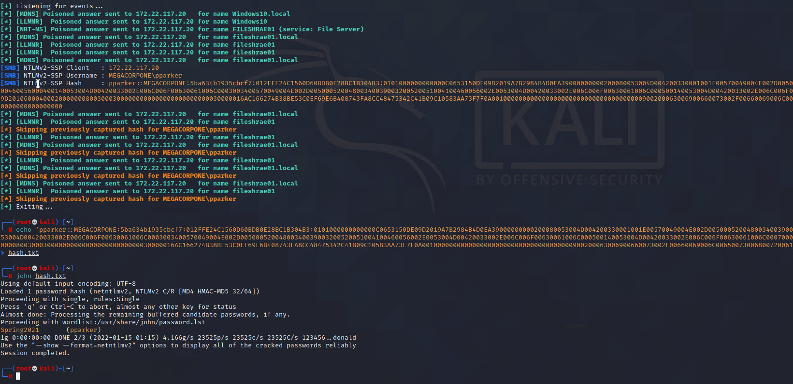

## Activity File: LLMNR Spoofing

In this activity, you will continue to play the role of a pentester conducting an engagement on MegaCorpOne.  While we successfully performed password spraying and found a set of credentials that works on a domain-joined machine, we want to see if we can find any other accounts through other methods. You will perform LLMNR spoofing in order to retrieve a set of credentials for another domain user, which you will crack offline with John the Ripper.

- You will use a tool called Responder to listen for LLMNR requests and spoof responses to unsuspecting victims on the network. 

- This activity will require you to both play the attacker and perform some typical user actions in order to generate LLMNR requests from the victim machine. 

### Instructions

1. In Kali, launch a new terminal, and run `responder` as sudo while passing in `eth1` as the device to use. 

    - `sudo responder -I eth1 -v`
	
	- Responder will now listen for LLMNR broadcasts from all devices on the network.
	
2. Wait for Responder to receive the incoming LLMNR broadcast. 

	- Once the request is received, Responder will automatically reply with an NTLM challenge asking for the password hash of the requesting user. Windows10 will receive this reply and respond with the NTLMv2 hash of the user. 
	
	- If no hashes are captured within 5 minutes, restart the Windows10 machine.
	
3. Once the password hash has been retrieved, copy it into a text file and crack it with `john`.

   

---
© 2022 Trilogy Education Services, a 2U, Inc. brand. All Rights Reserved.

