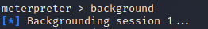
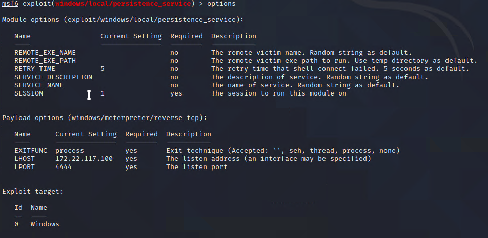
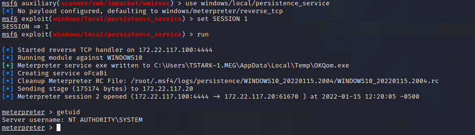

## Activity File: Windows Privilege Escalation

Using password spraying, you gained a foothold on a Windows machine in a previous activity. Now that we understand and recognize our privilege-escalation attack path, you are tasked to implement it with Metasploit. Specifically, you will escalate your privileges on the Windows machine from `tstark` to `SYSTEM` privileges, giving you full control of the entire machine.

- You will work off of the tstark user's Meterpreter session. 

- With the active Meterpreter session, you will attempt to escalate your privileges by creating a service that will run a malicious payload. 

- Remember, when a service is run, it is done with SYSTEM privileges. 

### Instructions

1. Background the Meterpreter session via the `background` command, as the following image shows:

	

2. Use the `windows/local/persistence_service` module in Metasploit.

3. View the OPTIONS and set the SESSION to your current Meterpreter session number ID. If you're unsure of the session number, type `sessions`.

		

4. Once the parameters are set, run the module.

    - `run`

5. Once complete, view the user ID.

    - `getuid`

		
	
6. Notice that the executable it uploads is a random file name. How could we make this more stealthy?

    - Name it something more legitimate, like `explorer.exe`.
---
© 2022 Trilogy Education Services, a 2U, Inc. brand. All Rights Reserved.

