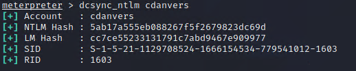

## Activity File: Credential Access

In this activity, you utilized your SYSTEM access on the domain controller to make a copy of the `NTDS.dit` file and then attempted to crack the password hashes in it.

### Instructions

You will utilize your Meterpreter session on the WINDC01 machine (domain controller). If you do not have an active session on the WINDC01 machine, refer to prior activities.

1. In Meterpreter, enter a shell then view the users on the machine via the `net` command.

	- `net users`

2. Exit the command shell, then load `kiwi` and perform `dcsync_ntlm` in Meterpreter for each of the users. Run the command `dcsync_ntlm` to see the usage.

    - `dcsync_ntlm`

    - 

3. Take each NTLM hash and place them in a text file. Using `john`, crack the hashes in the file.

    - `john hash.txt --format=NT `

    - 

---
© 2022 Trilogy Education Services, a 2U, Inc. brand. All Rights Reserved.

