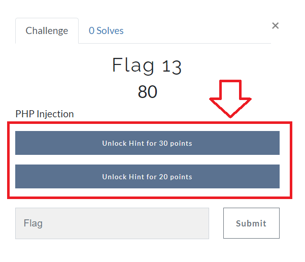

## 18.1 Lesson Plan: Project 2, Day 1: Web Application CTF

### Overview

In the second project week, students will use the skills that they learned in the Offensive Security unit to attack a fictional organization and determine its vulnerabilities. As they do so, they will look for "flags" within the organization's web application and operating systems that they'll collect in a competition-style Capture the Flag (CTF) game. On **Day 1**, students will attempt to exploit vulnerabilities in the organization's web application. On **Day 2**, students will determine what vulnerabilities exist in the organization's Linux servers, and on **Day 3**, students will attempt to exploit the organization's Windows servers.

### Daily Objectives

- **Day 1**: Students will be provided a fictional organization's web application that has a variety of vulnerabilities. Students will be tasked with finding flags as they exploit these vulnerabilities.

- **Day 2**: Students will continue to exploit the fictional organization, but will focus on the organization's Linux servers and vulnerabilities related to Linux operating systems. Students will continue finding flags during their exploitation.

- **Day 3**: Students will continue to exploit the fictional organization, but will focus on the organization's Windows servers and vulnerabilities related to Windows operating systems. Students will continue finding flags during their exploitation.

### Lab Environment

#### Lab Access

- In this module, students will use a new **Project 2** lab environment located in Windows Azure Lab Services. To access this environment, RDP into the Windows RDP Host machine using the following credentials:
  - Username: `azadmin`
  - Password: `p4ssw0rd*`

- Open Hyper-V Manager to access the nested machine, and use the following credentials for the **Kali machine**:
  - Username: `root`
  - Password: `kali`
  
- After uploading the daily CTFd flags, the administrator password on the CTFd (Capture the Flag) environment will be reset to:
  - Username: `admin`
  - Password: `ctfpassword`
  
### Module Checklist

Before beginning to prep this week's project, be sure you have the following accessible within your lab.  Please notify the curriculum team as soon as possible if any of the following is not available.

- [x] Kali
- [x] Win10  
- [x] WINDC01  

#### Docker Compose File to launch the web application

- To start today's lesson:
  - Within Kali, open up a terminal, and `cd` over to: `/root/Documents/day_1`
    - Type: `docker-compose pull` and press Enter, then...
    - Type: `docker-compose up` and press Enter.
    - Leave this window open.
  - Now, open a browser, and access the web application at: http://192.168.14.35
  
  
  

### Instructor Setup Instructions

⚠️ **Important** ⚠️ 

For this week's project, you will need to create the Capture the Flag environment that students use to submit the flags they find.  
  - This environment will also keep score for your students.
  - Be sure to set this up **before** class!
  
It is very important that students also follow the exact steps of setting up their web application. Specifically, students must pull the most current docker container before bringing it up. The instructions to enable the web application are listed in three steps in their guide.
   
**Complete the following steps to configure the web app CTF**:

1. We've created web apps for you to use in class. Select an available web app URL from the following [sheet](https://docs.google.com/spreadsheets/d/1Qe5S9qoziPqS2ftWMro6lGt4idww1OsRlxlySonMA7U/edit?usp=sharing). 

   - If you do not see any available apps, please reach out to the curriculum team. 

   - Be sure to indicate your starting date and end date of Project 2.

2. Open up your webpage, and on the **General** tab, under **Event Name** (as shown in the following image) enter "Project 2".
  
    
  
3. Under the **Mode** tab, select **Team Mode**, since the students will compete in groups.

4. Under the **Administration** tab, choose a username, email, and password for your administrator account.
  - Note that these will be removed once you update your CTF, and your new credentials will be `admin:ctfpassword`

5. Leave the defaults under the **Style** and **Date & Time** tabs.

6. Under **Integrations**, select **Finish**.

7. When the CTFd opens, select **Admin Panel**, as the following image shows:
  
    - 
  
8. Then, select **Config** and then **Backup**, as the following image shows:
  
   - 
  
9. Select the **Import** sub-tab.

10. Upload the following file: [Application Security Scavenger Hunt](Application_Security_Scavenger_Hunt.zip).  

11. Select **Import**, as the following image shows: 
  
    

     - **Note**: Sometimes, the import appears to get stuck and not progress, but it has actually completed. Simply click the **Challenges** link at the top of the screen to see if the challenges have uploaded.  

12. Validate that your webpage is set up by:
     - Accessing your webpage.
     - Logging in as the new admin user with the following credentials:`admin` : `ctfpassword`
     - Registering a test student user account to view the flags display, which should resemble the following image:
  
    
  
Refer to the following guide to learn about additional features of CTFd: [CTFd guide](https://docs.ctfd.io/docs/overview).  
  

- The **grading rubric** for this project is linked below:
  - [Project 2 Grading Rubric](https://docs.google.com/document/d/1PSiMv8_AkY31aXqlayXChbVFfE2MKTMpirMprht6s4E)

### Lab Environment

- Students will use the **Project 2** Azure Lab to complete all of this week's activities.
  - While the CTF framework is hosted externally in your Azure cloud account, the students will access it via a web browser within their Lab.

### Additional Resources

- [CTFd Guide](https://docs.ctfd.io/docs/overview)  
- [OWASP Top 10 Web Application Security Risks](https://owasp.org/www-project-top-ten/)
- [41 Common Web Application Vulnerabilities Explained](https://securityscorecard.com/blog/common-web-application-vulnerabilities-explained)
- [Web application Input Validation Cheat Sheet](https://cheatsheetseries.owasp.org/cheatsheets/Input_Validation_Cheat_Sheet.html)
- [How to Use Burp Suite for Penetration Testing](https://portswigger.net/burp/documentation/desktop/penetration-testing)
  

### Slideshow

You can access today's slides on Google Drive here: [Project 2 Day 1 Slides](https://docs.google.com/presentation/d/1BSbQKERWubZYfQZcvCnGnBklhVxSLye96axekIwFYB4/edit#slide=id.g11a629fa087_0_0).

---

### 01. Instructor Do: Welcome and Project Scenario

:important: Please make sure you created the Capture the Flag environment by following the steps in the "Instructor Setup Instructions" detailed above. 

Welcome students to class, and explain that today is the first day of Project 2. Begin by reminding students that during the Offensive Security unit, we've covered the following topics:

- Web application vulnerabilities
  - Injection vulnerabilities
    - SQL injection
    - XSS (stored / reflected)
  - Back-end component vulnerabilities
    - Directory traversal
    - LFI/RFI
  - Authentication vulnerabilities
    - Session management
    - Brute force attacks
  - Web application testing tools (Burp Suite)

- Penetration testing topics
    - OSINT
    - MITRE framework
    - Enumeration
    - Port scanning
    - Exploitation
    - Shells (bind / reverse)
    - Lateral movement
    - Persistence

- Penetration testing tools
    - Metasploit / Meterpreter
    - Nmap
    - Recon-ng
    - shodan.io
    - SearchSploit
    - Netcat 
             
- Congratulate them on covering these topics, and explain that they will apply all of these skills in our second project!

#### Project Scenario

Explain that for this week's project, students will work in groups and play the role of penetration testers hired to conduct a penetration testing engagement by **Rekall Corporation**.

Further explain this week's scenario by covering the following: 

   - Rekall has a brand new web application and several Linux and Windows servers that manage their businesses.
   - As a penetration tester hired by Rekall, you will use the offensive security skills that you've learned over the last couple of weeks to uncover Rekall's vulnerabilities and summarize the appropriate mitigations. 
   - Rekall is ready to bring their business live, and they are counting on your great work this week to protect their organization!

### 02. Instructor Do: Daily Schedules, Objectives, and Deliverables

#### Daily Structure

Next, remind the class that, as in previous project weeks, class will run a little differently this week. Each day will proceed as follows:

  - **1.** A brief introduction and overview of the daily project tasks.
  - **2.** Students will be provided a project guide and work on completing their tasks for the remaining class time.
    - The tasks will include finding vulnerabilities and being rewarded with "flags" for each vulnerability discovered.
  
Explain that while the goal of the project is to discover the vulnerabilities and recommend mitigations, each day this week will also be a Capture the Flag style competition. Students will obtain flags when they successfully exploit vulnerabilities, and they'll receive points for each "flag" that they find. The team with the most points at the end of class will be declared the winner!

#### Daily Objectives and Milestones

Introduce the high-level objectives for each day of Project 3:

- **Day 1**: Students will pentest Rekall's web application, which has a variety of web application vulnerabilities. Students will be tasked with finding flags as they exploit these vulnerabilities.

- **Day 2**: Students will continue to exploit Rekall's technical infrastructure, but will focus on the organization's Linux servers and vulnerabilities related to Linux operating systems. Students will continue finding flags during their exploitation.

- **Day 3**: Students will continue to exploit Rekall's technical infrastructure, but will focus on the organization's Windows servers and vulnerabilities related to Windows operating systems. Students will continue finding flags during their exploitation.

#### Project Deliverables

Let students know that as they work through the project, they will develop the following deliverable that they can take with them and discuss at job interviews (they will also submit this deliverable as their completed project): 

- **Penetration testing report**: Students will summarize their findings and recommended mitigations in a penetration testing summary report. 
     - They will also submit screenshots of their findings with this document.
     - A framework for the report will be provided.

  
⚠️ **Important** ⚠️ While this is a group activity, and findings can be shared amongst group members, **every student is required to submit this deliverable** in order to receive credit for Project 2!  

#### Today's Class

Let students know that the rest of today's class will proceed as follows:

- Overview of setup and rules for the Day 1 CTF.
- Students will use the remaining class time to compete in the CTF!

Take a moment to address questions before proceeding.

  
### 03. Instructor Do: Day 1 Project Overview

We will now review what students will do on Day 1 of the project. (These same instructions will be sent out in today's student activity file.)

#### Project Resources and Setup  
  
Explain the following resources, which students will use to complete today's project:
  
**1. Rekall's web application**

- You will access today's activity within your Project 2 Lab.

- Once you have logged into the Lab from your Hyper-V, select the "Kali" machine.
- Log in to Kali with the following credentials:
    - User: `root`
    - Password: `kali`
- Open a terminal, and `cd` over to: `/root/Documents/day_1`
    - Type: `docker-compose pull` and press Enter, then...
    - Type: `docker-compose up` and press Enter.
    - Leave this window open.
- Now, open a browser window, as the following image shows:
  
   
  
⚠️ **Important** ⚠️:  To make all the web application pages accessible, you must complete the **next 3 steps**:
  -  Once the browser opens, access the web application at `http://192.168.14.35`. The webpage should resemble the following image:

      

  - Once the web page loads, click the "Get Started" button. You will be notified via a popup that the CTF is ready. 

  - Click the "Click Here to Begin" button on the "About Rekall" page.

**2. CTF flag submission page**

- Within your Lab browser, open a second tab and access your CTF page.
 
    - Your instructor will provide the custom website for your CTF when it's time to begin.
- Once you have accessed this page, select "Register" on the top right to register your account, as the following image shows:
  
   

   - Remember your password in case you need to log back in!

   - ⚠️ **Important** ⚠️ - Since you are competing in groups, select one team captain to choose a group name and password and share it amongst the team members when registering. As the following image shows, the team captain will select the "Create Team" option, and the rest of the team will select the "Join Team" option:
  
   
  
#### CTF Instructions and Rules
 
**Instructions**  

Go over the following instructions for today's activity:
  - As penetration testers, you are tasked with finding all vulnerabilities in Rekall's new web application.
  - Fifteen "flags" are hidden across the web application, and a flag will display once you successfully exploit a vulnerability.
    - Note that some flags will display on the webpage as soon as you conduct an exploit, while some are hidden in other places.
  - Each flag is composed of a string of letters and numbers, and is identified by a number&mdash;e.g., "Flag 1: d8sksydasksdy".
  - Once you find a flag, enter it on the CTF flag submission page.
  - Remember to take a screenshot of each exploit you discover, as you will submit these in your summary!
  
Emphasize that while a real penetration tester doesn't look for "flags" as students will in this activity, the purpose of the activity is to move through the same steps that a penetration tester would conduct to determine an organization's vulnerabilities.  
  
**CTF Flag Submission Page**
  
Introduce the CTF flag submission page by covering the following: 
  - After accessing the CTF website, select the "Challenges" tab.
  - This webpage contains the 15 available flags hidden across the web application.
  - The flags are categorized by challenge level, including:
    - Expert 
    - Advanced
    - Intermediate
    - Easy
  -  The points awarded for a flag are indicated in the flag box. The more challenging the flag, the more points will be awarded for finding it, as the following image shows:
  
     
  
  - Selecting a flag will display important information for finding that flag, such as the vulnerability associated with that flag or guidance on where the flag is located, as the following image shows:
  
    
  
  - Once you have found a flag, select the box with that flag number, and enter in the flag, as the following image shows: 
       
    
  
 - You can view your team point total by selecting the "Scoreboard" option at the top of the page. 
  
  **CTF Hints**
 
  Explain the following about hints:
  - This CTF provides you an option to "pay" for hints with points.
  - Clicking on a flag will also display any available hints for that flag and the points it costs to unlock those hints, as the following image shows:

   

  - **Note**: You must have already been awarded the points before you can use them to "pay" for hints.
  
  **Additional Hints for Success**

  - To make all the web application pages accessible, click the following buttons:
     - The "Get Started" button on the "Home" page.
     - The "Click Here to Begin" button on the "About Rekall" page.
  - Certain flags are protected via input validation; try to find methods to bypass them.
    - Think like a hacker!
  - Use the internet to help figure out methods to exploit these vulnerabilities.
  - Feel free to use tools such as Burp Suite (installed within your VM) to help with your exploits.
    - Note that you will need to add a Proxy such as "Foxy Proxy" to your browser
    - Hint: Use Port 8081 if port 8080 isnt available
  - Certain exploits can be used to find information that will help you find other flags.
  - Most of the exploits that you'll use were covered in class, but there are some new exploits which will require additional research.
  
**CTF Rules**  

  Explain the following rules for today's activity:
  - Each group will start at the same time, once the URL for the CTF has been provided.
  - The team with the most points at the end of the allotted time will win.
  - You can use all available resources to assist you: class notes, slides, internet resources, tools such as Burp Suite, etc.
  - If you are able to exploit a vulnerability and a flag does not display, please contact your instructor or TA to receive the flag.
  - Your instructor or TA can assist with technical or lab access issues, but will not be able to provide guidance for finding the flags.
  
Ask the class if they have any questions before proceeding to the activity.  
  
### 04. Student Do: Attacking the Web Application (2:20)
  
We are ready to begin the web application CTF!
  
 - Send the following files to students: 
    - [Activity File: Capture the Flag](https://docs.google.com/document/d/1MBzHudN8MN8Gcjmjk69YnO9A-Zbhu2EjAgTvyQtX8VA/edit?usp=sharing)
    - [Penetration testing summary report](https://docs.google.com/document/d/1Kz1sOwmb82uNXJyZlox9cP7tPvDpNNcvkxREuCFBVLM/edit?usp=sharing)

- Remind the class that if they have any technical issues (e.g., the CTF or web app is inaccessible, flags don't display when they should, etc.) they should reach out to you or a TA.

**Instructor Notes**:

- Reference [the solution file](./Activities/Solved/readme.md) if any issues come up during the activity.
- Be sure to wrap up the CTF 15 minutes before class ends to leave time for a class review.
   

### 05. Instructor Review: Attacking the Web Application Review (0:15)

Begin by congratulating the winner and the second and third place finishers.
  - Offer the winning team the opportunity to show the class how they captured their flags.

Send the [solution file](./Activities/Solved/readme.md) out to the students and review it, focusing on the flags that students found the most challenging.

- Conclude the class by letting students know that in our next class, we will continue to find vulnerabilities within Rekall's technical infrastructure, but we'll shift our focus to their Linux servers.

---

© 2022 Trilogy Education Services, a 2U, Inc. brand. All Rights Reserved.    
