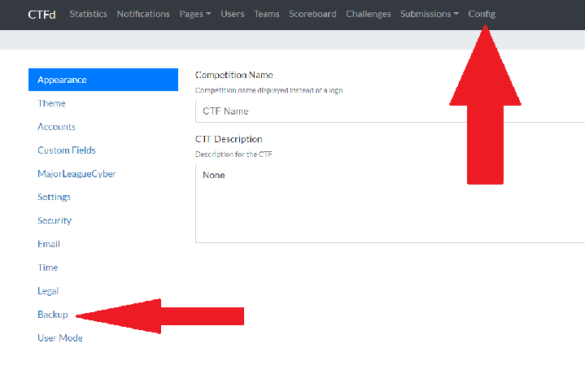
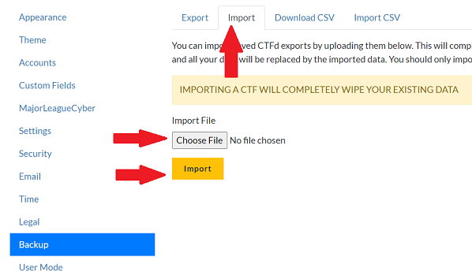
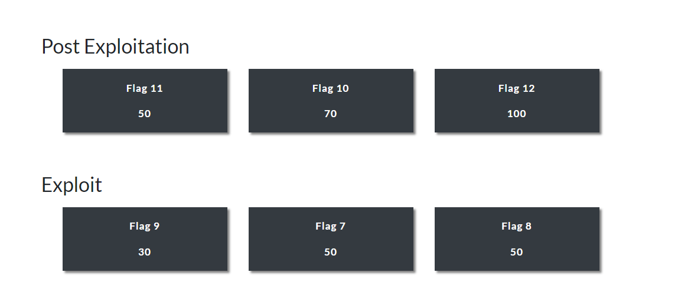
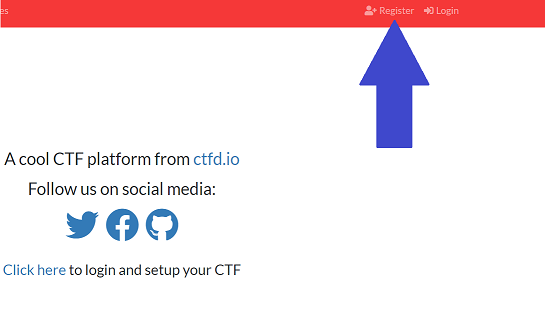
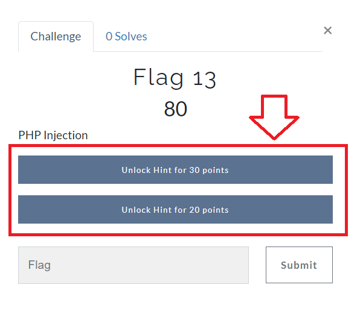

## 18.2 Lesson Plan: Project 2, Day 2: Linux Servers CTF

### Overview

On Day 2, students will continue to exploit Rekall's technical infrastructure, but today they'll focus on Rekall's Linux servers and vulnerabilities related to Linux operating systems. Students will continue finding flags during their exploitation.

### Lab Environment

- **Lab Access**

  - Students will use the **Project 2** lab environment (the same as Day 1) located in Windows Azure Lab Services. RDP into the Windows RDP Host machine using the following credentials:
    - Username: `azadmin`
    - Password: `p4ssw0rd*`

- Open Hyper-V Manager to access the nested machine, and use the following credentials for the **Kali machine**:
  - Username: `root`
  - Password: `kali`
  
  
- After uploading the daily CTFd flags, the administrator password on the CTFd (Capture the Flag) environment will be reset to:
  - Username: `admin`
  - Password: `ctfpassword`
  

- **Docker Compose File (to launch the Linux Servers that students will attack)**

  - To start today's lesson:
    - Within Kali, open up a terminal, and `cd` over to: `/root/Documents/day_2`
      - Type: `docker-compose pull` and press Enter, then...
      - Type: `docker-compose up` and press Enter.
      - Leave this window open.

### Instructor Setup Instructions

- ⚠️ **Important** ⚠️ 
  - For today's project, you will need to create a **NEW** Capture the Flag environment where students will enter found flags.  
    - Be sure to set this up 30 minutes or more before class.
    - You will continue using your personal Azure account (the one you used in Day 1) to host Day 2's CTF environment, but you will overwrite Day 1's activity with Day 2's activity.

**Complete the following steps to configure the Linux CTF**:

1. Access the same CTF website that you configured for Day 1, and log back in with your admin account.
  
2. Select **Config** and then **Backup**, as the following image shows:
  
   
  
3. Select the **Import** sub-tab.

4. Upload the following file: [Linux Scavenger Hunt](./Linux_ScavengerHunt.zip).

5. Select **Import**, as the following image shows: 
  
   

    - **Note**: Sometimes, the import appears to get stuck and not progress, but it has actually completed. Simply click the **Challenges** link at the top of the screen to see if the challenges have uploaded.

  
6. Validate that your webpage is set up by:
  - Accessing your webpage.
  - Logging in as the admin user with the same credentials from Day 1.
      - (`admin` : `ctfpassword`)
  - Logging in with a test student user account to view the flags display, which should resemble the following image:
  
   

- The **grading rubric** for this project is located in the `Resources` folder:
  - [Project 2 Grading Rubric - coming soon]

### Lab Environment

- Students will use their Azure Lab environment to complete all of this week's activities.
  - While the CTF framework is hosted externally in your Azure cloud account, the students will access it via a web browser within their Lab.

### Additional Resources

- [CTFd Guide](https://docs.ctfd.io/docs/overview)  
- [List of CVEs](https://cve.mitre.org/cve/)
- [MSFconsole Core Commands Tutorial](https://www.offensive-security.com/metasploit-unleashed/msfconsole-commands/)

### Slideshow

You can access today's slides on Google Drive here: [Project 2 Day 2 Slides](https://docs.google.com/presentation/d/1wPFz7ZO8LYjRuDyJRq2PQG3-5laCEZHxKqtXudPZUdQ/edit#slide=id.g11a629fa087_0_0).

---

### 01. Instructor Do: Welcome to Day 2

Welcome students to the second class of Project 2!

#### Project Scenario

Remind the class that for this week's project, students are playing the role of penetration testers hired to conduct a penetration testing engagement by **Rekall Corporation**.

- On Day 1, they found vulnerabilities within Rekall Corporation's web application.

Explain that in today's class, they will continue to search for vulnerabilities within Rekall's environment, but today, they will focus on Rekall's Linux servers.

### 02. Instructor Do: Objectives and Deliverables

Introduce the high-level objectives for today:

- Students will continue to exploit Rekall's technical infrastructure, focusing on the organization's Linux servers and vulnerabilities related to Linux operating systems.  
- Like they did on Day 1, students will also find "flags" during their exploitation.

Remind the students that as they work through the project, they should continue completing their required deliverable, the **penetration testing summary report**.

#### Today's Class

Let students know that the rest of today's class will proceed as follows:

- Overview of setup and rules for the Day 2 CTF.
- Students will use the remaining class time to compete in the CTF!

Take a moment to address questions before proceeding.
  
### 03. Instructor Do: Day 2 Project Overview

We will now review what students will do on Day 2 of the project. Point out that that these same instructions will be sent out in today's student activity file.

#### Project Resources and Setup  
  
Review the following resources, which students will use to complete today's project:
  
**1. Rekall's environment**

- You will access today's activity within your Project 2 Lab.
- Once you have logged into the Lab from your Hyper-V, select the "Kali" machine.
- Log in to Kali with the following credentials:
    - User: `root`
    - Password: `kali`
- Open a terminal, and `cd` over to: `/root/Documents/day_2`
    - Type: `docker-compose pull` and press Enter, then...
    - Type: `docker-compose up` and press Enter.
    - Leave this window open.
  - From your terminal, open a new tab where you can conduct today's tasks.
  
**2. CTF flag submission page**

  - Within your Kali Linux browser, open a second tab and access your CTF page.
    - Your instructor will provide the custom website for your CTF when you are ready to begin.
  - Once you have accessed this page, select "Register" on the top right to register your account, as the following image shows:
  
   

### CTF Instructions and Rules
   
**Instructions**  

  Go over the following instructions for today's activity:
  - As penetration testers, you are tasked with finding all vulnerabilities within Rekall's Linux servers.
  - As in Day 1's activity, you are also tasked with finding "flags" by exploiting these vulnerabilities.
  - The flags are hidden across various Linux hosts within Rekall's environment.
    - Many flags are hidden within the Linux hosts and titled Flag 1, Flag 2, etc.
    - Some flags are the answer to a specific challenge, such as: What is the IP of your machine?
    - Flags labeled Flag 1, Flag 2, etc. consist of a mix of letters and numbers&mdash;e.g., "Flag 1: d8sksydasksdy". 
  - Once you have found your flag or answered your question, enter the flag on the CTF flag submission page.
  - Don't forget to take screenshots of the exploits you discover, as you will submit them in your summary!

Remind the class that while a real penetration tester doesn't look for "flags" as students will in this activity, the purpose of the activity is to move through the same steps that a penetration tester would conduct to determine an organization's vulnerabilities.  
  
**CTF Flag Submission Page**
  
 Introduce the CTF flag submission page by covering the following: 
  - This webpage contains the 12 available flags.
  - Today's flag categories represent the phases of a penetration test engagement. For example:
      - **Reconnaissance**: This category contains challenges that use open source intelligence tools.
      - **Scanning**: This category contains challenges that use scanning tools, such as Nmap and Nessus.
      - **Exploitation**: This category contains challenges that use exploitation tools, such as Metasploit.
      - **Post Exploitation**: This category contains challenges that use post-exploitation tools, such as Meterpreter.
  - The points awarded for each flag are indicated in its respective flag box.
    - The more challenging the flag, the more points will be awarded.
  - Be sure to read the details in each flag box for important guidance on how to acquire that specific flag.
  - Once you find a flag, select the box with the corresponding flag number, and enter the flag.          
  - You can view your point total by selecting the "Scoreboard" option at the top of the page. 
  
**CTF Hints**
 
  - Remind students that this CTF provides you an option to "pay" for hints with points.
  - Clicking on a flag will also display any available hints for that flag and the points it costs to unlock those hints, as the following image shows:
  
   

- **Note**: You must have already been awarded the points before you can use them to "pay" for hints. 
  
**Additional Hints for Success**

  - Use the internet to help you figure out methods for exploiting these vulnerabilities.
  - Refer to your class notes and slides to help find several of the flags.
  - Certain exploits can be used to find information that will help you find other flags.
  - Most of the exploits that you'll use were covered in class, but there are some new exploits which will require additional research.
  - Trying and failing is often part of a penetration tester's work, so don't be afraid to attempt multiple exploits until one is successful.
  
  
**CTF Rules**  

  Explain the following rules for today's activity:
  - Each group will start at the same time, once the URL for the CTF has been provided.
  - The team with the most points at the end of the allotted time will win.
  - You can use all available resources to assist you: class notes, slides, internet resources, tools, etc. 
  - Your instructor or TA can assist with technical or lab access issues, but will not be able to provide guidance for finding the flags.  
  
Ask the class if they have any questions before proceeding to the activity.  
  
### 04. Student Do: Attacking Rekall's Linux Servers (2:20)
  
We are ready to begin the Linux servers CTF!
  
 - Send the following files to students: 
    - [Activity File: Capture the Flag](https://docs.google.com/document/d/1KrVkwHMyJRoD09-ktsUvpYuHpuxB148D1y_DpQu7YU0/edit?usp=sharing)
    - [Penetration testing summary report](https://docs.google.com/document/d/1Kz1sOwmb82uNXJyZlox9cP7tPvDpNNcvkxREuCFBVLM/edit?usp=sharing)

- Remind the class that if they have any technical issues (e.g., the CTF or Rekall environment is inaccessible, flags don't display when they should, etc.) they should reach out to you or a TA.

**Instructor Notes**:

- Reference [the solution file](./Activities/Solved/readme.md) if any issues come up during the activity.
- Be sure to wrap up the CTF 15 minutes before class ends to leave time for a class review.
   

### 05. Instructor Review:  Attacking Rekall's Linux Servers Review (0:15)

Begin by congratulating the winner and the second and third place finishers.
  - Offer the winning team the opportunity to show the class how they captured their flags.

Send the [solution file](./Activities/Solved/readme.md) out to the students and review it, focusing on the flags that students found the most challenging.

- Conclude the class by letting students know that in our next class we will continue to find vulnerabilities within Rekall's technical infrastructure, but we'll shift our focus to their Windows servers.
---

© 2022 Trilogy Education Services, a 2U, Inc. brand. All Rights Reserved.    
