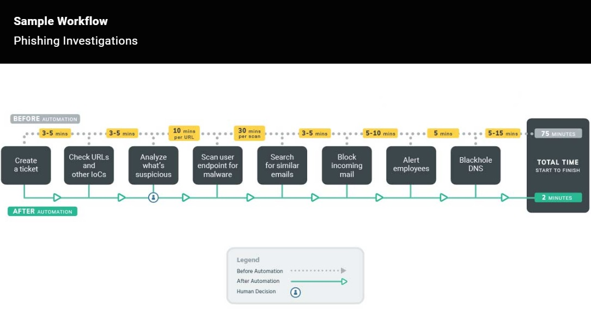

## 20.2 Lesson Plan: Advanced Security Monitoring Tools

### Overview

In today's class, students will learn about advanced monitoring tools that security professionals utilize to monitor and analyze security events. Then we will explore career paths and certifications related to Splunk and SIEM skills. We will conclude by introducing Splunk certifications.

### Class Objectives

By the end of class, students will be able to:

  - Differentiate between various advanced security monitoring solutions, such as SOARs, UBAs, and UEBAs and determine which is most appropriate for a specific security situation.

  - Understand how knowledge of SIEM software and Splunk is valued in the information security job market.

  - Continue learning about Splunk with free Splunk training courses. 

### Instructor Note

Be sure to leave time at the end of class to cover the remaining projects and the final **bootCon** presentation.

### Slideshow

The lesson slides are available on Google Drive here: [20.2 Slides](https://docs.google.com/presentation/d/1Daqwb7LcuRUgCsVZI2FR7hNzrXDMNCuZ2dwscCFT-0M/)

- To add slides to the student-facing repository, download the slides as a PDF by navigating to File > "Download as" and choose "PDF document." Then, add the PDF file to your class repository along with any other necessary files.

- **Note:** Editing access is not available for this document. If you or your students wish to modify the slides, please create a copy by navigating to File > "Make a copy...".

### Time Tracker

The time tracker is available on Google Drive here: [20.2 Time Tracker](https://docs.google.com/spreadsheets/d/1K112UYTZdbR03-TF4ZkoHtMkRN74fyaBF-4zdboa2iA/edit#gid=1145703143)

- **Note:** Editing access is not available for this document. If you or your students wish to modify the slides, please create a copy by navigating to File > "Make a copy...".

### Student Guide

- [20.2 Student Guide](StudentGuide.md)

-------

### 01. Instructor Do: Introduction to Advanced Security Monitoring Tools  (0:15)

Begin class by welcoming the students back and informing them that today we will be learning about other information security products used by security organizations.  

  - We will begin by briefly introducing Splunk's SIEM product, Enterprise Security, and then explore several other security products available in the marketplace. 

  - Then, we will focus on security careers relevant to the knowledge and tools learned in the last five classes. 
  
  - After the break, we will introduce Splunk certifications.
  
  - We will conclude the class by introducing the final project, the **bootCon presentation**!

## Splunk ES

Remind the class that over the past five classes, we covered many of Splunk's capabilities and add-on applications. 

  - Explain that while these Splunk capabilities can assist in security investigations, Splunk has a SIEM product specifically designed to assist security professionals.

Explain that Splunk's SIEM product is called **Splunk Enterprise Security** or **Splunk ES**.
  - Splunk ES provides security professionals insights from machine-generated data, such as:
    - Network devices like routers and firewalls
    - Endpoint devices like antivirus solutions
    - Vulnerability management systems like Nessus

Explain that Splunk ES is one of the most popular add-on products for security professionals as it has pre-built dashboards, reports and built-in features:

Splunk ES features allow you to:
  - Identify, prioritize, and investigate security events.
  - Gain insights into security events.
  - Monitor the status of your security environment.
  - Audit your security events.
  - Navigate these tasks with a pre-built, easy-to-use interface.
  
Point to the following image to illustrate the how the Splunk ES Dashboard can be used to help monitor security events:

   
    
Point out that learning the capabilities of Splunk ES is out of the scope of this class, but if the students are interested in researching the capabilities offered by Splunk ES, they can explore the following resources on their own time:

   - [Splunk: ES Video Demo](https://www.youtube.com/watch?v=HN4zGIyi3PI)  
   - [Splunk: ES Documentation](https://docs.splunk.com/Documentation/ES)
   
## Advanced Security Monitoring Solutions  

Explain that while SIEM products such as Splunk ES provide many monitoring benefits, organizations are now integrating  **advanced security monitoring solutions** into their businesses to provide additional protection.
 
Introduce advanced security monitoring solutions by covering the following:
  
  - The core goal of all security monitoring solutions is to assist with detection of information security events.

  - Advanced security monitoring solutions provide additional benefits such as machine learning, artificial intelligence, automation and response.

  - The most popular advancements in the information security industry are:

    - User behavior analytics (UBA)
    - User and entity behavior analytics (UEBA)
    - Security orchestration, automation and response (SOAR) 
 

**UBA** is a security monitoring tool that  uses machine learning, artificial intelligence, and data processing to detect abnormalities in user activity.

  - UBA gathers information about typical user behaviors and creates baselines.
    - For example, UBA can gather information on the servers and systems that a user accesses as well as when and how frequently they do so. 

    - UBA can then create alerts for when a user's activity deviates from this typical behavior. 

    - If a user usually only logs onto a server between 9 a.m. and 5 p.m., Monday through Friday, UBA would create an alert if the user logged in on at 2 a.m. on a Saturday.

**UEBA** is a security monitoring tool similar to UBA, except it extends its monitoring to other "entities."
  - Entities can include routers, servers, and IoT (Internet of Things) devices.   

  - UEBA looks at normal user and entity behaviors, and creates alerts when users or entities show abnormal activity.
 
**SOAR**, comparable to a SIEM, automates security processes and responds to security incidents.
  - Examples of automating security processes include:
    - Creating logging.
    - Assigning priorities to security incidents.

  - Examples of responding to security incidents include:
    - Launching security investigations.
    - Threat mitigation.
   
  - Similar to a SIEM, SOAR gathers machine data from multiple entities and analyzes the data for security events.
    - SOAR uses **playbooks**, which detail the processes and response actions for specific event.

    - Playbooks are designed and configured by each organization.
      - For example, an organization can design a playbook to automate the response to a phishing incident.
        - The below image illustrates how SOAR uses a playbook to automate each step of the response.

        - This diagram also illustrates how using SOAR playbooks can decrease incident response time.

   
             
        
In the next activity, students will research the different vendors that offer these advanced security monitoring tools and learn about the different capabilities of each product.
 

### 02. Student Do: Advanced Security Monitoring Tools (0:20)

Explain the following to students:

- OMP management has approved a larger budget for the SOC to enhance the security monitoring. 
- You are tasked with researching several SOAR, UBA, and UEBA vendors to provide a summary to your management about the products you are recommending.

:globe_with_meridians: This activity will use **breakout rooms**. Assign students into groups of 3-5 and move them into breakout rooms.

Send students the following:

- [Activity File: Advanced Security Monitoring Tools](activities/05-Advanced-Security-Monitoring/Unsolved/README.md)

### 03. Instructor Do: Advanced Security Monitoring Tools Activity Review  (0:10)

In this activity, students were tasked with researching several security products and providing a summary of their findings.

Completing this activity required the following steps:

  - Researching the various security products available from a variety of vendors.

  - Selecting advanced security monitoring products from the provided sites.

  - Researching and summarizing the findings from the products selected.
  
Responses will vary. Conduct an open discussion about each students' answers. 
  
  

### 04. Instructor Do: Splunk Careers  (0:15)

Explain that we will now examine how the Splunk knowledge and tools learned over the past five days can apply to careers and certifications in the information security industry. 

  - Point out that even if an employer doesn't use Splunk, many Splunk skills can be easily applied to other vendors and similar products.

  - For example, if a security professional who is familiar with Splunk ES takes a position at an organization that uses LogRhythm, they should be able to note the similar core capabilities and quickly adapt to the different software. 
    

Explain that Splunk skills is a desireable qualification for many infosec positions. For example: 

  - **SOC analysts** work in a Security Operations department alongside security engineers. Their positions involve detecting, containing, and potentially remediating information security threats. Most SOC analysts use SIEM products, such as Splunk ES, to monitor their environment.
  
  - **Cyber threat analysts** analyze an organization's networks and applications to protect organizations from cybercriminals. Cyber threat analysts often use Splunk products to make predictions about cybercriminals and what attacks they may conduct.
  
  - **Application security engineers** can use Splunk to fix web and mobile application vulnerabilities. AppSec engineers use Splunk to analyze their application logs to assist with creating and testing their remediation.
  
  - **Network security administrators** use products like Splunk to monitor suspicious network traffic, such as DDOS attacks. They can use the findings from Splunk logs to mitigate and prevent against future attacks.
  
  - **Incident response managers** can use Splunk to monitor the status of ongoing security investigations when an incident has occurred.
  
Explain that some of these positions, such as the SOC and threat analyst, may use Splunk products as part of their primary responsibilities.

  - Other security positions, such as application security administrators, may only use Splunk for a small portion of their tasks.

  - Either way, understanding how to use Splunk is a valuable skill for information security professionals.
  
Splunk is already a required skill in many roles, and the industry demand is increasing every year.
  - Point to the following chart to illustrate the growth in demand.
  
   
   ([Source: Edureka](<https://www.edureka.co/blog/splunk-careers-big-data-jobs/>))
  
In the next activity, students will search through several job sites to find positions where Splunk is either a required skill or a primary responsibility.

### 05. Student Do: Splunk Careers (0:15)

Explain the following to students:

- For the following activity, you will search job sites for Splunk-related roles and answer provided questions about each position.

:globe_with_meridians: This activity will use **breakout rooms**. Assign students into groups of 3-5 and move them into breakout rooms.

Send students the following:

- [Activity File: Splunk Careers](activities/09-Splunk-Careers/Unsolved/README.md)

### 06. Instructor Review: Splunk Careers Activity  (0:10)

This activity illustrated the value of Splunk in the current information security job market. Students were tasked with researching jobs that require Splunk skills.

Completing this activity required the following steps:

  - Using several job sites to research jobs with Splunk skills.

  - Answering several questions on their findings.

Discuss the students' findings with an open discussion.

### 07. Break (0:15)
    

### 08. Instructor Do: SIEM Certifications  (0:15)

Welcome the students back from break and explain that, similar to other domains in cybersecurity, Splunk skills are validated through certifications. These allow candidates to prove they have the required skills to assist an organization.

- Having a certification can help a cyber professional acquire a new position or receive a promotion, and can provide networking opportunities with professionals who have similar certifications. 

Introduce the following certifications that Splunk offers:

- **Splunk Core Certified User**: Entry-level certification that demonstrates a user's basic ability to use the Splunk software.

- **Splunk Core Certified Power User**: Demonstrates a user's foundational skills with Splunk’s core software, in addition to more complex skills such as creating calculated fields and data models.

- **Splunk Core Certified Advanced Power User**: Demonstrates a user's capability to design reports, complicated searches, and dashboards.

- **Splunk Enterprise Certified Admin**: Focuses on an individual's ability to support daily administrative tasks using Splunk Enterprise software.

- **Splunk Enterprise Certified Architect**: Focuses on a Splunk administrator's role to support advanced troubleshooting, configurations, and deployments within Splunk Enterprise.

- **Splunk Enterprise Security Certified Admin**: Focuses on a Splunk administrator's role to support installation, advanced troubleshooting, configurations, and deployments with Splunk Enterprise Security environment.
  
**Instructor Note:** If the students are interested in learning more about the tracks and certifications Splunk offers, send out the following link: 
  - [Splunk: Training](https://www.splunk.com/en_us/training.html)

Explain that, like many certifications in the infosec field, most of the trainings for these certifications are expensive. Many of them cost over $2,000.
 
- Fortunately, Splunk offers many single-subject courses for free. These courses will help prepare for the **Splunk Core Certified User** certification exam. 

  - Point out that Splunk also offers free introductory course in several of their advanced monitoring tools which were covered earlier in today's class.

Explain that each student can independently complete any remaining trainings to obtain the **Splunk Core Certified User Certification**.

  - This is completely optional and up to each individual student.
  - Note that there are costs associated with several additional trainings as well as taking the exam. 
  - Send out the following [link](https://www.splunk.com/en_us/training/certification-track/splunk-core-certified-user.html) for any students interested in the requirements for obtaining the **Splunk Core Certifed User Certification**.

Explain that in the final activity of the day, students will:
  - Set up a Splunk account.
  - Register and complete several free Splunk single-subject courses towards completing a certification.

Ask the students if they have any questions before proceeding to the final activity.

### 09. Student Do: Continuing your Splunk Education  (1:00)

Explain the following to students:

- For the remainder of the class, you will register for and begin Splunk single-subject courses.

- You must register for a Splunk account and complete the certification registration.

- Once the registration is completed, you will complete several free single subject courses

Send students the following:

- [Activity File: Splunk Certification](activities/12-Splunk-Certifications/Unsolved/README.md)

### 10. Instructor Review: Continuing your Splunk Education   (0:05)

The goal of this activity was to introduce the students to the Splunk's free single-subject courses. Students were tasked with completing several free courses.

Completing this activity required the following steps:

- Registering for a Splunk account and completing the certification registration.

Encourage students, if interested, to:

 - Complete the remaining courses on their own time.
 - Take the Splunk Core certified user exam to earn their Splunk Certificate.
 
Provide class with the following resources for taking the exam:
  - [Splunk: Core Certified User Certification](https://www.splunk.com/en_us/training/certification-track/splunk-core-certified-user.html)
  - [Splunk: Journey to Getting Certified](https://www.youtube.com/watch?v=-faNAbfUPFE&feature=emb_logo)  (video)
  - [Splunk: Exam Registration Tutorial](https://www.splunk.com/pdfs/training/Exam-Registration-Tutorial.pdf)
  - [PearsonVUE: Splunk Exam Registration](https://home.pearsonvue.com/splunk)
  - [Splunk: Certification Study Guide](https://www.splunk.com/pdfs/training/Splunk-Certification-Exams-Study-Guide.pdf)
 
Answer any questions that remain.

### 11. Instructor Do: Overview of Remaining Projects and Introduction to **bootCon**

Explain that students will complete two more projects in this course:
  
  - **Defensive Security Project**: Occurs at the end of the defensive security unit. Details will be provided at the beginning of the project week.
  - **Final Project (bootCon)**: Occurs during the last week of class. We'll provide an overview now so that students can begin brainstorming and preparing for their project.

#### Final Project: **bootCon**
  
Explain that on the last day of this boot camp, students will attend a mock cybersecurity conference called **bootCon**.
  - During this conference, students will have an opportunity to showcase the skills that they have acquired throughout the boot camp.
  - Each student will be required to present a cybersecurity topic of their choice during bootCon on the final day of class. 
  
#### The **bootCon** Presentation
 
Explain bootCon presentations by covering the following:
  - Cybersecurity professionals commonly present the following to their peers:
     - Security research that they're conducting
     - Newly discovered security vulnerabilities of products, devices, software, or hardware
     - Demonstrations of the “hacks” that will exploit these vulnerabilities
     - Mitigations to protect against these vulnerabilities
  - These presentations often occur at security conferences, trade shows, and other industry events. Cybersecurity professionals commonly attend events like this to remain up to date with new technological developments and techniques.
  - Similarly, graduates of the Cybersecurity Boot Camp will have an opportunity to showcase the skills they've learned during the boot camp with a bootCon presentation.
  - Most cyber professionals present at conferences when they've found a brand-new vulnerability. However, for bootCon presentations, it is acceptable and recommended that students re-create a finding that has already been discovered.

Explain some guidelines around bootCon presentations by covering the following:
  - A bootCon presentation is NOT a research paper.  
  - While research will be required, all presentations must be tangible and demonstrable. 
  - A demonstration can either be conducted in person or in a prerecorded video that accompanies the presentation if a live demonstration isn't practicable.

Explain that each bootCon presentation should fall into one of the following three categories:

1. Exploiting a vulnerability of an IOT device.
    - For example: hacking your personal Blu-Ray Player.
2. Developing code or a program that can complete a cybersecurity task.
    - For example, developing a Python script that can automate an Nmap scan.
3. Demonstration of how a cybersecurity tool that was not covered in class can accomplish a specific goal.
    -  For example, using SET to design a social engineering campaign.
  
#### bootCon Presentation Rules and Requirements 
  
Cover the following rules and requirements for bootCon presentations:
  
1. You must submit a project summary to your instructor for approval before proceeding. The summary should be submitted with a slack message by Week 22. (***Instructor Note***: *Provide the date for your class.*) Your project summary should include:
   - Topic and title of your presentation
   - End goal or vulnerability being exploited
   - List of devices and/or technologies that will be used to accomplish the goal
   - Summary of how the devices and technologies will be used to accomplish the goal
    
   - ***Instructor Note***: *Refer to the following guide to approve your students' bootCon proposals: [BootCon Presentation Approval Guide](bootcon_approval_checklist.md).*

 2. ⚠️ UNDER NO CIRCUMSTANCE MAY ANY ASPECT OF YOUR BOOTCON PRESENTATION BE UNETHICAL OR ILLEGAL. ⚠️
   - You must perform all hacks and tests in simulated environments.
   - You must complete any network connections in your own home and/or controlled environments.
   - You may only perform IOT hacks on devices that you personally own.

3. Presentations must have a goal whose achievement you can demonstrate.
   -	For example:
        - **Goal**: Cracking WEP wireless traffic from your home router.
        - **Demonstration**: Demonstrating how you captured and cracked your wireless traffic.
   - You can either conduct your demonstration live or record it and present it while you walk through what has taken place.

4. You must submit your presentation in the form of a Google Slides deck that, at a minimum, includes the following:
   - **Cover slide**: Presentation title and team member(s) presenting.
   - **Technical background**: 
      - Explanation of why you selected the topic that you are presenting.
      - Networking, cryptographic, or security concepts applied.
      - Research steps taken.
   - **Demonstration preview**: Preview of the steps that you'll take in the upcoming demonstration.
   - **Demonstration**: A live or recorded demonstration is conducted here. 
   - **Demonstration summary**: Summary of the demonstration that you just conducted and any impact that it may have.
   - **Mitigation**: Recommendations for mitigating against the attack that you just conducted. If your presentation isn't about an attack, this is not required.

5. You will present your project on the last day of class, and your total presentation time should be 7 - 10 minutes. 
   - ***Instructor Note***: *This is our suggested time guidance, but select the appropriate time per presentation based on your class size.*
   - If you choose to form a group of 2&ndash;3 students, presentation time can be 5 minutes per student.
   - You will **additionally** have the option to conduct the same presentation on demo day after the conclusion of class.

Send the following document explaining demo day to your students: [Demo Day guide](guide tbd).
   - Note that the SSM will provide students the exact date and time details.
  
 #### bootCon Presentation Ideas and Resources
  
  - Explain that for any students who need ideas for their bootCon presenation, we have created a document that contains:
    - Sample presentations
    - List of Kali Linux tools
    - List of IOT hacks
    - Videos of hacks presented at security conferences 
  
  - Provide the following document to students: [bootCon Presentation Guide](https://docs.google.com/document/d/1OpdJfVxTdcix4RhuzrS5YcnZLHSTThM5Nzpfe0laU4s/edit?usp=sharing). 
  
  - Explain that this document contains a set of sample instructions for a **bootCon** presentation.
    - Remind students that it is completely acceptable to recreate an existing presentation, as long as they are able to demonstrate the concept themselves.
  
 - Let students know that they can reach out to you to discuss any ideas for their presentation, and remind them that their proposals are due in Week 22.
    - Ask the class if they have any questions before concluding.

-------

© 2020 Trilogy Education Services, a 2U, Inc. brand. All Rights Reserved.  
