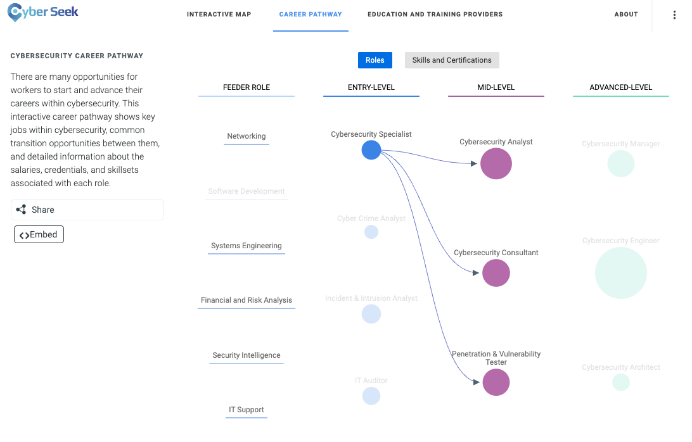
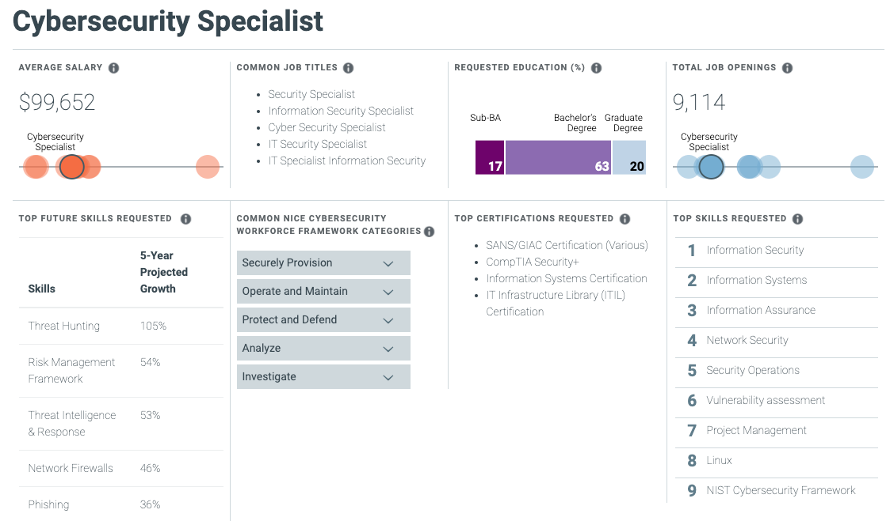

## 23.2 Lesson Plan: Security+ and Security Job Searching

### Overview

Today we'll continue on with Career Prep Week, diving deeper into the domains covered by the Security+ certification and then moving on to discuss strategies for students to best position themselves to start their cyber careers. Students will begin using online resources to map out their desired career paths and look for opportunities. They will also explore ways to develop their own network of cyber professionals.

### Class Objectives

By the end of class, students will be able to:

- Understand how each domain is divided across the Security+ exam.
- Prepare for Security+ questions from domains and topics that we have not explored in our curriculum, such as "Architecture and Design" and "Identity and Access Management."
- Correctly answer Security+ practice questions. 
- Identify a cyber career field they are interested in and map out a career path toward a desired role. 
- Begin developing their professional network. 

### Instructor Notes

- Today's Student Dos will consist of Google Form quizzes.

- Students will take practice quizzes on Google Forms. If you want to see how your class performs, each activity will provide instructor notes explaining how to create a copy of the quiz. Once you create a copy and distribute it to students, you will be able to view their responses. 

### Slideshow

The lesson slides are available on Google Drive here: [23.2 Slides](https://docs.google.com/presentation/d/1b6BHmmQpLDQyuGOe9Kz-B2aPrq_XHIFXESe8c2L_p-g/edit#slide=id.gd1f7fe79b6_0_2681)

- To add slides to the student-facing repository, download the slides as a PDF by navigating to **File** > **Download** and choosing **PDF document**. Then, add the PDF file to your class repository along with any other necessary files.

- **Note**: Editing access is not available for this document. If you or your students wish to modify the slides, please create a copy by navigating to **File** > **Make a copy**.

### Time Tracker

The time tracker is available on Google Drive here: [23.2 Time Tracker](https://docs.google.com/spreadsheets/d/1i3AYPS29ZSpb05xd0DiEi9sb-2easnYVh5vkMgrE_G8/edit#gid=0)

### Student Guide

Share the student-facing version of this lesson plan after class: [23.2 Student Guide](StudentGuide.md).

-------

### 01. Instructor Do: Welcome to Day 2 of Career Prep Week (0:05)

Welcome students to Day 2 of Career Prep Week! Explain that today, we'll continue preparation for the Security+ exam, and we'll also focus on strategies that students can use to help develop their cyber careers. As we approach the conclusion of this boot camp, students can use these skills to position themselves for success.

Before beginning, review the Security+ material that we covered in the previous class, including the following:

- Certifications are broken into three types: beginner certifications, advanced certifications, and specialized certifications.
- Information security professionals take different certification paths depending on their interests.  
- One of the most popular beginner certifications is Security+.
   - One of the best methods to prepare for the Security+ exam is the CertMaster Practice tool, which students have access to through this course.

Explain that the first half of today's class will focus on several domains on the Security+ exam and the types of questions they contain. The second half will focus on reviewing cybersecurity career paths, network building, and job search strategies.

Over the next two classes, we will cover cybersecurity career prep skills that will help students get interviews and land jobs. Topics include:

- Finding your cybersecurity career path.
- Building your cybersecurity network.
- Non-traditional job searching.
- Behavioral and technical interview tips.

Explain that in the next class, we will conduct mock interviews in which students will play the roles of both interviewee and interviewer.

Ask the class if they have any questions before proceeding to the next section.

### 02. Instructor Do: Security+ Identity and Access Management (0:15)

Begin by reminding the class that the Security+ exam consists of five domains, broken down as follows:
- 1.0 Attacks, Threats, and Vulnerabilities (24%)
- 2.0 Architecture and Design (21%)
- 3.0 Implementation (25%)
- 4.0 Operations and Incident Response (16%)
- 5.0 Governance, Risk, and Compliance (14%)

Explain that while this boot camp covered many topics across these domains, several subdomains on the exam are outside the scope of our class. 

We'll review some of the types of questions students may encounter on the Security+ exam from these subdomains now.

#### Identity and Access Management

First, we'll cover the types of questions the exam may contain on the topic **Identity and Access Management (IAM)**.

**Note**: IAM was a dedicated domain in previous versions of the Security+ Exam. While it is no longer a separate domain, it still appears in multiple domains on the latest exam. In this section, we'll consider IAM questions as they appear across various domains. 

Explain that IAM refers to the security policies that ensure that an organization's resources are only accessible by the right people, for the right reasons, at the right times.
  
- There are significant risks to incorrectly assigning access to resources.

 - For example, if an organization gives all staff access to payroll databases, they would be able to view PII and other private data of the organization and its employees. 

Across the Security+ domains, several subdomains contain questions covering IAM, including the following:

**2.4 - Summarize authentication and authorization design concepts.**

- This subdomain focuses on the basic terms and concepts associated with IAM, such as:

   - **Authentication, Authorization, and Accounting (AAA)**: The framework to best control access to an organization's resources.
     - Types of authentication factors:
       - Something you are: This includes biometrics, such as retina scanning or facial recognition.
       - Something you have: Such as tokens or key cards.
       - Something you know: Such as PINs and passwords.
      
- Pose the following question to the class and ask a volunteer to answer: 
        
   - **Of the following authentication factors, which one is a different factor than a retina scan?**
     - (A) Hand geometry recognition
     - (B) Voice recognition
     - (C) Fingerprint recognition
     - (D) Proximity cards 

   - The correct answer is **D**. Proximity cards are "something you have," while the other options are all biometric factors ("something you are").
  
**3.8 - Given a scenario, implement authentication and authorization solutions.**

- This subdomain focuses on the the application of the concepts associated with IAM, such as authentication protocols like Kerberos, CHAP, and PAP.
   - **Kerberos** is an authentication protocol developed at MIT that uses tickets.
   - **Password Authentication Protocol (PAP)** uses a standard username and password to authenticate to a remote system. It is considered insecure. 
   - **Challenge-Handshake Authentication Protocol (CHAP)** uses a three-way handshake, making it more secure than PAP.
   
- Pose the following sample question to the class:     
        
   - **Which of the following authentication protocols is considered insecure due to its lack of encryption?**
     - (A) EAP
     - (B) SAP
     - (C) PAP
     - (D) CHAP

   - The correct answer is **C**. PAP is insecure and unencrypted. 

- This subdomain also focuses on the management decisions that make sure the right people have access to the right resources for the right reasons. Types of access controls include:
    - **Mandatory Access Control (MAC)**
    - **Discretionary Access Control (DAC)**
    - **Role Based Access Control (RBAC)**

- This topic also focuses on selecting the optimal access controls based on your organization's environment.

    - For example, voice recognition is an appropriate biometric control if your office environment is relatively quiet.
    
- Pose the following sample question to class: 

    - **Which of the following biometric controls would you select for a noisy office with good lighting that needed a cost-efficient solution?**
      - (A) Voice recognition
      - (B) DNA analysis
      - (C) Fingerprint recognition
      - (D) Speech recognition
  
    - The correct answer is **C**. A and D would not be optimal in a noisy office, and B would likely be an expensive biometric solution.

       - If students ask about the difference between voice and speech recognition, explain that **voice recognition** detects speakers based on characteristics specific to the person's speech, while **speech recognition** detects the words spoken, absent of any unique accents, inflections, or characteristics of the speaker. 
       - Speech recognition is "what was said" and voice recognition is "who said it." 

- This subdomain also focuses on how user accounts are managed, including the concept of least privilege, which students should be familiar with. 

    - This is the principle that an individual or system should be given the minimum access rights needed to complete their tasks.
       - Account types:
         - User accounts: The basic, standard account type of users at your organization. These accounts are usually limited in privileges.
         - Guest accounts: Allow non-employees to have limited access to your organization's resources.
         - Privileged accounts: Have greater access than user accounts and are provided to managers and system administrators.
    
- Pose the following sample question to class: 
      
   - **An external auditor needs limited access to your organization. What type of account should you provide them?**
     - (A) Guest Account
     - (B) User Account
     - (C) Sudo Account
     - (D) Service Account
        
   - The correct answer is **A**. You would provide a guest account to a non-employee who needed limited access.
     
In the next activity, students will take a mini quiz that includes multiple-choice and PBQ questions from these topics.

### 03. Student Do: Security+ Identity and Access Management (0:15)

Explain the following to students:

- In this activity, you will take a quiz containing PBQs and multiple-choice questions covering Identity and Access Management.

- You are tasked with completing all of the questions in the allotted time.
 

Send students the following:

- [Activity File: Identity and Access Management Quiz](Activities/01_IAM/Unsolved/Readme.md)

  
**Instructor Note:** If you would like to see students' scores, make a copy of [this version of the quiz](https://docs.google.com/forms/d/15acK0ltBnyE1UkJybUn1k9LhK1_SigBouqqlwjyLQo0/edit?usp=sharing).

  - After opening the copy-able quiz, click the three-dot icon to the right of the **Send** button. 
  - Select **Make a copy**.
  - Send out your new copy.
  - To view the student scores, select **Responses** on the top middle of your copy of the quiz.

### 04. Instructor Review: Security+ Identity and Access Management Activity (0:10)

Remind students that the goal of this activity was to practice Security+ questions about Identity and Access Management, which was not covered in detail during our course.  Students were tasked with completing an online quiz that contained both performance-based and multiple-choice questions.

Students should be able to see their scores after submitting their answers and clicking **View Scores**. 

You can also send students the following pre-filled solution form: [Solution Guide: Identity and Access Management Quiz](https://docs.google.com/forms/d/e/1FAIpQLSd6_wq4RgCBffUs8FQp1Knp_W_MeWi8wM6eGPMqkmBO9Ql9Ig/viewscore?viewscore=AE0zAgA3OlnOmtOjFrNlAbvN-tCOgMwrB2_CsM2R3HNQiEjSY9jBDH9FqhRZDkiVeHt9Qu8).

Answer any questions that remain before proceeding to the next section.
  
### 05. Instructor Do: Security+ Architecture and Design Domain  (0:15)

In this section, we'll review the Security+ Architecture and Design domain, as there are several subdomains that we did not cover in our class.

Explain that **Architecture and Design** covers the processes and controls used to protect the confidentiality, integrity, and availability of an organization's data.

Within the Architecture and Design domain are eight subdomains: 

1. Explain the importance of security concepts in an enterprise environment.
2. Summarize virtualization and cloud computing concepts.
3. Summarize secure application development, deployment, and automation concepts. 
4. Summarize authentication and authorization design concepts.
5. Given a scenario, implement cybersecurity resilience.
6. Explain the security implications of embedded and specialized systems. 
7. Explain the importance of physical security controls. 
8. Summarize the basics of cryptographic concepts.

Note that while it's important for students to be familiar with all eight subdomains, today we'll focus on the three subdomains that have not been covered in our course: 3, 6, and 7.

**Subdomain 3: Summarize secure application development, deployment, and automation concepts.**

- This subdomain focuses on the concepts and processes relevant to developing secure applications for organizations and their users.

   - Some terms that students should be familiar with include:
     - **Input Validation**: Restricts what data can be input to application fields, such as limiting non-ASCII characters.
     - Software development methodologies:
       - **Agile**: A flexible development method that allows changes to the development requirements.
       - **Waterfall**: A structured and rigid development method where each step of the development cycle depends on the previous steps.
    
- Pose the following question to the class:

   - **What is the biggest risk of outputting detailed application errors with coding details?**
     - (A) There is no risk, and it is recommended.
     - (B) Coding details could provide the developer's name.
     - (C) Coding details could illustrate vulnerabilities in the application code, which a hacker can then exploit.
     - (D) Coding details could show when the code was written.
  
   - The correct answer is **C**. Displaying the code details, such as the coding language, version, and structure, could provide vulnerability information for hackers to exploit.

#### Subdomain 6: Explain the security implications of embedded and specialized systems.

- This subdomain focuses on the security of systems that have hardware with software embedded within them.
    -  A smart refrigerator is an example of an embedded system. A smart refrigerator has software embedded within its hardware to complete specific tasks, such as monitoring temperature and determining if a filter needs replacing.

- Students should become familiar with the following terms:
    -  **Supervisory Control and Data Acquisition (SCADA)**: A system used to control technical equipment in industries such as energy, oil, and water management.
    - **Internet of Things (IoT)**: The network of devices that are connected to the internet, which are considered an extension of the internet itself. These devices include smart light bulbs, refrigerators, printers, door locks, etc.
       - IoT is an expansive term relevant to many areas, such as smart houses, research and monitoring in the healthcare industry, wearable devices such as step counters, data collection in agriculture, manufacturing, city management, and many, many more. 
    
- Pose the following sample question to class: 
      
   - **To protect their data, which type of systems are usually not connected to the internet?**
      - (A) Linux servers
      - (B) Apache web servers
      - (C) SCADA systems
      - (D) Home office networks
  
   - The correct answer is **C**. While some SCADA systems have limited connection to the internet, they are usually not connected because they run high impact systems.

#### Subdomain 7: Explain the importance of physical security controls. 

- This subdomain focuses on concepts associated with physical security processes and controls.

   - Terms students should become familiar with include:
     - **Environmental controls**: For example, HVAC systems and fire suppression systems.
     - **Physical access controls**: For example, mantraps and security guards.
     - **Physical control types**: For example:
       - **Deterrents**, such as alarms.
       - **Preventions**, such as locks or gates.
    
- Pose this question to the class: 

   - **What type of risk can a bollard protect against?**
      - (A) Fire
      - (B) Flooding
      - (C) Vehicle access
      - (D) Script kiddies
  
   - The answer is **C**. A bollard is a short post built into the ground to protect areas from vehicle access.
     
In the next activity, students will take a mini quiz with several multiple-choice and performance-based questions from the Architecture and Design domain.

### 06. Student Do: Security+ Architecture and Design Quiz (0:15)

Explain the following to students:

- You will take a quiz containing performance-based and multiple-choice questions from the Architecture and Design domain. 

- You are tasked with completing all of the questions in the allotted time.

Send students the following:

- [Google Form: Architecture and Design Quiz](https://forms.gle/1AT2r9qY2xsyAcJj7)

**Instructor Note**: If you would like to see the students' scores, make a copy of [this version of the quiz](https://docs.google.com/forms/d/1xA5U7mlsigpjrYxvWJl48kNb8p4kmZaPUB9Rb8vyLOs/edit?usp=sharing).
  - After opening up the copy-able quiz, click the three-dots icon to the right of the **Send** button. 
  - Select **Make a copy**.
  - Send out the copy.
  - To view the student scores, select **Responses** on the top middle of your copy of the quiz.

### 07. Instructor Review: Security+ Architecture and Design Activity Quiz (0:10)

In this activity, students answered Security+ questions from the Architecture and Design domain. Students were tasked with completing an online quiz which contained performance-based and multiple-choice questions.

Students should be able to evaluate their performance by clicking **View Scores** after submitting their answers. 

You can also send students the following pre-filled solution form: 
- [Solution Guide: Architecture and Design Quiz](https://docs.google.com/forms/d/e/1FAIpQLScL0jWlQxPsspGh-GZc2N6RojNi2lVyTn4NpNJ8Mk_tID_m2Q/viewscore?viewscore=AE0zAgCv-C-rr7shzIGnfWGg0iFonZ1zTIa99MwBq1ma1YPM16lGg5WJIqp6Ndyc8bYwYHY)

Answer any questions that remain before the class break. 
  
### 08. Break (0:15)

### 09. Instructor Do: Introduction to Cyber Career Paths (0:10)

Remind students that in the very first week of class, we introduced the vast number of domains and specialties that exist in the cybersecurity industry.

Display the cybersecurity domains map on the slide as a refresher.

As we moved throughout the course, we highlighted roles relevant to the particular skills and domains that we were learning. Remind students of the relationship between these different career paths and the certifications that we covered on Day 1 of Career Prep Week.

- Hopefully, students have started thinking about which cyber domains and positions they are most interested in.
 
Understanding and mapping out career paths is an important way for students to begin their job search.  
 
If you ask a cyber professional how they found their way into the industry, many will share one of following responses:
- They started in careers outside of IT. 
- Before entering a cyber-specific role, they had to work in one or many other IT roles. 
  
#### Finding Career Paths

Provide the following resources to assist students in exploring some common career paths:

- [Cyberseek](https://www.cyberseek.org/pathway.html) provides information about supply and demand in the cybersecurity job market. 

  - Clicking on any of the featured roles will display helpful information, such as number of job openings, average salaries, and desired skills and certifications, as the following images show:    
   
 
  
 

- [LinkedIn](https://www.linkedin.com/) shows real professionals' career pathways and development. 

  - In the next activity, students will use LinkedIn to research several cybersecurity professionals career paths.
 
### 10. Student Do: Career Paths (0:10)

Explain the following to students:

- In this activity, you will use LinkedIn to research the career paths of several cybersecurity professionals.

- Find five InfoSec professionals who are currently working in a cybersecurity role that you're interested in, and document their career path based on their LinkedIn pages. 

Send students the following:

- [Activity File: Career Paths](Activities/01_Career_Paths/Unsolved/Readme.md)

### 11. Instructor Review: Career Paths Activity (0:05)

This activity illustrated the various career paths that cybersecurity professionals take to reach different positions. Students were tasked with identifying a cyber career field that they're interested in, finding five professionals working in that field, and documenting their career paths.

Note that there is no formal solution file. Each student will likely have different findings depending on the career field and cyber professionals they selected.

- Ask several students to share their findings with the class.

Answer any questions that remain before proceeding to the next section. 

### 12. Instructor Do: Cyber Networking (0:10)

Explain to the class that one of the best methods for landing a cybersecurity job is to build and connect with a **cyber network**.

  - Explain that the cybersecurity industry, while growing each year, is still a tight-knit, highly connected group of professionals.
  
Explain that establishing connections and building your network can help in the following ways:

- Through connections, you can meet other industry professionals, many of whom are actively hiring.
  - Hiring managers often circumvent the traditional job posting process and hire from personal recommendations.

- Networking can provide resources for specific cyber domains.
  - For example, if you need to find a mobile forensic specialist and have a large network, it's likely that your network contains the specialist you need. 

- Connecting with professionals who are associated with trusted third-party companies and vendors can give you access to better pricing and personalized service. 
  - For example, a contact who works for a SIEM vendor could come in handy if you are looking for SIEM products for your organization. 
  
Explain that it may feel challenging to break into a cyber network or connect with cyber professionals. 

- Point out that just by joining this class, students have already formed a cyber network consisting of the students and TAs in the class.

- Recommend that students connect with one another through LinkedIn if they haven't already.
  
Explain that the best way to build their network is to join local cyber groups, chapters, and professional associations. 

  - Many of these have members who are also very new to the industry.
  
The benefits of joining local cyber groups include:
- Regional specificity
- Welcoming attitude towards new professionals
- Monthly meetings, trainings, and social events
- Inexpensive or free membership and event cost

While many groups are offered for general cyber networking, there are also groups with specialized focuses, such as:

- Groups that emphasize certain technologies, such as cloud security groups like Cloud Security Alliance (CSA).

- Groups that focus on specific industries, such as banking and finance security groups like Financial Services Information Sharing and Analysis Center (FSISAC).

- Groups that connect people from specific demographics, such as Women in CyberSecurity (WiCS).

Explain that in the next activity, the students will be tasked with researching (and hopefully joining) their local cyber groups, chapters, and associations.

### 13. Student Do:  Building Your Cyber Network  (0:15)

Explain the following to students:

- In this activity, you will build your cyber network by finding information security groups or chapters local to your area.

- You must first research what local chapters exist in your area.

- A list of possible groups and organizations to chose from is included in the activity.

- You will select one or two that you are interested in joining, and answer several questions about your findings.

Send students the following:

- [Activity File: Building Your Cyber Network](Activities/02_Cyber_Network/Unsolved/Readme.md)

### 14. Instructor Review: Building Your Cyber Network Activity (0:05)

Hopefully students were able to find and join cyber groups, networks, and chapters in their local areas.

There is no formal solution file as each student will likely have different findings depending on their location and the chapters or groups they are interested in. Ask several students to share their findings with the class.

Answer any questions that remain before proceeding to the next section.

### 15. Instructor Do: Non-Traditional Job Searching (0:10)

While networking is an excellent way to increase your chances of landing an interview, it must be combined with additional job searching approaches. 

Explain that job searching requires casting a large net. The wider and more diverse your search, the more likely it is you'll find something. 

Now we'll discuss some traditional and non-traditional job searching methods.

#### Traditional Job Search Methods

Traditional job search methods include: 
- Searching websites like Indeed, Dice, and Monster.com.
- Searching for open positions on LinkedIn.
- Working with a recruiter. 

These methods are popular because of their comparatively easy application processes and the clarity of details in job postings.  

- However, this simplicity means you are often one of thousands of applicants. 

- The person reviewing the job applications will only know you by the information on your resume or job profile. 

Due to these limitations, cybersecurity professionals often use non-traditional approaches for finding open positions in addition to traditional approaches.    

#### Non-Traditional Job Search Methods

Cybersecurity professionals often use their creative thinking skills to "hack" the traditional approaches to job searching. These hacks include:

- Proposing that an employer create a position for your skills. 
    - You can share your observations of the organization's challenges or areas of need, and how your skills can address them.
    - This is most successful with organizations where you have a personal connection.
    
- Sharing your skills on platforms beyond your resume and LinkedIn.
    - Create blogs, custom websites, and videos to advertise your skills and find potential employers.

- Attending cyber events in which the primary purpose of the event is not job searching.
    - Increase your odds by attending cyber trade shows and conferences where you are one of fewer individuals looking for open positions.

- Reach out directly to the real decision maker at an organization. We'll discuss this more in a moment. 

Ask the class if they have used or can think of any other non-traditional job search methods.

#### Contacting Team Managers and Decision Makers

Recruiters and talent acquisition staff often manage an organization's hiring process. But they are the gatekeepers, not the ones who make final hiring decision. 

- The final hiring decisions are typically made by the managers and cybersecurity department leaders. These managers are also valuable resources for insight and information about working in the industry. 

A quick LinkedIn search can help you find these personnel.

  - Navigate to LinkedIn and run a search with the following format:
    - Cyber Manager [Company] [City] OR Security Director [Company] [City]
    - For example: Cyber Manager Microsoft Chicago

- Review the results, and try to find someone who seems responsible for hiring, building, and managing the cybersecurity team. 

Once we find this person, we can introduce ourselves with a message similar to the one below. 

  - Note that this is a soft first introduction, with no specific mention of open positions. That can be discussed in future meetings.

    Hello [First Name],

      I’m [Your Name], an aspiring cybersecurity professional transitioning from a career in [previous career]. As I make this transition, I am mapping out my job aspirations and pathways. I came across your profile and wanted to reach out to you because of your [success in X field/other reason that this person's career interests you]. 

      I [recently graduated/am about to graduate] from the cybersecurity boot camp at [your school], where I studied offensive and defensive security, web application security, and governance and compliance. I am also currently working [or worked] on some exciting new projects, including [one-line project description].

      If you have a few minutes, I would love to pick your brain about how you got started, what you do at [company], and how you maintain your expertise. Let me know if you’re available for a quick coffee or phone/Zoom call sometime.

      I look forward to hearing from you and appreciate your time either way!

      Thanks and best,

      [Your Name]

      
Explain that in the next activity, students will get to apply this non-traditional job search method by finding decision makers at organizations in their local area. 
      
### 16. Student Do: Hacking Your Job Search (0:10)

Explain the following to students:

- In this activity, you will "hack" your job search by applying non-traditional job searching methods.

- By finding the decision makers in an organization, you can unlock a more direct and effective application pipeline.   

- Once you find the person in charge, create (but don't send) an email introducing yourself. 

- Exchange composed emails with a partner, who will proofread and provide feedback. 

- At a later time, when your resume and LinkedIn profile are ready, you can send the email. 

Send students the following:

- [Activity File: Hacking Your Job Search](Activities/03_Hacking_Your_Search/Unsolved/Readme.md)

### 17. Instructor Review: Hacking Your Job Search Activity  (0:05)

Emphasize that once students' other job search materials are ready, they will be able to send those emails and hopefully establish new contacts in their cyber network. 

There is no formal solution file, but encourage students to continue drafting these emails as they prepare to search for jobs. 
 

Explain that in the next class we will look closely at the hiring process and practice technical and behavioral cybersecurity interviews. 

Answer any questions that remain before wrapping up the class.

Remind students that the next class will focus on mock interviews and preparing for the interview process. 

-------

© 2022 Trilogy Education Services, a 2U, Inc. brand. All Rights Reserved.  

