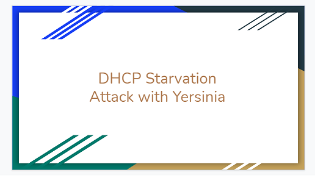
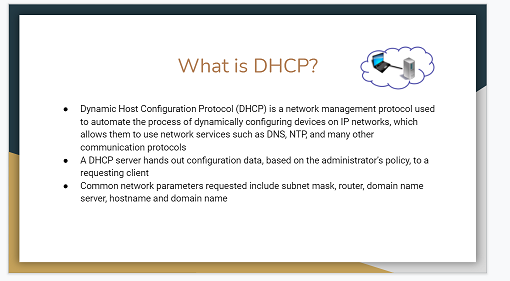
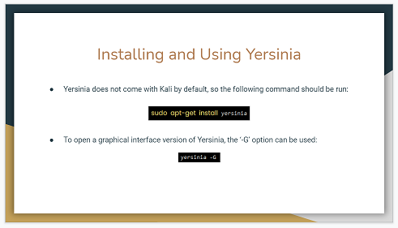
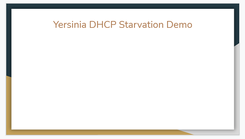
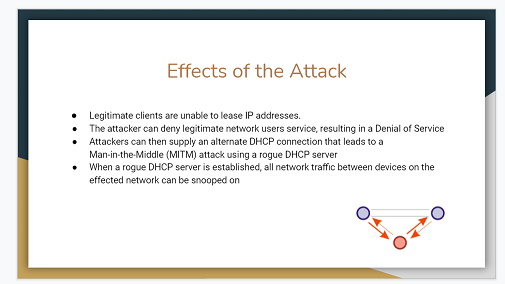
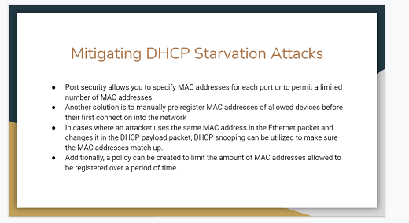

## 24.1 Lesson Plan: Project 4: Introduction to bootCon

### Overview

This week, students will conclude their cyber cohort by participating in a cyber class conference, called **bootCon**. During the week, students will put together their own unique cyber presentations to showcase the skills they've learned, and they'll present them on the last day of class.

### Daily Objectives

- **Day 1:** Today, students will learn the value of communication in the cybersecurity industry. Additionally, they'll be re-introduced to the **bootCon** conference and the rules for their presentations. Students will begin to research and put together their presentations.
- **Day 2:** On Day 2, students will receive guidance for a successful **bootCon** presentation. They'll use the remaining class time to finish putting together their presentations.
- **Day 3:** On Day 3, students will present their projects to their classmates at **bootCon**.

### Instructor Notes

- ⚠️ **Important** - Consider the final class time and the size of your class when determining the recommended presentation time for each student or group.

### Additional Resources

- [Cyber Class Conference Presentation Guide]( https://docs.google.com/document/d/1OpdJfVxTdcix4RhuzrS5YcnZLHSTThM5Nzpfe0laU4s/edit#heading=h.tcl6yuqrifjp)
### Slideshow

The slideshow for today is located on Google Drive here: [Project 4 Day 1 Slides](https://docs.google.com/presentation/d/1Mncax6Wm46sc5Z8MIoTC6J4PVRWc4cau7a--Qrko4ao/edit#slide=id.g4789b2c72f_0_6). 

---

### 01. Instructor Do: Welcome and Introduction to Cyber Communication

Welcome students to class, and congratulate them for making it to the final week! Remind the class of how much they have learned over these last 23 weeks, including:
- Core fundamental skills of terminal, operating systems, networking, cryptography, and cloud
- Offensive skills such as web application attacks and penetration testing
- Defensive skills such as SIEM and attack defense

Explain that while proficiency with these skills is important for success in the cybersecurity industry, it is also imperative that cyber professionals can clearly communicate cyber issues to audiences including customers, management, board members, and peers.
  - Often this audience is non-technical, and the ability to communicate complex cyber issues in layman's terms is crucial.

Introduce the following scenario, where clear communication is critical:

- For example, suppose an application security professional at a bank is tasked with finding vulnerabilities in their online-banking application. If this AppSec employee discovers a SQL injection vulnerability on their bank's website that may have already been exploited, they may be tasked with several important communications:

  - **1.** Explaining the issue to their management team and executives at the organization and providing a high-level overview of the vulnerability and the risk/impact of not mitigating it quickly.
  - **2.** Explaining to the legal team what data may have been exposed, so the legal team can begin to determine the legal implications.
  - **3.** Communicating to the developers where the vulnerability exists within the web application, so they can implement a fix to their code.

Clear communication can help lead to an efficient and quick resolution to a security issue. 
- Poor communication, on the other hand, could adversely impact the business by guiding business partners to make incorrect or ineffective decisions.
- For example, if the AppSec developer doesn't clearly present the data that may have been exposed to their attorneys, the organization may not properly disclose breached data, which could have significant legal implications.

While the ability to communicate complex cyber issues to a variety of stakeholders is one aspect of cyber communication, cyber professionals may also need to clearly communicate technical topics for other reasons, including:
  - Presenting proposals for ordering new technology to management.
  - Explaining their InfoSec and technical experience in job interviews.
  - **Presenting cybersecurity research** to their peers.

#### Cybersecurity Research Presentations

Explain that cybersecurity professionals commonly present the following to their peers:
- Security research that they're conducting
- Newly discovered security vulnerabilities of products, devices, software, or hardware
- Demonstrations of the “hacks” that will exploit these vulnerabilities
- Mitigations to protect against these vulnerabilities

These presentations often occur at security conferences, trade shows, and other industry events. Cybersecurity professionals commonly attend events like this to remain up to date with new technological developments and techniques. These events can also provide good networking opportunities, which can help when job searching both early and later on in your career. 

We'll review a few of the more popular cybersecurity events next. The end of the next section contains a list of links for some popular conferences that you can share with any students who may be interested in attending.

**Larger/Global Cyber Events**

Introduce the following popular cybersecurity events and conferences where these presentations take place:
- **Black Hat**: Black Hat is one of the largest cybersecurity events, typically held in Las Vegas every year in late summer. This event brings executives, cyber practitioners, and cyber sales teams to show off their newest products to the industry. Additionally, it includes many talks about cyber vulnerabilities and their mitigations.
     - Note that Black Hat holds other global events in Asia and Europe.
- **DEF CON**: DEF CON occurs in Las Vegas immediately after Black Hat. DEF CON is not only considerably less expensive (typically around $300), it is also very informal. Similar to Black Hat, DEF CON offers many talks about vulnerabilities and their mitigations.
     - Note that many consider the Black Hat/DEF CON period "hacker summer camp."
- **RSA**: RSA is a formal cybersecurity conference held annually in winter in San Francisco. It is typically attended by cyber management and executives. RSA also offers many talks about cyber vulnerabilities and mitigations.

**Smaller/Local Cyber Events**

Explain that while those events are popular and contain many presentations, students may not be geographically close to them. However, many smaller, local cyber conferences exist, and students may be able to find one that's available in their area. Some smaller conferences include:
- **Bsides**: Per Bsides, "each BSides is a community-driven framework for building events for and by information security community members." Bsides often hosts local conferences where speakers discuss security issues. The audience is typically local and smaller.
- **Local OWASP and DEF CON meetups**: Local chapters of groups such as OWASP and DEF CON may hold smaller monthly presentations.
- **Independent local security events**: There are also many independent conferences all over the world.

**Conference Links** 

Share the following list of links if any students are interested in attending or learning more about these events:

- **Black Hat**: https://blackhat.com
     - (Make sure to inquire about student rates.)
- **DEF CON**: https://defcon.org/ 
- **RSA**: https://rsaconference.com/
     - (Make sure to inquire about student rates.)
- **Local Bsides events**: http://www.securitybsides.com/w/page/12194156/FrontPage
- **Local DEF CON chapters**: https://forum.defcon.org/social-groups
- **Local OWASP chapters**: https://owasp.org/chapters/
- **Comprehensive list of cyber events around the world**: https://infosec-conferences.com/

Summarize that this should illustrate how many opportunities students have to attend cybersecurity events, and what an important part of the industry these events are.

Ask the class if they have any questions before introducing the final project.

### 02. Instructor Do: Introduction to bootCon

All of the conferences and events that we just discussed provide great learning opportunities. And during our final week of class, students will get an opportunity to hold their very own class cyber conference, called **bootCon**, where each student will present to their classmates!

#### bootCon Presentations

(Re)Introduce the **bootCon** presentation by covering the following:
- As discussed earlier in the course, on the last day of class, we will hold a cyber class conference called bootCon.
- Each student will have an opportunity to showcase the skills that they learned during the boot camp with a presentation.
- If students have elected to present as a group, each student must participate during the presentation. 
- Most cyber professionals present at conferences when they've found a brand-new vulnerability. However, for bootCon presentations, it is acceptable and recommended that students re-create a finding that has already been discovered.

Explain some guidelines around bootCon presentations by covering the following:
  - A **bootCon** presentation is NOT a research paper.  
  - While research will be required, all presentations must be tangible and demonstrable. 
  - A demonstration can either be conducted in person or in a prerecorded video that accompanies the presentation if a live demonstration isn't practicable.

  Each bootCon presentation should fall into one of the following three categories:

  - **1.**	Exploiting a vulnerability of an IOT device.
      - For example: hacking your personal Blu-Ray Player.

  - **2.**	Developing code or a program that can complete a cybersecurity task.
      - For example, developing a Python script that can automate an Nmap scan.

  - **3.**	Demonstration of how a cybersecurity tool that was not covered in class can accomplish a specific goal.
      -  For example, using SET to design a social engineering campaign.
  
#### bootCon Presentation Rules and Requirements 
  
 Cover the following rules and requirements for bootCon presentations:
   
-  **1.** If you haven't yet received approval for your project, make sure to submit your project summary to your instructor for approval before proceeding. Your project summary should include:
   - Topic and title of your presentation
   - End goal or vulnerability being exploited
   - List of devices and/or technologies that will be used to accomplish the goal
   - Summary of how the devices and technologies will be used to accomplish the goal
  
- **2.** ⚠️ UNDER NO CIRCUMSTANCE MAY ANY ASPECT OF YOUR BOOTCON PRESENTATION BE UNETHICAL OR ILLEGAL. ⚠️
   - You must perform all hacks and tests in simulated environments.
   - You must complete any network connections in your own home and/or controlled environments.
   - You may only perform IOT hacks on devices that you personally own.

- **3.** Presentations must have a goal whose achievement you can demonstrate.
   -	For example:
        - **Goal**: Cracking WEP wireless traffic from your home router.
      
        - **Demonstration**: Demonstrating how you captured and cracked your wireless traffic.
   - You can either conduct your demonstration live or record it and present it while you walk through what has taken place.

- **4.** You must submit your presentation in the form of a Google Slides deck that, at a minimum, includes the following:
   - **Cover slide**: Presentation title and team member(s) presenting.
   - **Technical background**: 
      - Explanation of why you selected the topic that you are presenting.
      - Networking, cryptographic, or security concepts applied.
      - Research steps taken.
   - **Demonstration preview**: Preview of the steps that you'll take in the upcoming demonstration.
   - **Demonstration**: A live or recorded demonstration is conducted here. 
   - **Demonstration summary**: Summary of the demonstration that you just conducted and any impact that it may have.
   - **Mitigation**: Recommendations for mitigating against the attack that you just conducted. If your presentation isn't about an attack, this is not required.

- **5.** You will present your project on the last day of class, and your total presentation time should be 7 - 10 minutes. 

   - **Instructor Note**: This is our suggested time guidance, but select the appropriate time per presentation based on your class size.
   - If you choose to form a group of 2&ndash;3 students, presentation time can be 5 minutes per student.
   - You will **additionally** have the option to conduct the same presentation on demo day after the conclusion of class.
   - Note that your SSM will provide the exact date and time details.

 #### bootCon Presentation Example
 
 Explain that we will now move through a sample presentation, including all of the items that students are minimally required to include. As you proceed through the sample presentation in the slide deck, cover the following:

  - **Slide 1 - Cover Slide**: This is the cover slide, with the presentation title and team members presenting.
    - This presentation is called "DHCP Starvation Attack with Yersinia," as the following image shows:

    

  - **Slide 2, 3, 4 - Technical Background**: These slides explain the technical background of the project. They cover any protocols, cryptographic concepts, or network diagrams that are used in the upcoming demonstration.
    - Additionally, this section of the presentation can include:
      - Why you selected the topic that you are presenting.
      - Steps you took to research this topic.
    - For example, this presentation covers what the protocol DHCP is, what the attack is, DHCP starvation, and a network diagram, as the following image shows:

    

  - **Slide 5, 6 - Demonstration Preview**: These slides cover the tool that you'll use to conduct the demonstration&mdash;basically, they preview the steps that you'll take in the upcoming demonstration.
    - This presentation shows how to install and set up Yersinia, and how it will be used to conduct the attack, as the following image shows:

    

  - **Slide 7 - Demonstration**: This slide marks where the demonstration takes place. At this point, you will either demonstrate live or play a recorded video of your demonstration.
    - This presentation has a placeholder slide where the presenter showed the class how to use Yersinia to conduct a DHCP attack.  
       - **Note**: This was conducted in a safe environment not connected to any external network.

    

 - **Slide 8 - Demonstration Summary**: This slide summarizes the demonstration that was just conducted and any impact that such an attack may have.
    - For example, this presentation covered the effects of a DHCP starvation attack, as the following image shows:

    

 - **Slide 9 - Mitigation**: This slide provides recommendations for mitigating the attack, if the demonstration was an attack.  
    - If your presentation does not involve an attack, then this slide is not required.

    

Ask the class if they have any questions about the requirements for their presentations.
    
 #### bootCon Presentation Ideas and Resources
  
  - Explain that for any students who still need an idea for their presentation, we have created a document that contains:
    - Sample presentations
    - List of Kali Linux tools
    - List of IOT hacks
    - Videos of hacks presented at security conferences 

  - Share the following document with students: [bootCon Presentation Guide](https://docs.google.com/document/d/1OpdJfVxTdcix4RhuzrS5YcnZLHSTThM5Nzpfe0laU4s/edit).
  
  - Explain that this document covers some of what we reviewed earlier, and it outlines the steps a student might take for an example bootCon presentation.
    - Remind the class that it is completely acceptable to recreate an existing presentation, as long as they are able to demonstrate the concept themselves.
  

### 03. Instructor Do: Daily Schedules, Objectives, and Deliverables

#### Daily Structure

Next, remind the class that, like previous project weeks, class will run differently than usual this week.
- Explain that the first two days will proceed as follows:
  - **1.** A brief lecture (we've already done today's).
  - **2.** Students will use the remaining class time to work on their presentations.
   
⚠️ **Important** ⚠️
   
   - Students may complete this project in groups, but they are **required** to remain in class (online or in person).
   - Groups are permitted to split up the work on these projects, but each student must submit their own project deliverables.

#### Project Deliverables

Let students know that for this project, they will develop and submit the following **deliverables**, which they can take with them and discuss at job interviews:
  - Presentation slides: each student must submit the slides that their team uses for Day 3's presentation.
  - Any additional resources or documents created or prepared for the presentation, such as:
      - Recordings
      - GitHub code

### 04. Student Do: Project Presentation Preparation

Explain that for the remainder of today's class, students will work on researching and completing their presentations.

Remind the students that their projects must be approved by the instructor before they begin.

Send students into their groups, and remind them to reach out to you or your TAs if they need any assistance.

---

© 2022 Trilogy Education Services, a 2U, Inc. brand. All Rights Reserved.
