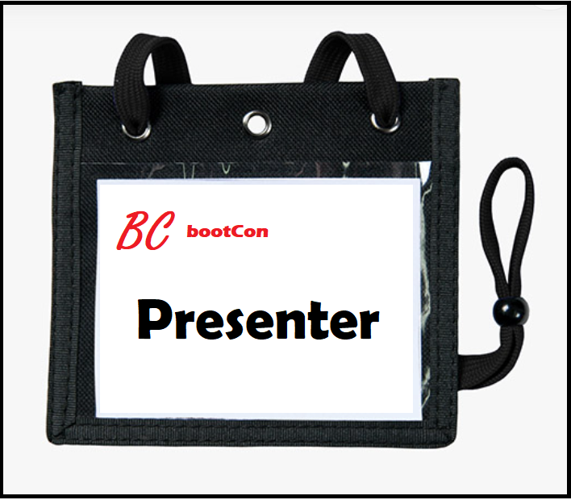

## 24.3 Lesson Plan: Project 4: Welcome to bootCon

### Overview

Today, students will conclude their cohort by presenting their final projects at the class cyber conference, **bootCon**.

### Instructor Notes

- Be sure to keep presentations running on time and be aware of remaining class time.
- Choose a method to let students know if they are running out of their allotted presentation time&mdash;e.g, a small chime, or, if using Zoom, using the "raise hand" option.
- After each presentation, introduce the next speaker and the speaker on deck.

### Slideshow
The slideshow for today is located on Google Drive here: [Project 4 Day 3 Slides](https://docs.google.com/presentation/d/15eSazThxJXC0ohqdbR1zywgPb4B7InKqqpk0qgUTe8c/edit)

---

### 01. Instructor Do: bootCon Introduction

Begin by congratulating the students on making it to the final class! Then welcome them to the **bootCon** cyber conference.
- Show students the virtual bootCon badges that they will receive as conference attendees, as shown in the following image:

    

Let students know that there will be no lecture today; the rest of class will consist of their final project presentations.

- **Deliverables**
  - Remind the students that after they present, they must submit the following project deliverables, and that **EACH STUDENT** is required to submit these deliverables:
    - **1.** **Presentation slides**
    - **2.** **Any additional presentation material, e.g., videos, GitHub pages, code, etc.**

- **Interview and Resume Guidance**
  - Point out that when networking and talking to potential employers, students can reference the work done on this project to answer specific interview questions or to demonstrate their skills within a specific domain.
  - Students can refer to the following document for guidance on how to add this project to their resume, discuss their project, and answer potential interview questions regarding this project's activities: [Interview and Resume Guidance](https://docs.google.com/document/d/1SS-cjIY51IxV4OtF8qcmjihUewd0d-He-oqvr5vy8qc/edit?usp=sharing).

Before beginning the presentations, cover the following guidelines for a successful **bootCon**:
   - Be aware of your presentation start time so that you are ready to start when you or your group is called.
   - Be aware of your allotted presentation time.
   - If you need to start wrapping up your presentation due to time limitations, your instructor or TA will give you an indication.
   - If you are using a recording, be sure to have your recording ready to play.
   - If time remains in your alloted presentation time, feel free to take your classmates' questions on your presentation.
   - Note that there will be no formal breaks during class, and the presentations will go from the beginning to the end of class time.

Ask the class if they have any questions before calling the first presenter at **bootCon**!

---

© 2022 Trilogy Education Services, a 2U, Inc. brand. All Rights Reserved.
