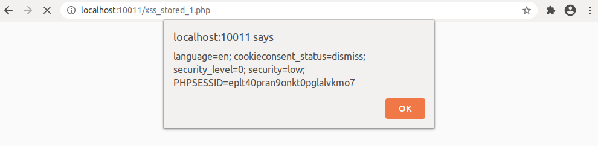

## Supplemental Lesson Plan: Web Vulnerabilities and Hardening Review

### Overview

Today's class is a contingency lesson plan intended to review the concepts of web vulnerabilities, specifically SQL injections and cross-site scripts. Today's class focuses mainly on web application penetration testing and less on defensive and mitigation strategies as students will learn to further hone their SQL and XSS techniques.

### Class Objectives

By the end of the lesson, students will be able to:

- Explain how SQL queries execute CRUD operations in SQL databases.

- Use the SQL `UNION` operator to enumerate the number of entries within a web application's original query.

- Create a malicious SQL injection payload using the `UNION` operator to pull data from another table.

- Compare hash checksums.

- Explain reflected and stored XSS attacks.

- Execute a basic `<script></script>` cross-site script.

- Create a cross-site script payload that injects from the end of a JSON object.

### Instructor Notes

:warning: This is a contingency lesson plan for when there are Azure outages. It is intended to be relatively easy to execute without the need for prep time. The content is specifically designed as a Web Vulns "1.5" lesson plan. It is a shorter lesson plan to give you time to:

- Check up on Azure status
- Ensure everyone's Vagrant machines are updated
- Review concept and material from Web Vulns Day 1

### Lab Environment 

- You and students will use your local Vagrant Ubuntu virtual machine for today's activities. 

  - Student access:

    - Username: `sysadmin`
    - Password: `cybersecurity`

- Make sure that you can bring up the container set by navigating to `/home/sysadmin/Documents/web_vulns` and running `docker-compose up`.

- Note the following about `docker-compose up`:

  - You can run the Docker-Compose container set in the background by using the `-d` (detach) argument with `docker-compose up -d`. This will free up the terminal to be used again after standing up the container set. You won't be able to see container status updates in the terminal if you have only used `docker-compose up`.

  - If you do this, you'll need to explain that you are detaching the container setup output and also that it is running in the background. 
  
  - :warning: **Heads Up**: Do *not* forget to run `docker-compose down` in any directory that you ran `docker-compose up`.

  - Once you are done with Docker-Compose for the day, run [`docker-compose down`](https://docs.docker.com/compose/reference/down/) to end the multi-container session.

#### Check Vagrant Builds

:warning:  Everyone will need to make sure that they have a Vagrant build with today's necessary set up files. Ensure that everyone has a `docker-compose.yml` file in the following directory:

- `/home/sysadmin/Documents/web_vulns`

The first two sections should take around 35 minutes to complete, so for the students that have outdated Vagrant machines, you will want to have TAs assist in getting them updated during this time.

### Slideshow and Time Tracker 

The lesson slides are available on Google Drive here: [Slides](https://docs.google.com/presentation/d/1KWP8lu2GaSGJcp5W1a22PMV-seN7z3FcVdU7r256mfk/edit#slide=id.gafe3e11ce2_1_2)

- To add slides to the student-facing repository, download the slides as a PDF by navigating to File > "Download as" and choose "PDF document." Then, add the PDF file to your class repository along with other necessary files.

- **Note:** Editing access is not available for this document. If you or your students wish to modify the slides, please create a copy by navigating to File > "Make a copy...". 

The time tracker is available on Google Drive here: [15.x Time Tracker]()

- **Note:** Editing access is not available for this document. If you or your students wish to modify the slides, please create a copy by navigating to File > "Make a copy...".

### Student Guide 

- [Student Guide](StudentGuide.md).

### 01. Instructor Do: Welcome and Overview (0:05)

Welcome students to class and remind them that in previous class we covered the following web vulnerabilities concepts:

- The OWASP Top 10, a list of the most critical and commonly seen web application vulnerabilities.
- How to modify SQL queries with `union` and `concat`.
- SQL injection (SQLi) attacks
- Cross-site scripting (XSS) attacks

Remind students that understanding injections is quintessential to learning about application security. It being one of the oldest but still relevant forms of attack. 

- In today's lesson will focus mainly on SQL injections and cross-site scripts. 

- In today's activities we will be using our local Vagrant machines to review and expand upon SQL injection and cross-site scripting attacks.


### 02. Instructor Do: SQL Review (0:30)

Explain that even though there are effective mitigation strategies against SQL injection attacks, such as input sanitization, SQL injection attacks are still prevalent. This is especially true on websites and applications that rely on old and antiquated technology or deal with financially constrained budgets.

- Send students the following article:

  - [Zdnet.com: Lone hacker Rasputin breaches 60 universities, federal agencies](https://www.zdnet.com/article/lone-hacker-breaches-60-universities-federal-agencies/)

    - _"A hacker has compromised at least 60 universities and US government organizations, utilizing SQL injections as his weapon of choice."_

Recall that successful SQL injection attacks are often the result of unpatched systems or web applications developed without security in mind.

- In the 15.1 SQL activities, we looked at crafting malicious SQL payloads and then we tested them in the DVWA web application.

- For their upcoming activity, we will test what they've learned about SQL injections. 

- We will also look into what an adversarial attacker might do once a database is compromised.

Before we get into the activity, let's review what we know about SQL and SQL vulnerabilities.

#### Database Review

Remind students about basic database concepts they should be familiar with by now:

- An SQL database is where the data within a web application is stored.

- A database's tables are structured in a column and row format, similar to a spreadsheet format, like Microsoft Excel.

- The `SELECT` statement is used to retrieve data, often in conjunction with `FROM` and `WHERE` to specify which **table** to look at and to set the **matching condition** of specific data to look for.

  - For example: `SELECT username, id FROM users WHERE id = '123'`.

Those are the basics of databases and query structure, upon which, we learned multiple ways to alter an SQL query, both for legitimate and malicious purposes.

Remind students that SQL queries will vary for each web application due to the fact that the underlying code is made by different developers. This is why there are numerous variations of injection payloads and offensive security professionals will need to try all the different kinds until they figure out which ones work.

#### SQL Review - Always True Statements

:question: Ask the class what kind of SQL logic, when added to a query, will cause the query to always execute even if another condition such as `WHERE` isn't met?

  - Answer: always true statements

Remind students that SQL payloads with **always true statements** will cause an SQL query to execute, despite the other intended conditions. 

- For example:

    ```sql
    SELECT * FROM popular WHERE actor='Will Smith' OR '1' = '1';
    ```

- In this query, even if there is no entry in the `popular` table where `Will Smith` is listed under the `actor` column, the `SELECT * FROM popular` portion of the query will still execute, listing ALL of the entries of the `popular` database table, due to the `OR '1' = '1'` conditional, our always true statement.

- Remind students of some other forms of always true statements:

  - `1=1`. **Note** that this uses integers to evaluate instead of strings in `'1' = '1'`
  - `car = car`
  - `'dog' = 'dog'`

Explain that students will need to know how to craft an always true statement for their activity later.

#### SQL Review - UNION Operator

:question: Ask the class what kind of SQL query operator is used to modify SQL queries, for example, to grab data from another database table.

Recall that we've used the `UNION` SQL query operator to create SQL injections that retrieved data outside of the original query's scope.

- For example:

  - `SELECT username, pin FROM users WHERE id = '12093' UNION SELECT username, password FROM users WHERE '1' = '1';`

The `UNION` operator here will force the database to retrieve the `username` and `password` from the `employees` database in place of the original query. 

- Note that some websites, due to how they are created, will require you to match the amount of entries or columns the original query pulled from, in order to display them on a page.

- For example, a site may pull your first name, last name, phone number, and email on a query, but only display your first name and email. 

- In this case, you still need to pull four columns of data, and then figure out which two to display on the web page.

#### Using UNION SELECT for Column Enumeration

Explain to students that the `union` command can be altered to find out how many columns were used in the expected SQL query.

- For example, an SQL query may look similar to: `'SELECT title, release, actor, genre FROM movies WHERE title LIKE %Citizen%` with the following intended output (recall that `%`'s represents a **wildcard** in SQL):

    | Title | Release | Actor | Genre |
    |:--:|:--:|:--:|:--:|
    | Citizenfour | 2014 | Edward Snowden | Documentary |

 - By using an SQL injection payload, we can interrupt this regular query with `union` in order to modify it to return to us the number of columns used in the original query.

 -  **Note** that the number of values shown on a page may not necessarily reflect the number of values used in a query.

Use the following example as a common format used for enumerating the number of values a query: 

  - `' union select NULL,NULL,NULL,etc.-- `, where each `NULL` is a placeholder for the number of columns or values in the original query. **Note** that there is a space after the `--`.

  - So say we tried using three `NULL`'s, despite there being four values in the original query (title, release, actor, genre):

    - `' union select NULL,NULL,NULL,etc.-- `

  - For anything more or less than four `NULL` value placeholders, a site may return an error such as:

      ```
      Error: You have an error in your SQL syntax; check the manual that corresponds to your MySQL server version for the right syntax to use near '' at line 1
      ```

  - You will then either add or remove `NULL`'s until the injection attempt no longer causes an error. When the right number of columns are found, the query should no longer error and should return blank data.

  - So, for example, if four `NULL`'s are used here, then we end up with the following payload generating no errors (note the blank row beneath):

    - `' union select NULL,NULL,NULL,NULL-- `

      | Title | Release | Actor | Genre |
      |:--:|:--:|:--:|:--:|
      | Citizenfour | 2014 | Edward Snowden | Documentary |
      |<pre></pre>|<pre></pre>|<pre></pre>|<pre></pre>|

   - We would then edit the payload to look for potential `employees` table data, `username` and `password`:

      - `' union select username,password,NULL,NULL from employees-- ` (note the missing `username`s).

  | Title | Release | Actor | Genre |
  |:--:|:--:|:--:|:--:|
  | Citizenfour | 2014 | Edward Snowden | Documentary |
  |098f6bcd4621d373cade4e832627b4f6|<pre></pre>|<pre></pre>|<pre></pre>|
  |5f4dcc3b5aa765d61d8327deb882cf99|<pre></pre>|<pre></pre>|<pre></pre>|
  |84d961568a65073a3bcf0eb216b2a576|<pre></pre>|<pre></pre>|<pre></pre>|
  |9f05aa4202e4ce8d6a72511dc735cce9|<pre></pre>|<pre></pre>|<pre></pre>|

  - At this point, if only the second value shows up on our web application, then we need to "shift" the payload right by starting it after the first `NULL` entry:

    - `' union select NULL,username,password,NULL from employees-- `,

    - After which, if we get the username and password to show up properly, then we have successfully used `union` to both find the right number of columns and to place our new data properly.

- Show the following example of the properly executed payload, displaying the username and password. 

    | Title | Release | Actor | Genre |
    |:--:|:--:|:--:|:--:|
    | Citizenfour | 2014 | Edward Snowden | Documentary |
    |admin|21232f297a57a5a743894a0e4a801fc3|<pre></pre>|<pre></pre>|
    |jsmith|5f4dcc3b5aa765d61d8327deb882cf99|<pre></pre>|<pre></pre>|
    |ckent|84d961568a65073a3bcf0eb216b2a576|<pre></pre>|<pre></pre>|
    |pparker|9f05aa4202e4ce8d6a72511dc735cce9|<pre></pre>|<pre></pre>|

    - The table successfully show us the `username` and `password`

  - Explain that students will be using this technique to find the right number of values to edit for their `UNION` injection payload.

#### Password Hashes

:question: Ask students if they know what the alphanumerical characters in the `password` column represents.

- Recall that the alphanumeric characters that appear in the `password` columns are called **hashes**.

- Whenever you create an account on a website and enter a new password, it isn't stored in plaintext for security reasons. Modern web applications will store a **hashed** version of their password in its database.

- MoA **hash** or **hash value** is a string of alphanumerical characters created by running what is known as a **cryptographic hash function** on data. The type of cryptographic hash function used will determine the number of alphanumerical characters that are used in the hash value.

Most databases will use what's known as cryptographic salting to safely store password hashes, but for today's lesson, we'll look at transforming simple strings of data to a hash.

Let's walkthrough the process: 

1. Open the terminal and enter `echo -n "password" | sha512sum`.

   - :question: Ask students if they think they know what this command will do.

       - Running this command transfers the string `password` through the UNIX **sha512** hashing function tool to create a hash value. 

2.  Run the following command and show the output:

     - `b109f3bbbc244eb82441917ed06d618b9008dd09b3befd1b5e07394c706a8bb980b1d7785e5976ec049b46df5f1326af5a2ea6d103fd07c95385ffab0cacbc86  -`

     - Explain that everything before the spaces and dash `  -` contains the hashed version of our string, `password`.

3. Copy and paste and then run the following command: 

    - `echo -n "Lorem ipsum dolor sit amet, consectetur adipiscing elit, sed do eiusmod tempor incididunt ut labore et dolore magna aliqua. Ut enim ad minim veniam, quis nostrud exercitation ullamco laboris nisi ut aliquip ex ea commodo consequat. Duis aute irure dolor in reprehenderit in voluptate velit esse cillum dolore eu fugiat nulla pariatur. Excepteur sint occaecat cupidatat non proident, sunt in culpa qui officia deserunt mollit anim id est laborum." | sha512sum`

    - Reiterate that each cryptographic hash function will always return the same amount of characters regardless of what kind of data is passed through it.

    - Show the output:

      - `8ba760cac29cb2b2ce66858ead169174057aa1298ccd581514e6db6dee3285280ee6e3a54c9319071dc8165ff061d77783100d449c937ff1fb4cd1bb516a69b9  -`

Explain that there aren't mathematical or algorithmic ways to reverse engineer a (non-SHA1/MD5) hash value, and the only way to know what became a hash is to already know what the original data was, generate its hash, and to compare the hashes. 

When you compare hashes of _known_ data, like we just created, to _unknown_ ones, such as hashes retrieved from a database, you are essentially doing what a **dictionary attack** does. These attacks compare hashes of known values to hashes of unknown values. When a match is found, you what the original value was.

  - Tell students that they'll be using this concept in the next activity.

#### Summary

Summarize SQL injections with the following steps:

- First, we use the web application as intended in order to establish a baseline of how the site is expected to function.

- Next, we use an **always true** statement to find out whether or not we can even use an SQL injection. If we generate technical errors from the site, then we continue to the next step. 

- Then, we enumerate the number of columns the query has by using `union select NULL-- ` and adding or removing `NULL`'s until no error occurs.

- After that, we modify our `union select` query, replacing the `NULL`'s with the cross-table data that we're looking for.

- Finally, if we find sensitive information, such as hashes, we'll try and run some tests to see if it matches what we believe the password is.

### 03. Student Do: SQL Injection with bWAPP (0:25)

Explain the following to students:

- In this activity, you will act the role of an Application Security Engineer tasked with testing a new web application by running SQL injection payloads on it.

Send students the following file:

- [Activity File: SQL Injection with bWAPP](Activities/0X_SQLi_bWAPP/Unsolved/README.md)

### 04. Instructor Review: Review SQL Injection with bWAPP (0:20)

The purpose of this activity was to review previously learned SQL injection techniques to exploit search fields without proper input sanitization.

For this activity, students used SQL injection techniques to exploit another web application, bWAPP.

Completing this activity required the following steps:

- Using an `Always True` SQL injection to return the list of movies.
- Modifying a `union` SQL injection to find out what the backend SQL query structure looks like.
- Further modifying the `union` SQL injection to return sensitive user data.
- Run some tests to see which hashing algorithm was used to store passwords.

Send students the following solution guide then use the walkthrough below to guide your review:

- [Solution Guide: SQL Injection with bWAPP](Activities/0X_SQLi_bWAPP/Solved/README.md)

#### Walkthrough

1. Based on the confirmed working SQL payloads that you've used before, an `Always True` statement is always a good place to start off. 

   - If we use `' OR '1' = '1` on the search form, we get a listing of all the movies.

     

     - :warning: There are other `Always True` SQL injection variations such as `or 1=1-- ` (must have a space after the `--`) that will work here too.

2. Next, you had to use repeated `UNION` attacks to see how many columns were being pulled from database. The goal was to edit the SQL injection `' union select 1,<etc>` until you got to using 7 `1`'s:

   - Using less or more than 7 `1`'s will return the following error:

     

   - Using 7 `1`'s returned the table back to us: `' union select 1,1,1,1,1,1,1-- ` (don't forget the space after `--`)

     

   - This means that we can replace any of these `1`'s with some educated guesses of column names. 

3. Now we'll use this knowledge to try to return columns from the `users` database using the different fields we filled when we first signed up, such as `login`, `password`, `email`, and `secret`. 

   - It'll likely have taken a few attempts to get the proper columns to show up, but when done correctly, it should look like the following:

     - `'union select 1,login,password,secret,email,1,1 from users-- `

   - This injection will return the `login`, `password`, `email`, and `secret` user database entries into the movie field columns.

       

   - In the returned entries from the `user` database, we can see our newly created user, `buzz`, along with the already existing users. 

   - As a bonus we were able to retrieve sensitive data, such as user password hashes!

#### Bonus 

- For the bonus you had to use various checksum tools to figure out which hashing function was used to to save password hashes. The following checksum tools are installed on our machine:

  - `md5sum`
  - `sha1sum`
  - `sha256sum`
  - `sha512sum`

- In order to figure out which one was used, the quickest method was to use the password we created when we registered our user, `buzz`, and then pass it to the checksum tools. To do this, we needed to run:

  - `echo -n "honey" | <checksum tool>`

- When piping our password to the various checksum tools, we can see that the result from `sha1sum` matches the result from the database.

    

#### Summary | Takeaway

Remind students that the goal for this activity was to review SQL injection attacks while building upon concepts they've already learned.

While students should already be familiar with SQL injections using `union` statements, they are now equipped to use those techniques to enumerate column depth before executing cross-table injections.

We also looked at how a dictionary attack uses pre-generated hashes to compare against stolen hashes.

- Know that today, MD5 and SHA1 are considered to be vulnerable to attack, despite being one-way cryptographic hashing functions. It's still fine to use as file _checksums_ and other non-sensitive data uses.

Send the students the following link that contains a [list of various SQL injection payloads](https://medium.com/@ismailtasdelen/sql-injection-payload-list-b97656cfd66b).

:warning: Explain that SQL queries will vary for each web application due to the fact that the underlying code is made by different developers. This is why there are numerous variations of injection payloads and offensive security professionals will need to try all the different kinds until they figure out which ones work.

Pause to answer any questions before proceeding.

### 05. Break (0:15)

:warning: Now may be a good time to check in on Azure status, get students caught up, update schedules, etc.

### 06. Instructor Do: Testing XSS on Web Applications (0:20)

Remind students that the other type of OWASP Top 10 attack that they looked at during the first day of Web Vulns was part of the injection category.  This attack is referred to as cross-site scripting. 

- Much like SQL injections, cross-site script attacks work from vulnerabilities in "injection" points, such as search fields and comment forms.

- These types of attacks arise from vulnerabilities within the front-end code within an application. 

Remind students that the two types of XSS attacks we covered were reflected and stored XSS attacks.

:question: Ask students if they can recall the difference between reflected and stored XSS attacks.

- Reflected XSS attacks rely on the victim's interaction to work, such as a URL embedded in a socially engineered email.

- Stored XSS attacks get stored within the web application, such as a posted comment within the comment section of a web page.

#### Simplified HTML XSS Example

Clarify that no matter if a reflected or stored, a cross-site script executes on the frontend, within a client, such as a web browser.

A web browser receives the frontend code such as HTML, CSS, and JavaScript within an HTTP response body from a server.

- The HTML and CSS frontend code is responsible for displaying static content, the design and layout of the site, and embedding media.
 
- JavaScript is used to extend functionality and create dynamic elements on a page.

- Within that frontend code, the XSS attacks we're going to look at take advantage of what is inside of an HTML `<script>` block, where JavaScript is run from. 

- Show an example of a generalized HTML page containing a form:

    ```HTML
      <html>
          <head>
          </head>
          <body> 
              <div>  
                  <form>
                  <!-- This is the XSS injection point -->
                  </form>
              </div>
          </body>
      </html>
    ```

- Within the `<form></form>` tags contain the code that creates a form field for user input. 

- When the page does not properly sanitize the form field, you can inject an HTML script block that contains JavaScript: `<script>alert('Message')</script>`.

	```HTML
	<html>
		<head>
		</head>
		<body> 
			<div>  
        <form>
          <script>alert('Message!')</script> <!-- Attacker injection using <script> tags -->
        </form>  
			</div>
		</body>
	</html
	```

Then when you hit a search or submit button, the script gets executed on whichever page loads next.

#### Reflected XSS Review

The reflected XSS example we looked at during the first day of Web Vulns was an example of URL poisoning that, when a user clicked on the link, it would execute malicious code:

- `192.168.50.128/webgoat.net/Content/ReflectedXSS.aspx?city=<script>alert("Hacked")</script>`

- In this example, an entire HTML `<script>` block is embedded with in the URL, and executes when the URL is clicked. Anything we put inside of the script block will execute when the user clicks it.

- When this script ran, a pop-up window shows up in the browser with a message that says "Hacked".

#### Stored XSS Review

Remind students that we also looked at stored XSS attacks, which leverage that a web site will store data that is sent to it, usually through a POST request, such as someone filling out a comment field.

Specifically, we looked at creating a comment in the Webgoat.NET web application, where we had the email and message forms.

Within those message forms, we created a JavaScript script block payload that looked like:

- `<script>alert(document.cookie)</script>`.

When we hit the **Save Comment** button, a pop-up window came up, that showed us the contents of our browser's cookie for this site.

Afterwards, when we then commented "Thanks for the great info!" as a different user, we saw that the same window popped up even though this was a completely normal message. The script was run for this user as well.

Explain that for their upcoming activity, students will need to be able to use XSS exploit the bWAPP application. 

Within their activity, will also be a challenging XSS "injection" task.

#### Summary | Takeaway

Summarize XSS attacks with the following:

- Common XSS attacks use `<script></script>` blocks to execute malicious JavaScript code within a web application
- Reflected XSS attacks typically take advantage of user interaction in order to work, such as a phishing URL.
- Stored XSS attacks take advantage of the web application not sanitizing input and "replaying" a malicious payload to other users.

Explain to students that in their activity they will need to determine the number of columns in the web application in order to exploit it.

### 07. Student Do: Testing XSS on Web Applications (0:30)

In this activity, you will continue your role as an Application Security Engineer.

- In the previous SQL review exercise, you were able to use a `union select` query to retrieve the number of columns on a web application and then use that knowledge to craft a specific cross-table SQL injection payload.

- For this task, your manager has asked that you once again try out your XSS techniques against this new web app.

Send students the following file:

- [Activity File: XSS with bWAPP](Activities/0X_XSS_bWAPP/Unsolved/README.md)

### 08. Instructor Review: Testing XSS on Web Applications (0:25)

The purpose of this activity was to review previously learned XSS attack techniques to exploit various XSS vulnerabilities in the bWAPP website.

For this activity, you ran multiple XSS attacks against the bWAPP application. The first two tasks were to re-familiarize yourself with XSS attacks while the third one expanded on what you've learned before to conduct a JSON-based XSS attack.

Completing this activity required the following steps:

- Use a reflected XSS attack that launches the alert pop-up window.
- Launch a stored-XSS attack that retrieves the contents of the stored browser cookie.
- Craft a JSON-based XSS payload to successfully create an alert message or display our browser cookie.

Send students the following solution guide then use the walkthrough below to guide your review:

- [Solution Guide: XSS with BWAPP](Activities/0X_XSS_bWAPP/Solved/README.md)

#### Walkthrough

1. For the first `Cross-Site Scripting - Reflected (GET)` task, you simply had to enter a full `<script>`-based XSS payload in either name field to launch the alert pop-up. The other name field can contain anything. Your XSS payload should have looked like the following:

    - `<script>alert('Vulnerable!')</script>` which would show the following upon hitting `Go`.

     

    :warning: If you entered the payload into both fields and the `Prevent this page from creating additional dialogs` shows up underneath the alert message, do **NOT** check the box before hitting `OK`.

2. For the second `Cross-Site Scripting - Reflected (GET)` task, you had to once again enter a full `<script>`-based XSS payload that displays your local browser cookie in an alert message. When done correctly, your payload should look like the following:

    - `<script>alert(document.cookie)</script>`, which will show your session and cookie information upon running:

     

3. For the third `Cross-Site Scripting - Stored (Blog)` task, you should have once again used the `<script>alert(document.cookie)</script>` payload.

    - For the first part of the task, after selecting the `Show all:` checkbox and clicking `Submit`, you should see your payload get executed:

     

      - The blog entry itself should be empty.

    - For the second part of the task when you created the `Happy Bee-logging, fellow Bees!` post, you should have noticed that your `PHPSESSID` had changed, as you are now logged into the user `bee`, as opposed to `buzz`.

      - This task demonstrated how a stored XSS payload can be executed for other visitors of the page.

      - If you used a different browser for the second part of the task, this further demonstrates that the stored XSS payload can execute on an entirely different web client.
      
        

**Bonus**

4. For the **bonus** task on the `XSS - Reflected (JSON)` page, you had to execute an XSS payload inside the search field that first created an error and then successfully executed a script. There are a few things to check here.

    - The first thing to test out here was what a successful and unsuccessful search looked like. There are technically two "successful" search results. One for movie that exist in the site's database and one for movies that don't exist.

        - If we enter `Iron Man` into the search field, we'll see a `Yes! We have that movie...` and nothing else.

        - If we enter `The Dark Knight` we'll get a `The Dark Knight??? Sorry, we don't have that movie :(`.

        - So these seem to be the two intended results. Now let's get to breaking the site.

    - The next step here was to use what we know about JSON structure to create an intentional "break" within the JSON retrieval. We need to know what the JSON response looks like first. Instead of attempting multiple variations of JSON enders, we'll find what we need if we open the browser developer console by pressing `F12` and then attempting a search.

    - Open the developer console by pressing `F12` and navigate to the `Networks` tab.

    - Leave the field blank and hit `Search` to see the `HINT: our master really loves Marvel movies :)` response.

    - Select the `xss_json.php` response and go to the response body portion. In the response body or "payload", we can see the following variable being set within `<Script></Script>` tags:

        - `var JSONResponseString = '{"movies":[{"response":"HINT: our master really loves Marvel movies :)"}]}';`

    - If we inspect the variable, we can see that it sends a response in JSON format. We can unpack it to visually to look like the following. The `<--` notes provide some JSON-formatting refreshers.

      ```JSON
      { <-- This is the start of the entire JSON response

          "movies": [ <-- This is an array within the JSON

              { <-- This is a nested JSON object within the array

                  "response":"HINT: our master really loves Marvel movies :)"

              }

          ]

      }
      ```

    - We can see that all of this is stored within the variable, `JSONResponseString`, inside of the quotes and semi-colon.

    - Just like with our SQL injection findings, the important part here is finding where the end of the message response terminates, which is everything after the smiley face, or `"}]}';`. We'll want to create a payload to inject our malicious code here.

    - Now that we know where we want to place our code, let's try entering `"}]}'; </script>` and hit `Search` to see the following error:

        - `??? Sorry, we don't have that movie :("}]}'; // var JSONResponse = eval ("(" + JSONResponseString + ")"); var JSONResponse = JSON.parse(JSONResponseString); document.getElementById("result").innerHTML=JSONResponse.movies[0].response; `

    - This shows that we ended the script early and the rest of the script printed as regular text on the page. Now let's try running an alert. Enter the following and hit `Search`:

        - `"}]}'; alert(document.cookie)</script>`

    - Once again, we'll be able to see our stored cookie, proving that our XSS exploit was successful!

        

    - At the bottom of the screenshot, we can see that the password hash matches that from our echo statement.

#### Summary | Takeaway

Remind students that the goal for this activity was to review and test their previously learned XSS techniques. 

We saw how easy it is to execute an XSS payload through various types of user input forms.

Reiterate how reflected and stored XSS attacks worked:

- With reflected XSS attacks, a malicious payload can be executed through the URL parameters passed from the user input fields. 

- With stored XSS attacks, a malicious payload gets saved on the site. When another user visits the page, their web client executes the payload.

- For the bonus task, our XSS injection payload terminated the `</script>` block early, causing the rest of the script's content to show up as plain text on the web page.

#### XSS Mitigation Strategies

As security professional we should know the different ways to mitigate against XSS attacks.

The same mindset to mitigate SQL injections, apply to XSS attacks as these are both injection-type attacks. Ways to mitigate against XSS attacks include:

- **Sanitizing input**: at every potential injection point, any data that a user can enter needs to be transformed in a way that it cannot break your application's and database's intended functionality. 

  - This includes things such as escaping characters such as `<`, `>`, `'` and `;`.

- **Validating input**: adding general checks and conditions for user entered data so that they conform properly. 

  - For example, making sure that, when a user signs up for an account, their email address contains the `@` character, and after that somewhere, a top-level domain (such as `.com` or `.org`) of some kind. If conditions aren't met, the user is presented with an error.

- Another method of mitigating against XSS attacks that we have discussed is implementing **same origin policies** so that your page cannot interact with an other pages than ones coming from the same host/protocol/port.

Pause to answer any questions before proceeding.

We are officially done with today's activities!

### 09. Wrap Up, Check Azure Lab Status, Update Schedule (0:10)

Have everyone go to original terminal that they ran `docker-compose up` in and enter CTRL+C to gracefully stop the containers. 

If the containers take too long to stop for anyone, have them enter CTRL+C again.

- Run `docker-compose down` to remove the Docker Compose environment.

Wrap up class and answer any remaining questions.

:warning: This contingency lesson plan is intentionally slightly shorter than most days to give some grace period for checking in on Azure lab status updates and getting students caught up with using Vagrant again.

- [Azure Labs](https://labs.azure.com/signin-oidc-aad#)

- [Azure Status Page](https://status.azure.com/en-us/status)

- [Down Detector: Microsoft Azure Status Page](https://downdetector.com/status/windows-azure/)

- [Azure Support Twitter Feed](https://twitter.com/AzureSupport)

:warning: With any remaining time left in the day, it may be useful to use it to review/check the `05-cyber-security` channel.

---

© 2021 Trilogy Education Services, a 2U, Inc. brand. All Rights Reserved.    
