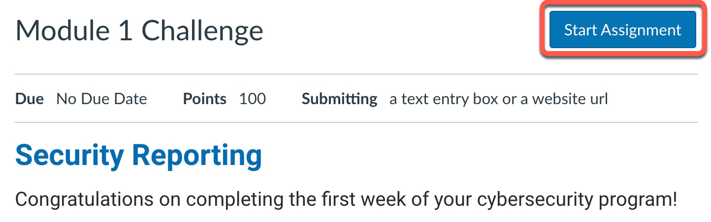
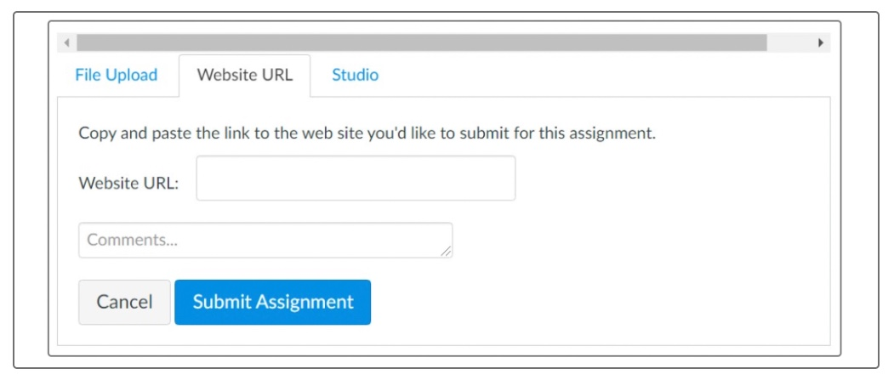
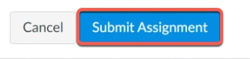

## Lesson 4: Submitting Assignments

### Overview

You will submit your weekly assignments in this platform. Before submitting an assignment, review all relevant information, including the rubric. 

### What You'll Learn

By the end of this lesson, you’ll know how to submit assignments.

### Activities

Review the following instructions to learn how to submit assignments. 

#### Open Assignments

Navigate to the Assignment page within the week's module. 

> **Note:** You can also access your Assignments through your user or course dashboard, the Syllabus, Gradebook, or Calendar.

#### Start Assignment

To submit an assignment, click the "Start Assignment" button located near the assignment title, as the following image shows:

#### Select Submission Type

There are several submission types available for assignments. The assignment's instructions typically indicate the type of submission that you should use. For assignments with multiple components, you may submit a website URL to a collection of files (e.g., a URL for a Google Drive folder). For this type of submission, select the Website URL submission type. In a separate tab or browser window, go to Google Drive or GitHub and copy the link to your assignment folder, document, or repository. Make sure the folder/file permissions are updated so that your instructor and TA are able to access your assignment. Paste the link into the Website URL field. 

The following image shows the assignment submission form:

Available submission types may vary by assignment. (They will be listed at the top of the assignment.) You can only select one submission type per assignment. Once you've clicked on the submission type, directions will appear. 

The following image shows an example for a file upload:

#### Sharing Your Google Drive Files

Before you submit a Challenge (homework) assignment that's saved in your Google Drive, you will need to update the folder or file permissions so that the instructional staff can access your submission. To do so, complete the following steps:

1. Right-click on the folder or file that you plan to submit.
2. Select "Get link."
3. Change "Restricted" to "Anyone with the link."
4. Change "Viewer" to "Commenter."
5. Copy the link and click "Done."

#### Submit Assignment

When you're ready to submit your assignment, click the "Submit Assignment" button, as the following image shows:

Note that large files submitted using the File Upload tab may display a submission status indicator.

#### Resubmit an Assignment

If you need to resubmit an assignment, navigate to the assignment's page (through grades, syllabus, or modules). Click the button near the title to begin your resubmission. Follow the same steps as you did for the first submission. 

