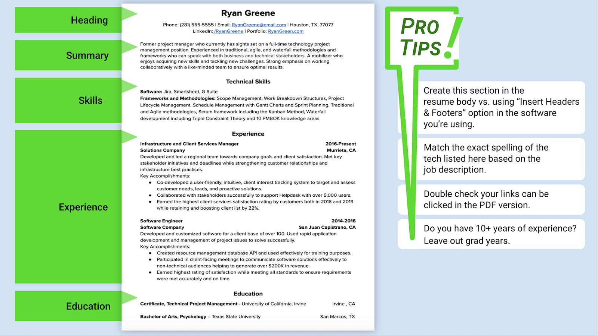
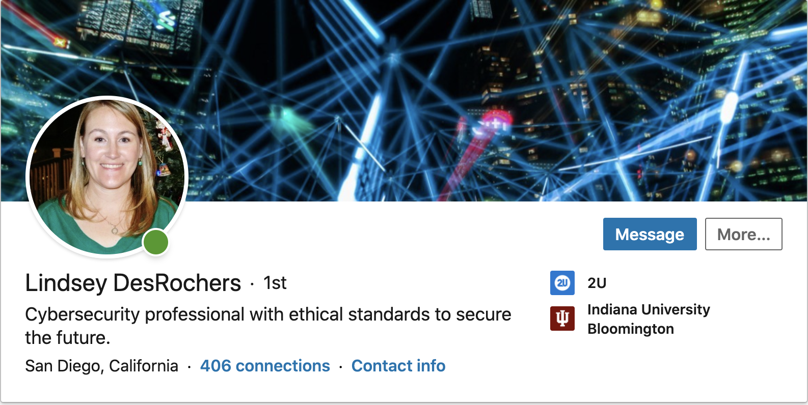
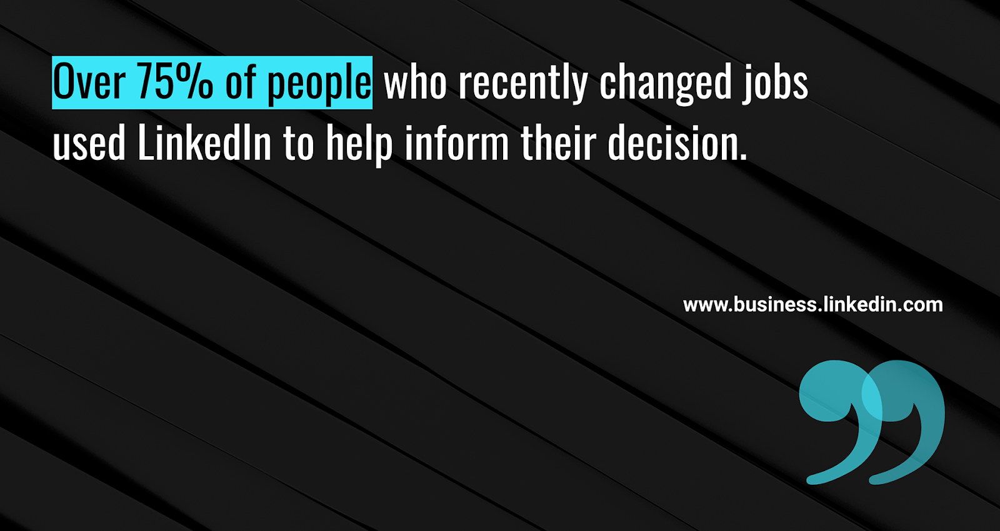

# Module 14 Career Connection

## Module 14 Career Connection

### Resume and LinkedIn Basics

Congratulations on completing your first cybersecurity project! Now that you have completed your first project, it’s time to start working on your resume and LinkedIn profile to increase your chances of getting hired after boot camp. 

Updating your resume to highlight the skills that you are learning in class will help you market yourself to prospective employers. In this Career Connection, you’ll learn tips and tricks to develop a resume that can pass through an applicant tracking system (ATS). Thinking about your resume now will help ensure that you are employer-ready by graduation and can gain access to employer partners.

According to [The Ladders](https://www.theladders.com/career-advice/you-only-get-6-seconds-of-fame-make-it-count), “Recruiters take 7.4 seconds to review a resume on average.” Because resumes are evaluated so quickly in today’s employment landscape, it’s crucial that yours clearly captures your qualifications, so that you can advance in the hiring process.

Once you have a strong resume, you are on your way to becoming an employer-competitive job candidate. But employer-competitive candidates go beyond simply being ready to job search. Their professional materials stand out from other applicants’ and make it clear to potential employers the value the candidate would add to a company. Their stand-out professional materials also provide them with increased visibility to potential employers.

To become employer-competitive, strive to meet the following goals:

* Ensure that all your career materials (resume and LinkedIn profile) are polished. 
* Develop an employer-competitive LinkedIn profile that highlights your key strengths and accomplishments and reflects your personal brand.
* Actively network with industry professionals via LinkedIn, job or career fairs, events, volunteer work, or other affinity and industry groups.

An exemplary LinkedIn profile won’t just help you get noticed by employers during your job search, it may also help you move forward in the hiring process. 

In this Career Connection, we’ll explore how to create a stand-out resume and maximize the benefits of LinkedIn!

#### List Your New Skills 

You demonstrated the following cybersecurity skills in Project 1 and can confidently add these skills to your resume and LinkedIn profile:
* Systems administration
* Networking
* Network security
* Cryptography
* Virtualization
* Cloud deployment
* Web development

Feel free to go back to earlier weeks and capture other cybersecurity skills that you would like to highlight on your resume and LinkedIn, too. You can also highlight the technical skills that you’ve learned or used in any previous work or volunteer experience.

#### Building an Employer-Competitive Resume

To be truly employer competitive, you want to connect your experience with the requirements of the job you are seeking, and position yourself as a top candidate. A strong resume shows the value you bring to the position and what kind of manager, employee, or team member you have been in the past. Adhere to the purpose and structure of an employer-ready resume and avoid the pitfalls of common resume mistakes. When developing a resume, you want to keep your tone professional, use correct grammar and punctuation, and have a clean, simple design. 

##### Beating the Applicant Tracking System (ATS)

The successful development of your resume will depend on your knowledge of the applicant tracking system, or ATS. While applicant tracking systems vary, their main purpose is to assist companies with recruiting and hiring talent. A typical ATS works by scanning, parsing, and organizing the content of a job seeker’s resume based on keywords (e.g., key skills and titles). After eliminating unqualified applicants, resumes that best match the job description are ranked and provided to a recruiter or hiring manager. 

Use the following tips to create an ATS-friendly resume:

* Word (.doc or .docx) and PDF file type documents are most common, but defer to the file types specified by the system. Some ATS software is not PDF-friendly and will scan a PDF as if it were one single image, which means the info in your resume will be missed.   

* Optimize and use keywords strategically. An ATS searches for resumes based on keywords selected by recruiters for a given job. Keywords should be aligned with the job description and represent your hard and soft skills. 

* Keep fonts professional (e.g., Arial, Times New Roman, Cambria) and formatting simple (tables and columns can distort when uploaded). Avoid headers and footers, as some systems are unable to scan information stored in these sections. The same rule applies to images, text boxes, graphics, and even using underlining or italics. If you use bullets, stick with a solid circle or square.  

* Don’t use acronyms alone, as they confuse some applicant tracking systems. Write out the keyword in long form, followed by the acronym&mdash;e.g., Technical Project Manager (TPM). 

The following image shows an example of an ATS-friendly resume: 

Notice that this resume includes sections for a heading, summary, skills, experience, and education. Review the following tips for building each section&mdash;and check out the [Cybersecurity Resume Guide](https://careernetwork.2u.com/articles/resume-cybersecurity/) for more support. 

Create a clear **heading** that includes:
* Your preferred name
* Your telephone number 
> **Note:** Make sure to set up a professional voicemail on your phone. No music or full inboxes! 
* Professional email address (e.g., avoid Hotmail, Yahoo, AOL, or a school email) 
* City and state
* The URL for your LinkedIn profile

Create a **summary**.
* Use your brand statement as the starting point for developing your summary. Check out the [Cybersecurity Brand Statement Samples](https://careernetwork.2u.com/articles/cybersecurity-brand-statement-samples/) for more support.
* Include three to five sentences highlighting your background, achievements, and soft skills. 
* Represent yourself as a professional, not as a student, and describe a specific short-term career goal.

Highlight your **skills**.
* Write a short list of skills you are earning through experience or training, which can be defined, evaluated, and measured. 
* Separate your skills into different categories. For example: systems administration, network security, defensive security, etc.

Describe your **experience**.
* List your previous experiences and your major responsibilities with results or accomplishments from those experiences. 
* Accomplishments are best communicated with metrics. Describe the results you achieved and their impact. 
* Ask yourself: How did I improve the team, a process, or the company? Was I recognized, formally or informally, etc?
     * For example: 
          * Don’t say: “Prepared weekly sales reports.” That’s a job duty. It says what you did, but not how well you did it. 
          * Instead, say: “Prepared weekly sales reports and presented findings in team meetings to inform business decisions, resulting in new marketing strategy and 7% revenue growth in 2015.” This helps articulate your value to the company.
* Finally, add your **education**.
     * List your education post&ndash;high school in reverse chronological order, including your boot camp!

> **Pro Tip:** List a couple of projects that you have completed from the boot camp or in a full-time or volunteer role. This section can be especially valuable for career switchers, and will help show how your relevant skills were applied in an actual project, even if you were not paid! 

##### Using a Designed Resume

Keep in mind that in certain situations, you should opt for a designed resume over an ATS-friendly resume. 
 
Use an ATS-friendly resume when:
* Submitting to job boards like LinkedIn, Indeed, Dice, etc.
* Applying directly to company career pages.

Use a designed resume when:
* A professional connection is passing it on to a hiring manager.
* Sharing out hard copies at a networking event.
* Posting in an online profile, like LinkedIn or your portfolio. 

#### Advancing Your Career with LinkedIn

Networking is a critical skill for successfully securing the role you desire. In fact, the #1 way that people discover a new job is through a referral. 

[Source.](https://business.linkedin.com/content/dam/business/talent-solutions/global/en_us/c/pdfs/Ultimate-List-of-Hiring-Stats-v02.04.pdf). 

LinkedIn (LI) is a social platform intended to help recruiters and job seekers alike discover professional connections and career options.

A strong LinkedIn profile will lead to more positive responses when you ask to connect and meet with people. It also helps companies that are trying to differentiate between suitable applicants. And, recruiters often use LinkedIn to source qualified candidates for their openings, so the more robust your profile, the more likely it is that recruiters will find you. 

Let’s explore further how to use LinkedIn as a tool to become employer-competitive. 

##### Confirm Your Basic Information

Your LI profile should contain some basic information that tells the story of who you are. In most cases, this basic information will help recruiters decide whether to take a closer look at your profile or move on to the next candidate. To make the best first impression, be sure to include a photo of yourself, a background image, contact information, a headline, and a summary on your LI profile. 

Here are some best practices for including basic information on your LI profile:

* **Profile Photo**: This should be a high-quality photo of just your face from the shoulders or neck up.

* **Background Image**: You can google “LinkedIn background images” for some inspiration. Select a background image that is in line with your personal brand or cybersecurity interests. 

* **Contact Information**: Use a professional email address (e.g., instead of using Hotmail or Yahoo, use Outlook or Gmail). Make sure you include phone numbers and email addresses that you check regularly.

* **Headline**: Write a brief but informative headline that includes your background and encourages employers to review your profile. Some examples include:
     * Cybersecurity professional with expertise in securing websites from internal and external threats.
     * Cybersecurity, Privacy & Forensics with a focus on DevSecOps and Secrets Management

* **Summary**: Your summary should be based on your professional [brand statement](https://careernetwork.2u.com/articles/ec-checklist-guide-brand-statement/). It should be clear and concise and highlight your skills. Your summary provides a more detailed picture of you and your life/career progression. 

The following image shows an example of how basic information is displayed on a LI profile:

 

Notice that the headshot is professional, high quality, and displays the person from the neck up. The background photo is captivating and seems relevant to cybersecurity. The headline immediately underneath the headshot (“Cybersecurity professional with ethical standards to secure the future.”) is catchy and also relevant to the industry.

##### Highlight Your Experience and Education

The experience and education sections of the LI profile are important. This is where you get to share your accomplishments and projects you’re proud of. Your resume will come in handy here, as most of the experience you highlight will come directly from your resume. If you have not started on your resume, check out this [resume guide](https://careernetwork.2u.com/articles/resume-guide/). 

In the meantime, here’s what you need to know about highlighting your experience and education on your LI profile.

* **Experience**: Employers should be able to clearly follow your employment history (including places and dates, job titles, and skills). The titles, dates, and locations should mirror your resume. If you had to cut important content from your resume to save space, you could add it in this section on LinkedIn.

* **Education**: List the degrees you have received in reverse chronological order, with your boot camp certificate listed first. To add a certificate to the section, click the plus icon.

##### Enhance Your Profile with Skills, Accomplishments, and Interests

The remaining LI profile sections allow you to showcase your qualifications, which your contacts can then validate, further highlighting your qualifications. This is an excellent way to stand out against other job seekers. You can add up to 50 skills on your LI profile, all of which can be endorsed by your network.

Implement the following best practices to enhance your LI profile:

* **Skills and Endorsements**: Add at least 20 skills, keeping them focused and optimized for keyword search. Maintaining a targeted list of skills can help you gain endorsements and interest from potential employers. 
     * Don’t underestimate the power of leveraging keywords in your profile. [This LinkedIn article](https://www.linkedin.com/pulse/practical-guide-powerful-keywords-your-linkedin-profile-erin-urban) provides practical advice on how to attract the recruiters you want by sourcing the right keywords. 
     * Include business (soft) skills that you have used in previous jobs&mdash;e.g., strategic thinking, prioritizing tasks, problem solving. To identify your own transferable skills, [check out this article](https://www.jobscan.co/skills/product-manager).
     * Include technical (hard) skills that you learned during the boot camp and other skills learned in previous roles (e.g., network security, cryptography, virtualization). Review your boot camp curriculum for more examples. 

* **Recommendations**: These are given by other LinkedIn members and attest to your skillset and work ethic, adding valuable information to your profile. Recommendations validate your trustworthiness and help recruiters feel confident in your strength as a candidate. Learn more about how to request recommendations from your connections [here](https://www.linkedin.com/help/linkedin/answer/90/recommendations-on-linkedin?lang=en).  

* **Accomplishments**: Highlight your top two to three projects in this section, making sure the most recent accomplishments are at the top (you can click and drag if they appear out of order). These can be projects from your boot camp, previous work, or projects you completed on your own time.

* **Interests**: A strong interests section can help employers feel connected to you. List interests that demonstrate your active involvement in the industry and professional-related groups, companies, and other entities, and follow companies and/or people within your industry space.

[Source.](https://business.linkedin.com/content/dam/business/talent-solutions/global/en_us/c/pdfs/Ultimate-List-of-Hiring-Stats-v02.04.pdf)

Hopefully by now, the positive benefits and impact that a strong LinkedIn profile can have on your job search are clear.

#### Submit your Resume and LinkedIn Profile for Review 

Did you know that you have access to a career team? You have access to an entire team of dedicated professionals ready to guide you through your job search process. To learn more about the career support available to you, check out [Intro To Career Support: Cybersecurity](https://careernetwork.2u.com/articles/intro-to-career-support-cybersecurity/).
When you’re ready, submit your resume and LinkedIn profile for review. Before submitting, optimize both to ensure that they are employer-competitive based on the tips discussed in this Career Connection. A Career Material Advisor will provide you with unlimited feedback on your resume and LinkedIn profile. If you have any questions about your feedback, take a moment to schedule time with your Career Material Advisor, and they will answer your questions. 

Discover more resume and LinkedIn resources for cybersecurity on the [Career Engagement Network (CEN)](https://careernetwork.2u.com/browse-by-industry/cybersecurity/).
For quick access to resume templates, check out the [Cybersecurity Resume Templates](https://docs.google.com/document/d/15Gr4-6EsmyU3icsZVUKZmwrELCE4CLkVm9wcESm-W0E/edit#).

#### Events 

For a guided experience on developing your career materials, view the past featured events online at [Career Services Online Events](https://careernetwork.2u.com/events/).