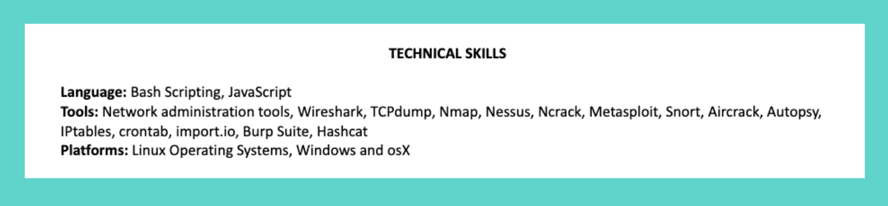
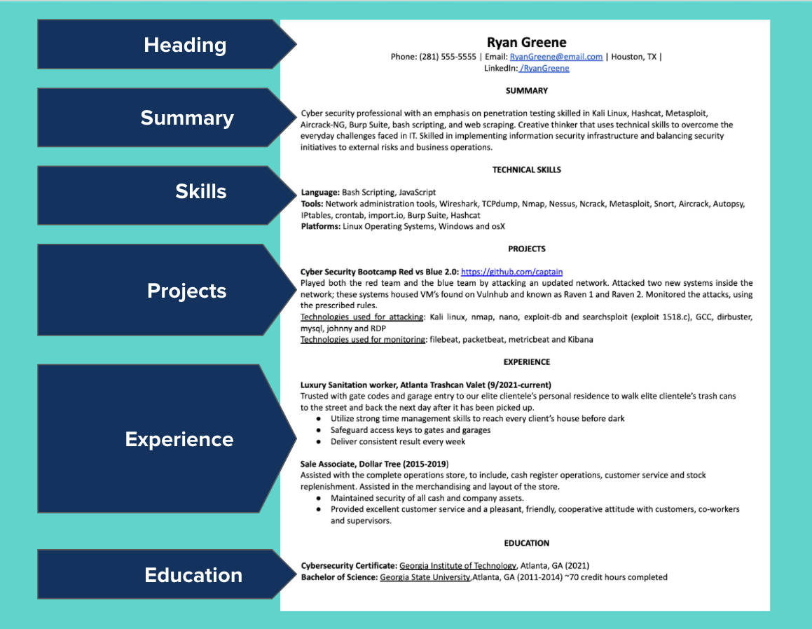
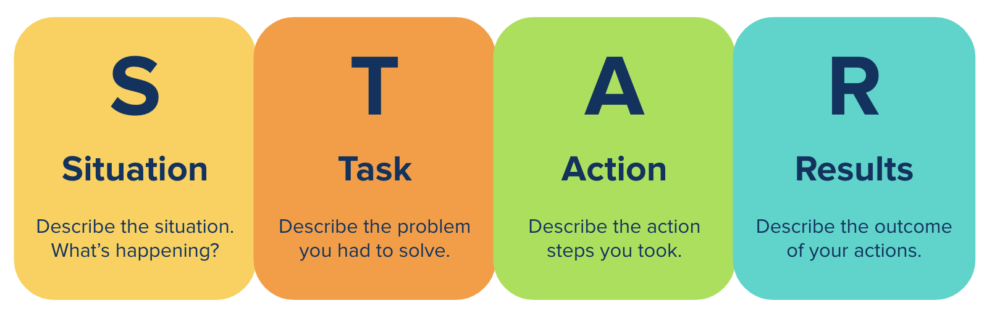

# Module 18 Career Connection

## Module 18 Career Connection

### Listing Projects & Skills On Your Resume

As we’ve discussed previously, your resume is one of the most crucial components of a successful job search. It will also be a widely distributed item that you’ll send to networking partners and potential employers. A resume outlines qualifications, technical skills, and accomplishments, and it is a vital marketing tool to help you land an interview. Ensuring that you have a clear, concise resume is key, as it often provides the first impression for a recruiter, hiring manager, or industry professional. In this Career Connection, we will cover how to add projects to your resume to show skill competence and hands-on experience, and then we’ll learn how to use the STAR Method to create impactful descriptions of your project and work experiences.

#### List Your New Skills 

You demonstrated the following cybersecurity skills in Project 2 and can confidently add these skills to your resume:
* Burp Suite
* XSS Vulnerabilities and Payloads
* SQL Injection
* Webshells
* File Inclusion and Command Injection Vulnerabilities
* Penetration Testing Execution Standard
* Searchsploit and Metasploit
* Zenmap
* Metasploit
* Pivoting Networks

Feel free to go back to earlier weeks and capture other cybersecurity skills that you would like to highlight on your resume, too. You can also highlight the technical skills that you’ve learned or used in any previous work or volunteer experience.

#### Resume Sections

To become truly employer competitive, you want to connect your experience with the requirements of the job you are seeking, and position yourself as a top candidate. A strong resume shows the value you bring to the position and what kind of manager, employee, or team member you have been in the past. Any resume should include the following sections:
* A clear **heading**
* A concise **summary**
* A **technical skills** section
* A detailed **projects** section
* Accomplishment-focused **work experience**
* List of **education** qualifications

First, we’ll focus on adding technical skills and projects to your employer-competitive resume.

##### The Technical Skills Section

The technical skills section is one of the most important sections on your resume. It is the section that recruiters will assess most often to get a sense of how you qualify for different roles. For this reason, your technical skills section should always clearly showcase your capabilities. 

Throughout the boot camp, you have learned many new cybersecurity skills. In most cases, you’ll want to list your new skills according to the role you're seeking. 

For example, the following image shows an example of a technical skills section for a cybersecurity boot camp graduate:

Notice that the skills are grouped into categories such as Languages, Tools, and Platforms, and the skills for each are listed without bullet points or tables. This format makes it easier for potential employers to skim the section for skills that are most relevant to the job. We highly recommend listing most of the skills you learned in the boot camp; however, use some judgment when completing this section. 

It is very important that you only add skills to your resume that you feel comfortable discussing or demonstrating. Everything on your resume is fair game for questions, which means you must be able to confidently discuss any skill listed on your resume. Employers do not expect you to be an expert in everything, but they do value your ability to communicate effectively. You don’t have to be 100% competent with each skill you list, but you should be familiar and comfortable enough to discuss it thoroughly. 

If you find a job description you’re interested in that asks for skills you are familiar with but not sure you can speak to, you can always save the job, get yourself up to speed on the skills required, then add that skill to your resume. Keep the following tips in mind when adding skills to your resume throughout your job search:

* **Tip #1**: No one expects complete expertise; recruiters reading your resume will see that you are new to the field. If you get a call for an interview, they believe that you can do the job.

* **Tip #2**: You can apply for jobs even if you do not meet 100% of the requirements. Employers expect this. Apply for roles where you meet at least 60% of the requirements. The other 40% of requirements are skills you may want to study.

* **Tip #3**: When you don’t meet the job requirements at the 60% threshold but you want to apply for the role, save the job and come back to it when you feel more confident in your skills.
    * Read more about the skills required to build your knowledge.
    * Watch YouTube videos to build your knowledge and confidence.
    * Start a mini project using the skills required to build your confidence.
    * Practice talking about the skills in question, connecting the dots to things you already know.

* **Tip #4**: Always tailor the skills you list on your resume to the skills required for the job.

##### The Projects Section

Including projects on your resume also allows you to highlight skills that you will need in your next job. This section can bridge the gap between what you’re currently doing and what you want to do. Projects are an excellent way to show that you have experience using the skills you assert in your technical skills section. Each of the projects you’ve completed so far in your program can be used on your resume to highlight competency and qualifications for jobs you want.

The project section can appear after your technical skills and before your work experience. This placement allows potential employers to notice immediately that you have used the skills associated with the roles you’re seeking.

The following image shows an example of how the project section could be placed on your resume: 

##### Listing Your Projects

Since projects are a great way to highlight skills or qualifications associated with the role you’re seeking, the descriptions are very important. Use the following general guidelines to describe your projects:

* **Include important details.** You should add enough information about each project that it can be easily understood by anyone who reads your resume. List a project title, a description, dates, and your role if it was a group project. We will discuss the formatting later on.

* **Focus on your achievements.** Share the impact and results of your project by focusing on what you accomplished.

* **Tailor your project description for every job application.** When applying for jobs, read the job description carefully and make sure your descriptions of your projects highlight the pieces that are most relevant. 

* **Include links to your work when possible.** Many employers will want to see examples of your work.

##### Formatting Your Projects

Format all of the projects that you list on your resume consistently. Make sure your resume is visually appealing and that your projects use the same formatting as the rest of your resume. Use bullet points to help you organize the relevant details. We recommend the following format:

**Project Name | Link to project**
* Describe the impact of the project, including its target audience and any notable data points (1-2 lines) 
* Clearly outline your role and responsibilities (1-2 lines)
* List the technology and tools used 

### Applying the STAR Method to Your Resume

As you fill in each section of your resume, using the STAR Method to describe your experience allows you to highlight your value as a job candidate. The STAR Method gives you the ability to match your skills to job qualifications by pairing your work experience with relevant examples. 

#### What Is the STAR Method?

The STAR Method uses your work history and qualifications to create concrete examples of times when you exceeded expectations. The STAR Method is also a four-part technique used to answer interview questions. It allows you to reveal details about your skills and knowledge, giving you a potential advantage over other candidates.

STAR stands for **S**ituation, **T**ask,  **A**ction, and **R**esult.

A STAR Method resume contains work experience bullet points that answer the following questions:
* **Situation**: What situation or challenge did you face?
* **Task**: What task were you involved in? What were your responsibilities and goals?
* **Action**: What actions did you specifically take to achieve the task? How did you contribute to your team’s efforts?
* **Result**: What was the outcome of your actions? Can it be quantified? How did it benefit your company?

The STAR framework is an excellent tool for describing your projects and work experience. Let’s explore how you can use the STAR Method to describe your projects and create effective bullet points for your work experience. 

#### Resume Bullet Points Using STAR 

To create effective descriptions for your projects and work experience using the STAR Method, look at a job description and choose two to three key skills that you want to highlight on your resume. Use the STAR framework to develop a STAR statement. STAR statements can be a single bullet point or multiple bullet points that clearly describe all the components of the STAR framework. 

Let’s examine some sample STAR statements for a cybersecurity analyst.

**STAR statement - single bullet point:**
* Automated common Splunk tasks following a security breach by developing scripts in Perl, Python, Bash, and Powershell, resulting in increased detection capabilities and optimized incident response.

**STAR statement - multiple bullet points:**
* Situation/Task
    * Automated common Splunk tasks following a major security breach that negatively impacted several branch offices.
* Action
    * Developed several scripts using programming languages such as Perl, Python, Bash, and Powershell.
* Results
    * Increased detection capabilities and incident response efficiency by 45%.

Using the STAR method, this cybersecurity analyst provides specific examples of what they did to decrease cyber threats and increase efficiency at their company.

Now, let’s consider how one might apply the STAR framework to a project description.

**STAR statement - Single bullet point:**
* Designed and implemented a virtual network to expose a load-balanced and monitored instance of virtual machines, the vulnerable web application. Used Docker and Ansible to accomplish automated configuration, setup and deployment of Elasticsearch, Logstash, and Kibana (ELK) server with filebeat, metricbeat installation, resulting in the perfect cybersecurity test environment.

**STAR statement - Multiple bullet points:**
* Situation/Task
    * Designed and implemented a virtual network to expose a load-balanced and monitored instance of virtual machines, the vulnerable web application.
* Action
    * Used Docker and Ansible to accomplish automated configuration, setup and deployment of Elasticsearch, Logstash, and Kibana (ELK) server with filebeat, metricbeat installation.
* Result
    * Designed the perfect cybersecurity testing environment and learning tool.

By providing detailed insight into your previous job duties and projects, you’re able to turn them into practical examples that give the hiring manager a clear picture of your accomplishments. Now that you understand the STAR Method and how to apply it to your resume, let’s review some practical action steps for creating your STAR statements.

#### Creating Your Own STAR Statements 

Use the following action steps to develop your own tailored STAR statements for your projects and work experiences:

* **Step 1**: Study the job description carefully and choose one to three key achievements, behaviors, qualities or skills to highlight on your resume.

* **Step 2**: Consider how those key achievements and qualities relate to your projects or work experiences.

* **Step 3**: Brainstorm and create a written outline of what you’ve accomplished. Use the STAR framework to develop your outline.

* **Step 4**: Create accomplishment-based resume statements that match your STAR framework outline.
    * Use numbers to quantify your experience (how much, how often, how many).
    * Begin each bullet point with an action verb.
    * Use exact keywords from the job descriptions to get through the ATS.

Writing a STAR Method resume is worth the effort because it helps you showcase your best accomplishments. You can effectively list your work experience for future employers, and have specific stories and examples to discuss. This resume can also become the blueprint for your interviews, because you have already developed STAR Method stories to share during those interactions.

### Submit your Resume for Review 

Did you know that you have access to a career team? You have access to an entire team of dedicated professionals ready to guide you through your job search process. To learn more about the career support available to you, check out [Intro To Career Support: Cybersecurity](https://careernetwork.2u.com/articles/intro-to-career-support-cybersecurity/).

When you’re ready, submit your resume for review. Before submitting, optimize your resume to ensure that it is employer-competitive based on the tips discussed in this Career Connection. A career material advisor will provide you with unlimited feedback on your resume. If you have any questions about your feedback, take a moment to schedule time with your career material advisor, and they will answer your questions. 

Discover more resume resources for cybersecurity on the [Career Engagement Network (CEN)](https://careernetwork.2u.com/browse-by-industry/cybersecurity/). 

For quick access to resume templates, check out the [Cybersecurity Resume Templates](https://careernetwork.2u.com/browse-by-industry/cybersecurity/).

### Events 

For a guided experience developing your resume and/or cover letter, view past featured events online at [Career Services Online Events](https://careernetwork.2u.com/events/).

