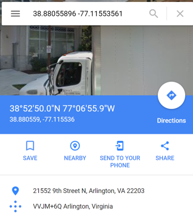
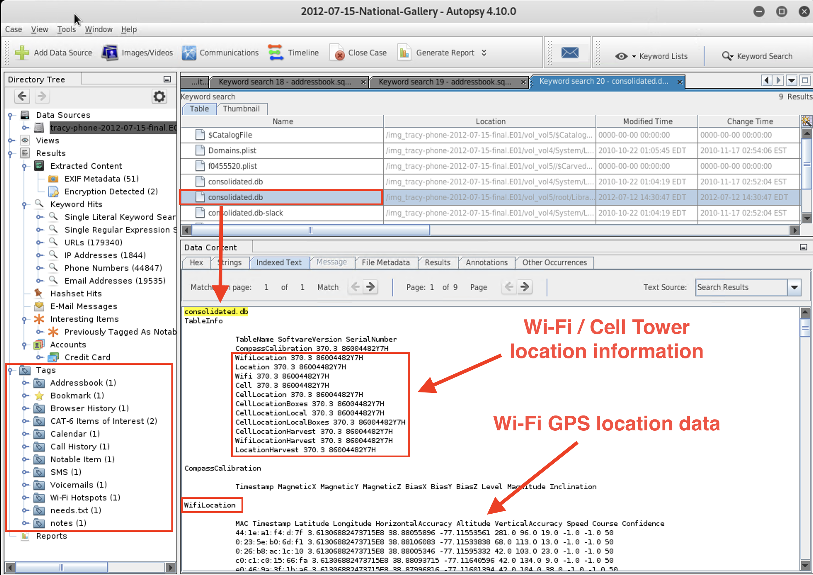
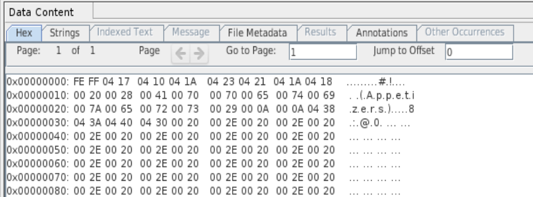
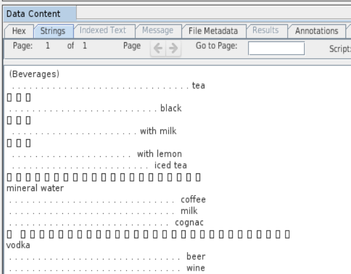

# Module 21 Challenge

## Module 21 Challenge <assignment>

### Digital Forensics

In this week's assignment, you will continue working with your group to finalize the case report that you began in class. The instructions are included here again for reference. There is also a bonus activity to sharpen your skills in locating and identifying data in a forensic image.

### Scenario

Just as in a real-world scenario, you will complete a final report to present your findings. You will work with your team to fill out the report.

 - You will submit the final report as your Challenge deliverable for this week. Make sure to fill out each section and include everything that your group has completed in class. Anything that you did not complete in class should be completed at home.

 - Use the [Final Case Report](https://docs.google.com/document/d/1H528_nPqhfp_eOCzvyviwx5U3M1NiPTGtIFaoQoANbY/edit?usp=sharing) Google Doc template to complete your report. Before beginning, make a copy of this template. To allow everyone in the group to access and work on the document at the same time, give every student editing access. 
 
 > **Important:** Your group should complete this case report as a team. However, **each student must submit a copy of the final report as the Challenge deliverable**. Follow the instructions in the Submission Guidelines section to submit your copy of your group's final report through Canvas.

 - Use the following resource to help guide your work:

     - [iPhone Forensics - Important Files and Databases](https://docs.google.com/document/d/10CWGqTvu09mrSn7Tg7xoKNWBrjeW1wCmXoqB58xYr0k/edit?usp=sharing)

### Lab Environnement

- This Challenge will use the Digital Forensics - Autopsy lab in Kali Linux.

- You will find the `tracy-phone-2012-07-15.final.E01` file located in the `/corpus` directory in Autopsy.

### Instructions

You've examined and documented quite a bit of information from the iPhone image file. Now you will use that documentation to build a final report.

1. First, fill out the following evidence worksheet to document the case's WiFi and GPS locations. You will add this, along with the Correspondence Worksheet, to the final report.

    - [Location Information Worksheet](https://docs.google.com/document/d/19ckQwWc2iPh7qzKVDnBAKoBS-DpVBCb2cFfAbLNrULk/edit?usp=sharing)

    Your group can search for WiFi and GPS info in the following directories:

     - Find information about WiFi locations in `root/Library/Caches/locationd/consolidated.db`.

       > **Note:** Input GPS coordinates into Google Maps to see the locations.

       - Refer to the following image as an example:

       

     - Find information related to WiFi and cell tower location information in `consolidated.db`.

        

2. Working in your group's copy of the report template, add content and details as indicated in each section.

   - You will rely on the Locations Information and Correspondence Evidence Worksheets that you've completed so far. Additionally, you can use the **iPhone Forensics - Important Files and Databases** resource to find and analyze more information that supports your case, such as voicemails or notes from the Notepad iPhone application.

   - Be sure to add to the report a list of the equipment and tools that you used to gather and analyze the evidence.

      - For example: Autopsy, the operating system (Kali Linux), text editors (Nano), etc.

   - When including pictures from the iPhone, use the time stamp of the **Created time** from Autopsy. 

### Bonus Assignment: Russian Tea Room

The goal of this assignment is to sharpen your skills in locating and identifying data in a forensic image.

- These skills are important for tasks related to locating and decoding data, such as executable code or malicious documents embedded in images or network logs.

#### Scenario: The Case of the Little Russian Tea Room

- There was a fire at the Little Russian Tea Room restaurant last week, and the only thing recovered was a hard drive. To start rebuilding the business, the restaurant hired you as a forensic investigator to analyze the disk image and reconstruct the menu.

- You'll work with an EnCase image of the hard drive.

- Luckily, the English and Russian menu are both in the hard drive image. However, only the English menu and two sections of the Russian menu are readable. Your must decode several sections of the Russian menu.

#### Resources

The strings in the EnCase image are hex and represent the UTF-16 format. You'll need to be familiar with hex and UTF-16 encoding and decoding for this activity.

  - Review this [Unicode Tutorial](https://docs.google.com/document/d/1f39Qp96t6N8eFmRipesUusw2sIfGXZv_rqEoR0byp_4/edit?usp=sharing) and the practice exercises. This review will help you locate the menus on the hard drive image.                                      

The following files are required to complete the assignment:

   - [RussianTeaRoom.zip](https://drive.google.com/file/d/1JlKMetFwyvQNVl0zpNO_O8A90KWyfJH2/view?usp=sharing) (560 KB): The Autopsy case file and EnCase image file

   - [menu.pdf](https://drive.google.com/file/d/1kXw3IoZKISAfAhsLiT7jiSnW0hK8aQoI/view?usp=sharing) (56.0 KB): The Little Russian Tea Room menu

   - [Google Sheets: Russian Tea Room](https://docs.google.com/spreadsheets/d/1GeibalvCi0jnUKay82dSne9V9kdEuUNyOxpaAEBABiU/edit?usp=sharing)

   - [Unicode-Tutorial.md](https://docs.google.com/document/d/1f39Qp96t6N8eFmRipesUusw2sIfGXZv_rqEoR0byp_4/edit?usp=sharing): Short Unicode tutorial

#### Instructions

Your task is to find, decode, and document six of the menus from the hard drive image using the Unicode Cyrillic and Latin character (cipher) set.

1. Launch Autopsy, and select "Open Case."

   - Open the `RussianTeaRoom` folder, and select `RussianTeaRoom.aut`.

    - Add the `Russian-TeamRoom.E01` EnCase image file to the case.

   - The following image shows a sample of the hex data in the Autopsy `RussianTeaRoom` case file:

     

2. Use [Google Sheets: Russian Tea Room](https://docs.google.com/spreadsheets/d/1GeibalvCi0jnUKay82dSne9V9kdEuUNyOxpaAEBABiU/edit?usp=sharing) to document the remaining information from the EnCase image for the investigation (remember to make a copy first!).

3. Find and document the complete file locations for the six menu sections in the image.

    > **Hint:** There may be multiple locations for the same file.

4. Document the menu items in Cyrillic (e.g., бифштеке) and English (e.g., steak) for the two following menu sections:

    - Pancakes (Menu #3)

    - Meat and Fish (Menu #5)

       > **Hint:** Use the "Hex" and "String" tabs in "Data Content" window in Autopsy to view the data.
       >
       > 

    Include the following in your documentation:

       - Starting location in the hex dump.
           - For example: `0x00000010`

       - Hex string for menu name or menu item.
           - For example: `00 42 00 65 00 76 00 65 00 72 00 61 00 67 00 65 00 73`

       - UTF-16 escape sequence for a menu name or menu item.
           - For example: `\u0042\u0065\u0076\u0065\u0072\u0061\u0067\u0065\u0073`

### Submission Guidelines

* Make sure that you have a copy of your team's Final Report on your Google Drive. Title your copy of the report with the following format: < YOUR NAME >< The Final Report >
* Place your copy of the report within a new folder on your Google Drive, and title the folder with the following format: < YOUR NAME >< M21 Challenge > 
* If you completed the bonus assignment, title your finished Russian Tea Room file with the following format: < YOUR NAME >< Russian Tea Room >
* Place your Russian Tea Room file within the M21 Challenge folder on your Google Drive.
* Make sure to set the folder and file permissions so that anyone can view and comment on your documents.
* Submit the URL of your M21 Challenge Google Drive folder through Canvas.
