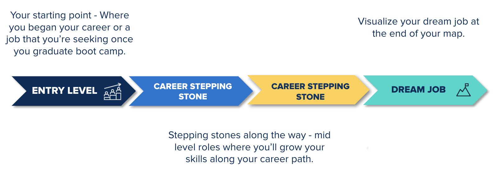

# Module 22 Career Connection

## Module 22 Career Connection

### Networking and Career Mapping

Congratulations on wrapping up another project! In this Career Connection, we’ll introduce you to career mapping. We’ll explore what job searching looks like in practice, and we’ll learn more about a job search technique that is designed to empower you to approach your search in a strategic manner.

In this Career Connection, we’ll also explore the importance of networking and provide some useful tips for how you can effectively use networking as a strategy in your job search. Only 20&ndash;30% of jobs are advertised publicly on job boards, according to [Careershifters](https://www.careershifters.org/expert-advice/why-the-best-jobs-are-never-advertised-and-how-to-find-them). That means that 70&ndash;80% of available jobs are never made public. This is why networking is the best strategy for landing your next career opportunity.

Successful networking involves building relationships, and that doesn't happen overnight. It takes time and consistent effort, but it will be worth it, and we’ll show you how to do it!
 
### List Your New Skills 

You demonstrated the following cybersecurity skills in Project 3 and can confidently add these skills to your resume and LinkedIn profile:

* Information security continuous monitoring (ISCM)
* Log types and how they are used for monitoring
* Log aggregation and correlation
* Baselining
* SIEM
* Splunk
   * Splunk Processing Language (SPL)
   * Reporting
   * Alerting
   * Dashboards
   * Add-on applications

Feel free to go back to earlier weeks and capture other cybersecurity skills that you would like to highlight on your resume and LinkedIn, too. You can also highlight the technical skills that you’ve learned or used in any previous work or volunteer experience.
 
### Career Mapping

When you think of your career, it is important to visualize it as a path. It has a starting point and a path that leads to your dream job, as the following image shows: 

 
In this section, we will explore some action steps that you can take to map your career path from start to dream job. Working through this activity will help you plan job search activities that align with your career map. It will help you decide on roles to target, beneficial networking opportunities, and other skills you need to learn.

Let’s get started!

#### Step One

When creating this map, start with the end destination. On a piece of paper or a Google doc, write out your dream job. To make the exercise more impactful, add the type of company you want to work for, whether you want to work in a team environment, the location, the salary you want to earn, or any other meaningful details. Be specific so that you can visualize yourself having everything you want. This is your dream! For this exercise, we’ll consider this your ultimate career objective.

#### Step Two

We’ll continue to work backward. Below your dream job, consider the stepping stone jobs (at least two or three) that will help you get to this end role. (If you’re not sure what these might be, visit the [Cybersecurity Career Pathways](https://careernetwork.2u.com/career-pathways/cybersecurity/) page on the Career Engagement Network to gain a sense of entry-, mid-, and senior-level roles and career pathing). 

Try to think not just of a title, but of the job responsibilities and skills you’ll want to gain in these roles. For instance, if your dream job is penetration tester at a Fortune 500 company, you’ll need to hone your network and application security skills as well as your programming language skills, and you’ll need to become familiar with tools used in the role. Your career stepping stones should account for those learning goals so that you can strengthen needed pen testing skills during your career.

#### Step Three

Consider your starting point. This can be the job you want to search for once you graduate the boot camp if you’re a career starter or switcher, or perhaps a promotion you’ll seek once you finish the boot camp if you’re a career advancer.

Try to be specific. Ask yourself the following questions: Do I want to work at a large company or a small one? Do I want to pursue a junior role first or another IT role? Do I want to work in a team environment?  There are no right or wrong answers to these questions. Answering these and other questions about what you want will help you make strategic decisions about your career so that you can achieve your dream job. Check out the [CEN Cyber Career Pathway](https://careernetwork.2u.com/career-pathways/cybersecurity/) page to review entry level jobs.

#### Step Four

Now, consider your career objective (your dream job) again at the end of your map. It’s time to further strategize how to get there, so identify two to three key results for each stepping stone along your map that are quantifiable measures of progress toward achieving your ultimate objective. 

Let’s use the penetration tester goal from before. We can start by searching for that job title on Indeed or LinkedIn to understand key requirements of the job.
Let’s review this sample penetration tester job posting:

**Penetration Tester**
 
*In this role, the Penetration Tester will:*
* Conduct security assessments including comprehensive penetration testing, vulnerability scanning, assumed breach, external, wireless, and social engineering.
* Recommend enhancements to security environments.
* Review network systems for potential weak points and recommend mitigations for any issues discovered.
* Evaluate potential new products, technologies, or vendors for use by the business.
* Create and maintain documentation.
* Produce reports and conduct presentations for relevant internal and external stakeholders.
 
*Requirements*
* 5+ years relevant experience.
* Expert knowledge using, administering, and troubleshooting Kali Linux as an attack platform.
* Experience with Windows/Active Directory attacks and attack path enumeration.
* Knowledge of network topology and complementing security controls. 
* Knowledge of PCI and other industry compliance standards.
* Knowledge of cyber attack stages, cyber threats and vulnerabilities, intrusion sets.
* Experience with conducting Red or Purple teaming exercises.
* Experience with scripting and editing existing code and programming, including Python, Bash, C, C++, .NET, or Java.
* Knowledge of network vulnerability assessments, web application security testing, network penetration testing, red teaming, security operations, or hunt operations.
* Advanced understanding of SIEM and XDR/MDR platforms.
* Strong written and oral communication skills.
 
*Preferred, But Not Required*
* Industry certifications such as CEH, GPEN, CEPT, LPT, OSCP, or OSCE.
* Demonstrated interest in the field such as writing for a cybersecurity blog or participating in “CTF”-style labs, e.g., Hack The Box or TryHackMe.
* Experience managing and configuring enterprise firewalls.
* Apple macOS and Linux experience.
 
Based on this job description, an ideal candidate for this role is an experienced cybersecurity professional that has advanced knowledge of skills you’re learning now in your boot camp. The candidate works well with internal stakeholders, communicates effectively with external clients, has a strong IT background, and is continuing to learn and grow.
 
With this in mind, key requirements for your stepping stones should be exposure and hands-on experience with tools and technology associated with pen testing, assessing cybersecurity environments and making recommendations, increasing documentation and communication skills, and other cyber-focused growth opportunities.
 
By the end of this step, you will be able to identify two to three stepping stone positions that align with key requirements to pursue your dream job. Refer to the [Cybersecurity Pathways](https://careernetwork.2u.com/career-pathways/cybersecurity/) resource on CEN to learn more about entry-, mid-, and senior-level positions you can pursue.
 
#### Using this Lesson to Advance Your Career

The final step in this exercise is to stay driven and not lose sight of your final destination! This map is a tool that you can use to help guide your job search and career planning process. It’s a tool meant to empower you on your journey, and you can always edit it as you progress through your career. 

You can bring your career map to your 1:1 career coaching session to gain perspective and feedback on your job search strategy. You can also use this tool in informational interviews you arrange with professionals in the cybersecurity field to gain insight on their path. Career coaches and professionals you network with in the field can provide insight, thoughts, and other perspectives to help you plot your course

### Events 

For a guided experience on developing your career path, view the past featured events online at [Career Services Online Events](https://careernetwork.2u.com/events/).
 
### Before You Start Networking

Next, we’ll explore how networking can help you in your job search.

Before you begin reaching out to people for networking purposes, it is important that you have an idea of your career goals and that your career materials (resume, LinkedIn profile, etc.) are up to date. In this course’s Career Connections, we’ve covered action steps for developing your resume, building your LinkedIn profile, and thinking strategically about your career path.

Make sure to submit your resume and LinkedIn profile to your Career Materials Advisor (CMA) team. Your CMA will provide you with unlimited feedback on your resume and LinkedIn profile. If you have any questions about your feedback, take a moment to schedule time with your Career Material Advisor, and they will answer your questions.

You must submit your resume or LinkedIn profile to be assigned a CMA.

Once you are confident that your resume, LinkedIn profile, and career goals are in a good place, you can begin strategically networking.
 
### What Is networking?

Networking is basically people in the same or related industries sharing ideas and information. It often involves meeting new people and can take place anywhere. Networking can happen in informal and formal settings. For example, networking can happen at events, your office, or through industry associations. However, it can also be done by reaching out to friends or acquaintances, or connecting with specific individuals that you want to meet via LinkedIn. The key difference between networking and casually meeting someone on a day out is your intention. The intention behind professional networking is connecting with professionals to help one another experience growth in your careers.

Networking is:

* A chance to learn more about an industry and career paths.
* An opportunity to gain visibility and make new connections.
* A chance to describe your interests, skills, and values or share ideas.
* An opportunity to help other professionals when you’re in a position to do so.
* An opportunity to boost your professional confidence.

Networking is not:

* Asking for a job or favors.
* An interview for employment.
* A guarantee of employment or employability.
* A business card swap at a meeting or conference.
* A stockpile of connections on LinkedIn.
* A one-way relationship.

### Online vs. In-Person Networking

With an ever-increasing number of social networking sites and apps, online networking is becoming as common as in-person networking. You may wonder if one style of networking has more value than the other. Let’s explore some key differences and advantages of each.

#### Online Networking

The first online professional networking tool that most people think of is LinkedIn. This rapidly growing social networking site offers the opportunity to gain hundreds of connections that could take years to make through in-person networking. It allows you to connect with people quickly and effectively based on your career, interests, current connections, and the connections of your friends. Once you have made a connection via LinkedIn, one goal could be to message them and plan a time to meet virtually or in person. 

Some advantages of online networking include: 
* Initiating contact is easy and less intimidating.
* You can potentially connect with people all over the world.
* Unlimited exposure opportunities.
* Instant, real-time access to information and communication tools.

#### In-Person Networking

Although we live in a digital world, in-person networking is still necessary to build meaningful relationships. Knowing how to effectively network in person can be one of the greatest tools available for developing your career. Being able to look someone in the eyes and shake their hand can never be replicated online. 

Some advantages of networking in person include:
* Allows you to show your personality.
* Helps you focus on sharing your knowledge and expertise.
* Allows you to build confidence is presenting yourself as a professional.

### Using LinkedIn to Network

LinkedIn is the world's largest professional networking website. You can use it to build connections in your industry and to stay in touch with colleagues, past and present. It's an excellent tool for job searching and a great way to stay up to date with industry news, enhance your professional reputation, and increase the visibility of your brand.

To get the best from LinkedIn, use the following strategies:

**Complete your profile**
* Make sure that your profile is polished by adding a professional photo, an industry-specific headline, a concise summary, and work samples to the Featured section.

**Connect with other LinkedIn users**
* When you make a new connection, you gain access to that person's profile and their publicly available connections. These are "second-degree connections." Invite them to connect too, when appropriate. Check out these [LinkedIn message templates](https://careernetwork.2u.com/articles/outreach-templates-resources/) for more guidance.

**Give and receive recommendations and endorsements**
* Ask your connections for recommendations and endorsements. Recommendations should come from people who can speak to your work&mdash;colleagues, boot camp teammates, former managers, etc.

**Use LinkedIn Groups**
* LinkedIn Groups is an excellent way to grow your professional network organically. Share your knowledge with people in your groups, and they'll likely respond in kind. To learn more about making the most out of LinkedIn Groups, check out this [article](https://www.themuse.com/advice/5-ways-to-get-the-most-out-of-linkedin-groups).

**Produce engaging content**
* Think about your audience. Post useful, informative, and relevant content. You can also upload or record videos and post full articles, which allow you to showcase your expertise.

**Observe professional etiquette**
* Be mindful of your reputation, and avoid posting personal or polarizing details that you might post on other social media platforms. Be respectful, professional, and positive.

### Step-By-Step Networking Guide

#### (1) Identify Your Current Network

You may already have more people in your network than you realize. Use the following categories to help you think about who's in your network and how you might reach out to them:
* Family
* Friends
* Former colleagues / classmates / supervisors
* Professors, trainers, etc.
* Other connections

#### (2) Expand your Network

Consider the following approaches to expand your network:

* Reach out to any relevant person on the networking list you just created and send them your materials with a specific ask. “Asks” can include a quick chat on the phone for advice or a lunch
date to talk about your target industry, as well as recommendations for who you should
connect with next.
* If you’re currently employed, ask your boss for projects that require you to interact with new departments or individuals. For example, you can propose helping the company enhance its website. In doing so, you'll interact with other developers and/or the marketing department.
* Find volunteer opportunities. Get involved in an organization or group that interests you, and offer to contribute some of your new skills. You may meet people who can be helpful.
* Create business cards that include your target role, links to online profiles such as LinkedIn, and a QR code to scan for your resume or CV.
* Continue using LinkedIn weekly to connect with employees and decision makers. Look for secondary connections. Send personal messages about your passions and common interests, and request informational interviews.

[Here is a great reminder of the many places where you can network.](https://www.jobmonkey.com/best-places-to-network/)

#### (3) Attend Networking Events

It’s always helpful to set a goal when attending networking events (e.g., “I will have three
meaningful conversations that may lead to potential follow-up,” or “I will not leave until I have
entered into at least five conversations.”) Establishing a goal allows you to set a measurable
standard of success for an event, which can help change your experience of networking into a
positive one.

Here are some additional tips that will help you differentiate yourself at an event:

1. Always bring business cards to events. On the back of cards you receive, take notes about the people you speak with so that you can follow up.
2. Master the use of relevant language&mdash;the better your vocabulary (especially as it relates to your industry), the more impressed people will be. Being confident, articulate, and knowledgeable will help you create a strong first impression.
3. Eye contact&mdash;maintain eye contact when you're speaking with someone. Looking away can make you appear less confident. And remember to smile!
4. Leave personal space&mdash;don’t stand too close. Keep a reasonable distance.
5. Acknowledge your understanding&mdash;when someone else is talking, acknowledge that you hear them with non-verbal body language such as nodding.
6. Wait your turn&mdash;successful professionals are also good listeners. Give people the chance to complete their thoughts before offering a response.
7. Watch body language. Mirror the body language of the person with whom you are interacting. If they sit down, you should sit down too&mdash;they may be ready for a longer conversation. Try not to cross or fold your arms, as it can make you appear guarded. Overall, be mindful of body language.
8. Be curious and open the conversation with questions. Focus on the other person first and convey genuine interest. [Here are some conversation starters that may help](https://www.themuse.com/advice/30-brilliant-networking-conversation-starters).

#### (4) Follow Up

Networking is only effective if you follow up! After meeting new contacts, follow up with a
personal message. When reaching out, whether via email or phone, here are a few tips:

1. Remind them how they know you. Always begin by referencing a common person, event, educational or work experience, organization, or award that creates a common bond.
2. Be clear on what you bring to the table. Express interest in the person’s work, and express how you can add value rather than asking for something. Sharing interesting articles, making introductions to helpful contacts, supporting the contact's endeavors, and engaging with their LinkedIn posts are great ways to add value.
3. Be flexible with scheduling. Make it easy and convenient for the contact to say yes to connecting again!
4. Do your homework! Research your new connections to help you foster genuine relationships. LinkedIn and general internet searches can provide access to information on your targeted connections.
5. Don’t give up, and don’t take it personally. Some people hesitate to reach out again for fear of being ignored, rejected, or seeming like a pest. It’s okay if someone doesn’t take you up on your offer. If you reach out regularly, you'll get more accepted invitations than passes.
6. Breathe, and stay calm. It’s perfectly normal to be nervous about contacting people. Networking is a skill that requires practice. It may help to practice calls with friends or family. It may also help to remember that you're not calling to ask for favors&mdash;you are asking to learn from someone. People often love sharing their expertise!

#### (5) Request Informational Interviews and Seek Mentors

Informational interviews are your opportunity to explore whether your goals and/or current opportunities really are the right match for you. They're also great ways to expand your network.

**Before the interview…**

**Do**:
* Research the individual: use LinkedIn, Google, or personal connections to prepare.
* Prepare a list of questions (at least four).
* Review a list of conversation starters for informational interviews, and have a few ready to go. Check out this [article](https://www.forbes.com/sites/juliawuench/2021/05/19/9-questions-to-ask-during-an-informational-interview/?sh=3481271727a7) for question ideas.
* Prepare your elevator pitch.

**Don’t**:
* Plan to “wing it.” While these are not job interviews, preparation is needed.
* Script every second of the interview; you need to build an organic relationship as well.
* Assume the other person will lead the conversation or listen to you talk the entire time.

**During the interview…** 

**Do**:
* Smile, make appropriate eye contact, and lean forward.
* Ask questions to demonstrate interest and active listening.
* Find a personal connection through interests, passions, or hobbies.
* Listen for ways you may be able to help or volunteer.
* Use varied tones and volumes to demonstrate your passion and enthusiasm.
* Describe work you’ve done that relates.

**Don’t:**
* Complain about previous employers or peers.
* Dominate conversation.
* Answer questions with one word answers&mdash;instead, be concise but thorough.
* Look at your phone during the conversation.

**After the interview…**

**Do:**
* Jot down notes to remember the conversation.
* Write a thank-you email.
* Follow up occasionally with updates.

**Don’t:**
* Follow up too frequently (no more than about once per month).
* Text a thank you. In most cases, this should be more formal.

> **Note:** The goal is that many informational interviews will lead to more interviews, volunteer or open-source projects, or ideas about new directions. For more on informational interviews, check out [5 Tips for Non-Awkward Informational Interviews](https://www.themuse.com/advice/5-tips-for-nonawkward-informational-interviews). (Note that informational Interviews are not conducted in certain markets or regions, such as Mexico.)

#### Additional Resources

* [CEN Networking Resources](https://careernetwork.2u.com/articles/networking-resources/)
