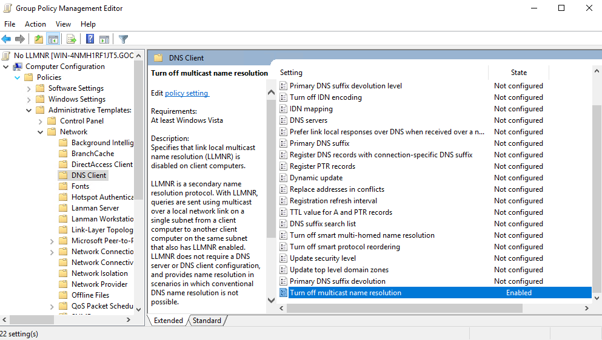
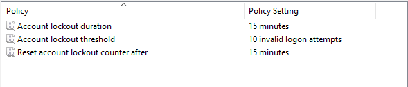
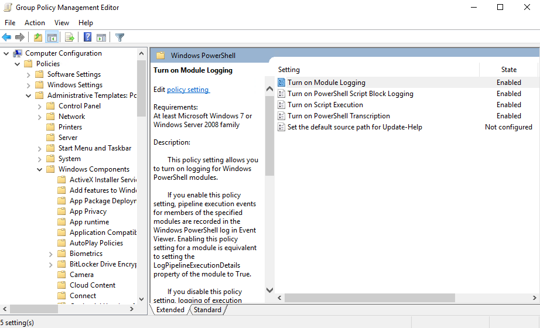
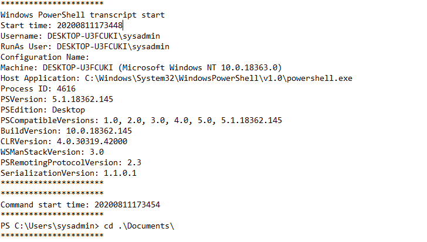

## Week 7 Homework Solution: A Day in the Life of a Windows Sysadmin

:warning: The Day 3 activities must be fully completed in order to complete this activity. If they are not, you will need to refer to your student guides and set up your domain OUs, users, and groups .

---

### Task 1: Create a GPO: Disable Local Link Multicast Name Resolution (LLMNR)


Within the **Windows Server** machine, open the Group Policy Management tool and create a new GPO named `No LLMNR`.

- Right-click the new GPO listing, and select **Edit** to open the Group Policy Management Editor and find policies.

- In the Group Policy Management Editor, this policy can be found at the following path: `Computer Configuration\Policies\Administrative Templates\Network\DNS Client`.

  - You'll be looking for a policy called `Turn Off Multicast Name Resolution`.

  - Enable this policy and exit the Group Policy Management Editor window.

- Back in the Group Policy Management window, right-click the **GC Computers** organizational unit, and select **Link an Existing GPO...**.

  - Select **No LLMNR** and click **OK**.

The new GPO `No LLMNR` has now been assigned computer configuration policies and has been linked to the `GC Computers` organizational unit.



#### Summary

This important domain-hardening Group Policy is used to avoid adversaries within the network attempting to [spoof LLMNR responses](https://attack.mitre.org/techniques/T1557/001/). 

---

### Task 2: Create a GPO: Account Lockout

Within the **Windows Server** machine, open the Group Policy Management tool and create a new GPO named `Account Lockout`.

- Right-click the new GPO listing, and select **Edit** to open up the Group Policy Management Editor and find policies.

- Use the policy located at: `Computer Configuration\Policies\Windows Settings\Security Settings\Account Policies\Account Lockout Policy`.

- If you'd like to set each individual policy to Microsoft's baselines, do the following:

  - Set **Account lockout duration** to **15 minutes**.

  - Set **Account lockout threshold**  to  **10 invalid logon attempts**.

  - Set **Reset account lockout counter after** to **15 minutes**.

In Group Policy Management:

- Right-click the **GC Computers** OU and select **Link an existing GPO...**.

- Select **Account Lockout** then click **OK**.



#### Summary

Security professionals will always debate ideal password and account lockout policies due to how common user error is. But it's important that organizations create strong account lockout policies to ensure attackers can't gain access through such methods as [dictionary attacks](https://capec.mitre.org/data/definitions/16.html).

---

### Task 3: Create a GPO: Enabling Verbose PowerShell Logging and Transcription

Within the **Windows Server** machine, open the Group Policy Management tool and create a new GPO named `PowerShell Logging`.

- Right-click the new GPO listing, and select **Edit** to open the Group Policy Management Editor and find policies.

- Use the policy located at: `Computer Configuration\Policies\Administrative Templates\Windows Components\Windows PowerShell`. 

Set each individual policy:

- Enable the `Turn on Module Logging` policy and do the following:

  - Enter `*` for the **Module Name** and click **OK**.

- Enable the `Turn on PowerShell Script Block Logging` policy and do the following:

  - Check the box for `Log script block invocation start/stop events:`.

- Enable the `Turn on Script Execution` policy and do the following:

    - Set **Execution Policy** to **Allow all scripts**.

- Enable the `Turn on PowerShell Transcription` policy and do the following:

  - Leave the **Transcript output directory** blank (this defaults to the user's `~\Documents` directory).

  - Check the **Include invocation headers** option. This will add timestamps to the command transcriptions.

- Leave the `Set the default source path for Update-Help` policy as **Not configured**.

- To link this new `PowerShell Logging` GPO to the `GC Computers` OU, do the following in Group Policy Management:

  - Right-click the `GC Computers` OU and select **Link an existing GPO...**.

  - Select **PowerShell Logging** then click **OK**.



#### Summary

Logging PowerShell execution and scripts is a fundamental to Windows system administration and security. PowerShell is readily available and fully-featured in Windows-based environments. 

For that reason, PowerShell is also the [most frequently used tool by attackers](https://symantec-enterprise-blogs.security.com/blogs/threat-intelligence/living-land-legitimate-tools-malicious) for gaining information and access to Windows enterprise environments.

These logs are often saved to restricted file shares and/or SIEM so that they can be analyzed. We'll be covering SIEM in more depth in a later lesson.

---

### Task 4: Create a Script: Enumerate Access Control Lists

The final `enum_script.ps1` script should look like:

  ```PowerShell
  $directory = Get-ChildItem .\
  foreach ($item in $directory) {
    Get-Acl $item
  }
  ```

The following is a breakdown of the script:

- The line, `$directory = Get-ChildItem .\`, sets the variable `$directory` to the contents of the current working directory through `Get-ChildItem .\`. 

- Each file or subdirectory from within the directory that we ran the script in, becomes an `$item`. 

- The `foreach` script block then executes once for each `$item` within the directory. In this case, `Get-Acl $item`. 

- For example, if we had the files `1.txt`, `2.doc`, and `3.pdf` in our current directory, we would expect the script block, `Get-Acl <filename>`, to execute three times, with each execution of the script showing us the ACL of the file:

  1. `Get-Acl 1.txt` 
  2. `Get-Acl 2.doc` 
  3. `Get-Acl 3.pdf` 

- Make sure you save the file in `C:\Users\sysadmin\Documents\enum_acls.ps1`.

In PowerShell, test the script:

- Navigate to the `C:\Windows` directory with:

  - `cd C:\Windows`

- Enter the full file path and name to numerate the ACLs for everything in `C:\Windows`:

  - `C:\Users\sysadmin\Documents\enum_acls.ps1`

If you successfully created and ran the script, you'll see output similar to the following:

```PowerShell
win.ini                  NT AUTHORITY\SYSTEM         NT AUTHORITY\SYSTEM Allow  FullControl...
WindowsUpdate.log        NT AUTHORITY\SYSTEM         NT AUTHORITY\SYSTEM Allow  FullControl...
winhlp32.exe             NT SERVICE\TrustedInstaller NT AUTHORITY\SYSTEM Allow  ReadAndExecute, Synchronize...
WMSysPr9.prx             NT SERVICE\TrustedInstaller NT AUTHORITY\SYSTEM Allow  ReadAndExecute, Synchronize...
write.exe                NT SERVICE\TrustedInstaller NT AUTHORITY\SYSTEM Allow  ReadAndExecute, Synchronize...
```

#### Summary

This script is fundamentally simple, but it leverages PowerShell to grab the security descriptors of files and subdirectories. Using scripts to enumerate files, users, etc. is an important skill for security professionals.

---

### Bonus Task 5: Verify Your PowerShell Logging GPO

- Log into your **Windows 10** machine with the credentials: `sysadmin` | `cybersecurity` if you are not already logged in.

  - If you are having trouble logging into the local account, at the `Other user` login screen, use `.\sysadmin` as the user name.

- Once you're logged in, open a PowerShell or CMD window and run `gpupdate` and wait for it to finish.

- Navigate to your system directory with `cd C:\Windows`

- Within the C:\Windows directory, enter your script's path and filename to run it: `C:\Users\sysadmin\Documents\enum_acls.ps1`

- After running the script, navigate to your user's Documents directory with `cd C:\Users\sysadmin\Documents`.

  - You should see a directory with the current date as the directory name. Your new transcribed PowerShell logs should be inside. You'll need these for your submission.

#### Summary

You should always confirm that your GPOs are working properly. In this case, the PowerShell logging and transcription GPO can be used in enterprise-scale log monitoring systems, such as SIEMs, which you'll learn about during the SIEMs week.

---

### Submission Answers

- **Deliverable for Task 1:** In the Group Policy Management window, under Group Policy Objects, you should have the following GPOs:

   - `Account Lockout`
   - `No LLMNR`
   - `PowerShell Logging`

- **Deliverable for Task 2:**

  For your account policies GPO, you should have a screenshot similar to this:
  

- **Deliverable for Task 3:**

  For your PowerShell logging GPO, you should have a screenshot similar to this:
  

- **Deliverable for Task 4:**

  For your `enum_acls.ps1` script, you should have the following:

    ```PowerShell
    $directory = Get-ChildItem .\
    foreach ($item in $directory) {
      Get-Acl $item
    }
    ```
  
- **Deliverable for Bonus Task 5:**

  

---

© 2020 Trilogy Education Services, a 2U, Inc. brand. All Rights Reserved.
