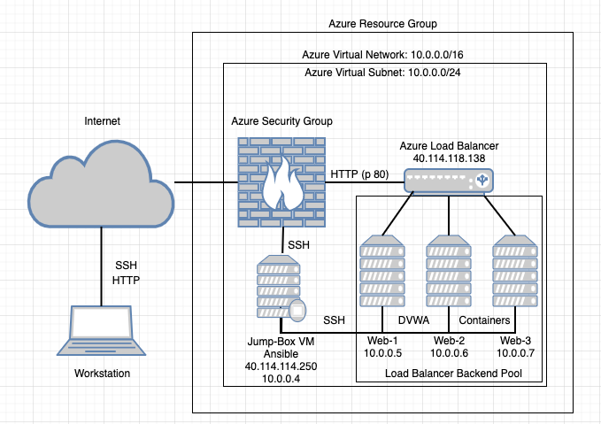

## Solution Guide: Cloud Security Homework

### Solution

Use a free account at [draw.io](https://app.diagrams.net/) to diagram the entire cloud network you have created.

    - Your diagram should show the following:
        - Azure resource group
        - Virtual network with IP address range
        - Subnet range
        - Flow of specific traffic (e.g., HTTP, SSH)
        - Security group blocking traffic
        - Load balancer
        - All five VMs that you have launched
        - Where Docker and Ansible are deployed
        - Availability Zones

**Solution:**

Navigate to [draw.io](https://app.diagrams.net/) and choose a location to save your work.

Choose a Network Diagram Template to modify.

Verify that you have all of the Networking icons in the bottom of the left panel.

Your finished diagram should look similar to the following:

---
© 2020 Trilogy Education Services, a 2U, Inc. brand. All Rights Reserved.
